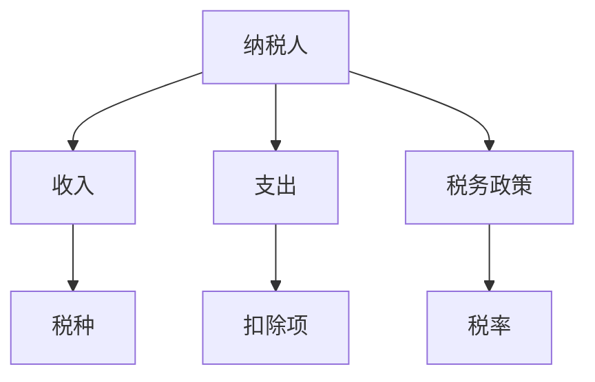
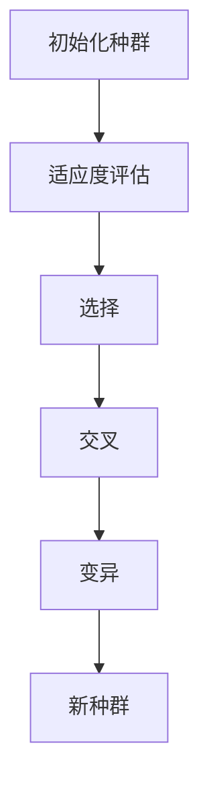
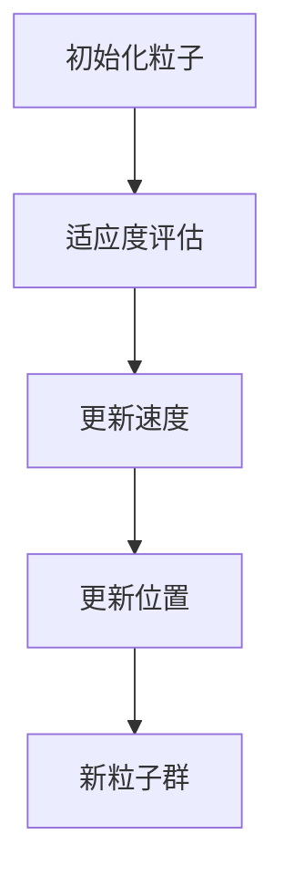
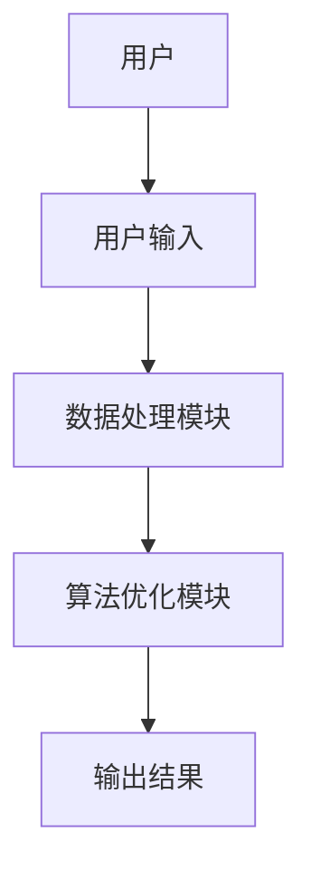

                 


# 《构建智能化的个人税务筹划多目标优化助手》

---

## 关键词：个人税务筹划、多目标优化、人工智能、算法原理、系统架构

---

## 摘要：  
本文详细探讨了如何利用人工智能和多目标优化算法构建智能化的个人税务筹划助手。通过分析税务筹划的核心问题，提出基于遗传算法和粒子群优化的多目标优化模型，结合系统架构设计，构建一个高效、智能的税务筹划工具。文章从背景、算法、系统设计到项目实战，全面阐述了实现过程，并提供了可落地的解决方案。

---

# 目录大纲

---

## 第一部分：背景与概述

### 第1章：智能化税务筹划的背景与问题

#### 1.1 税务筹划的背景与意义

- 1.1.1 税务筹划的基本概念  
- 1.1.2 税务筹划的重要性  
- 1.1.3 智能化税务筹划的优势  

#### 1.2 个人税务筹划的挑战与痛点

- 1.2.1 个人税务筹划的主要问题  
- 1.2.2 传统税务筹划的局限性  
- 1.2.3 智能化税务筹划的需求  

#### 1.3 多目标优化的必要性

- 1.3.1 多目标优化的基本概念  
- 1.3.2 税务筹划中的多目标优化问题  
- 1.3.3 多目标优化在税务筹划中的应用  

#### 1.4 本章小结

---

## 第二部分：核心概念与联系

### 第2章：多目标优化与税务筹划的核心概念

#### 2.1 多目标优化的原理

- 2.1.1 多目标优化的基本概念  
- 2.1.2 多目标优化的数学模型  
- 2.1.3 多目标优化的算法特点  

#### 2.2 税务筹划的核心要素

- 2.2.1 税务筹划的目标  
- 2.2.2 税务筹划的约束条件  
- 2.2.3 税务筹划的关键因素  

#### 2.3 多目标优化与税务筹划的关系

- 2.3.1 多目标优化在税务筹划中的应用  
- 2.3.2 税务筹划对多目标优化的需求  
- 2.3.3 两者的结合与协调  

#### 2.4 实体关系图（ER图）



#### 2.5 本章小结

---

## 第三部分：算法原理与数学模型

### 第3章：多目标优化算法的选择与实现

#### 3.1 遗传算法（Genetic Algorithm）的原理与应用

- 3.1.1 遗传算法的基本概念  
- 3.1.2 遗传算法的流程图  



- 3.1.3 遗传算法在税务筹划中的应用  

#### 3.2 粒子群优化算法（Particle Swarm Optimization）的原理与应用

- 3.2.1 粒子群优化算法的基本概念  
- 3.2.2 粒子群优化算法的流程图  



- 3.2.3 粒子群优化算法在税务筹划中的应用  

#### 3.3 算法的比较与选择

- 3.3.1 遗传算法与粒子群优化算法的对比  
- 3.3.2 税务筹划场景下的算法选择  

### 第4章：数学模型与目标函数

#### 4.1 多目标优化的数学模型

- 4.1.1 目标函数的定义  
- 4.1.2 约束条件的定义  

#### 4.2 税务筹划的数学模型

- 4.2.1 收入与支出的数学表达  
- 4.2.2 税率与扣除项的数学表达  

#### 4.3 多目标优化的目标函数

$$ \text{最大化 } f_1(x) = \text{税后收入} $$
$$ \text{同时最大化 } f_2(x) = \text{扣除项} $$
$$ \text{约束条件 } g(x) \leq 0 $$

---

## 第四部分：系统分析与架构设计

### 第5章：系统分析与架构设计方案

#### 5.1 问题场景介绍

- 5.1.1 税务筹划助手的目标用户  
- 5.1.2 税务筹划助手的功能需求  

#### 5.2 系统功能设计

- 5.2.1 用户界面设计  
- 5.2.2 数据处理模块  
- 5.2.3 算法优化模块  

#### 5.3 系统架构设计

- 5.3.1 类图设计  


- 5.3.2 架构图设计  



---

## 第五部分：项目实战与实现

### 第6章：项目实战与核心代码实现

#### 6.1 环境安装与配置

- 6.1.1 Python环境的安装  
- 6.1.2 第三方库的安装  

#### 6.2 核心功能实现

- 6.2.1 数据处理模块的实现  

```python
import pandas as pd

# 示例数据处理代码
data = pd.DataFrame({
    '收入': [100000, 80000, 120000],
    '支出': [20000, 15000, 30000],
    '税率': [0.2, 0.15, 0.25]
})

# 计算税后收入
data['税后收入'] = data['收入'] * (1 - data['税率'])
```

- 6.2.2 算法优化模块的实现  

```python
import numpy as np

# 示例遗传算法代码片段
def fitness(individual):
    # 计算适应度函数
    return np.sum(individual)

# 初始化种群
population = np.random.randint(0, 2, size=(10, 5))
```

#### 6.3 案例分析与结果展示

- 6.3.1 案例背景  
- 6.3.2 数据输入与处理  
- 6.3.3 算法优化过程  
- 6.3.4 结果分析  

---

## 第六部分：总结与展望

### 第7章：总结与未来展望

#### 7.1 最佳实践与经验分享

- 7.1.1 税务筹划的注意事项  
- 7.1.2 算法优化的关键点  

#### 7.2 本章小结

- 7.2.1 核心内容回顾  
- 7.2.2 未来研究方向  

#### 7.3 注意事项

- 7.3.1 数据隐私保护  
- 7.3.2 税务政策的变化  

#### 7.4 拓展阅读

- 7.4.1 推荐书籍与论文  
- 7.4.2 相关技术动态  

---

## 作者信息

作者：AI天才研究院/AI Genius Institute & 禅与计算机程序设计艺术 /Zen And The Art of Computer Programming

---

通过以上目录大纲，文章将从理论到实践，全面讲解如何构建智能化的个人税务筹划多目标优化助手，帮助读者掌握核心技术和实现方法。

