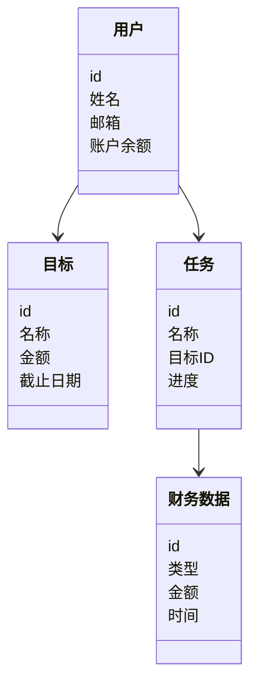
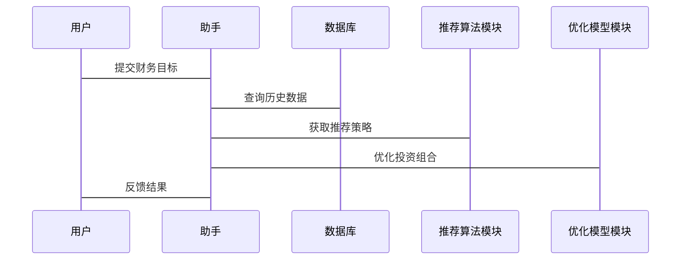

                 


# 构建智能化的个人财富管理目标跟踪助手

## 关键词：人工智能，财富管理，目标跟踪，智能化助手，推荐算法，优化模型

## 摘要：  
本文将探讨如何构建一个智能化的个人财富管理目标跟踪助手，通过结合人工智能技术，帮助用户实现财务目标的智能化跟踪与优化。文章从背景介绍、核心概念、算法原理、系统架构到项目实战，逐步展开，最终为读者提供一个完整的解决方案。

---

# 第一部分: 背景与核心概念

## 第1章: 财富管理与智能化目标跟踪助手

### 1.1 财富管理的基本概念
#### 1.1.1 财富管理的定义与范围
财富管理是指通过科学的规划和管理，帮助个人或家庭实现财务目标的过程。它包括资产配置、风险管理、税务规划等多个方面。

#### 1.1.2 个人财富管理的重要性
在现代社会，个人财富管理变得越来越重要。随着经济环境的不确定性增加，如何有效地管理财务目标，确保资产的保值与增值，成为每个人需要关注的重要课题。

#### 1.1.3 目标跟踪在财富管理中的作用
目标跟踪是财富管理的核心环节。通过实时跟踪财务目标的实现进度，可以及时调整策略，确保目标的顺利达成。

### 1.2 智能化目标跟踪的必要性
#### 1.2.1 传统目标跟踪的局限性
传统的目标跟踪方式通常依赖人工记录和定期检查，存在效率低下、容易遗漏等问题。

#### 1.2.2 智能化跟踪的优势
智能化目标跟踪助手可以通过自动化数据采集、智能分析和个性化推荐，显著提高跟踪效率和准确性。

#### 1.2.3 人工智能在财富管理中的应用前景
人工智能技术的快速发展为财富管理领域带来了新的机遇。通过机器学习、自然语言处理等技术，智能化助手能够更好地满足用户的需求。

## 第2章: 智能化目标跟踪助手的核心概念

### 2.1 助手的功能模块
#### 2.1.1 数据采集与处理
智能化助手需要从多种来源（如银行账户、投资平台）采集财务数据，并进行清洗和预处理。

#### 2.1.2 目标设定与分解
用户可以根据自身需求设定财务目标，并将其分解为可执行的任务。

#### 2.1.3 财务分析与预测
通过数据分析和建模，助手可以对用户的财务状况进行预测，并提供优化建议。

#### 2.1.4 个性化推荐与反馈
根据用户的财务状况和目标，助手可以提供个性化的投资建议和反馈。

### 2.2 核心概念的ER实体关系图
```mermaid
er
  actor: 用户
  goal: 目标
  task: 任务
  progress: 进度
  financial_data: 财务数据
  rule: 规则
  relation: 用户 -> 目标
  relation: 用户 -> 任务
  relation: 任务 -> 进度
  relation: 进度 -> 财务数据
  relation: 目标 -> 规则
```

### 2.3 核心概念对比分析
#### 2.3.1 数据采集 vs 数据分析
数据采集是获取原始数据的过程，而数据分析是对数据进行处理和挖掘的过程。

#### 2.3.2 财务预测 vs 个性化推荐
财务预测是对未来的财务状况进行预测，个性化推荐是基于用户需求提供具体的建议。

#### 2.3.3 任务分解 vs 进度跟踪
任务分解是将目标拆解为具体任务，进度跟踪是监控任务的执行情况。

---

# 第二部分: 算法原理与数学模型

## 第3章: 推荐算法原理

### 3.1 基于协同过滤的推荐算法
#### 3.1.1 协同过滤的基本原理
协同过滤是一种基于用户行为相似性推荐物品的算法。通过分析用户的偏好，找到与之相似的用户，并推荐他们喜欢的物品。

#### 3.1.2 用户-物品协同过滤的实现
$$ R_{ij} = \mu + u_i + v_j $$

其中，$R_{ij}$ 是用户 $i$ 对物品 $j$ 的评分，$\mu$ 是全局平均值，$u_i$ 是用户 $i$ 的偏置，$v_j$ 是物品 $j$ 的偏置。

#### 3.1.3 优缺点分析
协同过滤的优点是简单易实现，缺点是计算量大且难以处理数据稀疏性问题。

### 3.2 基于内容的推荐算法
#### 3.2.1 基于文本挖掘的内容推荐
通过分析物品的文本描述，提取关键词并生成向量表示，从而进行推荐。

#### 3.2.2 基于特征提取的推荐
使用主成分分析（PCA）等方法提取物品的关键特征，进行推荐。

#### 3.2.3 与协同过滤的结合
结合内容特征和用户行为数据，提高推荐的准确性和多样性。

### 3.3 推荐算法的数学模型
#### 3.3.1 协同过滤的矩阵分解
$$ R_{ij} = \mu + u_i + v_j $$

其中，$u_i$ 和 $v_j$ 分别表示用户 $i$ 和物品 $j$ 的隐向量。

---

## 第4章: 优化模型

### 4.1 基于遗传算法的优化模型
#### 4.1.1 遗传算法的基本原理
遗传算法是一种模拟自然选择过程的优化算法，通过选择、交叉和变异操作，逐步优化目标函数。

#### 4.1.2 优化模型的实现
$$ f(x) = x_1^2 + x_2^2 + \dots + x_n^2 $$

其中，$x_i$ 是优化变量。

#### 4.1.3 应用场景
遗传算法可以应用于组合优化问题，如投资组合优化。

### 4.2 基于梯度下降的优化模型
#### 4.2.1 梯度下降的基本原理
梯度下降是一种基于梯度优化的算法，通过不断调整参数，使目标函数达到最小值。

#### 4.2.2 优化模型的实现
$$ \theta = \theta - \alpha \nabla J(\theta) $$

其中，$\theta$ 是参数，$\alpha$ 是学习率，$\nabla J(\theta)$ 是目标函数的梯度。

#### 4.2.3 应用场景
梯度下降常用于机器学习模型的训练，如神经网络。

### 4.3 优化模型的数学模型
#### 4.3.1 线性回归的优化
$$ \text{最小化} \quad J(\theta) = \frac{1}{2m} \sum_{i=1}^m (h_\theta(x^{(i)}) - y^{(i)})^2 $$

其中，$h_\theta(x)$ 是线性回归模型，$m$ 是样本数量。

---

# 第三部分: 系统分析与架构设计方案

## 第5章: 问题场景介绍

### 5.1 问题背景
在财富管理中，用户需要实时跟踪财务目标的实现进度，并根据市场变化调整投资策略。

### 5.2 项目介绍
本项目旨在构建一个智能化的个人财富管理目标跟踪助手，帮助用户实现财务目标的智能化跟踪与优化。

## 第6章: 系统功能设计

### 6.1 领域模型


### 6.2 系统架构设计


### 6.3 系统接口设计
- 用户接口：提供目标设定、任务跟踪等功能。
- 数据接口：与银行、投资平台等第三方系统对接。

### 6.4 系统交互


---

## 第7章: 项目实战

### 7.1 环境安装
- 安装Python和相关库（如numpy、pandas、scikit-learn）。

### 7.2 核心代码实现
```python
import numpy as np
from sklearn.metrics.pairwise import cosine_similarity

# 示例协同过滤算法
def collaborative_filtering(user_item_matrix):
    user_avg = np.mean(user_item_matrix, axis=1)
    item_avg = np.mean(user_item_matrix.T, axis=0)
    diff = user_item_matrix - user_avg[:, np.newaxis] - item_avg[np.newaxis, :]
    similarity = cosine_similarity(diff.T)
    return similarity

# 示例优化模型
def optimize_portfolio(weights, returns):
    weights = np.array(weights)
    returns = np.array(returns)
    return np.argmax(weights * returns)
```

### 7.3 案例分析
假设用户设定一个投资目标，助手通过协同过滤和遗传算法优化，推荐最优的投资组合。

### 7.4 项目总结
通过实战，读者可以掌握如何将理论应用于实际，构建一个智能化的财富管理助手。

---

## 第8章: 最佳实践与小结

### 8.1 最佳实践
- 数据预处理是关键，确保数据的准确性和完整性。
- 在实际应用中，需要考虑系统的扩展性和可维护性。

### 8.2 小结
本文详细介绍了构建智能化个人财富管理目标跟踪助手的各个方面，从背景介绍到系统设计，再到项目实战，为读者提供了一个完整的解决方案。

### 8.3 注意事项
- 确保数据安全，保护用户隐私。
- 定期更新模型，适应市场变化。

### 8.4 拓展阅读
- 《机器学习实战》
- 《Python机器学习》

---

作者：AI天才研究院/AI Genius Institute & 禅与计算机程序设计艺术 /Zen And The Art of Computer Programming

