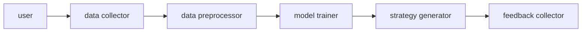
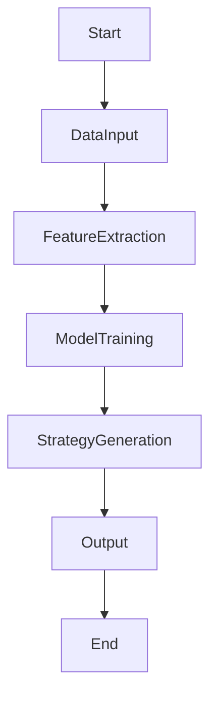

                 


# {{构建智能化的个人财富管理策略动态生成与调整助手}}

## {{人工智能、财富管理、动态生成、机器学习、自然语言处理、策略调整}}

### {{通过人工智能技术，实现个人财富管理策略的动态生成与实时调整，提供智能化、个性化的财富管理解决方案。}}

---

# 第一部分: 背景与问题分析

## 第1章: 财富管理的智能化需求

### 1.1 传统财富管理的局限性
#### 1.1.1 人工决策的低效性
#### 1.1.2 市场波动的不可预测性
#### 1.1.3 用户需求的个性化差异

### 1.2 人工智能在财富管理中的应用潜力
#### 1.2.1 数据处理能力
#### 1.2.2 自动化决策的优势
#### 1.2.3 个性化服务的可能性

### 1.3 智能化助手的目标与边界
#### 1.3.1 核心目标
#### 1.3.2 辅助决策的边界
#### 1.3.3 数据隐私与安全的考虑

---

# 第二部分: 核心概念与技术框架

## 第2章: 机器学习与自然语言处理

### 2.1 机器学习在财富预测中的应用
#### 2.1.1 监督学习模型
#### 2.1.2 无监督学习的应用
#### 2.1.3 强化学习的优势

### 2.2 NLP在用户需求分析中的作用
#### 2.2.1 文本分类
#### 2.2.2 情感分析
#### 2.2.3 信息抽取

## 第3章: 动态策略生成的数学模型

### 3.1 时间序列分析模型
#### 3.1.1 ARIMA模型
#### 3.1.2 LSTM网络的应用

### 3.2 强化学习算法
#### 3.2.1 Q-Learning算法
#### 3.2.2 策略梯度法

## 第4章: 实体关系与流程图

### 4.1 实体关系图


### 4.2 流程图


---

# 第三部分: 系统架构与设计

## 第5章: 系统功能模块

### 5.1 数据采集模块
#### 5.1.1 数据来源
#### 5.1.2 数据预处理
#### 5.1.3 数据存储

## 5.2 模型训练模块
#### 5.2.1 模型选择
#### 5.2.2 参数调优
#### 5.2.3 模型评估

## 5.3 策略生成模块
#### 5.3.1 策略生成逻辑
#### 5.3.2 策略输出格式
#### 5.3.3 策略动态调整机制

## 第6章: 系统架构设计

### 6.1 分层架构


### 6.2 接口设计
#### 6.2.1 API接口定义
#### 6.2.2 接口调用流程
#### 6.2.3 接口安全考虑

## 第7章: 系统交互流程

### 7.1 用户交互流程
#### 7.1.1 用户输入
#### 7.1.2 数据处理
#### 7.1.3 模型调用
#### 7.1.4 结果反馈

---

# 第四部分: 项目实战与案例分析

## 第8章: 项目实战

### 8.1 环境安装
#### 8.1.1 安装Python
#### 8.1.2 安装机器学习库
#### 8.1.3 安装自然语言处理库

## 8.2 核心代码实现
#### 8.2.1 数据采集与预处理
#### 8.2.2 模型训练与评估
#### 8.2.3 策略生成与调整

## 8.3 代码示例
```python
import numpy as np
from sklearn.linear_model import LinearRegression

# 示例数据
X = np.array([[1], [2], [3], [4], [5]])
y = np.array([2, 4, 5, 4, 7])

# 模型训练
model = LinearRegression()
model.fit(X, y)

# 预测
new_X = np.array([[6]])
print(model.predict(new_X))  # 输出预测值
```

## 第9章: 案例分析与实际应用

### 9.1 案例分析
#### 9.1.1 数据分析
#### 9.1.2 模型选择
#### 9.1.3 策略生成

### 9.2 实际应用
#### 9.2.1 系统部署
#### 9.2.2 用户反馈
#### 9.2.3 系统优化

---

# 第五部分: 最佳实践与小结

## 第10章: 最佳实践

### 10.1 系统优化建议
#### 10.1.1 数据处理的优化
#### 10.1.2 模型选择的优化
#### 10.1.3 系统架构的优化

## 10.2 使用注意事项
#### 10.2.1 数据隐私保护
#### 10.2.2 系统稳定性保障
#### 10.2.3 用户体验优化

## 第11章: 小结与展望

### 11.1 项目总结
#### 11.1.1 核心成果
#### 11.1.2 经验总结
#### 11.1.3 问题与不足

### 11.2 未来展望
#### 11.2.1 技术进步
#### 11.2.2 应用扩展
#### 11.2.3 研究方向

---

# 作者：AI天才研究院 & 禅与计算机程序设计艺术

---

以上是《构建智能化的个人财富管理策略动态生成与调整助手》的技术博客文章目录大纲。通过逐步分析，确保内容全面、结构清晰，涵盖背景、技术、算法、系统架构、项目实战和最佳实践等关键部分，为读者提供深入的技术指导和实践参考。

