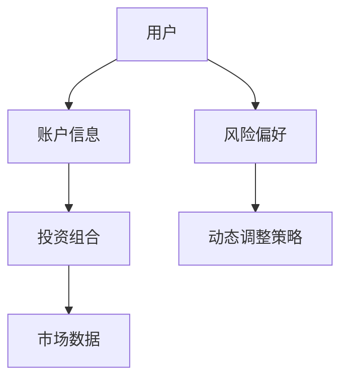
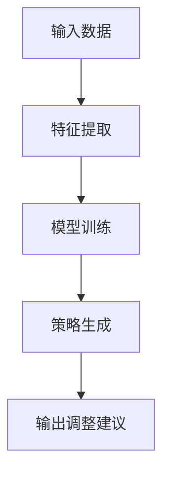
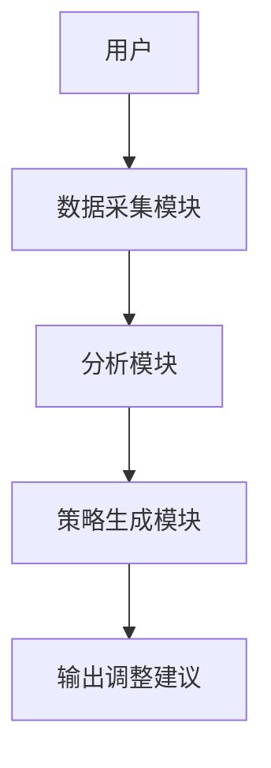

                 


# 构建智能化的个人财富管理策略动态调整助手

---

## 关键词：  
智能化财富管理、动态调整策略、机器学习、强化学习、系统架构、项目实战

---

## 摘要：  
本文详细探讨了如何构建一个智能化的个人财富管理策略动态调整助手。通过结合机器学习和强化学习算法，该系统能够实时分析市场数据和用户需求，动态调整投资策略。本文从问题背景、核心概念、算法原理、系统架构到项目实战，全面解析了实现这一系统的各个方面，并提供了具体的代码示例和案例分析，帮助读者快速理解和应用这些技术。

---

## 第一部分: 背景与概述

### 第1章: 个人财富管理的智能化需求

#### 1.1 问题背景与描述
##### 1.1.1 传统个人财富管理的局限性  
传统的个人财富管理依赖于手动操作和固定的投资策略。这种模式在市场波动较大时显得灵活性不足，无法及时捕捉市场变化，导致投资回报率低下。  

##### 1.1.2 智能化财富管理的需求驱动  
随着人工智能和大数据技术的快速发展，智能化财富管理成为可能。通过实时数据分析和智能决策，投资者可以更高效地管理资产，优化投资组合。  

##### 1.1.3 动态调整策略的核心价值  
动态调整策略的核心在于根据市场变化和个人财务状况的变化，实时优化投资组合。这种动态调整能够最大化收益，降低风险。  

#### 1.2 问题解决与边界
##### 1.2.1 动态调整策略的实现路径  
通过机器学习算法分析市场数据，预测市场趋势，并根据预测结果动态调整投资策略。  

##### 1.2.2 边界与外延  
系统的边界包括数据采集、分析和策略生成，外延则包括策略的执行和监控。  

##### 1.2.3 核心要素与组成结构  
系统的核心要素包括数据源、分析模块、策略生成模块和执行模块。  

### 第2章: 智能化财富管理助手的核心概念

#### 2.1 核心概念原理
##### 2.1.1 数据采集与处理  
通过API接口获取市场数据、用户财务数据和经济指标数据。  

##### 2.1.2 智能分析与决策  
利用机器学习模型分析数据，生成投资建议。  

##### 2.1.3 动态调整策略生成  
根据市场变化和用户需求，实时优化投资组合。  

#### 2.2 核心概念对比表
##### 2.2.1 数据源对比  
| 数据类型 | 描述 | 来源 |
|----------|------|------|
| 市场数据 | 包括股票价格、指数等 | 第三方API |
| 用户数据 | 包括资产、收入等 | 用户输入 |
| 经济指标 | 包括GDP、利率等 | 数据库 |

##### 2.2.2 分析方法对比  
| 方法 | 描述 | 适用场景 |
|------|------|----------|
| 回归分析 | 预测变量之间的关系 | 趋势预测 |
| 强化学习 | 基于奖励机制优化决策 | 动态调整策略 |

##### 2.2.3 调整策略对比  
| 策略 | 描述 | 优点 |
|------|------|------|
| 均衡策略 | 保持资产在不同风险等级的分配 | 稳定收益 |
| 激进策略 | 突出高风险高回报资产 | 高风险高回报 |

#### 2.3 ER实体关系图  


---

## 第二部分: 算法原理与数学模型

### 第3章: 动态调整策略的算法原理

#### 3.1 机器学习基础
##### 3.1.1 监督学习与非监督学习  
- **监督学习**：基于标记数据进行预测，如回归分析。  
- **非监督学习**：基于未标记数据进行聚类分析。  

##### 3.1.2 回归分析与分类算法  
- **线性回归**：用于预测连续变量，如股票价格。  
- **决策树**：用于分类和回归，如预测股票涨跌。  

##### 3.1.3 时间序列预测模型  
- **ARIMA模型**：用于预测时间序列数据，如指数走势。  

#### 3.2 强化学习在策略调整中的应用
##### 3.2.1 Q-Learning算法  
Q-Learning是一种无模型强化学习算法，适用于动态环境中的决策问题。  

##### 3.2.2 策略网络  
策略网络通过端到端的训练，直接输出最优策略。  

##### 3.2.3 探索与利用平衡  
通过平衡探索和利用，算法可以在不确定环境中找到最优策略。  

#### 3.3 算法流程图  


#### 3.4 数学模型与公式  
##### 3.4.1 回归分析模型  
$$ y = \beta_0 + \beta_1x + \epsilon $$  

##### 3.4.2 Q-Learning更新公式  
$$ Q(s, a) = Q(s, a) + \alpha [r + \gamma \max Q(s', a') - Q(s, a)] $$  

---

## 第三部分: 系统分析与架构设计

### 第4章: 系统架构设计

#### 4.1 问题场景介绍  
系统需要实时处理市场数据，分析用户需求，并生成动态调整策略。  

#### 4.2 系统功能设计  
##### 4.2.1 数据采集模块  
- 获取市场数据、用户数据和经济指标。  

##### 4.2.2 分析模块  
- 使用机器学习模型分析数据，生成投资建议。  

##### 4.2.3 策略生成模块  
- 根据分析结果动态调整投资组合。  

#### 4.3 系统架构图  


#### 4.4 接口设计与交互  
##### 4.4.1 数据接口  
- RESTful API用于数据传输。  

##### 4.4.2 用户交互  
- 提供用户友好的界面，展示调整策略和执行结果。  

---

## 第四部分: 项目实战

### 第5章: 项目实战

#### 5.1 环境安装  
- 安装Python、Pandas、Scikit-learn、TensorFlow等库。  

#### 5.2 核心代码实现
##### 5.2.1 数据预处理  
```python
import pandas as pd
data = pd.read_csv('market_data.csv')
data = data.dropna()
```

##### 5.2.2 模型训练  
```python
from sklearn.linear_model import LinearRegression
model = LinearRegression()
model.fit(X_train, y_train)
```

##### 5.2.3 策略生成  
```python
def generate_strategy(data, model):
    predictions = model.predict(data)
    strategy = []
    for pred in predictions:
        if pred > 0.5:
            strategy.append('Buy')
        else:
            strategy.append('Sell')
    return strategy
```

#### 5.3 案例分析  
- 通过实际数据展示模型的预测结果和策略生成过程。  

#### 5.4 项目小结  
总结项目实现的关键点和经验教训。

---

## 第五部分: 最佳实践

### 第6章: 最佳实践

#### 6.1 小结  
总结智能化财富管理策略动态调整助手的核心要点。  

#### 6.2 注意事项  
- 数据质量的重要性。  
- 模型调优的必要性。  

#### 6.3 拓展阅读  
- 推荐相关书籍和论文，供读者深入学习。

---

## 作者：  
AI天才研究院/AI Genius Institute & 禅与计算机程序设计艺术/Zen And The Art of Computer Programming

