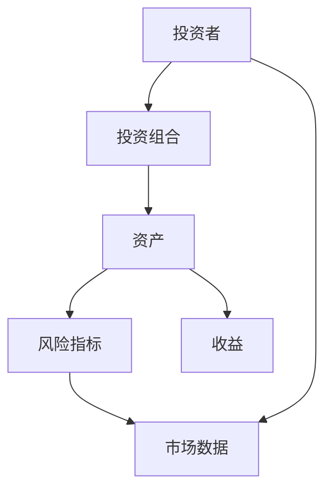
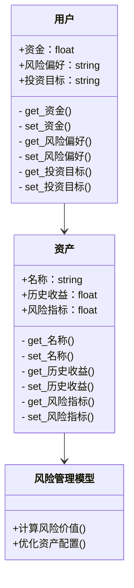
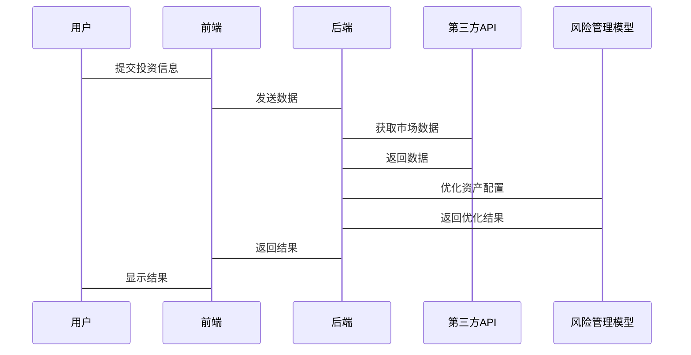

                 


# 构建智能化的个人退休金投资组合动态风险管理助手

## 关键词：退休金投资、风险管理、动态调整、人工智能、投资组合优化

## 摘要：随着金融市场日益复杂，个人退休金投资面临着前所未有的风险与挑战。本文旨在探讨如何利用智能化技术构建动态风险管理助手，通过现代投资组合理论与机器学习算法相结合，实现投资组合的实时优化与风险控制，为个人投资者提供个性化的投资建议与动态风险管理方案。

---

# 第一部分: 背景介绍

# 第1章: 个人退休金投资组合与风险管理概述

## 1.1 问题背景

### 1.1.1 退休金投资的重要性  
退休金是保障个人晚年生活质量的重要资金来源。随着人口老龄化加剧，退休金的投资管理变得尤为重要。合理的投资组合能够最大化资产增值，同时降低投资风险。

### 1.1.2 当前退休金投资的主要问题  
- **市场波动风险**：金融市场波动剧烈，传统的静态投资组合难以应对动态变化的市场环境。  
- **风险承受能力变化**：个人的风险承受能力会随着年龄、财务状况的变化而变化，静态的资产配置策略难以满足动态需求。  
- **信息不对称与决策滞后**：投资者难以及时获取市场信息并做出调整，导致投资决策的滞后性。  

### 1.1.3 动态风险管理的必要性  
动态风险管理能够实时跟踪市场变化和投资者的财务状况，及时调整投资组合，有效降低风险，提高投资收益。

## 1.2 问题描述  

### 1.2.1 投资组合管理的核心目标  
- 实现资产增值最大化。  
- 在可接受风险范围内优化收益。  

### 1.2.2 风险管理的关键挑战  
- 如何量化和评估不同资产的风险。  
- 如何动态调整资产配置以应对市场变化。  

### 1.2.3 动态调整的复杂性  
- 动态调整需要实时数据支持和快速计算能力。  
- 调整策略需要考虑多种因素，如市场趋势、投资者偏好等。  

## 1.3 解决方案  

### 1.3.1 智能化投资组合管理的概念  
通过人工智能和机器学习技术，构建动态风险管理助手，实时监控市场变化和投资者需求，自动调整投资组合。

### 1.3.2 动态风险管理的实现路径  
- 数据采集与分析：实时采集市场数据和用户行为数据。  
- 风险评估与预测：利用机器学习模型预测市场风险。  
- 动态调整策略：根据风险评估结果调整资产配置。  

### 1.3.3 技术手段与方法论  
- 应用现代投资组合理论（MPT）进行资产配置。  
- 利用机器学习算法（如随机森林、神经网络）进行风险预测。  

## 1.4 边界与外延  

### 1.4.1 问题解决的边界  
- 仅关注退休金投资组合的动态风险管理，不涉及其他财务领域。  
- 限定于个人投资者，不考虑机构投资者。  

### 1.4.2 相关概念的外延  
- 动态风险管理可以应用于其他类型的投资组合管理。  
- 相关技术（如机器学习、大数据分析）也可应用于其他金融领域。  

### 1.4.3 核心要素组成  
- 市场数据：包括股票、债券等资产的价格和波动率数据。  
- 用户数据：包括投资者的风险偏好、财务状况等信息。  
- 算法模型：包括风险评估模型、资产配置优化模型。  

## 1.5 概念结构与核心要素  

### 1.5.1 核心概念的层次结构  
- 上层：投资目标与风险偏好。  
- 中层：市场环境与资产类别。  
- 下层：具体资产与风险指标。  

### 1.5.2 核心要素的详细描述  
- **市场环境**：包括经济指标、市场趋势、行业动态等。  
- **资产类别**：包括股票、债券、基金等。  
- **风险指标**：包括波动率、VaR（风险价值）、夏普比率等。  

### 1.5.3 概念之间的关系  
- 市场环境影响资产类别表现。  
- 资产类别表现影响风险指标。  
- 风险指标影响投资组合的动态调整。  

---

# 第二部分: 核心概念与联系

# 第2章: 风险管理模型

## 2.1 风险管理模型的原理  

### 2.1.1 现代投资组合理论（MPT）  
MPT由哈里·马科维茨提出，旨在通过优化资产配置来最大化收益并最小化风险。其核心公式为：  
$$ \text{最优组合} = \arg\min \sigma^2 \quad \text{在给定的收益约束下} $$  
其中，σ²表示投资组合的方差（即风险）。  

### 2.1.2 风险调整的资本资产定价模型（CAPM）  
CAPM用于计算资产的预期收益，公式为：  
$$ E(r_i) = r_f + \beta_i (E(r_m) - r_f) $$  
其中，E(r_i)是资产i的预期收益，r_f是无风险利率，β_i是资产i的贝塔系数，E(r_m)是市场预期收益。  

### 2.1.3 风险价值（VaR）与条件风险价值（CVaR）  
VaR是投资组合在一定置信水平下的潜在损失。CVaR是VaR在超过VaR部分的平均损失，用于更全面地衡量尾部风险。  

## 2.2 动态调整机制  

### 2.2.1 动态资产配置策略  
动态资产配置通过实时调整资产权重，根据市场变化优化投资组合。例如，当市场风险上升时，减少高风险资产的配置比例。  

### 2.2.2 风险承受能力的动态变化  
投资者的风险承受能力会随时间变化，例如在退休临近时，风险承受能力可能下降。系统需实时跟踪并调整风险参数。  

### 2.2.3 市场环境的实时监测与反馈  
系统需实时监测市场波动、经济指标等，根据反馈调整投资组合。  

## 2.3 用户行为分析模型  

### 2.3.1 用户风险偏好的识别  
通过问卷调查和行为分析，识别用户的短期和长期风险偏好。  

### 2.3.2 投资目标与风险承受能力的匹配  
根据用户的财务状况和风险偏好，推荐适合的投资组合。  

### 2.3.3 用户行为数据的采集与分析  
采集用户的交易历史、资产配置等数据，分析用户的实际行为模式。  

## 2.4 核心概念对比  

### 2.4.1 不同风险管理模型的对比分析  
| 模型       | 优点                           | 缺点                           |
|------------|--------------------------------|--------------------------------|
| MPT        | 能够优化资产配置，降低风险     | 需要假设资产收益分布的正态性   |
| CAPM       | 计算单个资产的预期收益           | 仅适用于市场无套利机会的情况     |
| VaR/CVaR   | 易于理解，适合风险厌恶型投资者  | 无法捕捉“黑天鹅”事件的风险      |

### 2.4.2 动态调整机制与静态模型的区别  
动态调整机制能够实时适应市场变化，而静态模型仅适用于相对稳定的市场环境。  

### 2.4.3 用户行为分析与传统风险管理的差异  
用户行为分析结合了投资者的主观因素，而传统风险管理主要依赖于市场数据。  

## 2.5 实体关系图  



---

# 第三部分: 算法原理

# 第3章: 风险管理与优化算法

## 3.1 算法原理概述  

### 3.1.1 现代投资组合理论（MPT）的数学模型  
目标函数：  
$$ \text{最小化} \quad \sigma^2 = \sum_{i=1}^n w_i^2 \sigma_i^2 + \sum_{i \neq j} 2w_i w_j \sigma_{ij} $$  
约束条件：  
$$ \sum_{i=1}^n w_i = 1 $$  
其中，w_i是资产i的权重，σ²是资产i的方差，σ_{ij}是资产i和j的相关性。  

### 3.1.2 风险价值（VaR）的计算方法  
VaR的计算通常采用蒙特卡洛模拟或历史模拟法。例如，使用蒙特卡洛模拟生成大量资产价格的随机样本，计算特定置信水平下的损失。  

### 3.1.3 预测模型的选择  
基于机器学习的预测模型（如LSTM）可以用于预测市场波动，从而优化投资组合的动态调整。  

## 3.2 算法实现  

### 3.2.1 Python代码实现  

```python
import numpy as np

def portfolio_variance(weights, covariance_matrix):
    return np.dot(weights.T, np.dot(covariance_matrix, weights))

def optimize_portfolio(n_assets, returns, covariance_matrix):
    # 初始化权重向量
    weights = np.array([1.0 / n_assets] * n_assets)
    # 迭代优化权重
    for _ in range(100):
        var = portfolio_variance(weights, covariance_matrix)
        if var == 0:
            break
        # 计算梯度并更新权重
        gradient = 2 * np.dot(covariance_matrix, weights)
        weights -= gradient * 0.01
        # 确保权重之和为1
        weights = weights / np.sum(weights)
    return weights

# 示例数据
n_assets = 3
returns = np.array([0.1, 0.15, 0.05])
covariance_matrix = np.array([
    [0.16, 0.05, 0.02],
    [0.05, 0.25, 0.01],
    [0.02, 0.01, 0.16]
])

weights = optimize_portfolio(n_assets, returns, covariance_matrix)
print("优化后的权重：", weights)
```

### 3.2.2 优化算法的数学推导  
目标函数：  
$$ \text{最小化} \quad \sum_{i=1}^n w_i^2 \sigma_i^2 + \sum_{i \neq j} 2w_i w_j \sigma_{ij} $$  
约束条件：  
$$ \sum_{i=1}^n w_i = 1 $$  

### 3.2.3 优化结果分析  
通过优化算法，可以找到在给定风险下的最大收益组合。  

---

# 第四部分: 系统分析与架构设计

# 第4章: 系统分析与架构设计  

## 4.1 系统分析  

### 4.1.1 问题场景介绍  
投资者通过系统输入资金、风险偏好等信息，系统实时分析市场数据，动态调整投资组合。  

### 4.1.2 项目介绍  
本项目旨在构建一个智能化的个人退休金投资组合动态风险管理助手。  

## 4.2 系统功能设计  

### 4.2.1 领域模型  



### 4.2.2 系统架构设计  


### 4.2.3 接口设计  
- 前端接口：用户输入信息，接收优化结果。  
- 后端接口：与第三方API（如金融数据服务）交互，获取市场数据。  

### 4.2.4 交互流程图  



---

# 第五部分: 项目实战

# 第5章: 项目实战  

## 5.1 环境安装  

### 5.1.1 安装Python  
从[Python官网](https://www.python.org/)下载并安装Python 3.8及以上版本。  

### 5.1.2 安装依赖库  
安装以下Python库：  
- numpy  
- pandas  
- scikit-learn  
- matplotlib  

命令：  
```bash
pip install numpy pandas scikit-learn matplotlib
```

## 5.2 系统核心实现  

### 5.2.1 核心代码  

```python
import numpy as np
import pandas as pd
from sklearn.linear_model import LinearRegression

def predict_market(ticker):
    # 获取历史数据
    data = pd.read_csv(f"{ticker}.csv")
    # 训练线性回归模型
    model = LinearRegression()
    model.fit(data[['open', 'high', 'low']], data['close'])
    # 预测未来价格
    future_price = model.predict(data[['open', 'high', 'low']].iloc[-1].values.reshape(1, -1))
    return future_price[0]

# 示例
print(predict_market("AAPL"))
```

### 5.2.2 代码解读  
- 从CSV文件读取股票历史数据。  
- 使用线性回归模型预测未来价格。  
- 返回预测结果。  

## 5.3 实际案例分析  

### 5.3.1 数据准备  
下载某股票的历史数据，保存为CSV格式。  

### 5.3.2 模型训练  
使用历史数据训练预测模型。  

### 5.3.3 结果分析  
分析模型预测结果，评估模型的准确性。  

---

# 第六部分: 最佳实践

# 第6章: 最佳实践  

## 6.1 小结  
通过智能化技术，可以有效优化个人退休金投资组合的动态风险管理，提高投资收益并降低风险。  

## 6.2 注意事项  
- 定期更新模型，以适应市场变化。  
- 注意数据质量和模型的可解释性。  

## 6.3 拓展阅读  
- 《投资学》——《Introducing Modern Portfolio Theory》  
- 《机器学习实战》——《Hands-On Machine Learning with Scikit-Learn and TensorFlow》  

---

作者：AI天才研究院/AI Genius Institute & 禅与计算机程序设计艺术/Zen And The Art of Computer Programming

