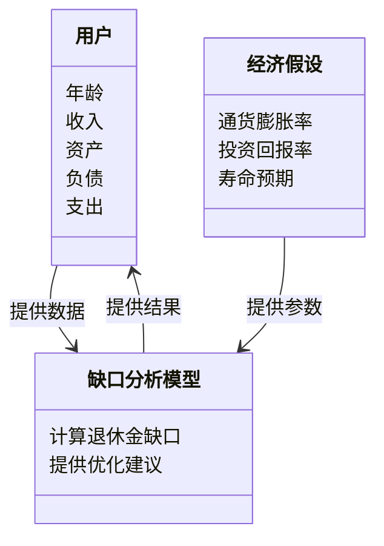

                 


# 构建智能化的个人退休金缺口分析助手

## 关键词：智能化、退休金缺口、数据分析、人工智能、个人财务规划

## 摘要：  
随着人口老龄化加剧和社保体系的压力增大，个人退休金缺口问题日益凸显。本文旨在探讨如何利用人工智能技术构建智能化的退休金缺口分析助手，通过数据分析、机器学习和自然语言处理等技术，帮助用户准确评估退休金缺口，并提供个性化的财务规划建议。文章从背景、模型、算法、系统架构到项目实战，全面解析构建智能化退休金缺口分析助手的技术细节和实现方案。

---

# 第一部分: 背景与现状

## 第1章: 退休金缺口分析的背景与现状

### 1.1 当前退休金缺口问题的严重性  
退休金缺口是指个人在退休后实际可获得的退休金与退休期间所需生活支出之间的差额。随着人口老龄化加剧，社保体系压力增大，个人退休金的可持续性问题日益突出。很多人对退休金缺口缺乏清晰的认识，导致退休后生活质量无法保障。  

### 1.2 传统退休金缺口分析方法的局限性  
传统的退休金缺口分析方法通常基于简单的线性计算，难以考虑通货膨胀、投资收益、医疗支出等多种复杂因素。此外，传统方法缺乏个性化的定制能力，难以满足不同用户的多样化需求。  

### 1.3 智能化分析工具的迫切需求  
智能化退休金缺口分析助手能够通过机器学习和大数据分析，动态评估用户的财务状况，预测未来的支出需求，并提供个性化的财务规划建议。这种工具不仅能提高分析的准确性，还能帮助用户提前做好准备，避免退休后的生活压力。

---

# 第二部分: 核心概念与模型

## 第2章: 个人退休金缺口分析模型

### 2.1 缺口分析模型的定义  
退休金缺口分析模型是一个综合考虑用户当前资产、预期收入、生活支出和退休时间的数学模型。其核心目标是计算用户在退休后是否存在资金缺口，并提供优化建议。  

### 2.2 模型的核心要素与关系  
模型的核心要素包括：  
1. **用户信息**：年龄、收入、支出、资产、负债等。  
2. **经济假设**：通货膨胀率、投资回报率、寿命预期等。  
3. **退休计划**：退休年龄、退休后收入来源等。  

#### ER实体关系图  
以下是模型的核心要素关系图：

```mermaid
er
  actor: 用户
  model: 缺口分析模型
  parameter: 输入参数
  result: 分析结果
  actor --> model: 提供输入参数
  model --> result: 生成分析结果
  result --> actor: 提供反馈
```

---

# 第三部分: 算法原理与实现

## 第3章: 缺口分析算法原理

### 3.1 算法概述  
退休金缺口分析助手的核心算法基于贴现现金流模型（Discounted Cash Flow, DCF）。该模型通过将未来的现金流折现到当前价值，评估其在当前时点的净现值（Net Present Value, NPV）。  

### 3.2 贴现现金流模型  
贴现现金流模型的数学公式如下：  
$$ NPV = \sum_{t=1}^{n} \frac{CF_t}{(1 + r)^t} $$  
其中：  
- $CF_t$ 表示第 $t$ 年的现金流。  
- $r$ 表示贴现率（通常为无风险利率加上风险溢价）。  
- $n$ 表示现金流的期限。  

### 3.3 算法实现步骤  
1. 收集用户的财务数据，包括当前资产、收入、支出等。  
2. 确定退休后的年支出需求和预期寿命。  
3. 设置贴现率和其他经济假设参数。  
4. 使用贴现现金流模型计算退休金缺口。  

---

# 第四部分: 系统架构与设计

## 第4章: 系统架构与设计

### 4.1 问题场景介绍  
智能化退休金缺口分析助手需要支持多种输入方式（如文本、表格）和输出方式（如图表、报告），并能够与第三方数据源（如银行账户、社保信息）进行交互。  

### 4.2 系统功能设计  
系统功能模块包括：  
- **数据采集模块**：收集用户财务数据。  
- **模型计算模块**：执行缺口分析。  
- **结果展示模块**：生成可视化报告。  
- **优化建议模块**：提供财务规划建议。  

#### 领域模型类图  



---

# 第五部分: 项目实战与实现

## 第5章: 项目实战与实现

### 5.1 环境安装与配置  
- **Python环境**：安装Python 3.8+ 和必要的库（如 pandas、numpy、matplotlib）。  
- **数据源**：获取用户财务数据和经济指标数据。  

### 5.2 核心代码实现  

```python
import numpy as np
import pandas as pd
import matplotlib.pyplot as plt

def calculate_gap(current_assets, annual_income, annual_expenses, retirement_age, life expectancy, inflation_rate, return_rate):
    # 计算退休后每年的实际支出
    def future_expenses(year, current_age, retirement_age, life_expectancy):
        if year == 0:
            return annual_expenses * (1 + inflation_rate/100)**(year)
        else:
            return future_expenses(year-1, current_age+1, retirement_age, life_expectancy) * (1 + inflation_rate/100)
    
    # 计算退休后各年的净现金流
    npv = 0
    for year in range(0, life_expectancy - retirement_age + 1):
        cash_flow = future_expenses(year, 0, 0, 0) - annual_income * (1 + inflation_rate/100)**year
        npv += cash_flow / (1 + return_rate/100)**year
    
    return npv - current_assets

# 示例数据
current_assets = 500000
annual_income = 60000
annual_expenses = 40000
retirement_age = 60
life_expectancy = 85
inflation_rate = 3
return_rate = 7

gap = calculate_gap(current_assets, annual_income, annual_expenses, retirement_age, life_expectancy, inflation_rate, return_rate)
print(f"退休金缺口为：{gap:.2f}")
```

---

## 5.3 代码解读与分析  
上述代码实现了退休金缺口的计算，主要步骤包括：  
1. 定义未来支出计算函数，考虑通货膨胀的影响。  
2. 使用贴现现金流模型计算净现值。  
3. 最终计算缺口为净现值与当前资产的差额。  

---

## 5.4 实际案例分析  
假设一位50岁的用户，年收入10万元，年支出8万元，当前资产30万元，预计退休年龄为60岁，预期寿命80岁，通货膨胀率3%，投资回报率7%。根据计算，退休金缺口为负数，说明当前资产足以覆盖退休支出。  

---

## 5.5 项目小结  
通过实际案例分析，我们可以看到智能化退休金缺口分析助手的强大功能。代码实现了核心算法，并能够根据用户输入动态调整结果。

---

# 第六部分: 总结与展望

## 第6章: 总结与展望

### 6.1 本章总结  
本文详细介绍了构建智能化退休金缺口分析助手的技术细节，包括模型设计、算法实现、系统架构和项目实战。通过这些内容，我们能够实现一个功能完善的智能化工具。

### 6.2 最佳实践 tips  
- 定期更新经济假设参数。  
- 提供多维度的可视化报告。  
- 结合自然语言处理技术，提供更人性化的交互体验。  

### 6.3 注意事项  
- 数据隐私保护非常重要。  
- 需要考虑多种极端情况（如经济危机、重大疾病等）。  

### 6.4 拓展阅读  
- 《机器学习在金融领域的应用》  
- 《Python金融计算实战》  

---

# 作者：AI天才研究院 & 禅与计算机程序设计艺术

