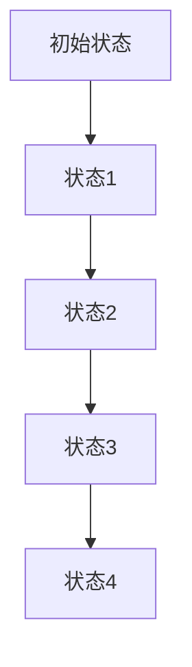
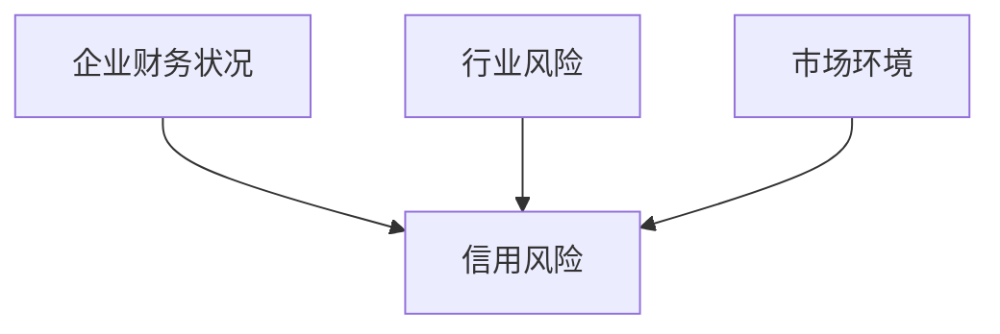
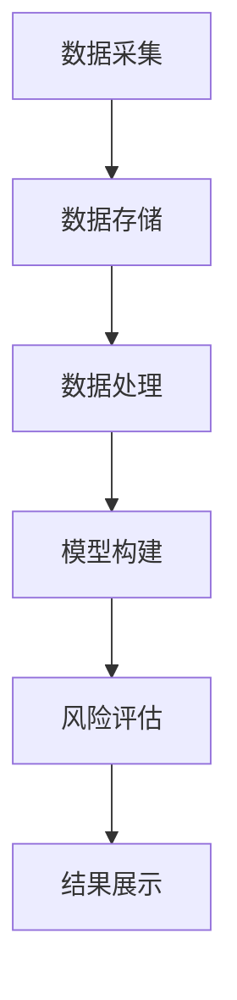

                 


# 《构建智能化的企业信用风险传导模型》

> 关键词：信用风险，风险传导，系统性风险，非系统性风险，企业信用模型，风险管理

> 摘要：本文详细探讨了构建智能化企业信用风险传导模型的理论基础、算法原理、系统架构设计及项目实战。通过分析信用风险的定义、特征、传导机制，结合数学模型和算法实现，提出了一种基于马尔可夫链和贝叶斯网络的智能化信用风险传导模型，并通过实际案例展示了模型的应用与效果。

---

## 第一部分: 企业信用风险传导模型概述

### 第1章: 企业信用风险的基本概念

#### 1.1 信用风险的定义与特征
信用风险是指由于债务人或交易对手未能履行其合同义务，导致债权人或相关方遭受损失的风险。企业信用风险的核心在于企业的偿债能力和意愿。

- **定义**：信用风险是企业在经营过程中，由于自身或外部环境的变化，导致无法按时偿还债务或履行合同义务而产生的风险。
- **特征**：
  1. 客观性：信用风险是客观存在的，不受主观意志控制。
  2. 相关性：信用风险的传导具有连锁效应，一家企业的风险可能影响整个产业链。
  3. 多维性：信用风险受企业内部治理、外部经济环境、行业特征等多方面因素影响。

#### 1.2 企业信用风险的传导机制
信用风险的传导机制是企业之间通过供应链、金融交易等渠道，将风险从一家企业传递到其他相关企业或金融系统的过程。

- **传导路径**：
  1. 直接传导：企业之间的直接债务关系，如供应商因欠款导致资金链断裂。
  2. 间接传导：通过金融中介（如银行）进行传导，一家企业的违约可能引发连锁反应。
  3. 系统性传导：风险从单个企业扩散至整个金融系统，引发系统性金融危机。

#### 1.3 信用风险传导模型的构建背景
传统信用风险管理方法主要基于单个企业的财务指标，难以捕捉系统性风险的传导机制。随着企业间关联性的增强，构建智能化的信用风险传导模型变得尤为重要。

- **挑战**：
  1. 数据量大：企业信用数据涉及多维度信息，数据获取和处理难度大。
  2. 非线性关系：信用风险的传导过程复杂，存在非线性关系。
  3. 实时性要求高：金融市场的动态变化要求模型具有实时性。

---

### 第2章: 企业信用风险传导模型的理论基础

#### 2.1 信用风险传导的理论框架
系统性风险与非系统性风险是信用风险传导模型的两大核心理论。

- **系统性风险**：
  - 定义：由整个经济系统或市场的波动引起的，影响所有资产的风险。
  - 特征：不可分散、影响广泛。
- **非系统性风险**：
  - 定义：由特定企业或行业的因素引起的，可以通过分散投资降低的风险。
  - 特征：可分散、影响范围有限。

#### 2.2 信用风险传导的数学模型
构建数学模型是信用风险传导研究的核心。

- **马尔可夫链模型**：
  - 用于描述信用等级的变化过程。
  - 状态转移概率矩阵：描述企业信用等级从一个状态转移到另一个状态的概率。
  - 公式：$P_{i,j} = P(\text{信用等级从状态 } i \text{ 转移到状态 } j)$

- **贝叶斯网络模型**：
  - 用于分析信用风险的影响因素及其相互关系。
  - 节点表示变量（如企业财务状况、行业风险等），边表示因果关系。
  - 公式：$P(A|B) = \frac{P(B|A)P(A)}{P(B)}$

#### 2.3 实体关系图（ER图）架构
通过ER图展示信用风险传导模型的核心要素及其关系。

```mermaid
erDiagram
    actor 企业A [企业]
    actor 企业B [企业]
    actor 银行 [银行]
    actor 市场 [市场]
    node 信用风险 [信用风险]
    node 传导路径 [传导路径]
    node 系统性风险 [系统性风险]
    node 非系统性风险 [非系统性风险]

    企业A --> 信用风险: 拥有
    企业B --> 信用风险: 拥有
    银行 --> 信用风险: 拥有
    市场 --> 信用风险: 拥有

    信用风险 --> 传导路径: 通过
    传导路径 --> 系统性风险: 引发
    传导路径 --> 非系统性风险: 引发
```

---

### 第3章: 信用风险传导模型的核心概念与联系

#### 3.1 核心概念的定义与属性
- **系统性风险**：影响整个金融系统的风险，具有不可分散性。
- **非系统性风险**：特定于某个企业或行业的风险，可通过分散投资降低。
- **信用风险传导**：企业之间的信用风险通过供应链、金融交易等渠道的传播过程。

#### 3.2 核心概念的对比分析
下表对比了系统性风险与非系统性风险的主要区别：

| 特性               | 系统性风险               | 非系统性风险           |
|--------------------|--------------------------|------------------------|
| 影响范围           | 整个金融系统             | 单个企业或行业         |
| 可分散性           | 不可分散                 | 可分散                 |
| 成因               | 经济周期、政策变化等     | 企业财务状况、管理等   |
| 示例               | 金融危机、经济衰退       | 企业违约、诉讼案件     |

#### 3.3 实体关系图（ER图）架构
通过ER图展示信用风险传导模型的核心要素及其关系。

```mermaid
erDiagram
    entity 企业A [企业]
    entity 企业B [企业]
    entity 银行 [银行]
    entity 市场 [市场]
    entity 信用风险 [信用风险]
    entity 系统性风险 [系统性风险]
    entity 非系统性风险 [非系统性风险]

    企业A --> 信用风险: 拥有
    企业B --> 信用风险: 拥有
    银行 --> 信用风险: 拥有
    市场 --> 信用风险: 拥有

    信用风险 --> 系统性风险: 引发
    信用风险 --> 非系统性风险: 引发
```

---

## 第二部分: 信用风险传导模型的算法原理

### 第4章: 信用风险传导模型的算法实现

#### 4.1 算法原理概述
- **选择算法的依据**：基于信用风险传导的复杂性，选择马尔可夫链和贝叶斯网络作为核心算法。
- **马尔可夫链模型**：用于描述企业信用等级的转移过程。
- **贝叶斯网络模型**：用于分析信用风险的影响因素及其相互关系。

#### 4.2 算法实现步骤

##### 马尔可夫链模型实现步骤


- **步骤1**：确定信用等级的转移状态。
- **步骤2**：计算状态转移概率矩阵。
- **步骤3**：预测未来的信用等级变化。

##### 贝叶斯网络模型实现步骤


- **步骤1**：构建贝叶斯网络的结构。
- **步骤2**：计算每个节点的概率分布。
- **步骤3**：进行信用风险的推断。

#### 4.3 算法实现代码
以下是一个简单的马尔可夫链模型实现示例：

```python
import numpy as np

# 定义状态转移矩阵
states = ['A', 'B', 'C', 'D']
transition_matrix = np.array([
    [0.3, 0.4, 0.2, 0.1],
    [0.2, 0.5, 0.2, 0.1],
    [0.1, 0.3, 0.4, 0.2],
    [0.1, 0.2, 0.3, 0.4]
])

# 初始状态概率分布
initial_state = np.array([1, 0, 0, 0])

# 预测下一步状态
next_state = np.dot(initial_state, transition_matrix)
print("Next state probabilities:", next_state)
```

---

### 第5章: 数学模型与公式推导

#### 5.1 马尔可夫链模型的数学表达
- **状态转移概率矩阵**：$P$，其中$P_{i,j}$表示从状态$i$转移到状态$j$的概率。
- **n步转移概率**：$P^n$，表示经过$n$步转移后的概率。

#### 5.2 贝叶斯网络模型的数学表达
- **贝叶斯公式**：$P(A|B) = \frac{P(B|A)P(A)}{P(B)}$

#### 5.3 系统性风险的数学模型
- **系统性风险指数**：$S = \sum_{i=1}^{n} w_i R_i$，其中$w_i$是权重，$R_i$是各个因素的风险值。

---

## 第三部分: 项目实战与系统架构设计

### 第6章: 项目实战

#### 6.1 环境安装
- **工具安装**：安装Python、NumPy、Matplotlib、TensorFlow等工具。
- **数据获取**：收集企业的财务数据、行业数据、市场数据等。

#### 6.2 核心实现代码
以下是一个信用风险传导模型的核心实现代码：

```python
import numpy as np
import pandas as pd

# 数据预处理
data = pd.read_csv('credit_data.csv')
data = data.dropna().reset_index()

# 构建马尔可夫链模型
transition_matrix = pd.crosstab(data['current_state'], data['next_state'])
transition_matrix = transition_matrix.div(transition_matrix.sum(axis=1), axis=0)

# 预测未来状态
initial_state = np.array([1, 0, 0, 0])
next_state = np.dot(initial_state, transition_matrix.values)
print("Next state probabilities:", next_state)
```

#### 6.3 实际案例分析
通过具体案例分析模型的应用效果，例如分析一家企业的信用风险传导过程。

---

### 第7章: 系统架构设计

#### 7.1 系统功能设计
- **数据采集模块**：采集企业数据、市场数据等。
- **模型构建模块**：构建信用风险传导模型。
- **风险评估模块**：评估系统性风险和非系统性风险。

#### 7.2 系统架构图


---

## 第四部分: 总结与展望

### 第8章: 总结
- **核心内容回顾**：信用风险的定义、传导机制、模型构建方法。
- **模型优势**：智能化、实时性、可扩展性。

### 第9章: 展望
- **未来研究方向**：复杂系统的信用风险建模、动态调整模型参数。
- **技术发展趋势**：结合人工智能和大数据技术，构建更精准的信用风险传导模型。

---

## 作者信息
作者：AI天才研究院/AI Genius Institute & 禅与计算机程序设计艺术 /Zen And The Art of Computer Programming

