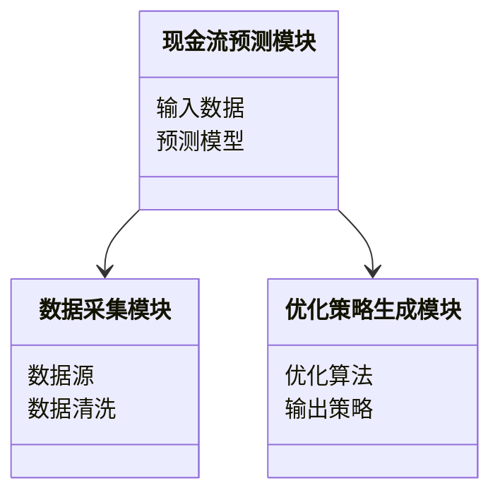
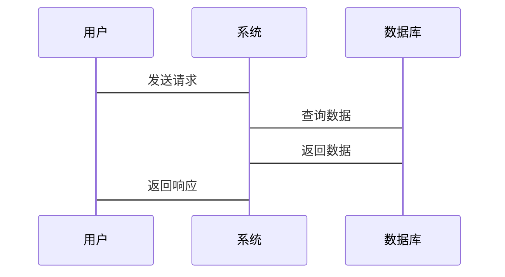

                 


# 构建智能化的企业现金流管理优化平台

> 关键词：现金流管理、人工智能、机器学习、智能化优化、企业财务管理

> 摘要：本文将深入探讨如何利用人工智能和机器学习技术构建智能化的企业现金流管理优化平台。从传统现金流管理的局限性出发，分析智能化管理的必要性，详细阐述现金流预测模型和优化算法的核心原理，结合系统架构设计和项目实战，为读者提供一套完整的解决方案。

---

## 第1章: 企业现金流管理优化平台概述

### 1.1 企业现金流管理的核心概念

#### 1.1.1 企业现金流管理的基本概念

现金流管理是企业财务管理的核心组成部分，涉及企业现金流入和流出的计划、控制和分析。有效的现金流管理能够确保企业在任何时候都有足够的流动性来支付债务、运营成本以及其他财务需求。现金流管理的关键在于预测未来现金流的变化趋势，并根据预测结果进行优化调整。

#### 1.1.2 现金流管理的重要性与挑战

现金流管理的重要性体现在以下几个方面：
- **流动性管理**：确保企业有足够的现金应对日常运营和突发事件。
- **投资决策支持**：通过现金流预测，帮助企业做出更明智的投资决策。
- **风险管理**：识别潜在的财务风险，如现金流断链或过度依赖某项业务。

然而，现金流管理也面临诸多挑战：
- 数据来源多样，难以整合。
- 预测模型的准确性和实时性要求高。
- 人工操作效率低，容易出错。

#### 1.1.3 智能化现金流管理的必要性

随着企业规模的扩大和市场竞争的加剧，传统的现金流管理模式已无法满足现代企业的需求。智能化现金流管理通过引入人工智能和大数据技术，能够实时监控现金流变化，自动预测和优化，显著提高管理效率和准确性。

---

### 1.2 传统现金流管理的局限性

#### 1.2.1 传统现金流管理的流程与问题

传统现金流管理通常依赖人工操作，流程繁琐且效率低下。主要问题包括：
- 数据分散，难以实时更新。
- 预测模型简单，缺乏动态调整能力。
- 缺乏跨部门协作，导致信息不对称。

#### 1.2.2 数据孤岛与信息不对称

在传统管理模式下，企业的财务数据往往分散在不同的部门和系统中，导致数据孤岛问题。信息无法及时共享，影响现金流预测的准确性和及时性。

#### 1.2.3 人工操作的低效性与错误率

人工操作不仅效率低下，还容易因人为疏忽导致错误。尤其是在处理大量数据时，错误率难以控制。

---

### 1.3 智能化现金流管理的背景与趋势

#### 1.3.1 大数据与人工智能技术的发展

近年来，大数据和人工智能技术的快速发展为企业财务管理带来了新的机遇。通过机器学习算法，企业可以更精准地预测现金流变化，并优化管理策略。

#### 1.3.2 智能化财务管理的行业趋势

越来越多的企业开始采用智能化财务管理工具，尤其是在现金流管理领域。智能化管理不仅提高了效率，还帮助企业更好地应对市场波动。

#### 1.3.3 企业现金流管理优化的未来方向

未来的现金流管理将更加注重智能化和自动化。通过实时数据分析和智能决策支持，企业能够实现更高效的现金流管理。

---

## 1.4 本章小结

### 1.4.1 核心问题总结

现金流管理是企业财务管理的核心，但传统模式存在数据分散、预测不准等问题，亟需智能化解决方案。

### 1.4.2 智能化优化的必要性

智能化现金流管理能够提高预测准确性和管理效率，帮助企业更好地应对财务风险。

### 1.4.3 本书研究目标

本书旨在探讨如何利用人工智能和大数据技术构建智能化的企业现金流管理优化平台，提供一套完整的解决方案。

---

## 第二部分: 核心概念与原理

---

## 第2章: 智能化现金流管理的核心概念

### 2.1 现金流预测模型

#### 2.1.1 时间序列分析的基本原理

时间序列分析是一种基于历史数据预测未来趋势的方法。常用的模型包括ARIMA和LSTM。

##### ARIMA模型

ARIMA（自回归积分滑动平均模型）是一种广泛应用于时间序列预测的方法。其数学公式为：
$$ ARIMA(p, d, q) $$

其中：
- \( p \) 表示自回归的阶数。
- \( d \) 表示差分的阶数。
- \( q \) 表示滑动平均的阶数。

##### LSTM模型

LSTM（长短期记忆网络）是一种基于循环神经网络的模型，特别适合处理时间序列数据。其结构包括输入门、遗忘门和输出门。

$$ \text{LSTM}(t, h, o) $$

其中：
- \( t \) 表示时间步。
- \( h \) 表示隐藏状态。
- \( o \) 表示输出。

---

#### 2.1.2 机器学习在现金流预测中的应用

机器学习算法（如随机森林、支持向量回归）可以用于现金流预测。其中，支持向量回归模型的数学公式为：
$$ \text{minimize } \frac{1}{2}||w||^2 + C\sum_{i=1}^n \xi_i $$

其中：
- \( w \) 表示权重。
- \( C \) 表示惩罚系数。
- \( \xi_i \) 表示松弛变量。

---

#### 2.1.3 神经网络模型的原理与优势

神经网络模型通过多层感知机模拟人类大脑的神经网络，能够捕捉复杂的非线性关系。其优势在于能够处理大量特征，并自动提取有用信息。

---

### 2.2 数据驱动的现金流优化方法

#### 2.2.1 数据清洗与特征工程

数据清洗是确保数据质量的重要步骤，包括去除异常值、填补缺失值等。特征工程则是通过提取和选择特征，提高模型的预测能力。

#### 2.2.2 基于机器学习的优化算法

遗传算法是一种模拟自然选择的优化算法，常用于解决复杂的优化问题。其基本步骤包括选择、交叉和变异。

#### 2.2.3 数据可视化与分析工具

通过数据可视化工具（如Matplotlib、Tableau），可以更直观地分析现金流数据，发现潜在规律。

---

### 2.3 现金流管理的系统架构

#### 2.3.1 系统功能模块划分

系统主要功能模块包括：
- 数据采集与处理模块。
- 现金流预测模块。
- 优化策略生成模块。
- 实时监控模块。

#### 2.3.2 数据流与信息交互

数据从各个来源采集后，经过清洗和特征工程处理，输入预测模型，生成预测结果，再通过优化算法生成优化策略。

#### 2.3.3 系统的可扩展性与灵活性

系统设计应具有良好的扩展性，能够方便地添加新的数据源和预测模型。

---

## 第3章: 现金流预测与优化的数学模型

### 3.1 时间序列预测模型

#### 3.1.1 ARIMA模型的数学公式

$$ ARIMA(p, d, q) $$

---

#### 3.1.2 LSTM模型的结构与公式

$$ \text{LSTM}(t, h, o) $$

---

### 3.2 机器学习优化算法

#### 3.2.1 遗传算法的基本原理

遗传算法通过模拟自然选择的过程，逐步优化解。

---

#### 3.2.2 支持向量回归的数学模型

$$ \text{minimize } \frac{1}{2}||w||^2 + C\sum_{i=1}^n \xi_i $$

---

#### 3.2.3 线性回归与非线性回归的区别

线性回归假设变量之间存在线性关系，而非线性回归可以处理更复杂的关系。

---

### 3.3 现金流优化的数学公式

#### 3.3.1 线性规划模型

$$ \text{maximize } Z = \sum c_j x_j $$

约束条件：
$$ \text{subject to } g_i(x) \leq 0 $$

---

#### 3.3.2 非线性规划模型

$$ \text{subject to } g_i(x) \leq 0 $$

---

## 第三部分: 系统分析

---

## 第4章: 系统架构设计

### 4.1 系统功能设计

#### 4.1.1 领域模型（Mermaid 类图）



---

### 4.2 系统架构设计

#### 4.2.1 系统架构（Mermaid 架构图）

```mermaid
archiecture

    client --> api-gateway: HTTP 请求
    api-gateway --> service-1: 服务调用
    service-1 --> database-1: 数据查询
    service-2 --> database-2: 数据查询
    service-3 --> database-3: 数据查询
```

---

### 4.3 系统接口设计

#### 4.3.1 系统交互（Mermaid 序列图）



---

## 第5章: 项目实战

### 5.1 环境安装

安装所需的依赖：
- Python
- TensorFlow
- Pandas
- Matplotlib

---

### 5.2 核心实现

#### 5.2.1 现金流预测模型代码

```python
import numpy as np
import pandas as pd
from sklearn.model_selection import train_test_split
from sklearn.metrics import mean_squared_error
from tensorflow.keras.models import Sequential
from tensorflow.keras.layers import LSTM, Dense

# 数据准备
data = pd.read_csv('cash_flow.csv')
X = data[['收入', '支出', '净现金流量']]
y = data['预测现金流']

# 数据分割
X_train, X_test, y_train, y_test = train_test_split(X, y, test_size=0.2)

# 模型构建
model = Sequential()
model.add(LSTM(64, input_shape=(None, 3)))
model.add(Dense(1))
model.compile(loss='mean_squared_error', optimizer='adam')

# 模型训练
model.fit(X_train, y_train, epochs=10, batch_size=32, verbose=1)

# 模型预测
y_pred = model.predict(X_test)
print(mean_squared_error(y_test, y_pred))
```

---

## 第6章: 最佳实践与总结

### 6.1 最佳实践 tips

- 数据清洗是关键，确保数据质量。
- 选择合适的模型，避免过拟合。
- 定期更新模型，适应数据变化。

### 6.2 小结

通过智能化技术，企业可以实现更高效的现金流管理，降低风险，提升竞争力。

### 6.3 注意事项

- 数据隐私保护。
- 模型的实时性与准确性之间的平衡。
- 系统的可扩展性与维护成本。

### 6.4 拓展阅读

- 《机器学习实战》
- 《时间序列分析》
- 《企业财务管理》

---

## 作者

作者：AI天才研究院/AI Genius Institute & 禅与计算机程序设计艺术/Zen And The Art of Computer Programming

