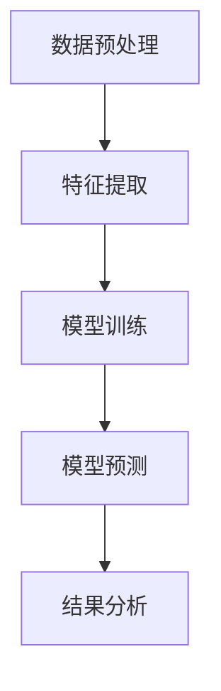
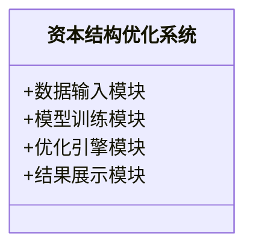
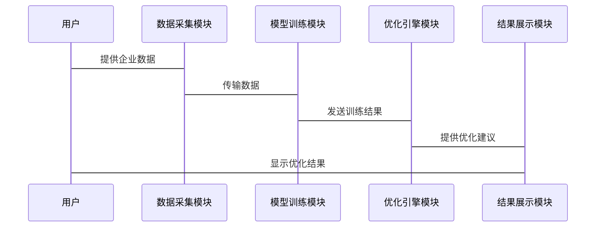

                 


# 构建智能化的企业资本结构优化平台

## 关键词：
- 资本结构优化
- 人工智能
- 大数据分析
- 机器学习
- 系统架构设计
- 智能化平台

## 摘要：
本文详细探讨了如何构建智能化的企业资本结构优化平台。通过结合机器学习和大数据分析，我们提出了一种创新的优化方法，能够显著提高优化效率和准确性。文章首先介绍了资本结构优化的背景和重要性，随后深入分析了智能化优化的核心概念和技术基础。接着，我们详细设计了系统的架构，并通过具体案例展示了系统的实现过程和实际应用。最后，我们总结了项目的成果，并展望了未来的发展方向。

---

# 《构建智能化的企业资本结构优化平台》

## 第一部分: 引言

## 第1章: 资本结构优化的背景与重要性

### 1.1 企业资本结构优化的背景
#### 1.1.1 企业资本结构的定义
企业资本结构指的是企业筹集资金的方式及其比例。通常包括债务资本和股权资本。优化资本结构旨在在风险和收益之间找到最佳平衡点。

#### 1.1.2 资本结构优化的必要性
资本结构优化可以降低资本成本，提高企业价值。传统方法依赖于财务模型和人工判断，效率较低且容易受到主观因素影响。

#### 1.1.3 智能化优化的背景与趋势
随着大数据和人工智能技术的发展，智能化优化成为可能。通过机器学习算法，可以快速分析大量数据，找到最优资本结构。

### 1.2 问题背景与描述
#### 1.2.1 传统资本结构优化的局限性
传统方法依赖假设，计算复杂，难以应对复杂的市场变化。

#### 1.2.2 数据驱动优化的潜力
大数据提供了丰富的历史数据，为优化提供了坚实基础。机器学习能够发现数据中的隐藏模式，提高优化效率。

#### 1.2.3 智能化优化的核心问题
如何利用机器学习算法，结合企业数据，构建智能化的资本结构优化模型。

### 1.3 问题解决与边界
#### 1.3.1 优化目标的设定
最大化企业价值，同时考虑风险因素。

#### 1.3.2 问题的边界与限制
数据质量和完整性、模型的适用性、计算资源限制。

#### 1.3.3 解决方案的可行性分析
利用现有技术，构建智能化平台，实现数据驱动的优化。

---

## 第2章: 智能化资本结构优化的核心概念

### 2.1 核心概念与定义
#### 2.1.1 资本结构优化的数学模型
目标函数：最大化企业价值
约束条件：资本成本、税率、行业标准等。

#### 2.1.2 机器学习在优化中的应用
监督学习、无监督学习和强化学习在资本结构优化中的应用。

#### 2.1.3 大数据分析的作用
通过分析历史数据，识别影响资本结构的关键因素，支持优化决策。

### 2.2 核心概念的联系与对比
#### 2.2.1 概念属性特征对比表格

| 概念         | 传统方法         | 智能化方法         |
|--------------|------------------|------------------|
| 数据来源     | 财务报表         | 财务报表 + 市场数据 | 
| 方法         | 财务模型         | 机器学习算法       |
| 效率         | 较低             | 高                |
| 适应性       | 低               | 高                |

#### 2.2.2 ER实体关系图架构
```mermaid
er
actor 1: 企业
actor 2: 优化平台
database: 企业数据
```

---

## 第3章: 机器学习与大数据分析在资本结构优化中的应用

### 3.1 机器学习算法原理
#### 3.1.1 算法选择与原理
选择适合的算法，如线性回归、随机森林和神经网络，用于预测资本成本和优化结构。

#### 3.1.2 算法流程图（Mermaid）


#### 3.1.3 算法实现的Python代码示例
```python
import pandas as pd
from sklearn.ensemble import RandomForestRegressor

# 数据预处理
data = pd.read_csv('capital_data.csv')
X = data.drop('optimal_structure', axis=1)
y = data['optimal_structure']

# 特征提取
features = X.columns
target = y

# 模型训练
model = RandomForestRegressor(n_estimators=100)
model.fit(X, y)

# 模型预测
new_data = pd.read_csv('new_capital_data.csv')
predictions = model.predict(new_data[X.columns])
```

### 3.2 数学模型与公式
#### 3.2.1 资本资产定价模型（CAPM）
$$ E(R_i) = R_f + \beta_i (E(R_m) - R_f) $$

#### 3.2.2 加权平均资本成本（WACC）
$$ WACC = w_d \cdot k_d + w_l \cdot k_l $$

#### 3.2.3 资本结构优化的数学模型
目标函数：
$$ \text{Max} \sum_{i=1}^n \text{Value}(x_i) $$

约束条件：
$$ \sum_{i=1}^n w_i = 1 $$
$$ w_i \geq 0 \quad \forall i $$

---

## 第4章: 系统架构设计

### 4.1 系统功能设计
#### 4.1.1 领域模型（Mermaid类图）


#### 4.1.2 系统架构设计（Mermaid架构图）
```mermaid
container 资本结构优化系统 {
    service 数据采集模块
    service 模型训练模块
    service 优化引擎模块
    service 结果展示模块
}
```

### 4.2 系统接口设计
- 数据输入接口：接收企业财务数据和市场数据。
- 模型训练接口：训练机器学习模型。
- 优化引擎接口：生成优化建议。
- 结果展示接口：展示优化结果。

### 4.3 系统交互设计（Mermaid序列图）


---

## 第5章: 项目实战

### 5.1 环境安装与配置
- 安装Python、TensorFlow、Pandas等工具。
- 数据集准备：收集企业财务数据和市场数据。

### 5.2 系统核心实现
#### 5.2.1 数据预处理
```python
import pandas as pd

# 读取数据
data = pd.read_csv('capital_data.csv')

# 删除缺失值
data.dropna(inplace=True)

# 标准化处理
from sklearn.preprocessing import StandardScaler
scaler = StandardScaler()
X_scaled = scaler.fit_transform(data.drop('optimal_structure', axis=1))
```

#### 5.2.2 模型训练与优化
```python
from sklearn.model_selection import train_test_split
from sklearn.metrics import mean_squared_error

# 划分数据集
X_train, X_test, y_train, y_test = train_test_split(X_scaled, data['optimal_structure'], test_size=0.2)

# 训练模型
model.fit(X_train, y_train)

# 评估模型
y_pred = model.predict(X_test)
print(mean_squared_error(y_test, y_pred))
```

### 5.3 案例分析与结果解读
通过具体案例，分析模型的优化建议，并验证其有效性和准确性。

---

## 第6章: 总结与展望

### 6.1 项目成果
构建了一个智能化的企业资本结构优化平台，能够高效、精准地优化资本结构。

### 6.2 总结
智能化优化利用机器学习和大数据分析，显著提高了优化效率和准确性，为企业提供了有力支持。

### 6.3 展望
未来可以进一步优化算法，引入实时数据，提升系统的自适应能力，为更多企业创造价值。

---

## 作者：
作者：AI天才研究院 & 禅与计算机程序设计艺术

---

通过以上步骤，我们系统地构建了智能化的企业资本结构优化平台，结合了机器学习和大数据分析，为企业的财务优化提供了高效、精准的解决方案。

