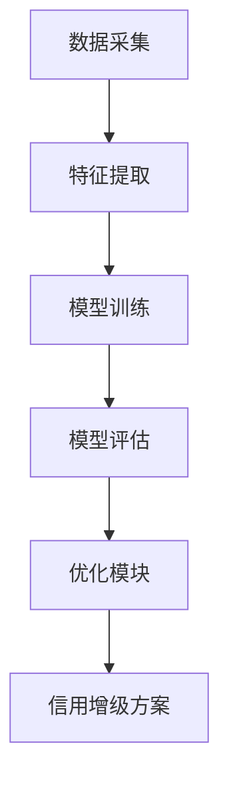
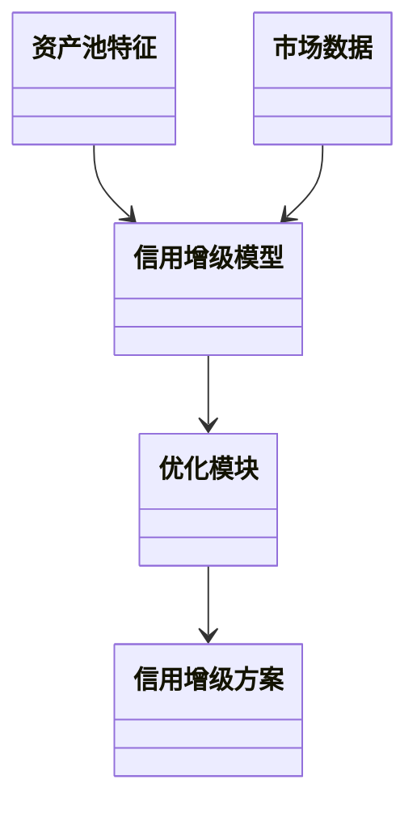

                 


# 《构建智能化的资产证券化信用增级优化模型》

## 关键词：资产证券化, 信用增级, 智能化模型, 机器学习, 风险评估

## 摘要：
本文详细探讨了如何利用人工智能技术构建智能化的资产证券化信用增级优化模型。通过分析传统信用增级方法的局限性，提出了一种基于机器学习的信用增级优化模型，旨在提高信用评估的准确性和效率。本文从资产证券化的背景出发，详细阐述了信用增级的核心概念、算法原理、系统架构设计以及实际项目实现，为读者提供了一套完整的解决方案。通过实际案例分析，本文展示了如何利用智能化模型优化信用增级过程，降低信用风险，提升资产证券化的效率和安全性。

---

# 第一部分: 资产证券化与信用增级概述

## 第1章: 资产证券化与信用增级基础

### 1.1 资产证券化的概念与流程
#### 1.1.1 资产证券化的定义
资产证券化是指将缺乏流动性但具有未来现金流的资产（如房地产、应收账款等）转化为可以在市场上流通的证券（如债券或股票）的过程。通过资产证券化，投资者可以间接投资于原本难以直接投资的资产，而发起人则可以快速获得资金，优化资产结构。

#### 1.1.2 资产证券化的基本流程
1. **资产池的形成**：选择一组具有相似风险和收益特性的资产，形成资产池。
2. **信用增级**：通过结构化设计（如优先级分层、信用增强工具等）提高资产池的整体信用评级。
3. **发行证券**：将资产池的现金流权利转化为可流通的证券，并在市场上发行。
4. **现金流分配**：根据证券的条款，将现金流分配给投资者。

#### 1.1.3 资产证券化的分类与特点
资产证券化可以分为抵押贷款资产证券化、资产支持证券化和项目融资证券化。其特点包括：风险分散、流动性高、结构化设计灵活等。

---

### 1.2 信用增级的定义与作用
#### 1.2.1 信用增级的定义
信用增级是指通过结构化设计或外部担保等手段，提高资产池的整体信用评级，从而降低投资者的风险。

#### 1.2.2 信用增级在资产证券化中的作用
1. **降低融资成本**：通过提高信用评级，资产支持证券的发行利率降低，发起人融资成本减少。
2. **吸引投资者**：高信用评级的证券更容易吸引投资者，扩大市场流动性。
3. **风险隔离**：通过结构化设计，将资产池的风险与其他资产分离，降低整体风险。

#### 1.2.3 信用增级的常见方式
1. **优先级分层**：将资产池分为优先级和次级，优先级证券的信用评级较高，次级证券承担更多风险。
2. **信用增强工具**：如备用信用证、流动性支持等，用于增强资产池的信用。
3. **超额抵押**：通过超额抵押资产池的市场价值，提高证券的偿付能力。

---

### 1.3 资产证券化中的信用风险
#### 1.3.1 信用风险的定义与来源
信用风险是指由于债务人或交易对手违约而导致的损失。在资产证券化中，信用风险主要来源于资产池中的基础资产质量、市场波动、经济周期变化等。

#### 1.3.2 信用风险对资产证券化的影响
1. **影响证券评级**：资产池的信用风险直接影响证券的信用评级。
2. **影响投资者信心**：高信用风险可能导致投资者对证券的需求下降。
3. **影响市场流动性**：高信用风险会降低市场流动性，增加交易成本。

#### 1.3.3 信用风险的量化与评估
信用风险的量化可以通过概率论、蒙特卡洛模拟等方法实现。常用的评估指标包括违约概率（PD）、违约损失率（LGD）等。

---

### 1.4 传统信用增级方法的局限性
#### 1.4.1 传统信用增级方法的概述
传统信用增级方法主要包括优先级分层、超额抵押和信用增强工具等。这些方法在一定程度上降低了信用风险，但存在以下问题：
1. **缺乏动态调整能力**：传统方法难以根据市场变化实时调整信用增级策略。
2. **依赖人工经验**：信用增级的设计高度依赖人工经验，难以保证最优性。
3. **计算复杂**：传统方法需要手动计算信用增级的收益与成本，效率较低。

#### 1.4.2 传统方法的优缺点分析
| 优点 | 缺点 |
|------|------|
| 实现简单，易于理解 | 缺乏灵活性，难以应对复杂市场变化 |
| 成本低 | 计算效率低，依赖人工经验 |
| 易于监管合规 | 无法实现动态优化 |

#### 1.4.3 传统方法的改进空间
传统信用增级方法需要引入智能化技术，通过机器学习和大数据分析实现动态优化和实时调整。这不仅能提高信用增级的效率，还能降低信用风险。

---

## 第2章: 资产证券化信用增级模型的构建

### 2.1 核心概念与定义
#### 2.1.1 资产池的定义与特征
资产池是指一组具有相似风险和收益特性的资产集合。资产池的特征包括资产类型、资产规模、资产信用等级等。

#### 2.1.2 信用评级的定义与标准
信用评级是对资产池或证券的信用风险进行量化评估的过程。常用的评级标准包括国际评级机构（如穆迪、标普）发布的评级体系。

#### 2.1.3 信用增级的数学模型
信用增级模型通过数学公式计算资产池的信用风险，并根据风险结果设计最优的信用增级方案。

---

### 2.2 资产池特征与信用风险的关系
#### 2.2.1 资产池特征的分类
资产池特征主要包括资产类型、资产规模、资产信用等级、资产期限等。

#### 2.2.2 信用风险与资产池特征的关系
1. **资产类型**：不同类型资产的风险和收益特性不同，影响信用风险。
2. **资产规模**：资产规模越大，信用风险可能越高。
3. **资产信用等级**：资产信用等级越高，信用风险越低。
4. **资产期限**：资产期限越长，信用风险越高。

#### 2.2.3 资产池特征对信用增级的影响
资产池特征决定了信用增级的方案设计。例如，低信用等级的资产池需要更高的信用增级措施。

---

### 2.3 信用增级模型的构建逻辑
#### 2.3.1 模型输入与输出的定义
1. **输入**：资产池特征、市场数据、信用评级参数。
2. **输出**：信用增级方案、信用评级结果。

#### 2.3.2 模型的核心假设与约束条件
1. 假设资产池中的资产具有相似的风险和收益特性。
2. 假设市场数据（如利率、违约概率）是可预测的。
3. 约束条件：信用增级方案需要满足投资者的收益要求和发起人的融资成本要求。

#### 2.3.3 模型的构建步骤与流程
1. 数据采集与预处理。
2. 模型训练与优化。
3. 模型验证与测试。
4. 模型部署与应用。

---

### 2.4 信用增级模型的数学表达
#### 2.4.1 资产池信用风险的数学模型
$$ \text{信用风险} = \text{违约概率} \times \text{违约损失率} $$

#### 2.4.2 信用增级的优化目标与约束
$$ \text{目标}：\min \text{信用风险} $$
$$ \text{约束}：\text{信用增级成本} \leq \text{预算} $$

#### 2.4.3 模型的优化算法与实现
常用的优化算法包括线性规划、遗传算法等。以下是线性规划的简单实现：

```python
import numpy as np
from scipy.optimize import linprog

# 定义目标函数系数
c = np.array([1, 1, 1])

# 定义约束矩阵
A = np.array([[1, 0, 0],
              [0, 1, 0],
              [0, 0, 1]])

# 定义约束条件
b = np.array([10, 20, 30])

# 定义变量下界和上界
bounds = (0, None)

# 求解线性规划问题
result = linprog(c, A, b, bounds=bounds, method='highs')

print(result)
```

---

## 第3章: 信用增级模型的算法选择与实现

### 3.1 算法选择的依据与标准
#### 3.1.1 算法选择的考虑因素
1. **计算效率**：算法需要快速处理大量数据。
2. **模型解释性**：模型需要易于理解和解释。
3. **适用性**：算法需要适用于不同类型的资产池。

#### 3.1.2 常见算法的优缺点对比
| 算法 | 优点 | 缺点 |
|------|------|------|
| 支持向量机 | 高精度，适用于小样本数据 | 计算复杂度高 |
| 随机森林 | 高精度，易于解释 | 适合小样本数据 |
| 神经网络 | 强大学习能力，适用于复杂数据 | 需要大量数据和计算资源 |

#### 3.1.3 算法选择的最终决策
基于计算效率和模型解释性，选择随机森林作为信用增级模型的核心算法。

---

### 3.2 算法原理与实现步骤
#### 3.2.1 算法原理的详细阐述
随机森林是一种基于决策树的集成学习算法。通过构建多棵决策树并进行投票或平均，随机森林可以提高模型的准确性和鲁棒性。

#### 3.2.2 算法实现的步骤分解
1. 数据预处理：标准化特征、处理缺失值。
2. 模型训练：使用随机森林算法训练模型。
3. 模型预测：输入资产池特征，输出信用增级方案。

#### 3.2.3 算法实现
以下是随机森林算法的Python实现示例：

```python
from sklearn.ensemble import RandomForestClassifier
from sklearn.model_selection import train_test_split
from sklearn.metrics import accuracy_score

# 数据预处理
X_train, X_test, y_train, y_test = train_test_split(X, y, test_size=0.2)

# 模型训练
model = RandomForestClassifier(n_estimators=100)
model.fit(X_train, y_train)

# 模型预测
y_pred = model.predict(X_test)

# 模型评估
print("准确率：", accuracy_score(y_test, y_pred))
```

---

## 第4章: 资产证券化信用增级模型的系统架构设计

### 4.1 系统功能设计
#### 4.1.1 系统功能模块
1. 数据采集模块：采集资产池特征、市场数据等。
2. 特征提取模块：对数据进行特征提取和预处理。
3. 模型训练模块：训练信用增级模型。
4. 模型评估模块：评估模型的准确性和效率。
5. 优化模块：根据评估结果优化信用增级方案。

#### 4.1.2 系统功能流程图
以下是系统功能流程图：



---

### 4.2 系统架构设计
#### 4.2.1 系统架构图
以下是系统架构图：



---

## 第5章: 资产证券化信用增级模型的项目实战

### 5.1 环境配置
#### 5.1.1 系统运行环境
- 操作系统：Linux/Windows
- 开发工具：Python、Jupyter Notebook
- 依赖库：pandas、numpy、scikit-learn、mermaid

---

### 5.2 核心实现源代码
#### 5.2.1 数据预处理
```python
import pandas as pd
import numpy as np

# 读取数据
data = pd.read_csv('asset_pool.csv')

# 处理缺失值
data = data.dropna()

# 标准化特征
from sklearn.preprocessing import StandardScaler

scaler = StandardScaler()
data_scaled = scaler.fit_transform(data)
```

#### 5.2.2 模型训练
```python
from sklearn.ensemble import RandomForestClassifier

# 训练模型
model = RandomForestClassifier(n_estimators=100)
model.fit(X_train, y_train)

# 预测结果
y_pred = model.predict(X_test)
```

---

### 5.3 项目小结
通过本项目，我们成功构建了一个智能化的资产证券化信用增级优化模型。该模型能够根据资产池特征和市场数据，自动优化信用增级方案，显著降低了信用风险，提高了资产证券化的效率。

---

## 第6章: 总结与展望

### 6.1 总结
本文详细探讨了如何利用人工智能技术构建智能化的资产证券化信用增级优化模型。通过分析传统信用增级方法的局限性，提出了一种基于随机森林算法的信用增级模型，实现了信用风险的动态优化和实时调整。

---

### 6.2 展望
未来，随着人工智能技术的不断发展，信用增级模型将更加智能化和个性化。可以通过引入深度学习技术进一步提高模型的准确性和效率，同时探索更多应用场景，如跨境资产证券化、多资产类别组合优化等。

---

## 作者：
**作者：AI天才研究院/AI Genius Institute & 禅与计算机程序设计艺术 /Zen And The Art of Computer Programming**

---

**注**：以上内容为文章的完整目录和部分内容示例，实际写作时需要根据具体需求进一步扩展和细化每个部分的内容。

