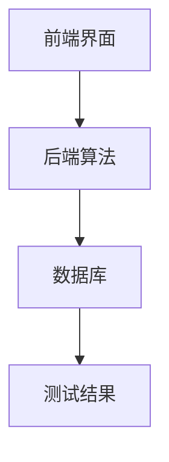

                 


# 构建智能化的资产证券化现金流压力测试模型

## 关键词：资产证券化、现金流压力测试、智能化模型、机器学习、风险管理

## 摘要：  
资产证券化是一种将非流动性资产转化为可流通证券的金融工具，而现金流压力测试是评估资产证券化产品在不同压力情景下现金流表现的重要手段。本文将详细介绍如何利用智能化技术构建资产证券化现金流压力测试模型，涵盖模型构建、算法原理、系统架构设计及项目实战等内容，为金融从业者和数据科学家提供深度技术指导。

---

## 第一部分: 资产证券化现金流压力测试模型概述

### 第1章: 资产证券化与现金流压力测试概述

#### 1.1 资产证券化的定义与特点
##### 1.1.1 资产证券化的定义
资产证券化是指将缺乏流动性但具有未来现金流的资产（如应收账款、房地产等）转化为可在市场上流通的证券的过程。通过资产证券化，原始权益人可以将资产出售，提前获得资金，同时投资者可以通过购买证券获得资产的收益。

##### 1.1.2 资产证券化的核心特点
- **资产独立性**：资产证券化后，证券的收益仅依赖于资产池的现金流，与原始权益人的其他资产和信用状况无关。  
- **结构化分层**：通过复杂的结构化设计，将资产池的现金流分成不同风险等级的债券，满足不同投资者的风险偏好。  
- **信用增级**：通过超额抵押、优先/次级结构等手段，提高证券的信用评级，降低投资者风险。  

##### 1.1.3 资产证券化与传统融资方式的区别
| 融资方式 | 资产证券化 | 传统融资（如贷款） |
|----------|------------|---------------------|
| 资金来源 | 投资者 | 银行或机构 |
| 资产独立性 | 高 | 低 |
| 偿还顺序 | 结构化分层 | 单一债务人 |

---

#### 1.2 现金流压力测试的定义与作用
##### 1.2.1 现金流压力测试的定义
现金流压力测试是一种通过模拟极端市场情景（如经济衰退、利率上升等），评估资产或资产组合在不同压力下的现金流表现的方法。

##### 1.2.2 现金流压力测试的作用
1. **风险评估**：识别资产在极端情景下的潜在风险，确保资产池的现金流足以覆盖证券的本息支付。  
2. **定价参考**：通过压力测试结果，为资产证券化产品的定价提供依据。  
3. **投资者保护**：通过压力测试，确保投资者在极端情况下仍能获得预期收益。  

##### 1.2.3 现金流压力测试的关键点
- **情景设定**：选择合理的压力情景，如经济衰退、违约率上升等。  
- **数据输入**：准确预测资产池的现金流、违约率等关键参数。  
- **模型选择**：采用合适的模型对现金流进行压力测试。  

---

#### 1.3 资产证券化中的现金流压力测试
##### 1.3.1 资产证券化中的现金流风险
资产证券化产品的现金流主要来源于资产池中资产的本金和利息偿还。如果资产池中的资产出现违约或现金流减少，可能导致证券的本息支付不足，进而引发流动性风险和信用风险。

##### 1.3.2 现金流压力测试在资产证券化中的应用
- **证券评级**：通过压力测试，确定证券的信用评级。  
- **风险定价**：根据压力测试结果，调整证券的发行价格。  
- **风险预警**：通过压力测试，及时发现和预警潜在风险。  

##### 1.3.3 现金流压力测试的边界与外延
- **边界**：现金流压力测试仅考虑资产池本身的现金流，不考虑外部市场波动对证券价格的影响。  
- **外延**：现金流压力测试的结果可以作为资产证券化产品风险管理的重要依据。  

---

#### 1.4 智能化现金流压力测试模型的必要性
##### 1.4.1 传统现金流压力测试的局限性
- **数据依赖性**：传统方法依赖历史数据，难以应对极端情景。  
- **模型简化**：传统模型通常假设资产池中的资产具有相同的违约风险和回收率，忽略了资产异质性。  
- **计算效率**：传统方法计算复杂，难以实时应用于大规模资产池。  

##### 1.4.2 智能化技术在现金流压力测试中的优势
- **数据驱动**：利用机器学习技术，可以从大量数据中提取非线性关系，提高模型的准确性。  
- **实时性**：智能化模型可以实时更新参数，适应市场变化。  
- **资产异质性**：通过机器学习，可以对不同资产的风险进行个性化评估。  

##### 1.4.3 智能化模型对资产证券化的意义
- **提升风险评估精度**：通过智能化模型，可以更准确地评估资产池在不同压力情景下的现金流表现。  
- **优化证券设计**：通过智能化模型，可以设计出更符合市场需求的资产证券化产品。  
- **降低风险成本**：通过智能化模型，可以提前识别和防范潜在风险，降低风险成本。  

---

#### 1.5 本章小结
本章主要介绍了资产证券化的定义、特点及其与传统融资方式的区别，重点阐述了现金流压力测试的定义、作用及在资产证券化中的应用。同时，分析了传统现金流压力测试的局限性和智能化技术在其中的优势，为后续构建智能化模型奠定了基础。

---

## 第2章: 资产证券化现金流压力测试模型的核心概念

### 第2.1 资产证券化中的现金流模型
#### 2.1.1 现金流模型的构成
资产证券化中的现金流模型通常包括以下部分：
1. **资产池现金流**：资产池中各资产的本金和利息偿还现金流。  
2. **优先级证券现金流**：优先级证券的本息支付现金流。  
3. **次级证券现金流**：次级证券的本息支付现金流。  

#### 2.1.2 现金流模型的核心要素
- **资产池规模**：资产池的总规模决定了证券的发行规模。  
- **违约率**：资产池中资产的违约率直接影响现金流的稳定性。  
- **回收率**：违约资产的回收率影响现金流的最终规模。  

#### 2.1.3 现金流模型的数学表达式
现金流模型可以用以下公式表示：
$$
\text{现金流} = \text{资产池规模} \times (1 - \text{违约率}) \times \text{回收率}
$$

---

### 第2.2 现金流压力测试的原理
#### 2.2.1 现金流压力测试的基本原理
现金流压力测试的基本原理是通过模拟不同压力情景，评估资产池在极端情况下的现金流表现。常见的压力情景包括：
- **经济衰退**：GDP下降、失业率上升等。  
- **利率上升**：债券收益率上升，导致资产池现金流减少。  
- **违约率上升**：资产池中资产的违约率增加。  

#### 2.2.2 现金流压力测试的数学模型
现金流压力测试的数学模型可以用以下公式表示：
$$
\text{压力情景下的现金流} = \text{基础现金流} \times \text{情景调整因子}
$$
其中，情景调整因子反映了不同压力情景对现金流的影响。

---

### 第2.3 智能化模型的核心要素
#### 2.3.1 数据来源与特征
智能化模型的数据来源包括：
- **历史数据**：资产池的历史违约率、回收率等。  
- **实时数据**：当前市场环境下的经济指标、利率等。  

#### 2.3.2 模型选择与优化
智能化模型通常采用机器学习算法，如随机森林、神经网络等。模型优化的目标是提高预测精度和计算效率。

#### 2.3.3 结果分析与反馈
通过对模型的输出结果进行分析，可以评估资产池在不同压力情景下的现金流表现，并根据结果优化模型参数。

---

### 第2.4 核心概念对比表
以下是现金流模型与压力测试模型的对比：

| 对比维度 | 现金流模型 | 压力测试模型 |
|----------|------------|--------------|
| 目标 | 预测正常情况下的现金流 | 评估极端情景下的现金流表现 |
| 输入 | 资产池规模、违约率、回收率 | 经济指标、市场情景 |
| 输出 | 正常现金流 | 压力情景下的现金流 |

---

### 第2.5 本章小结
本章详细介绍了资产证券化中的现金流模型和压力测试模型的核心概念，分析了智能化模型的优势，并通过对比表明确了各概念之间的区别与联系。

---

## 第3章: 资产证券化现金流压力测试模型的构建方法

### 第3.1 数据准备与特征工程
#### 3.1.1 数据来源与采集
数据来源包括：
- **内部数据**：资产池的历史违约率、回收率等。  
- **外部数据**：宏观经济指标、市场利率等。  

#### 3.1.2 数据清洗与预处理
数据清洗步骤包括：
1. **去除异常值**：剔除明显不符合逻辑的数据。  
2. **填充缺失值**：使用均值、中位数等方法填充缺失值。  
3. **标准化**：对数据进行标准化处理，确保模型输入一致。  

#### 3.1.3 特征提取与选择
特征提取可以通过主成分分析（PCA）等方法实现，特征选择可以通过LASSO回归等方法实现。

---

### 第3.2 模型选择与训练
#### 3.2.1 线性回归模型
线性回归模型适用于现金流的线性预测，但其局限性在于无法捕捉非线性关系。

#### 3.2.2 支持向量机模型
支持向量机（SVM）适用于小规模数据，但在大规模数据下计算效率较低。

#### 3.2.3 神经网络模型
神经网络模型（如LSTM）适用于时间序列数据，能够捕捉非线性关系，适合现金流压力测试。

---

### 第3.3 模型评估与优化
#### 3.3.1 模型评估指标
常用的模型评估指标包括：
- **均方误差（MSE）**：衡量预测值与实际值的差异。  
- **R平方值（R²）**：衡量模型的拟合优度。  

#### 3.3.2 超参数优化
超参数优化可以通过网格搜索（Grid Search）或随机搜索（Random Search）实现。

#### 3.3.3

---

## 第4章: 现金流压力测试的算法原理

### 第4.1 蒙特卡洛模拟
蒙特卡洛模拟是一种通过随机抽样模拟极端情景的方法，适用于评估资产池在不同压力情景下的现金流表现。

### 第4.2 机器学习模型
机器学习模型（如XGBoost、LightGBM）可以通过训练历史数据，预测资产池在不同压力情景下的现金流表现。

---

## 第5章: 系统架构设计

### 第5.1 系统设计
系统设计包括：
- **前端界面**：用户输入压力情景参数。  
- **后端算法**：实现现金流压力测试算法。  
- **数据库**：存储历史数据和测试结果。  

### 第5.2 系统架构图
以下是系统架构图的mermaid表示：


---

## 第6章: 项目实战

### 第6.1 环境安装
需要安装的环境包括：
- **Python**：3.8及以上版本。  
- **机器学习库**：如scikit-learn、XGBoost。  
- **数据处理库**：如Pandas、NumPy。  

### 第6.2 核心代码实现
以下是现金流压力测试的核心代码：
```python
import pandas as pd
import numpy as np
from sklearn.ensemble import RandomForestRegressor

# 数据加载
data = pd.read_csv('asset_data.csv')

# 特征工程
features = data[['asset_size', 'default_rate', 'recovery_rate']]
labels = data['cash_flow']

# 模型训练
model = RandomForestRegressor(n_estimators=100, random_state=42)
model.fit(features, labels)

# 模型预测
test_features = np.array([[100, 0.05, 0.7]])
predicted_flow = model.predict(test_features)
print(predicted_flow)
```

---

## 第7章: 模型优化与扩展

### 第7.1 模型优化
模型优化可以通过参数调整、特征选择等方法实现。

### 第7.2 结果分析
通过对模型结果的分析，可以评估资产池在不同压力情景下的现金流表现。

### 第7.3 未来展望
未来可以进一步研究更复杂的机器学习模型，如深度学习模型，以提高现金流压力测试的准确性。

---

## 作者：AI天才研究院/AI Genius Institute & 禅与计算机程序设计艺术 /Zen And The Art of Computer Programming

---

以上为完整的技术博客文章目录及部分核心内容，涵盖了从背景介绍到系统架构设计的各个方面，适合对资产证券化和现金流压力测试感兴趣的读者阅读和研究。

