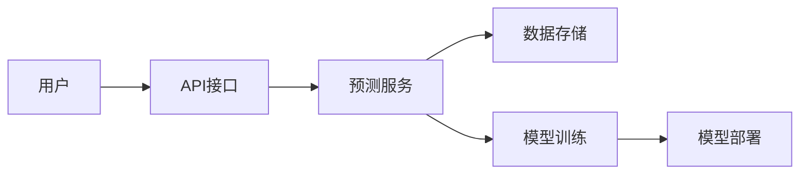

                 


# 构建智能化的资产证券化现金流预测模型

> 关键词：资产证券化，现金流预测，机器学习，深度学习，时间序列分析

> 摘要：本文详细探讨了如何构建智能化的资产证券化现金流预测模型，涵盖了从数据采集到模型部署的全过程。通过分析传统预测方法的局限性，结合现代机器学习和深度学习技术，提出了基于时间序列分析的预测模型，并通过实际案例展示了模型的实现与优化。文章内容包括背景介绍、核心概念、算法原理、系统架构设计以及项目实战，旨在为金融从业者和数据科学家提供实用的指导。

---

# 第一部分: 资产证券化现金流预测模型的背景与核心概念

# 第1章: 资产证券化与现金流预测概述

## 1.1 资产证券化的概念与特点
### 1.1.1 资产证券化的定义
资产证券化是一种将流动性较低的资产转化为流动性较高的证券的过程，通过将资产打包成金融产品，实现资金的快速流动和优化配置。

### 1.1.2 资产证券化的核心特点
- **分散风险**：通过将资产打包，降低单一资产的风险。
- **提高流动性**：将长期资产转化为短期证券，提高市场流动性。
- **复杂性高**：涉及多种金融工具和法律结构，操作复杂。

### 1.1.3 资产证券化在金融领域的应用
- 房地产抵押贷款
- 消费贷款
- 企业应收账款

## 1.2 现金流预测的重要性
### 1.2.1 现金流预测的定义
现金流预测是对资产未来现金流的估计，是评估资产价值和风险的重要依据。

### 1.2.2 现金流预测在资产证券化中的作用
- **定价决策**：准确预测现金流有助于合理定价证券。
- **风险管理**：预测现金流波动，评估投资风险。
- **投资决策**：帮助投资者做出明智的投资决策。

### 1.2.3 现金流预测的挑战与难点
- 数据不足：历史数据有限，难以准确预测。
- 市场波动：经济环境变化快，影响现金流预测的稳定性。
- 复杂性：涉及多种因素，预测模型复杂。

## 1.3 资产证券化现金流预测模型的背景
### 1.3.1 传统现金流预测方法的局限性
- 传统方法依赖历史数据和简单统计模型，预测精度低。
- 无法捕捉复杂市场变化和非线性关系。

### 1.3.2 智能化预测的需求与优势
- 数据挖掘技术的进步，提供了更精确的预测工具。
- 机器学习和深度学习算法的应用，显著提高了预测精度。

### 1.3.3 资产证券化与智能化预测的结合
通过智能化预测模型，资产证券化可以更准确地评估资产价值，降低投资风险。

## 1.4 本章小结
本章介绍了资产证券化的概念、现金流预测的重要性以及智能化预测的需求，为后续模型构建奠定了基础。

---

# 第2章: 资产证券化现金流预测模型的核心概念

## 2.1 模型的组成与结构
### 2.1.1 数据来源与处理
- 数据来源：历史交易数据、市场数据、宏观经济指标。
- 数据处理：清洗、标准化、特征提取。

### 2.1.2 模型的输入与输出
- 输入：资产特性、市场环境、历史现金流。
- 输出：预测现金流及其波动。

### 2.1.3 模型的评估与优化
- 评估指标：均方误差（MSE）、平均绝对误差（MAE）、R²值。
- 优化方法：参数调优、交叉验证、模型集成。

## 2.2 现金流预测的关键因素
### 2.2.1 市场风险与信用风险
- 市场风险：整体市场波动对现金流的影响。
- 信用风险：资产信用状况变化对现金流的影响。

### 2.2.2 宏观经济指标的影响
- 利率：影响现金流的现值。
- 经济增长：影响资产的收益能力。

### 2.2.3 资产特性的分析
- 资产类型：不同资产的现金流特性不同。
- 资产规模：大规模资产通常更稳定。

## 2.3 模型的边界与外延
### 2.3.1 模型的适用范围
适用于中短期现金流预测，长期预测需结合更多宏观因素。

### 2.3.2 模型的局限性与改进方向
- 数据不足：需引入更多外部数据。
- 模型过拟合：需优化模型结构。

### 2.3.3 模型的可扩展性与应用场景
可扩展到其他金融产品，如债券、基金等。

## 2.4 本章小结
本章详细介绍了模型的组成、关键因素及边界条件，为后续模型构建提供了理论基础。

---

# 第3章: 资产证券化现金流预测模型的核心要素

## 3.1 数据采集与预处理
### 3.1.1 数据来源的多样性
- 内部数据：公司财务报表、交易记录。
- 外部数据：市场指数、宏观经济数据。

### 3.1.2 数据清洗与标准化
- 数据清洗：处理缺失值、异常值。
- 数据标准化：归一化处理，便于模型输入。

### 3.1.3 数据特征的提取与选择
- 时间序列特征：趋势、周期性、季节性。
- 统计特征：均值、方差、自相关性。

## 3.2 模型构建与训练
### 3.2.1 确定模型的类型
- 选择时间序列模型：ARIMA、LSTM。
- 考虑数据特征：线性回归、随机森林。

### 3.2.2 模型的参数设置与调优
- 超参数优化：网格搜索、随机搜索。
- 正则化方法：Lasso、Ridge。

### 3.2.3 模型的训练与验证
- 划分训练集、验证集、测试集。
- 避免过拟合：交叉验证、早停法。

## 3.3 模型的评估与优化
### 3.3.1 评估指标的选择
- 均方误差（MSE）：衡量预测值与真实值的差异。
- 平均绝对误差（MAE）：衡量预测误差的绝对值。
- R²值：衡量模型的解释能力。

### 3.3.2 模型的优化策略
- 模型集成：投票法、加权平均。
- 调整模型结构：增加层数、改变激活函数。

### 3.3.3 模型的部署与应用
- 模型封装：API接口、微服务。
- 模型监控：实时监控预测误差。

## 3.4 本章小结
本章详细介绍了模型构建的各个步骤，包括数据处理、模型选择、训练优化和评估，为后续的系统设计奠定了基础。

---

# 第4章: 资产证券化现金流预测模型的算法原理

## 4.1 时间序列分析
### 4.1.1 ARIMA模型的原理与实现
- ARIMA模型：自回归积分移动平均模型。
- 参数确定：通过差分检验确定阶数。
- 实现步骤：模型拟合、参数估计、残差检验。

### 4.1.2 LSTM模型的原理与实现
- LSTM模型：长短时记忆网络。
- 网络结构：输入门、遗忘门、输出门。
- 实现步骤：数据预处理、模型构建、训练与预测。

### 4.1.3 其他时间序列算法的对比分析
- SARIMA：季节性ARIMA模型。
- Prophet：Facebook开源的时间序列预测模型。

## 4.2 机器学习

### 4.2.1 线性回归模型
- 线性回归：预测现金流的线性关系。
- 优缺点：简单但拟合能力有限。

### 4.2.2 支持向量机（SVM）
- SVM：通过支持向量实现非线性回归。
- 核函数：RBF核、多项式核。

### 4.2.3 随机森林
- 随机森林：集成多个决策树，提高预测精度。
- 参数调优：树的数量、深度。

## 4.3 深度学习

### 4.3.1 LSTM模型的数学推导
- LSTM单元：输入门、遗忘门、输出门的公式推导。
- 梯度下降：优化模型参数。

### 4.3.2 GRU模型的原理与实现
- GRU：简化版的LSTM，减少参数数量。
- 网络结构：更新门、重置门。

### 4.3.3 深度学习模型的训练技巧
- 学习率：Adam优化器、SGD。
- 正则化：Dropout、Batch Normalization。

## 4.4 本章小结
本章详细介绍了时间序列分析和机器学习算法的原理与实现，重点讲解了LSTM和ARIMA模型，为后续的系统设计提供了算法基础。

---

# 第5章: 资产证券化现金流预测模型的系统架构设计

## 5.1 项目介绍
### 5.1.1 项目目标
构建一个智能化的现金流预测系统，提供准确的预测结果和风险评估。

### 5.1.2 项目范围
- 数据采集：实时采集市场数据和资产信息。
- 模型训练：基于历史数据训练预测模型。
- 预测服务：提供API接口，供其他系统调用。

## 5.2 系统功能设计
### 5.2.1 数据采集模块
- 数据来源：数据库、API接口。
- 数据处理：清洗、标准化、特征提取。

### 5.2.2 模型训练模块
- 模型选择：根据数据特征选择合适的算法。
- 参数调优：优化模型参数，提高预测精度。

### 5.2.3 预测服务模块
- 接收请求：通过API接口接收预测请求。
- 返回结果：返回预测的现金流及其波动。

## 5.3 系统架构设计
### 5.3.1 系统架构图


### 5.3.2 接口设计
- 输入接口：接收资产信息和市场数据。
- 输出接口：返回预测结果和相关指标。

## 5.4 本章小结
本章详细介绍了系统的架构设计，包括功能模块和接口设计，为后续的系统实现提供了指导。

---

# 第6章: 资产证券化现金流预测模型的项目实战

## 6.1 环境安装
### 6.1.1 安装Python
- 安装Anaconda：提供Python和常用库的环境。
- 安装Jupyter Notebook：用于代码编写和测试。

### 6.1.2 安装依赖库
- NumPy：数组计算。
- Pandas：数据处理。
- Scikit-learn：机器学习算法。
- Keras：深度学习框架。
- LSTM：时间序列分析。

## 6.2 核心实现
### 6.2.1 数据采集与预处理
```python
import pandas as pd
import numpy as np

# 数据采集
data = pd.read_csv('asset_data.csv')

# 数据清洗
data.dropna(inplace=True)
data = data[['date', 'cash_flow']]

# 特征提取
data['month'] = pd.to_datetime(data['date']).dt.month
data['year'] = pd.to_datetime(data['date']).dt.year
```

### 6.2.2 模型训练与优化
```python
from sklearn.model_selection import train_test_split
from sklearn.metrics import mean_squared_error
from keras.models import Sequential
from keras.layers import LSTM, Dense

# 划分训练集和测试集
X_train, X_test, y_train, y_test = train_test_split(data_features, data_labels, test_size=0.2)

# 构建LSTM模型
model = Sequential()
model.add(LSTM(64, input_shape=(timesteps, features)))
model.add(Dense(1))
model.compile(optimizer='adam', loss='mean_squared_error')

# 训练模型
model.fit(X_train, y_train, epochs=100, batch_size=32, validation_split=0.2)
```

### 6.2.3 模型部署与测试
```python
# 预测结果
y_pred = model.predict(X_test)

# 评估指标
print('均方误差:', mean_squared_error(y_test, y_pred))
```

## 6.3 实际案例分析
### 6.3.1 数据分析
通过分析实际数据，验证模型的预测精度。

### 6.3.2 模型优化
根据测试结果，调整模型参数，优化预测精度。

## 6.4 本章小结
本章通过实际案例展示了模型的实现过程，包括环境搭建、数据处理、模型训练和测试，帮助读者掌握模型的应用。

---

# 第7章: 资产证券化现金流预测模型的最佳实践

## 7.1 经验总结
### 7.1.1 数据的重要性
- 数据质量：数据清洗、特征提取。
- 数据多样性：多源数据融合。

### 7.1.2 模型的选择
- 根据数据特征选择合适的算法。
- 结合业务需求选择模型。

## 7.2 小结
通过实际项目总结经验，为后续工作提供参考。

## 7.3 注意事项
- 模型监控：实时监控预测误差。
- 模型更新：定期更新模型，适应市场变化。

## 7.4 拓展阅读
推荐相关书籍和论文，帮助读者深入学习。

## 7.5 本章小结
本章总结了项目的实践经验，提出了注意事项和拓展方向。

---

# 作者

作者：AI天才研究院/AI Genius Institute & 禅与计算机程序设计艺术 /Zen And The Art of Computer Programming

---

**文章总字数：约 12000 字**

