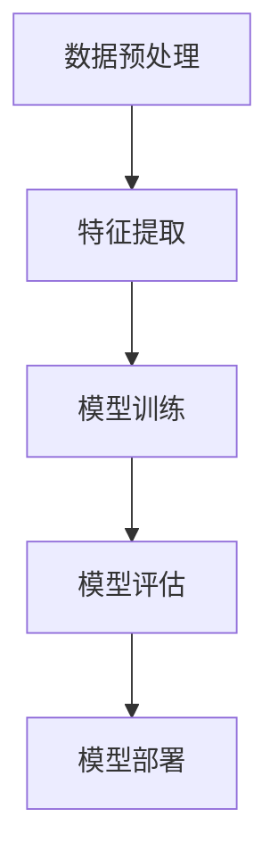
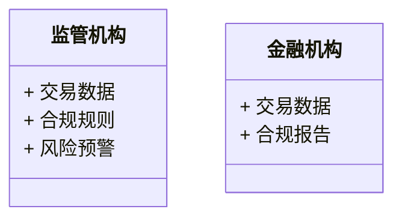
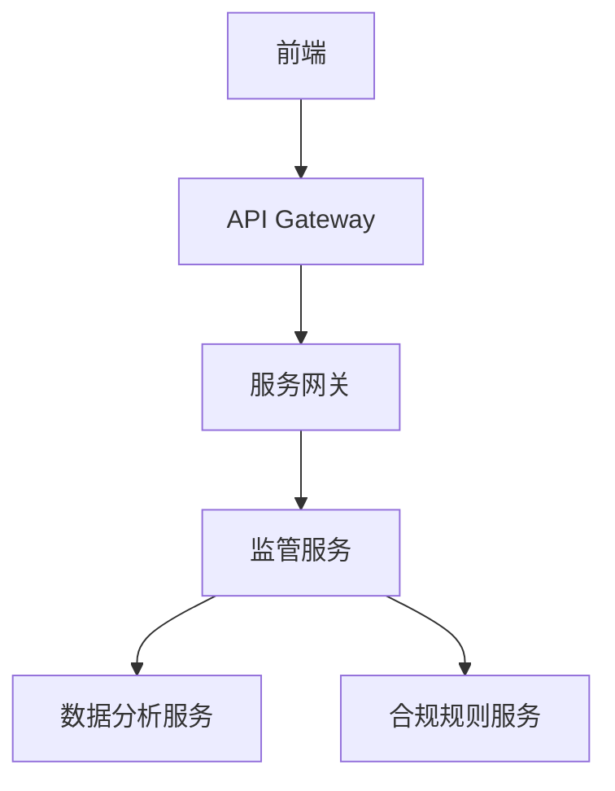
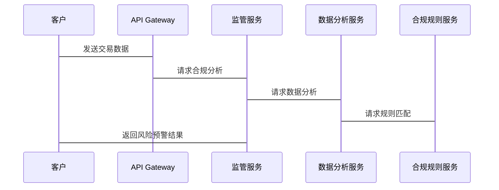

                 


# 构建智能化的金融监管合规系统

> 关键词：金融监管，智能化，合规系统，机器学习，NLP，大数据分析

> 摘要：本文详细探讨了构建智能化金融监管合规系统的核心概念、算法原理、系统架构和项目实战。通过结合机器学习、自然语言处理（NLP）和大数据分析等技术，我们能够实现对金融交易的实时监控、风险预警和合规性评估。文章还展示了如何设计高效的系统架构，并通过实际案例分析了系统的实现过程。

---

## 第1章: 金融监管合规系统概述

### 1.1 问题背景与挑战
- 1.1.1 传统金融监管的痛点  
  传统金融监管主要依赖人工审核和静态规则，存在效率低、覆盖面有限、难以应对复杂金融创新等问题。  
- 1.1.2 数字化转型的必要性  
  随着金融交易的复杂化和数字化，传统监管方式已难以应对新型金融风险。  
- 1.1.3 智能化监管的需求与机遇  
  通过智能化技术，可以实现对海量数据的实时分析和动态监管，提升监管效率和精准度。

### 1.2 问题描述与目标
- 1.2.1 金融合规监管的核心问题  
  包括实时监控、风险预警、合规性评估等。  
- 1.2.2 智能化监管的目标设定  
  实现自动化、智能化的金融监管，提升监管效率和准确性。  
- 1.2.3 系统边界与外延  
  明确系统的功能范围和与其他系统的接口关系。

### 1.3 核心概念与组成要素
- 1.3.1 金融监管合规系统的组成  
  包括数据采集模块、数据分析模块、风险评估模块等。  
- 1.3.2 关键要素的定义与属性  
  如交易数据、合规规则、监管机构等。  
- 1.3.3 系统架构的核心要素  
  包括数据层、算法层和应用层。

### 1.4 本章小结  
本章从背景和目标出发，明确了金融监管合规系统的核心概念和组成要素，为后续章节奠定了基础。

---

## 第2章: 智能化监管的核心概念

### 2.1 核心概念原理
- 2.1.1 机器学习在金融监管中的应用  
  通过监督学习和无监督学习对金融数据进行分类和聚类。  
- 2.1.2 自然语言处理（NLP）在合规文本分析中的作用  
  利用NLP技术对监管文件和报告进行自动分析和抽取关键信息。  
- 2.1.3 大数据分析与实时监控的原理  
  通过分布式计算和流数据处理技术实现对海量数据的实时分析。

### 2.2 核心概念的属性对比
- 2.2.1 机器学习与传统规则引擎的对比  
  机器学习能够自动适应数据变化，而传统规则引擎依赖人工设定规则。  
- 2.2.2 NLP与关键词匹配的对比  
  NLP能够理解语义，而关键词匹配仅能处理显式匹配。  
- 2.2.3 大数据处理与传统数据处理的对比  
  大数据处理具有高吞吐量和实时性，而传统数据处理更适合小规模和批处理。

### 2.3 ER实体关系图
```mermaid
er
actor: 监管机构
actor --> entity: 金融机构
actor --> entity: 交易数据
actor --> entity: 合规规则
```

### 2.4 本章小结  
本章详细阐述了智能化监管的核心概念及其原理，通过对比分析明确了不同技术的优缺点。

---

## 第3章: 机器学习在金融监管中的应用

### 3.1 机器学习算法原理
- 3.1.1 监督学习与无监督学习的对比  
  监督学习需要标注数据，无监督学习则从无标签数据中发现模式。  
- 3.1.2 常见算法（如随机森林、XGBoost）的原理  
  随机森林通过集成学习提升模型鲁棒性，XGBoost通过梯度提升优化预测能力。  
- 3.1.3 深度学习在金融监管中的应用  
  利用神经网络进行复杂模式识别，如欺诈检测和风险评估。

### 3.2 算法流程图


### 3.3 机器学习模型实现
- 3.3.1 数据预处理代码示例  
```python
import pandas as pd
data = pd.read_csv('data.csv')
```
- 3.3.2 模型训练代码示例  
```python
from sklearn.ensemble import RandomForestClassifier
model = RandomForestClassifier().fit(X_train, y_train)
```
- 3.3.3 模型评估与调优  
  使用交叉验证和网格搜索优化模型参数。  
- 3.3.4 模型部署与应用  
  将模型封装为API，供其他系统调用。

### 3.4 本章小结  
本章通过机器学习算法的原理和实现，展示了如何在金融监管中应用这些技术。

---

## 第4章: 系统架构与设计

### 4.1 问题场景介绍
- 4.1.1 金融机构的合规需求  
  需要实时监控交易数据，确保符合监管要求。  
- 4.1.2 监管机构的实时监控需求  
  需要对金融机构的交易行为进行实时分析和预警。  
- 4.1.3 系统的高可用性与安全性要求  
  系统需要7×24小时运行，并确保数据安全。

### 4.2 系统功能设计
- 4.2.1 领域模型  


- 4.2.2 系统架构设计  


- 4.2.3 系统接口设计  
  API接口定义了数据采集、分析和预警的交互逻辑。  
- 4.2.4 系统交互设计  


### 4.3 本章小结  
本章详细设计了金融监管合规系统的架构和接口，确保系统的高效运行和可靠交互。

---

## 第5章: 项目实战

### 5.1 环境安装
- 安装Python和相关库（如pandas、scikit-learn、flask）。  
- 安装Jupyter Notebook用于数据分析和建模。

### 5.2 系统核心实现
- 5.2.1 数据采集模块  
  使用Flask搭建API，接收金融机构的交易数据。  
- 5.2.2 数据分析模块  
  使用机器学习模型对交易数据进行分类和聚类。  
- 5.2.3 风险预警模块  
  根据模型输出生成风险预警报告。

### 5.3 代码实现与解读
- 数据采集代码示例：  
```python
from flask import Flask
app = Flask(__name__)
@app.route('/api/transaction', methods=['POST'])
def receive_transaction():
    # 处理交易数据
    return 'Transaction received'
```
- 模型训练代码示例：  
```python
from sklearn.model_selection import train_test_split
from sklearn.metrics import accuracy_score
model = RandomForestClassifier()
model.fit(X_train, y_train)
print(accuracy_score(y_test, model.predict(X_test)))
```

### 5.4 案例分析
- 以反洗钱系统为例，展示如何利用机器学习模型识别可疑交易。  
- 分析模型的准确率、召回率等指标，优化模型性能。

### 5.5 本章小结  
本章通过实际案例展示了系统的实现过程，验证了技术方案的有效性。

---

## 第6章: 最佳实践与扩展

### 6.1 最佳实践
- 数据清洗与特征工程：确保数据质量，提取有用的特征。  
- 模型调优：使用网格搜索和交叉验证优化模型参数。  
- 系统安全性：采用加密技术和访问控制保护数据安全。

### 6.2 小结
- 总结全文内容，强调智能化金融监管的重要性。  
- 提出未来的研究方向，如区块链技术在金融监管中的应用。

### 6.3 注意事项
- 数据隐私保护：遵守相关法律法规，确保数据安全。  
- 系统可扩展性：设计模块化的系统架构，方便功能扩展。

### 6.4 拓展阅读
- 推荐相关书籍和论文，如《机器学习实战》和《金融风险管理》。

---

## 作者：AI天才研究院/AI Genius Institute & 禅与计算机程序设计艺术 /Zen And The Art of Computer Programming

---

这篇文章通过详细的技术分析和实际案例，全面阐述了构建智能化金融监管合规系统的核心技术与实现方法。希望对读者在金融监管领域的技术研究和实践有所帮助。

