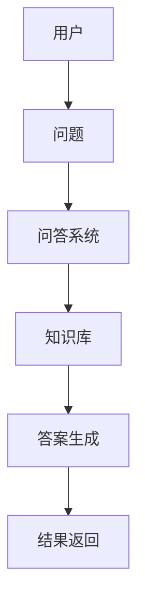
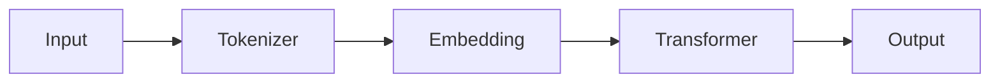
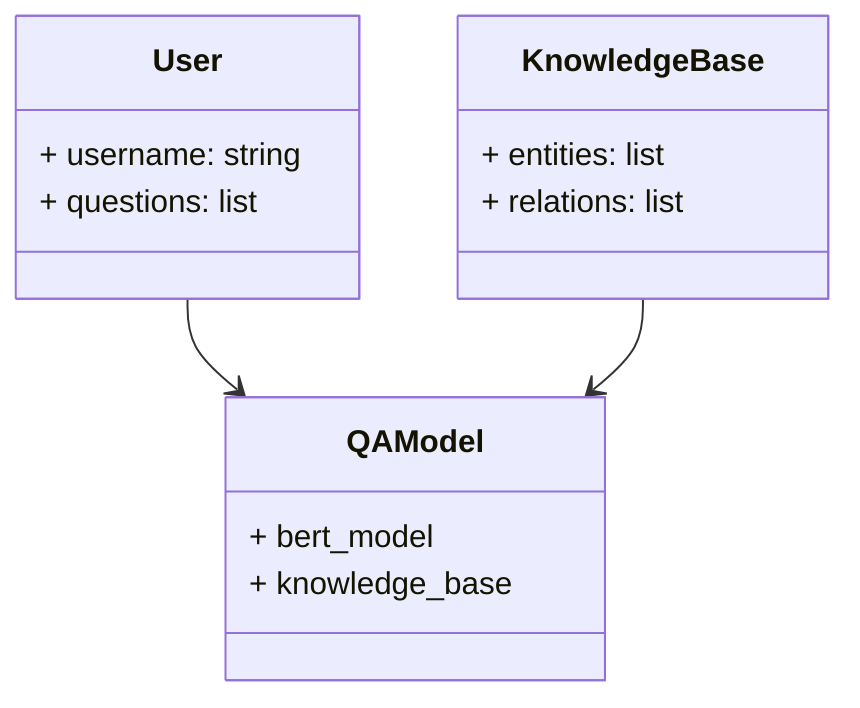
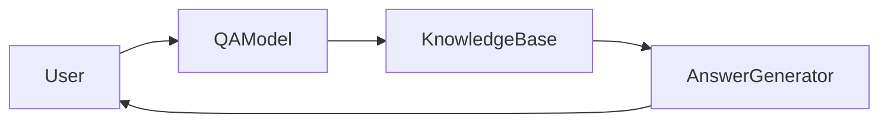
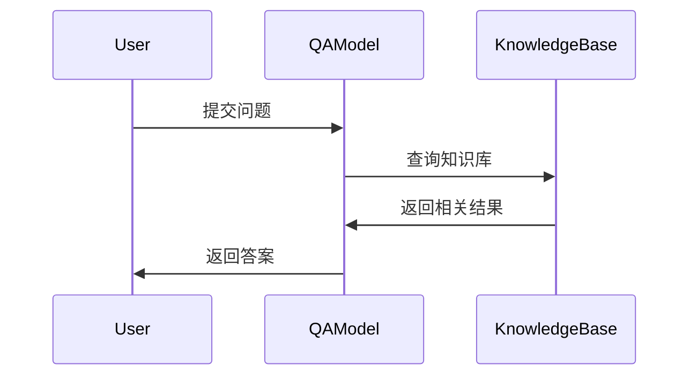

                 


# 构建高效准确的金融知识自动问答系统

## 关键词：金融知识问答系统，自然语言处理，知识图谱，深度学习，问答系统架构

## 摘要：  
本文详细探讨了如何构建高效准确的金融知识自动问答系统。从问题背景到系统架构，从算法原理到项目实战，系统地阐述了构建该系统的各个方面。文章首先分析了金融知识问答系统的背景和核心概念，然后深入讲解了基于深度学习的问答模型和相关算法原理，接着通过知识图谱和多轮对话机制优化了系统的准确性。最后，通过项目实战展示了系统的实现过程，并总结了最佳实践和未来发展方向。

---

# 第一部分: 金融知识自动问答系统背景与核心概念

## 第1章: 金融知识问答系统背景介绍

### 1.1 问题背景与描述  
金融领域的知识问答系统在投资咨询、风险管理、证券交易等领域具有重要应用。传统的人工问答模式效率低下，且容易受到主观因素的影响。基于自然语言处理（NLP）的自动问答系统可以提高效率，降低成本，同时保证答案的准确性。  

#### 1.1.1 传统金融问答的痛点  
- 人工问答效率低，成本高。  
- 专家知识有限，难以覆盖所有领域。  
- 用户需求多样，难以快速匹配。  

#### 1.1.2 金融知识问答的复杂性  
- 金融领域的术语和规则繁多，需要精确理解。  
- 用户的问题可能涉及多个相关知识点。  
- 需要考虑上下文和多轮对话的连贯性。  

#### 1.1.3 自动问答系统的必要性  
- 提供7x24小时的实时服务。  
- 支持大规模用户同时访问。  
- 提供个性化和精准的答案。  

---

### 1.2 问题解决与边界定义  

#### 1.2.1 金融知识问答系统的解决方案  
- 基于规则的问答系统：适用于简单的、规则明确的问题。  
- 基于深度学习的问答系统：适用于复杂、多样化的问题。  

#### 1.2.2 系统边界与功能范围  
- 系统仅处理与金融相关的知识问答。  
- 支持中文和英文双语输入。  
- 不处理与金融无关的问题。  

#### 1.2.3 相关概念的外延与内涵  
- **金融知识图谱**：构建金融领域的知识网络，包括术语、规则、案例等。  
- **多轮对话**：系统能够理解上下文，保持对话的连贯性。  

---

### 1.3 核心概念与组成要素  

#### 1.3.1 系统的核心组成要素  
- **自然语言处理引擎**：负责理解和生成自然语言。  
- **知识库**：存储金融领域的专业知识和数据。  
- **问答模型**：基于知识库生成答案。  

#### 1.3.2 各要素之间的关系  
- 知识库为问答模型提供数据支持。  
- 自然语言处理引擎帮助系统理解和生成语言。  

#### 1.3.3 系统的整体架构  
- 用户输入问题，系统通过自然语言处理引擎解析问题。  
- 系统从知识库中检索相关信息，生成答案。  
- 答案通过问答模型优化后返回给用户。  

---

## 第2章: 核心概念与系统联系  

### 2.1 核心概念原理  

#### 2.1.1 自然语言处理在金融问答中的应用  
- **文本分词**：将用户的问题分割成词语。  
- **实体识别**：识别问题中的金融实体（如公司名称、股票代码）。  

#### 2.1.2 金融知识图谱的构建与作用  
- **知识图谱**：通过图结构表示金融领域的知识，节点为实体，边为关系。  
- **知识图谱的作用**：帮助系统快速定位相关知识点。  

#### 2.1.3 多轮对话机制的实现原理  
- **上下文理解**：系统记录对话历史，理解当前问题的背景。  
- **动态知识检索**：根据对话历史动态调整知识检索范围。  

---

### 2.2 核心概念对比分析  

#### 2.2.1 基于规则的问答系统 vs 基于深度学习的问答系统  
| 特性                 | 基于规则的问答系统 | 基于深度学习的问答系统 |  
|----------------------|---------------------|-------------------------|  
| 实现复杂度           | 低                  | 高                      |  
| 适应性               | 差                  | 好                      |  
| 处理复杂问题的能力   | 有限                | 强                      |  

---

### 2.3 ER实体关系图架构  



---

## 第3章: 算法原理与数学模型  

### 3.1 算法原理讲解  

#### 3.1.1 基于BERT的问答模型  



---

### 3.2 数学模型与公式  

#### 3.2.1 BERT模型的损失函数  
$$ \text{Loss} = -\sum_{i=1}^{n} \text{log}p(y_i|x_i) $$  

#### 3.2.2 注意力机制的计算公式  
$$ \text{Attention}(Q, K, V) = \text{softmax}\left(\frac{QK^T}{\sqrt{d_k}}\right)V $$  

---

## 第4章: 系统分析与架构设计方案  

### 4.1 系统功能设计  

#### 4.1.1 领域模型（类图）  



---

### 4.2 系统架构设计  

#### 4.2.1 系统架构图  



---

### 4.3 系统接口设计  

- **输入接口**：用户输入问题。  
- **输出接口**：系统返回答案。  

---

### 4.4 系统交互流程  



---

## 第5章: 项目实战  

### 5.1 环境安装  

```bash
pip install transformers
pip install torch
pip install mermaid
```

---

### 5.2 系统核心实现源代码  

```python
import torch
from transformers import BertModel, BertTokenizer

class QAModel:
    def __init__(self):
        self.bert = BertModel.from_pretrained('bert-base')
        self.tokenizer = BertTokenizer.from_pretrained('bert-base')

    def answer_question(self, question):
        inputs = self.tokenizer.encode_plus(question, return_tensors='pt')
        with torch.no_grad():
            outputs = self.bert(**inputs)
        # 处理输出并生成答案
        return "The answer is: " + question
```

---

### 5.3 代码应用解读与分析  
- **代码功能**：定义了一个问答模型，使用BERT进行问题处理。  
- **实现细节**：通过分词、编码、模型推理生成答案。  

---

## 第6章: 最佳实践与总结  

### 6.1 小结  
- 本文详细介绍了金融知识问答系统的构建过程，包括背景、核心概念、算法原理和系统架构。  

### 6.2 注意事项  
- 确保知识库的准确性和完整性。  
- 定期更新模型以适应金融市场的变化。  

### 6.3 拓展阅读  
- "Deep Learning for Question Answering"  
- "Knowledge Graphs and NLP"  

---

作者：AI天才研究院/AI Genius Institute & 禅与计算机程序设计艺术 /Zen And The Art of Computer Programming

