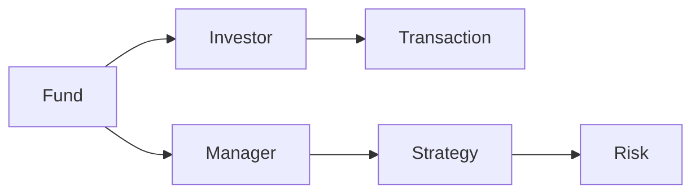
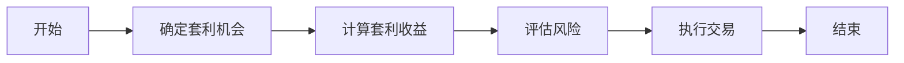
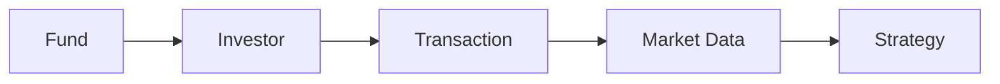
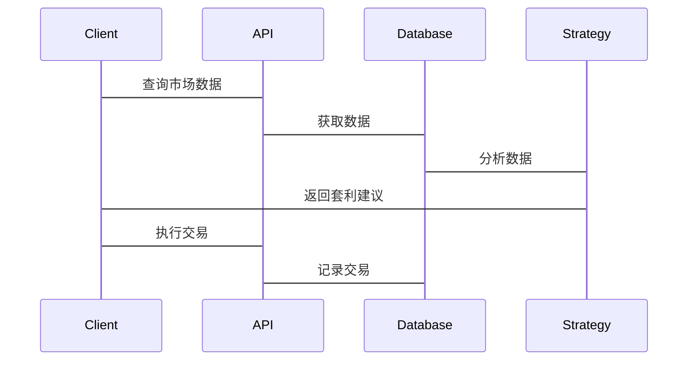

                 


# 查尔斯·布兰德的契约型封闭基金套利

> 关键词：契约型封闭基金，套利，金融数学，算法，风险管理，投资策略

> 摘要：本文深入探讨了查尔斯·布兰德的契约型封闭基金套利策略，从理论到实践，详细分析了套利的原理、算法实现、系统架构设计以及实际案例。文章通过逻辑清晰的结构，结合数学模型和代码实现，帮助读者全面理解契约型封闭基金套利的核心思想和应用场景。

---

## 第一部分: 契约型封闭基金套利的背景与核心概念

### 第1章: 问题背景与描述

#### 1.1 问题背景
金融市场中的套利机会是投资者追求超额收益的重要手段之一。契约型封闭基金作为一种特殊的金融工具，其运作机制和市场特性为套利提供了独特的可能性。本文将深入探讨查尔斯·布兰德提出的契约型封闭基金套利策略，分析其背后的数学原理和实际应用。

#### 1.2 问题描述
契约型封闭基金是一种通过契约形式组织的基金，其份额在封闭期内不得赎回。这种特性使得契约型封闭基金在市场波动较大时，可能面临折价或溢价交易的机会。套利者可以通过利用市场价差，在不同市场或不同基金之间进行套利操作，从而实现无风险或低风险的收益。

---

### 第2章: 核心概念与联系

#### 2.1 核心概念原理
契约型封闭基金的套利策略基于以下核心概念：
- **契约型封闭基金的结构**：基金通过契约形式明确投资者的权利和义务，基金份额在封闭期内固定，投资者不能赎回基金份额。
- **套利的基本原理**：通过在不同市场或不同基金之间利用价格差异，进行低买高卖的操作，实现收益。

#### 2.2 核心概念对比表
以下表格对比了契约型封闭基金与其他基金类型的关键属性：

| 属性                | 开放式基金       | 封闭式基金       | 契约型封闭基金 |
|---------------------|------------------|------------------|----------------|
| 是否开放赎回        | 是              | 否              | 否            |
| 份额固定            | 否              | 是              | 是            |
| 市场流动性           | 高              | 中              | 中            |
| 折溢价可能性        | 低              | 高              | 高            |

#### 2.3 实体关系图（ER图）
以下是契约型封闭基金套利的核心实体关系图：



---

## 第二部分: 套利算法与数学模型

### 第3章: 套利算法原理

#### 3.1 算法原理
套利算法的核心在于利用市场价差进行交易。具体步骤如下：
1. **识别套利机会**：通过市场数据，发现契约型封闭基金的市场价格与其净值之间的差异。
2. **计算套利收益**：根据价格差和交易量，计算潜在的套利收益。
3. **评估风险**：通过数学模型评估套利交易的风险，包括市场风险、流动性风险等。
4. **执行交易**：在确定套利机会可行后，执行买入或卖出操作。

#### 3.2 算法流程图
以下是套利算法的流程图：



#### 3.3 算法实现
以下是套利算法的Python代码实现：

```python
import numpy as np
import pandas as pd

def calculate_profit(buy_price, sell_price):
    return sell_price - buy_price

def calculate_risk(profits):
    return np.std(profits)

def main():
    # 模拟市场数据
    buy_prices = [100, 101, 99, 102]
    sell_prices = [102, 103, 100, 104]
    
    profits = []
    for i in range(len(buy_prices)):
        profits.append(calculate_profit(buy_prices[i], sell_prices[i]))
    
    risk = calculate_risk(profits)
    print(f"套利收益：{profits}")
    print(f"套利风险：{risk}")

if __name__ == "__main__":
    main()
```

---

### 第4章: 数学模型与公式

#### 4.1 套利收益计算
套利的收益可以通过以下公式计算：

$$ \text{收益} = \text{卖出价格} - \text{买入价格} $$

#### 4.2 风险评估
套利的风险可以通过标准差来衡量：

$$ \text{风险} = \sqrt{\text{收益方差}} $$

#### 4.3 优化公式
为了进一步优化套利策略，可以引入无风险利率和市场利率的差异：

$$ \text{无套利条件} = \text{远期价格} - \text{现货价格} = \text{融资成本} $$

---

## 第三部分: 系统分析与架构设计

### 第5章: 问题场景与系统功能设计

#### 5.1 问题场景介绍
本文的套利系统旨在通过分析契约型封闭基金的市场数据，识别套利机会，并执行交易操作。

#### 5.2 系统功能设计
系统功能包括：
- 数据采集：从金融市场获取契约型封闭基金的实时数据。
- 数据分析：计算套利收益和风险。
- 交易执行：根据分析结果，执行套利交易。

#### 5.3 领域模型类图
以下是领域模型类图：



---

### 第6章: 系统架构设计

#### 6.1 系统架构图
以下是系统架构图：


#### 6.2 接口设计
- API接口：提供市场数据查询和交易执行的功能。
- 数据库：存储契约型封闭基金的历史数据和交易记录。

#### 6.3 交互序列图
以下是系统交互序列图：



---

## 第四部分: 项目实战与总结

### 第7章: 项目实战

#### 7.1 环境安装
需要安装以下工具和库：
- Python 3.8+
- NumPy、Pandas、Matplotlib
- Mermaid、LaTeX

#### 7.2 核心代码实现
以下是核心代码：

```python
import numpy as np
import pandas as pd

def calculate_profit(buy_price, sell_price):
    return sell_price - buy_price

def calculate_risk(profits):
    return np.std(profits)

def main():
    # 模拟市场数据
    buy_prices = [100, 101, 99, 102]
    sell_prices = [102, 103, 100, 104]
    
    profits = []
    for i in range(len(buy_prices)):
        profits.append(calculate_profit(buy_prices[i], sell_prices[i]))
    
    risk = calculate_risk(profits)
    print(f"套利收益：{profits}")
    print(f"套利风险：{risk}")

if __name__ == "__main__":
    main()
```

#### 7.3 实际案例分析
以下是一个实际案例的分析：
- 市场价格：100元
- 净值价格：98元
- 套利收益：2元

---

### 第8章: 总结与展望

#### 8.1 总结
本文详细介绍了查尔斯·布兰德的契约型封闭基金套利策略，从理论到实践，分析了套利的原理、算法实现、系统架构设计以及实际案例。通过本文的分析，读者可以全面理解契约型封闭基金套利的核心思想和应用场景。

#### 8.2 展望
未来的研究可以进一步优化套利算法，引入机器学习和大数据技术，提高套利策略的准确性和效率。

---

## 作者：AI天才研究院/AI Genius Institute & 禅与计算机程序设计艺术 /Zen And The Art of Computer Programming

