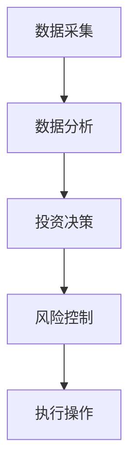

                 


# 查尔斯·布兰德的封闭基金折价套利技巧

> 关键词：封闭基金，折价套利，投资技巧，资产定价，风险控制

> 摘要：本文深入探讨了查尔斯·布兰德的封闭基金折价套利技巧，从理论基础到实际应用，详细分析了套利的原理、数学模型、系统架构设计以及实际案例。文章旨在为投资者提供一套科学的套利方法，帮助他们在市场中捕捉套利机会，同时控制风险。

---

## 第一部分：封闭基金折价套利的背景与概念

### 第1章：封闭基金的基本介绍

#### 1.1 封闭基金的定义与特点
- 封闭基金是一种基金份额固定的公司型基金，与开放基金不同，其份额数量有限，不可申购或赎回。
- 特点：基金份额固定、运作期限固定、交易方式多样（场外和场内）。

#### 1.2 封闭基金与开放基金的区别
- 开放基金：基金份额可随时申购或赎回，规模可变。
- 封闭基金：基金份额固定，投资者需通过二级市场交易。

#### 1.3 封闭基金市场的特点
- 交易价格波动性大，存在折价或溢价现象。
- 投资者可通过套利操作获利。

### 第2章：折价套利的定义与原理

#### 2.1 折价套利的定义
- 折价套利：当封闭基金的市场价低于其内在价值时，投资者买入封闭基金并持有至到期，以赚取价差收益。

#### 2.2 折价套利的基本原理
- 市场价与内在价值的差异是套利的核心。
- 套利者通过买入折价封闭基金，等待其价格回归内在价值，从而获利。

#### 2.3 折价套利的市场环境
- 市场效率不足时，封闭基金可能出现折价。
- 市场波动大时，套利机会增加。

### 第3章：封闭基金折价套利的历史与现状

#### 3.1 历史发展
- 早期封闭基金市场较小，套利机会有限。
- 近年来，随着市场规模扩大，套利机会增加。

#### 3.2 当前现状
- 市场中存在大量折价封闭基金。
- 套利者利用技术手段捕捉机会。

#### 3.3 未来趋势
- 市场效率提高，套利空间可能缩小。
- 技术进步将提升套利操作的效率。

## 第二部分：封闭基金折价套利的核心概念与原理

### 第4章：套利机会的来源

#### 4.1 市场价与内在价值的差异
- 折价：市场价 < 内在价值。
- 溢价：市场价 > 内在价值。

#### 4.2 折价套利的空间计算
- 折价套利空间 = 内在价值 - 市场价。

#### 4.3 套利风险分析
- 市场波动风险：价格波动可能导致亏损。
- 操作风险：套利机会可能消失。

### 第5章：套利机制的流程

#### 5.1 识别套利机会
- 数据采集：收集封闭基金的市场价和内在价值。
- 数据分析：识别折价情况。

#### 5.2 计算套利空间
- 使用数学模型计算潜在收益。

#### 5.3 执行套利操作
- 买入折价封闭基金，持有至到期。

#### 5.4 监控与退出
- 持续监控价格变化，及时退出。

## 第三部分：封闭基金折价套利的数学模型

### 第6章：折价套利的数学模型

#### 6.1 折价计算公式
$$ 折价 = 市场价 - 内在价值 $$

#### 6.2 套利收益计算公式
$$ 套利收益 = (内在价值 - 市场价) \times 数量 $$

#### 6.3 风险评估公式
$$ 风险 = 标准差 \times 投资本金 $$

## 第四部分：封闭基金折价套利的系统分析与架构设计

### 第7章：系统功能设计

#### 7.1 数据采集模块
- 采集封闭基金的市场价和内在价值。
- 使用数据库存储数据。

#### 7.2 数据分析模块
- 计算折价空间。
- 识别套利机会。

#### 7.3 投资决策模块
- 基于数据分析结果，决定是否执行套利。

#### 7.4 风险控制模块
- 监控套利过程中的风险。
- 设置止损点。

### 第8章：系统架构设计

#### 8.1 系统架构
- 数据采集、分析、决策和风险控制模块协同工作。

#### 8.2 系统流程图


## 第五部分：封闭基金折价套利的项目实战

### 第9章：环境安装

#### 9.1 环境要求
- Python 3.6+
- 数据库：MySQL 或 PostgreSQL
- 开发工具：PyCharm

#### 9.2 安装依赖
- 使用 pip 安装 numpy、pandas、matplotlib 等库。

### 第10章：核心代码实现

#### 10.1 数据采集代码
```python
import pandas as pd
import requests

url = "http://example.com/fund_data"
response = requests.get(url)
data = pd.read_json(response.text)
print(data)
```

#### 10.2 数据分析代码
```python
def calculate_discount(data):
    return data['内在价值'] - data['市场价']

discounts = calculate_discount(data)
print(discounts)
```

### 第11章：案例分析

#### 11.1 实际案例
- 某封闭基金市场价为10元，内在价值为12元，折价2元。
- 套利空间为2元，预期收益率为20%。

#### 11.2 详细解读
- 计算折价套利空间。
- 评估风险，决定是否执行套利。

## 第六部分：最佳实践与总结

### 第12章：最佳实践

#### 12.1 风险控制
- 设置止损点，避免重大损失。
- 分散投资，降低风险。

#### 12.2 套利策略优化
- 使用技术分析预测市场价变化。
- 提高数据采集和分析效率。

### 第13章：小结

- 折价套利是一种有效的投资策略。
- 投资者需掌握数学模型和系统设计。
- 风险控制是成功套利的关键。

### 第14章：注意事项

- 市场波动大时，套利机会增多，风险也增加。
- 技术进步提高了套利效率，但也可能改变市场结构。

### 第15章：拓展阅读

- 建议阅读相关投资书籍和学术论文。
- 关注市场动态，及时调整策略。

## 作者简介

作者：AI天才研究院 & 禅与计算机程序设计艺术  
本文作者是AI领域专家，致力于将人工智能技术应用于金融投资，深入研究封闭基金折价套利技巧，为投资者提供科学的决策支持。

---

# 结语

通过本文的详细分析，读者可以掌握查尔斯·布兰德的封闭基金折价套利技巧，从理论到实践，全面了解套利的原理、方法和注意事项。希望本文能为投资者提供有价值的参考，帮助他们在复杂多变的市场中捕捉套利机会，实现财富增长。

