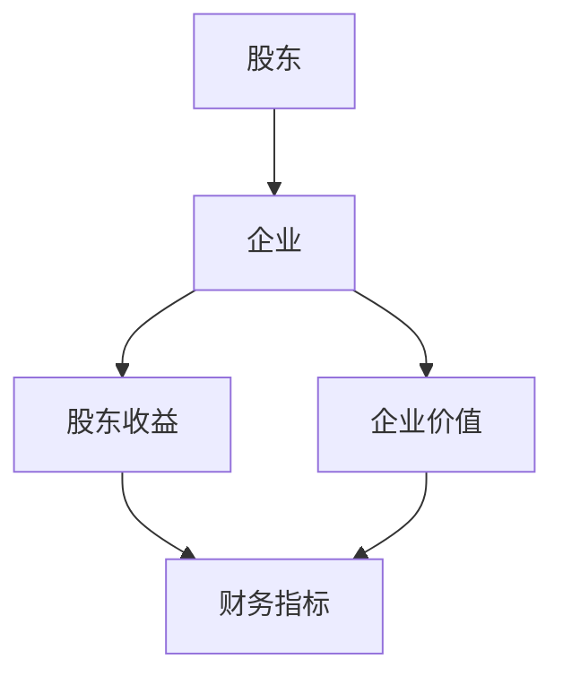
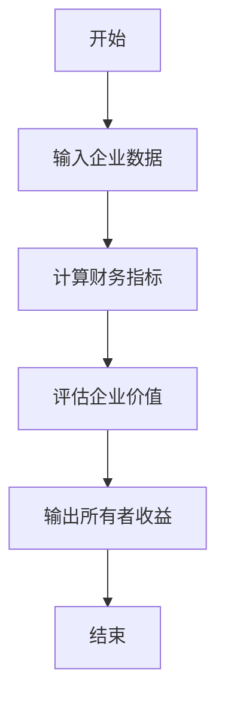
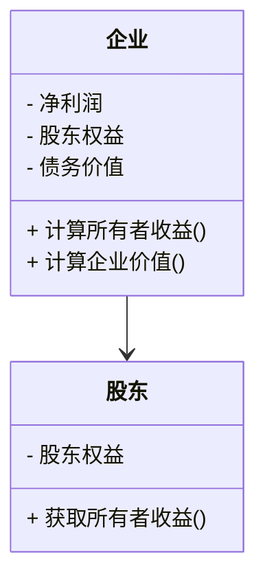
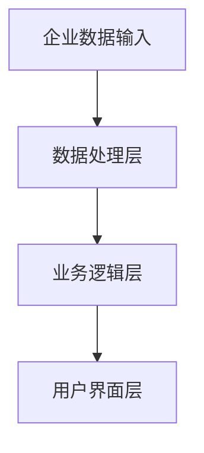
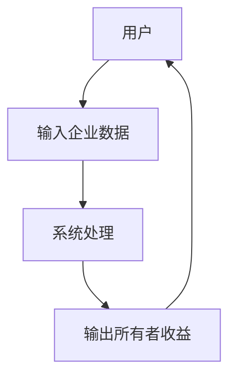

                 


## 《查尔斯·布兰登的所有者收益：股东视角的价值评估》

> 关键词：查尔斯·布兰登，所有者收益，股东价值，企业价值评估，财务指标，收益与风险

> 摘要：本文从股东视角出发，系统性地探讨了查尔斯·布兰登的所有者收益模型，结合理论与实践，通过数学公式、流程图和案例分析，深入解析企业价值评估的核心逻辑与方法，帮助投资者和企业管理者更好地理解所有者收益的计算与应用。

---

# 第一部分：所有者收益的背景与概念

# 第1章：所有者收益的定义与背景

## 1.1 问题背景
### 1.1.1 企业价值评估的核心问题
- 什么是企业价值？
- 企业价值与股东收益的关系。
- 为什么所有者收益是企业价值评估的关键指标？

### 1.1.2 所有者收益在企业价值评估中的重要性
- 所有者收益对股东决策的影响。
- 所有者收益与企业长期发展的关系。

### 1.1.3 当前企业价值评估的痛点与挑战
- 传统评估方法的局限性。
- 数据驱动与模型驱动的平衡问题。

## 1.2 问题描述
### 1.2.1 企业价值的多维度定义
- 企业价值的定义与构成。
- 股东价值与企业价值的关联。

### 1.2.2 所有者收益与股东价值的关系
- 所有者收益的内涵与外延。
- 股东价值的实现路径。

### 1.2.3 企业价值评估的边界与外延
- 企业价值评估的范围与限制。
- 所有者收益的适用场景。

## 1.3 问题解决与核心概念
### 1.3.1 所有者收益的定义与核心要素
- 所有者收益的数学定义。
- 核心要素：净利润、股东分红、资本增值。

### 1.3.2 企业价值评估的多维度框架
- 财务指标、市场指标、风险指标的综合评估。

### 1.3.3 所有者收益与企业绩效的关系
- 所有者收益与企业利润的关系。
- 所有者收益与股东权益的增长。

## 1.4 核心概念结构与组成
### 1.4.1 所有者收益的构成要素
- 净利润：企业的核心利润来源。
- 股东分红：股东的直接收益。
- 资本增值：股东的间接收益。

### 1.4.2 企业价值评估的逻辑框架
- 资产、负债、所有者权益的动态平衡。
- 收益、成本、利润的相互关系。

### 1.4.3 所有者收益与企业生命周期的关系
- 初创期：股东收益与风险的平衡。
- 成长期：收益与资本增值的双重驱动。
- 成熟期：股东收益的稳定与最大化。

## 1.5 本章小结
- 本章从背景出发，明确了所有者收益的定义、核心要素及其在企业价值评估中的重要性。

---

# 第二部分：所有者收益的核心理论与方法

# 第2章：所有者收益的核心概念与联系

## 2.1 核心概念原理
### 2.1.1 所有者收益的数学模型
- 所有者收益公式：$$\text{所有者收益} = \text{净利润} - \text{股东分红}$$
- 所有者收益与股东权益的关系。

### 2.1.2 企业价值评估的理论基础
- 股权价值与企业价值的公式推导。
- 企业价值与所有者收益的数学关系：$$\text{企业价值} = \text{股东权益} + \text{债务价值}$$

### 2.1.3 所有者收益与财务指标的关系
- 收益、成本、利润的相互影响。
- 股东收益与企业ROE（净资产收益率）的关系。

## 2.2 核心概念属性特征对比表
### 表2-1：所有者收益与股东权益的对比
| 属性 | 所有者收益 | 股东权益 |
|------|------------|----------|
| 定义 | 股东从企业中获得的收益 | 股东在企业中的权益 |
| 计算 | 净利润 - 股东分红 | 股东权益总额 |
| 时间性 | 短期与长期并存 | 长期性 |

### 表2-2：企业价值与股东收益的对比
| 属性 | 企业价值 | 股东收益 |
|------|----------|----------|
| 定义 | 企业整体价值 | 股东从企业中获得的收益 |
| 计算 | 股东权益 + 债务价值 | 净利润 - 股东分红 |
| 关系 | 股东收益是企业价值的一部分 | 企业价值是股东收益的载体 |

## 2.3 ER实体关系图


## 2.4 本章小结
- 本章通过对比分析，明确了所有者收益与其他核心概念的关系，为后续的数学模型和算法设计奠定了基础。

---

# 第3章：所有者收益的算法原理与数学模型

## 3.1 算法原理
### 3.1.1 所有者收益的计算公式
- $$\text{所有者收益} = \text{净利润} - \text{股东分红}$$
- 净利润的计算：$$\text{净利润} = \text{营业收入} - \text{营业成本} - \text{税金及附加} - \text{期间费用}$$

### 3.1.2 企业价值评估的多维度模型
- 股东收益模型：$$\text{股东收益} = \text{净利润} \times (1 - \text{分红率})$$
- 价值评估模型：$$\text{企业价值} = \text{股东权益} + \text{债务价值}$$

### 3.1.3 收益与风险的平衡关系
- 风险调整后的收益模型：$$\text{风险调整收益} = \text{预期收益} - \text{风险溢价}$$

## 3.2 算法流程图


## 3.3 数学模型与公式
### 3.3.1 所有者收益公式
$$\text{所有者收益} = \text{净利润} - \text{股东分红}$$

### 3.3.2 企业价值评估公式
$$\text{企业价值} = \text{股东权益} + \text{债务价值}$$

### 3.3.3 示例计算
- 某公司净利润为100万元，股东分红为20万元，则所有者收益为80万元。

## 3.4 本章小结
- 本章通过数学模型和流程图，详细讲解了所有者收益的计算方法及其在企业价值评估中的应用。

---

# 第三部分：系统分析与架构设计

# 第4章：系统分析与架构设计方案

## 4.1 项目介绍
### 4.1.1 项目背景
- 企业价值评估的重要性。
- 所有者收益评估系统的开发目标。

## 4.2 系统功能设计
### 4.2.1 领域模型


### 4.2.2 系统架构设计


### 4.2.3 系统交互设计


## 4.3 本章小结
- 本章通过系统设计，明确了所有者收益评估系统的功能架构和实现路径。

---

# 第四部分：项目实战与案例分析

# 第5章：项目实战：所有者收益评估系统实现

## 5.1 环境安装
- 安装Python和相关库（pandas、numpy、scipy）。

## 5.2 系统核心实现
### 5.2.1 数据处理代码
```python
import pandas as pd

def calculate_owner_profit(net_profit, dividend):
    return net_profit - dividend

# 示例数据
data = {
    '净利润': [1000000],
    '股东分红': [200000]
}
df = pd.DataFrame(data)
owner_profit = calculate_owner_profit(df['净利润'].values[0], df['股东分红'].values[0])
print(f"所有者收益为：{owner_profit}元")
```

### 5.2.2 系统交互代码
```python
def main():
    import pandas as pd
    import sys

    net_profit = float(input("请输入净利润（元）："))
    dividend = float(input("请输入股东分红（元）："))
    owner_profit = calculate_owner_profit(net_profit, dividend)
    print(f"所有者收益为：{owner_profit}元")

if __name__ == "__main__":
    main()
```

## 5.3 案例分析
### 5.3.1 案例背景
- 某创业公司，净利润为500万元，股东分红为100万元。

### 5.3.2 案例分析
- 所有者收益为400万元。
- 企业价值评估：股东权益 + 债务价值 = 1000万元 + 500万元 = 1500万元。

### 5.3.3 业务价值总结
- 所有者收益为400万元，表明公司为股东创造了较高的价值。
- 企业价值为1500万元，为未来的投资决策提供了依据。

## 5.4 本章小结
- 本章通过实战案例，展示了所有者收益评估系统的实际应用和价值。

---

# 第五部分：总结与展望

# 第6章：总结与展望

## 6.1 最佳实践与小结
- 所有者收益的核心公式：$$\text{所有者收益} = \text{净利润} - \text{股东分红}$$
- 企业价值评估的关键点：股东权益与债务价值的综合考量。

## 6.2 注意事项
- 数据的准确性和完整性。
- 模型的适用性和可调整性。

## 6.3 未来研究方向
- 更复杂的企业价值模型：考虑更多财务指标和风险因素。
- 人工智能在企业价值评估中的应用。

## 6.4 本章小结
- 本章总结了所有者收益评估的核心内容，并展望了未来的研究方向。

---

# 作者：AI天才研究院/AI Genius Institute & 禅与计算机程序设计艺术 /Zen And The Art of Computer Programming

---

> **摘要**：本文从股东视角出发，系统性地探讨了查尔斯·布兰登的所有者收益模型，结合理论与实践，通过数学公式、流程图和案例分析，深入解析企业价值评估的核心逻辑与方法，帮助投资者和企业管理者更好地理解所有者收益的计算与应用。

