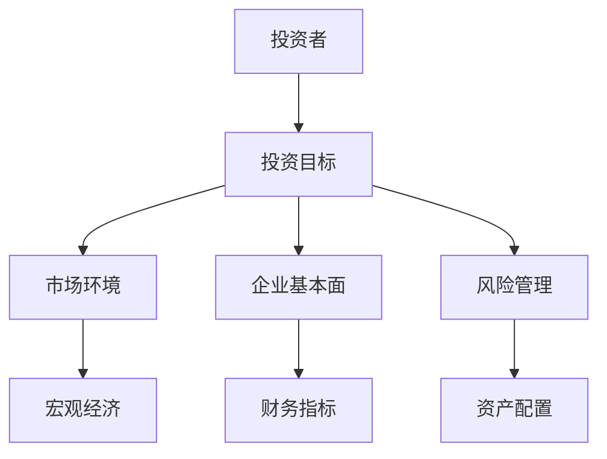
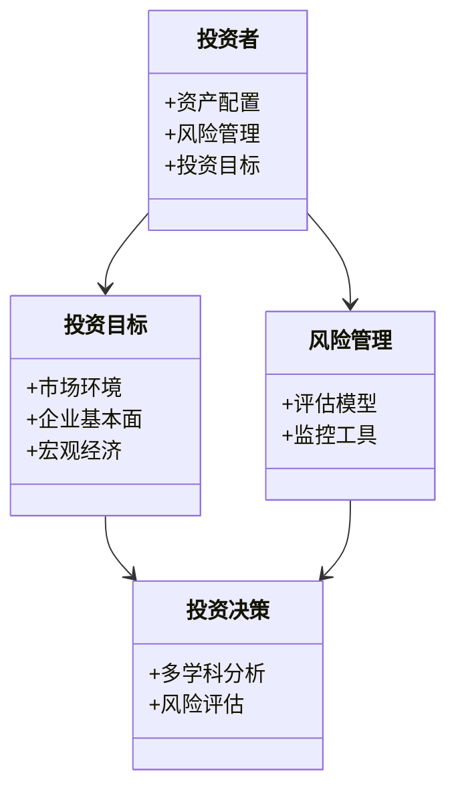
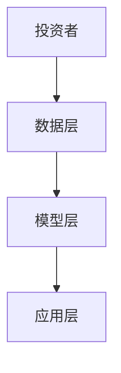
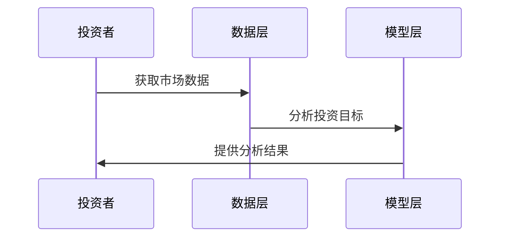

                 


# 查理·芒格的多元思维模型在投资中的运用

> 关键词：查理·芒格，多元思维模型，投资决策，价值投资，风险管理，系统思维

> 摘要：本文深入探讨查理·芒格的多元思维模型在投资中的应用，结合具体案例和系统分析，揭示如何通过多学科视角做出明智的投资决策，降低风险，实现长期收益。

---

## 第一部分: 查理·芒格的多元思维模型概述

### 第1章: 查理·芒格及其多元思维模型的背景

#### 1.1 查理·芒格的生平与思想

##### 1.1.1 查理·芒格的早年经历

查理·芒格出生于1924年，是一位美国著名投资者和作家。他在哈佛大学学习法律，后转学到加州大学伯克利分校，获得经济学学士学位。芒格的职业生涯始于法律领域，但他的兴趣逐渐转向投资。

##### 1.1.2 芒格的投资哲学与价值观念

芒格的价值投资理念强调安全边际和内在价值。他认为，投资的本质是寻找那些具有持续竞争优势，并且管理良好、财务健康的企业。

##### 1.1.3 芒格与伯克希尔·哈撒韦的传奇

芒格与沃伦·巴菲特共同管理伯克希尔·哈撒韦公司，使其从一家小型保险公司发展为市值数千亿美元的投资巨头。

#### 1.2 多元思维模型的起源与定义

##### 1.2.1 多元思维模型的提出背景

芒格提出多元思维模型，认为投资决策需要跨学科的视角，以避免单一学科的局限性。

##### 1.2.2 多元思维模型的核心定义

多元思维模型是一种通过多个学科的视角来分析问题的方法，强调知识的广度和深度。

##### 1.2.3 多元思维模型的边界与外延

模型的应用范围广泛，但需注意其局限性，避免过度复杂化。

#### 1.3 多元思维模型在投资中的重要性

##### 1.3.1 投资中的常见问题与误区

投资者常因过度自信或忽视系统性风险而犯错。

##### 1.3.2 多元思维模型如何解决投资问题

通过多学科分析，减少认知偏差，提高决策质量。

##### 1.3.3 多元思维模型与长期投资成功的关系

长期成功的投资需要全面的分析和风险管理。

### 第2章: 多元思维模型的核心概念与联系

#### 2.1 核心概念原理

##### 2.1.1 多元思维模型的哲学基础

强调整体性思维，避免片面判断。

##### 2.1.2 多元思维模型的数学基础

涉及概率论和统计学，用于评估风险和收益。

##### 2.1.3 多元思维模型的心理学基础

分析认知偏差对决策的影响。

#### 2.2 核心概念属性对比表格

| 概念         | 描述                                                                 |
|--------------|----------------------------------------------------------------------|
| 心理学模型   | 描述人类行为和决策的心理机制                                         |
| 经济学模型   | 描述市场运作和价值评估的经济规律                                   |
| 统计学模型   | 描述数据分布和风险评估的统计方法                                   |
| 历史学模型   | 描述历史事件的因果关系和周期性                                       |

#### 2.3 ER实体关系图架构



---

## 第二部分: 多元思维模型的算法原理

### 第3章: 多元思维模型的算法实现

#### 3.1 算法原理概述

多元思维模型结合了多个学科的分析方法，用于评估投资决策的风险和收益。

#### 3.2 使用Python的多元思维模型实现

##### 3.2.1 安装必要的库

```python
import numpy as np
import pandas as pd
import matplotlib.pyplot as plt
```

##### 3.2.2 蒙特卡洛模拟示例代码

```python
def monte_carlo_simulation(initial_amount, annual_return, annual_volatility, years):
    np.random.seed(42)
    returns = np.random.normal(0, annual_volatility, years)
    returns = returns + annual_return
    returns = np.cumprod(1 + returns/100)
    plt.plot(returns)
    plt.title('Monte Carlo Simulation')
    plt.xlabel('Year')
    plt.ylabel('Cumulative Returns')
    plt.show()

monte_carlo_simulation(10000, 7, 15, 10)
```

##### 3.2.3 模型的数学公式

投资组合的预期收益为各资产收益的加权平均，风险由方差衡量：

$$ E(R_p) = \sum w_i E(R_i) $$

$$ Var(R_p) = \sum w_i^2 Var(R_i) + \sum w_i w_j Cov(R_i, R_j) $$

---

## 第三部分: 系统分析与架构设计方案

### 第4章: 多元思维模型的系统架构

#### 4.1 问题场景介绍

构建一个投资决策支持系统，帮助投资者基于多元思维模型进行分析。

#### 4.2 系统功能设计



#### 4.3 系统架构设计



#### 4.4 系统接口设计

通过API获取市场数据和企业基本面信息，进行分析和预测。

#### 4.5 系统交互设计



---

## 第四部分: 项目实战

### 第5章: 项目实现

#### 5.1 环境安装

```bash
pip install numpy pandas matplotlib
```

#### 5.2 核心代码实现

##### 5.2.1 多元思维模型应用

```python
def evaluate_investment(initial Investment, returns, risks):
    expected_return = np.mean(returns)
    expected_risk = np.std(risks)
    return expected_return, expected_risk
```

##### 5.2.2 风险评估代码

```python
def risk_assessment(portfolio, scenarios):
    returns = []
    for _ in range(scenarios):
        returns.append(np.random.normal(0, portfolio['volatility']))
    return returns
```

#### 5.3 应用案例分析

分析某公司的财务状况和市场环境，评估投资的可行性。

#### 5.4 项目小结

通过多元思维模型，投资者可以更全面地评估风险和收益，做出更明智的决策。

---

## 第五部分: 最佳实践与注意事项

### 第6章: 投资策略与风险管理

#### 6.1 多元思维模型的最佳实践

- 定期更新知识库
- 多维度分析投资目标
- 风险管理优先

#### 6.2 风险管理的关键点

- 分散投资
- 定期复盘
- 保持耐心

#### 6.3 小结

通过系统的分析和持续的学习，投资者可以有效运用多元思维模型，实现长期稳定的收益。

---

## 第六部分: 拓展阅读与总结

### 第7章: 进阶内容

#### 7.1 长期投资的系统思维

- 理解经济周期
- 分析企业竞争优势
- 评估管理团队

#### 7.2 价值评估的关键要素

- 财务状况
- 市场地位
- 管理能力

#### 7.3 查理·芒格的决策框架

- 知识的广度和深度
- 避免认知偏差
- 长期视角

---

## 作者：AI天才研究院 & 禅与计算机程序设计艺术

---

通过以上结构，文章详细探讨了查理·芒格的多元思维模型在投资中的应用，结合理论分析和实际案例，帮助投资者提升决策能力。

