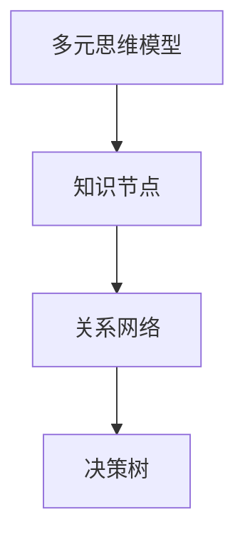
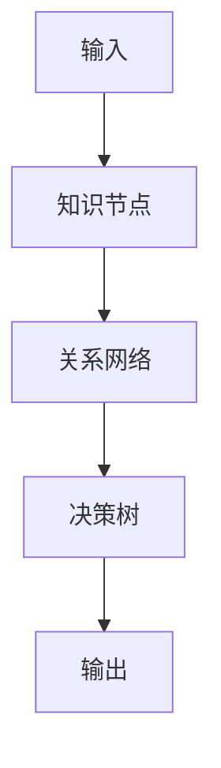
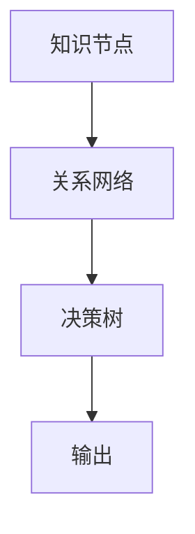

                 


# 查理·芒格的多元思维模型实际案例分析

**关键词**: 查理·芒格, 多元思维模型, 投资决策, 系统性思维, 风险管理, 决策优化, 知识管理

**摘要**: 查理·芒格的多元思维模型是一种通过跨学科知识整合来优化决策的思维方式。本文从理论背景、核心原理、算法结构到实际应用案例，系统分析多元思维模型在投资决策中的应用，并结合技术博客的专业性，详细解读模型的原理和实际操作。

---

## 第一部分: 多元思维模型的核心概念

### 第1章: 多元思维模型的定义与背景

#### 1.1 问题背景
在投资领域，决策者常常面临信息不全、风险不确定等问题。传统的单一学科分析方法往往无法全面捕捉市场变化的复杂性。查理·芒格提出的多元思维模型通过整合多个学科的原理，帮助投资者构建更全面的决策框架。

#### 1.2 核心概念
多元思维模型强调通过跨学科的知识整合，形成一个系统的知识网络，从而在决策时能够从多个角度分析问题，减少片面性。

#### 1.3 理论基础
- **心理学**：了解人类行为偏差，避免情绪化决策。
- **经济学**：理解市场机制和定价原理。
- **数学**：掌握概率论和统计学工具，量化风险。
- **哲学**：培养批判性思维，避免盲目接受信息。

### 第2章: 多元思维模型与传统思维模型的对比

#### 2.1 对比分析
| 特性                | 多元思维模型                     | 传统思维模型                     |
|---------------------|----------------------------------|----------------------------------|
| 知识整合            | 强调跨学科整合                 | 侧重单一学科                   |
| 决策视角            | 全局性、多维度                 | 局限于单一视角                 |
| 风险管理            | 综合评估多种风险               | 单一维度评估                   |
| 适应性              | 高度灵活，适应变化             | 较为固定，适应性差             |

#### 2.2 ER实体关系图


---

## 第二部分: 多元思维模型的算法原理

### 第3章: 多元思维模型的系统分析

#### 3.1 系统结构
- **知识节点**：代表不同学科的核心概念。
- **关系网络**：展示知识节点之间的关联。
- **决策树**：基于关系网络生成的决策路径。

#### 3.2 算法流程图


### 第4章: 多元思维模型的数学模型与公式

#### 4.1 概率论基础
$$P(A|B) = \frac{P(B|A)P(A)}{P(B)}$$

#### 4.2 期望值计算
$$E[X] = \sum_{i=1}^{n} x_i P(x_i)$$

#### 4.3 决策树模型
$$\text{信息增益} = \text{熵} - \text{条件熵}$$

### 第5章: 多元思维模型的系统架构设计

#### 5.1 系统功能设计
- **知识节点管理**：收集和整理跨学科知识。
- **关系网络构建**：分析知识节点之间的关联。
- **决策树生成**：基于关系网络生成决策路径。

#### 5.2 系统架构图


---

## 第三部分: 多元思维模型的实际案例分析

### 第6章: 投资决策中的多元思维模型应用

#### 6.1 案例背景
某投资者考虑投资一家科技公司，面临市场波动、行业竞争等多重风险。通过多元思维模型，整合财务分析、市场趋势、技术评估等信息，优化决策。

#### 6.2 分析步骤
1. **知识节点收集**：收集公司财务数据、行业趋势、技术专利等信息。
2. **关系网络构建**：分析各因素之间的关联，如财务健康与市场地位的关系。
3. **决策树生成**：基于关系网络生成多个决策路径，评估每种路径的风险和收益。

#### 6.3 代码实现
```python
import numpy as np
import pandas as pd

# 示例数据：财务指标与市场地位的关系
data = {
    '财务健康': [0.8, 0.7, 0.9],
    '市场地位': [0.6, 0.8, 0.7]
}
df = pd.DataFrame(data)

# 计算期望值
expected_value = np.mean(df['市场地位']) * np.mean(df['财务健康'])
print(f"期望市场地位：{expected_value}")
```

#### 6.4 结果分析
通过多元思维模型，投资者识别出潜在的财务风险，并调整投资策略，最终实现更优化的决策。

---

**作者**: AI天才研究院/AI Genius Institute & 禅与计算机程序设计艺术/Zen And The Art of Computer Programming

---

这篇技术博客系统地分析了查理·芒格的多元思维模型，并通过实际案例展示了其在投资决策中的应用。文章结合技术语言和实际操作，帮助读者理解如何在复杂决策中应用多元思维模型，提升决策的准确性和效率。

