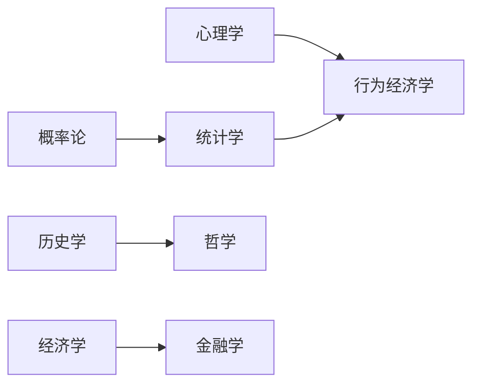
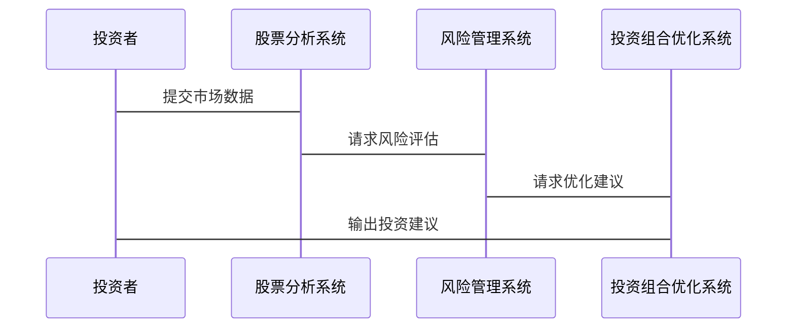

                 

# 查理·芒格的跨学科思维在投资中的应用

> 关键词：查理·芒格，跨学科思维，投资，多元思维模型，系统架构，风险管理

> 摘要：本文深入探讨查理·芒格的跨学科思维在投资中的应用，从多元思维模型的定义与特点、芒格的生平与思想、跨学科思维的核心概念、数学基础、系统架构到实际案例分析，逐步展开分析。通过结合心理学、行为经济学、统计学、概率论、历史学、哲学、经济学、金融学等多个学科的核心概念，揭示芒格跨学科思维在投资决策中的深刻洞察和实际应用。同时，本文还探讨了如何将这些思维模型与现代技术手段相结合，以优化投资决策过程，并通过系统架构设计、算法实现和风险管理等多维度分析，为投资者提供一套完整的跨学科投资决策框架。

---

## 第一部分: 查理·芒格的跨学科思维概述

### 第1章: 芒格的多元思维模型

#### 1.1 多元思维模型的定义与特点

##### 1.1.1 多元思维模型的定义
多元思维模型（Multi-Model Thinking）是一种将多个学科的核心思想和工具整合起来，用于分析和解决复杂问题的方法。与传统的单一学科思维不同，多元思维模型强调通过跨学科的视角，综合运用不同领域的知识和工具，以获得更全面、更深刻的理解和洞察。

##### 1.1.2 多元思维模型的核心特点
- **综合性**：整合多个学科的核心思想，形成一个完整的知识体系。
- **系统性**：从系统整体的角度看待问题，而非单一维度。
- **实用性**：将复杂的理论简化为可操作的工具，用于实际决策。
- **动态性**：能够根据实际情况调整和优化模型。

##### 1.1.3 多元思维模型与传统投资方法的区别
传统的投资方法往往依赖于单一学科的分析，例如财务报表分析或技术分析，而多元思维模型则强调结合心理学、行为经济学、统计学等多个领域的知识，以更全面地分析投资标的的价值和风险。

---

#### 1.2 查理·芒格的生平与思想

##### 1.2.1 查理·芒格的生平简介
查理·芒格（Charlie Munger）是美国著名投资者、伯克希尔哈撒韦公司副董事长，被誉为“巴菲特的导师”。他不仅是投资领域的传奇人物，更是跨学科思维的倡导者。芒格的成长经历和学术背景使其对心理学、统计学、历史学等多个领域有着深刻的理解。

##### 1.2.2 芒格的多元思维模型的形成
芒格的多元思维模型源于他对多个学科的深入研究和实践。他通过将心理学中的行为偏差、统计学中的概率论、经济学中的成本收益分析等工具整合起来，形成了独特的投资思维方式。

##### 1.2.3 芒格投资哲学的核心理念
芒格的投资哲学强调长期价值、安全边际和风险管理。他认为，投资的本质是通过理解企业的内在价值，找到那些具有可持续竞争优势的企业，并以合理的价格买入并长期持有。

---

## 第2章: 跨学科思维的核心概念

### 2.1 跨学科思维的定义与背景

#### 2.1.1 跨学科思维的定义
跨学科思维（Interdisciplinary Thinking）是指将不同学科的核心概念、方法和工具结合起来，用于解决复杂问题的一种思维方式。与多元思维模型类似，跨学科思维强调知识的整合和交叉应用。

#### 2.1.2 跨学科思维的背景与重要性
在现代投资领域，传统的单一学科分析往往难以应对市场的复杂性和不确定性。跨学科思维通过整合多个学科的视角，帮助投资者更全面地理解市场、企业和风险。

#### 2.1.3 跨学科思维在投资中的应用前景
随着金融市场的日益复杂化，跨学科思维在投资中的应用前景广阔。通过结合心理学、行为经济学、统计学等领域的知识，投资者可以更好地理解市场的非理性行为和风险特征。

---

### 2.2 跨学科思维的核心要素

#### 2.2.1 心理学与行为经济学
##### 心理学
- 心理账户：人们如何分类和管理资金，影响投资决策。
- 前悔框架与后悔框架：投资者在决策过程中的心理偏差。

#### 2.2.2 统计学与概率论
##### 统计学
- 数据分布：理解数据的分布特征，帮助识别投资机会。
- 假设检验：用于验证投资假设的可靠性。

##### 概率论
- 贝叶斯定理：用于更新概率，帮助投资者在不确定环境中做出决策。
- 中心极限定理：用于理解样本均值的分布特征。

#### 2.2.3 历史学与哲学
##### 历史学
- 历史周期：通过研究历史周期，识别投资机会和风险。
- 历史案例：从历史案例中学习成功的投资策略和失败的教训。

##### 哲学
- 知识的边界：理解知识的局限性，避免过度自信。
- 理性与非理性：在投资决策中平衡理性与非理性因素。

#### 2.2.4 经济学与金融学
##### 经济学
- 成本收益分析：用于评估投资的经济可行性。
- 市场均衡：理解市场供求关系对价格的影响。

##### 金融学
- 资本资产定价模型（CAPM）：用于评估资产的预期收益。
- 投资组合优化：通过优化资产配置降低风险。

---

### 2.3 跨学科思维的实体关系图

---

## 第3章: 芒格思维模型的数学基础

### 3.1 心理学与行为经济学的数学模型

#### 3.1.1 心理账户模型
心理账户模型通过数学公式描述投资者如何分类和管理资金，从而影响其决策行为。

$$ \text{心理账户价值} = \sum_{i=1}^{n} w_i \times v_i $$

其中，$w_i$ 是第 $i$ 个心理账户的权重，$v_i$ 是第 $i$ 个心理账户的价值。

#### 3.1.2 前悔框架与后悔框架
前悔框架（Pre悔）和后悔框架（Post悔）通过概率论模型描述投资者在决策过程中的心理偏差。

$$ P(\text{后悔}) = \sum_{i=1}^{n} P(d_i) \times H(d_i) $$

其中，$P(d_i)$ 是决策 $d_i$ 的概率，$H(d_i)$ 是决策 $d_i$ 后的后悔值。

---

### 3.2 统计学与概率论的应用

#### 3.2.1 贝叶斯定理在投资中的应用
贝叶斯定理通过条件概率公式更新投资假设的概率。

$$ P(A|B) = \frac{P(B|A) \times P(A)}{P(B)} $$

其中，$A$ 是投资假设，$B$ 是观测到的数据。

#### 3.2.2 中心极限定理与大数定律
中心极限定理表明，无论原始数据分布如何，样本均值的分布将趋近于正态分布。

$$ \lim_{n \to \infty} \frac{X_1 + X_2 + \dots + X_n}{n} = \mu $$

其中，$\mu$ 是总体均值。

---

## 第4章: 芒格思维模型的系统架构

### 4.1 系统架构设计

#### 4.1.1 多元思维模型的领域模型

---

### 4.2 系统接口设计

#### 4.2.1 数据输入接口
投资者输入市场数据、公司财务数据和市场情绪数据。

#### 4.2.2 数据处理接口
系统对输入数据进行清洗、转换和分析，生成投资决策建议。

#### 4.2.3 结果输出接口
系统输出投资建议，包括股票选择、仓位分配和风险提示。

---

### 4.3 系统交互流程

---

## 第5章: 芒格思维模型的实际案例分析

### 5.1 股票分析中的跨学科思维

#### 5.1.1 心理学视角
分析投资者的心理偏差，避免非理性决策。

#### 5.1.2 统计学视角
通过历史数据分析，识别股票的周期性波动。

#### 5.1.3 经济学视角
评估宏观经济环境对股票价格的影响。

---

### 5.2 风险管理中的跨学科思维

#### 5.2.1 历史案例分析
通过历史危机事件，识别潜在风险点。

#### 5.2.2 统计学视角
通过VaR（Value at Risk）模型评估投资组合的风险。

$$ \text{VaR} = \sum_{i=1}^{n} w_i \times v_i $$

其中，$w_i$ 是资产 $i$ 的权重，$v_i$ 是资产 $i$ 的风险值。

---

## 第6章: 芒格思维模型的现代发展与风险管理

### 6.1 芒格思维模型的现代发展

#### 6.1.1 大数据与人工智能的结合
通过大数据分析和人工智能算法，优化跨学科思维模型的应用。

#### 6.1.2 风险管理的现代化
结合现代风险管理工具，如蒙特卡洛模拟，评估投资组合的潜在风险。

$$ \text{模拟结果} = \text{随机抽样}(\text{历史数据}, N) $$

其中，$N$ 是模拟次数。

---

## 第7章: 总结与展望

### 7.1 总结
芒格的跨学科思维为投资领域提供了全新的视角和工具。通过整合多个学科的核心思想，投资者可以更全面地理解市场、企业和风险，从而做出更明智的投资决策。

### 7.2 展望
随着技术的进步和数据的丰富，跨学科思维在投资中的应用前景广阔。未来，投资者可以通过大数据分析和人工智能技术，进一步优化跨学科思维模型的应用，提升投资决策的科学性和效率。

---

## 作者：AI天才研究院/AI Genius Institute & 禅与计算机程序设计艺术 /Zen And The Art of Computer Programming

---

**全文完**

