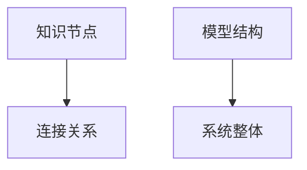
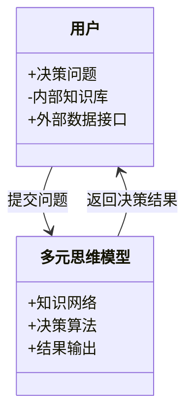
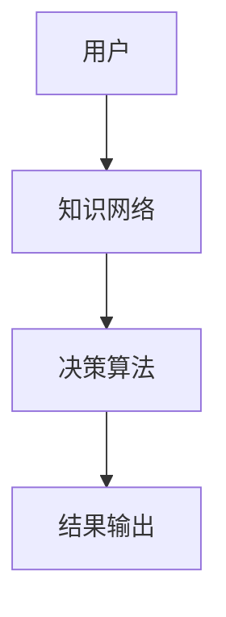
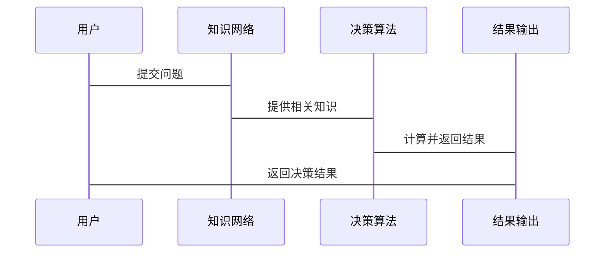
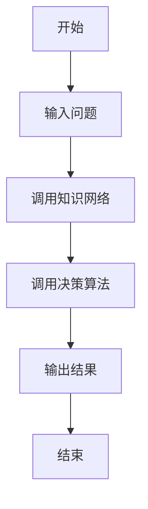

                 


```markdown
# 查理芒格的多元思维模型

> 关键词：多元思维模型, 查理芒格, 系统性思维, 知识网络化, 复杂问题解决

> 摘要：本文深入探讨了查理芒格的多元思维模型，从其核心概念、系统分析到实际应用，详细阐述了该模型在复杂问题解决中的独特优势和应用价值。

---

# 第一部分: 查理芒格多元思维模型的背景与核心概念

# 第1章: 多元思维模型的起源与重要性

## 1.1 多元思维模型的定义与背景
### 1.1.1 问题背景：传统思维的局限性
传统单一学科思维在解决复杂问题时往往显得力不从心，容易陷入“盲人摸象”的困境。

### 1.1.2 问题描述：单一学科视角的不足
单一学科视角难以全面理解问题的本质，容易忽视关键因素之间的相互作用。

### 1.1.3 问题解决：多元思维模型的提出
通过整合多个学科的知识和思维方式，形成一个有机的知识网络，以更全面地分析问题。

### 1.1.4 边界与外延：多元思维模型的适用范围
适用于复杂系统分析、决策制定等领域，尤其在面对不确定性时表现尤为突出。

### 1.1.5 核心要素：模型的组成与结构


## 1.2 多元思维模型的核心概念
### 1.2.1 核心概念：模型的原理与特征
多元思维模型通过多个学科的视角，构建一个知识网络，帮助我们更全面地理解问题。

### 1.2.2 核心要素对比表格
| 比较维度 | 单一思维模型 | 多元思维模型 |
|----------|--------------|--------------|
| 适用范围 | 有限         | 广泛         |
| 解决问题能力 | 有限         | 强大         |
| 知识结构 | 线性         | 网络化       |

### 1.2.3 ER实体关系图
```mermaid
er
actor: 用户
model: 多元思维模型
relation: 包含
```

## 1.3 多元思维模型的哲学基础
### 1.3.1 基于查理芒格的决策理念
芒格强调通过多个思维模型的相互验证来提高决策的准确性。

### 1.3.2 基于知识的网络化结构
知识不是孤立的点，而是相互关联的网络，这种网络化的知识结构能够更好地应对复杂问题。

### 1.3.3 基于问题解决的系统性思维
系统性思维要求我们从整体出发，综合考虑各个因素之间的相互作用。

## 1.4 本章小结
### 1.4.1 多元思维模型的核心概念总结
多元思维模型是一种通过整合多个学科的思维方式，构建知识网络，以更全面地理解和解决问题的方法。

### 1.4.2 多元思维模型的哲学基础
芒格的决策理念和系统性思维为多元思维模型提供了坚实的哲学基础。

### 1.4.3 为后续章节打下基础
本章为后续章节的系统分析与架构设计奠定了基础，后续章节将深入探讨模型的实现与应用。

---

# 第2章: 多元思维模型的系统分析与架构设计

## 2.1 系统分析
### 2.1.1 问题场景：复杂决策问题
在面对复杂决策问题时，单一的思维模型往往无法提供足够的洞察力。

### 2.1.2 项目介绍：构建多元思维模型系统
本项目旨在通过整合多个学科的思维方式，构建一个能够应对复杂问题的知识系统。

### 2.1.3 系统功能设计


## 2.2 系统架构设计
### 2.2.1 系统架构图


### 2.2.2 系统接口设计
- 用户接口：提交决策问题，接收决策结果。
- 知识网络接口：提供多学科的知识和思维方式。
- 决策算法接口：根据输入的问题，调用相应的算法进行计算。

### 2.2.3 系统交互流程


## 2.3 系统实现细节
### 2.3.1 知识网络的构建
- 知识节点的定义与关联
- 知识网络的动态更新
- 知识网络的存储与检索

### 2.3.2 决策算法的设计
- 算法选择与优化
- 算法的可扩展性
- 算法的鲁棒性

### 2.3.3 结果输出的处理
- 结果的可视化
- 结果的可解释性
- 结果的可操作性

## 2.4 本章小结
### 2.4.1 系统分析的重要性
通过系统分析，我们能够更好地理解问题的本质，并找到有效的解决方案。

### 2.4.2 系统架构设计的核心要素
系统的架构设计需要考虑各个模块之间的协作关系，确保系统的整体性能。

### 2.4.3 为后续章节打下基础
本章为后续章节的项目实战奠定了基础，后续章节将详细探讨系统的实现与应用。

---

# 第3章: 多元思维模型的数学模型与算法原理

## 3.1 数学模型的建立
### 3.1.1 知识网络的数学表示
使用图论中的图结构来表示知识网络，节点代表知识，边代表关联关系。

$$
G = (V, E)
$$

其中，\( V \) 表示知识节点，\( E \) 表示节点之间的关联关系。

### 3.1.2 决策算法的数学表示
使用概率论和统计学方法来计算各个决策方案的可行性。

$$
P(A|B) = \frac{P(B|A)P(A)}{P(B)}
$$

### 3.1.3 网络的权重计算
使用加权图来表示知识网络的权重，权重越大表示关联性越强。

$$
w_{ij} = \frac{1}{1 + e^{-k \cdot d_{ij}}}
$$

其中，\( d_{ij} \) 表示节点 \( i \) 和节点 \( j \) 之间的距离，\( k \) 为常数。

## 3.2 算法原理的详细讲解
### 3.2.1 算法选择
- 确定性算法与概率性算法的对比
- 算法的时间复杂度与空间复杂度分析

### 3.2.2 算法实现


### 3.2.3 算法优化
- 并行计算的优化
- 知识网络的动态更新优化
- 决策算法的参数优化

## 3.3 本章小结
### 3.3.1 数学模型的重要性
数学模型是多元思维模型的核心工具，能够帮助我们更好地理解和解决复杂问题。

### 3.3.2 算法原理的详细讲解
通过详细讲解算法原理，我们能够更好地掌握多元思维模型的实现方法。

### 3.3.3 为后续章节打下基础
本章为后续章节的项目实战奠定了数学基础，后续章节将详细探讨系统的实现与应用。

---

# 第4章: 多元思维模型的项目实战

## 4.1 项目环境安装
### 4.1.1 开发环境的配置
- 操作系统要求
- 开发工具的安装
- 第三方库的安装

### 4.1.2 依赖管理
- 使用虚拟环境管理依赖
- 使用包管理工具安装依赖

## 4.2 项目核心实现
### 4.2.1 知识网络的构建
```python
class KnowledgeNode:
    def __init__(self, id, content):
        self.id = id
        self.content = content
```

### 4.2.2 决策算法的实现
```python
def decision_algorithm(knowledge_graph, problem):
    # 算法实现
    pass
```

### 4.2.3 结果输出的处理
```python
def output_result(result):
    print("决策结果:", result)
```

## 4.3 代码应用解读与分析
### 4.3.1 代码结构分析
- 代码的整体结构
- 代码的功能模块划分

### 4.3.2 代码实现细节
- 代码的可扩展性分析
- 代码的可维护性分析

## 4.4 实际案例分析
### 4.4.1 案例背景介绍
- 案例的背景
- 案例的目标

### 4.4.2 案例分析过程
- 知识网络的构建
- 决策算法的实现
- 结果输出的处理

## 4.5 本章小结
### 4.5.1 项目实战的重要性
通过项目实战，我们能够更好地掌握多元思维模型的实现方法。

### 4.5.2 代码实现的细节分析
详细分析了代码实现的细节，帮助读者更好地理解多元思维模型的实现过程。

### 4.5.3 为后续章节打下基础
本章为后续章节的系统优化与扩展奠定了基础，后续章节将详细探讨系统的进一步优化。

---

# 第5章: 多元思维模型的最佳实践与小结

## 5.1 最佳实践
### 5.1.1 知识网络的动态更新
- 定期更新知识网络
- 动态调整权重

### 5.1.2 决策算法的优化
- 算法的参数优化
- 算法的结构优化

### 5.1.3 系统的可扩展性设计
- 模块化设计
- 接口标准化

## 5.2 小结
### 5.2.1 多元思维模型的核心价值
通过整合多个学科的思维方式，构建一个知识网络，帮助我们更全面地理解和解决复杂问题。

### 5.2.2 系统设计的关键点
系统的架构设计需要考虑各个模块之间的协作关系，确保系统的整体性能。

### 5.2.3 未来的发展方向
- 知识网络的智能化
- 决策算法的自动化
- 系统的可扩展性设计

## 5.3 注意事项
### 5.3.1 知识网络的构建
- 知识节点的选取
- 知识网络的权重设置

### 5.3.2 决策算法的选择
- 算法的适用场景
- 算法的优缺点对比

### 5.3.3 系统的维护
- 系统的日常维护
- 系统的故障排除

## 5.4 拓展阅读
### 5.4.1 推荐书籍
- 《穷查理宝典》
- 《思考，快与慢》

### 5.4.2 推荐博客
- 查理芒格的官方网站
- 专业技术博客

---

# 作者

作者：AI天才研究院/AI Genius Institute & 禅与计算机程序设计艺术 /Zen And The Art of Computer Programming

---

**本文为《查理芒格的多元思维模型》的完整目录大纲，后续将根据需要逐步展开各个章节的具体内容。**
</think>

```markdown
# 查理芒格的多元思维模型

> 关键词：多元思维模型, 查理芒格, 系统性思维, 知识网络化, 复杂问题解决

> 摘要：本文深入探讨了查理芒格的多元思维模型，从其核心概念、系统分析到实际应用，详细阐述了该模型在复杂问题解决中的独特优势和应用价值。

---

# 第一部分: 查理芒格多元思维模型的背景与核心概念

# 第1章: 多元思维模型的起源与重要性

## 1.1 多元思维模型的定义与背景
### 1.1.1 问题背景：传统思维的局限性
传统单一学科思维在解决复杂问题时往往显得力不从心，容易陷入“盲人摸象”的困境。

### 1.1.2 问题描述：单一学科视角的不足
单一学科视角难以全面理解问题的本质，容易忽视关键因素之间的相互作用。

### 1.1.3 问题解决：多元思维模型的提出
通过整合多个学科的知识和思维方式，形成一个有机的知识网络，以更全面地分析问题。

### 1.1.4 边界与外延：多元思维模型的适用范围
适用于复杂系统分析、决策制定等领域，尤其在面对不确定性时表现尤为突出。

### 1.1.5 核心要素：模型的组成与结构


## 1.2 多元思维模型的核心概念
### 1.2.1 核心概念：模型的原理与特征
多元思维模型通过多个学科的视角，构建一个知识网络，帮助我们更全面地理解问题。

### 1.2.2 核心要素对比表格
| 比较维度 | 单一思维模型 | 多元思维模型 |
|----------|--------------|--------------|
| 适用范围 | 有限         | 广泛         |
| 解决问题能力 | 有限         | 强大         |
| 知识结构 | 线性         | 网络化       |

### 1.2.3 ER实体关系图
```mermaid
er
actor: 用户
model: 多元思维模型
relation: 包含
```

## 1.3 多元思维模型的哲学基础
### 1.3.1 基于查理芒格的决策理念
芒格强调通过多个思维模型的相互验证来提高决策的准确性。

### 1.3.2 基于知识的网络化结构
知识不是孤立的点，而是相互关联的网络，这种网络化的知识结构能够更好地应对复杂问题。

### 1.3.3 基于问题解决的系统性思维
系统性思维要求我们从整体出发，综合考虑各个因素之间的相互作用。

## 1.4 本章小结
### 1.4.1 多元思维模型的核心概念总结
多元思维模型是一种通过整合多个学科的思维方式，构建知识网络，以更全面地理解和解决问题的方法。

### 1.4.2 多元思维模型的哲学基础
芒格的决策理念和系统性思维为多元思维模型提供了坚实的哲学基础。

### 1.4.3 为后续章节打下基础
本章为后续章节的系统分析与架构设计奠定了基础，后续章节将深入探讨模型的实现与应用。

---

# 第2章: 多元思维模型的系统分析与架构设计

## 2.1 系统分析
### 2.1.1 问题场景：复杂决策问题
在面对复杂决策问题时，单一的思维模型往往无法提供足够的洞察力。

### 2.1.2 项目介绍：构建多元思维模型系统
本项目旨在通过整合多个学科的思维方式，构建一个能够应对复杂问题的知识系统。

### 2.1.3 系统功能设计


## 2.2 系统架构设计
### 2.2.1 系统架构图


### 2.2.2 系统接口设计
- 用户接口：提交决策问题，接收决策结果。
- 知识网络接口：提供多学科的知识和思维方式。
- 决策算法接口：根据输入的问题，调用相应的算法进行计算。

### 2.2.3 系统交互流程


## 2.3 系统实现细节
### 2.3.1 知识网络的构建
- 知识节点的定义与关联
- 知识网络的动态更新
- 知识网络的存储与检索

### 2.3.2 决策算法的设计
- 算法选择与优化
- 算法的可扩展性
- 算法的鲁棒性

### 2.3.3 结果输出的处理
- 结果的可视化
- 结果的可解释性
- 结果的可操作性

## 2.4 本章小结
### 2.4.1 系统分析的重要性
通过系统分析，我们能够更好地理解问题的本质，并找到有效的解决方案。

### 2.4.2 系统架构设计的核心要素
系统的架构设计需要考虑各个模块之间的协作关系，确保系统的整体性能。

### 2.4.3 为后续章节打下基础
本章为后续章节的项目实战奠定了基础，后续章节将详细探讨系统的实现与应用。

---

# 第3章: 多元思维模型的数学模型与算法原理

## 3.1 数学模型的建立
### 3.1.1 知识网络的数学表示
使用图论中的图结构来表示知识网络，节点代表知识，边代表关联关系。

$$
G = (V, E)
$$

其中，\( V \) 表示知识节点，\( E \) 表示节点之间的关联关系。

### 3.1.2 决策算法的数学表示
使用概率论和统计学方法来计算各个决策方案的可行性。

$$
P(A|B) = \frac{P(B|A)P(A)}{P(B)}
$$

### 3.1.3 网络的权重计算
使用加权图来表示知识网络的权重，权重越大表示关联性越强。

$$
w_{ij} = \frac{1}{1 + e^{-k \cdot d_{ij}}}
$$

其中，\( d_{ij} \) 表示节点 \( i \) 和节点 \( j \) 之间的距离，\( k \) 为常数。

## 3.2 算法原理的详细讲解
### 3.2.1 算法选择
- 确定性算法与概率性算法的对比
- 算法的时间复杂度与空间复杂度分析

### 3.2.2 算法实现


### 3.2.3 算法优化
- 并行计算的优化
- 知识网络的动态更新优化
- 决策算法的参数优化

## 3.3 本章小结
### 3.3.1 数学模型的重要性
数学模型是多元思维模型的核心工具，能够帮助我们更好地理解和解决复杂问题。

### 3.3.2 算法原理的详细讲解
通过详细讲解算法原理，我们能够更好地掌握多元思维模型的实现方法。

### 3.3.3 为后续章节打下基础
本章为后续章节的项目实战奠定了数学基础，后续章节将详细探讨系统的实现与应用。

---

# 第4章: 多元思维模型的项目实战

## 4.1 项目环境安装
### 4.1.1 开发环境的配置
- 操作系统要求
- 开发工具的安装
- 第三方库的安装

### 4.1.2 依赖管理
- 使用虚拟环境管理依赖
- 使用包管理工具安装依赖

## 4.2 项目核心实现
### 4.2.1 知识网络的构建
```python
class KnowledgeNode:
    def __init__(self, id, content):
        self.id = id
        self.content = content
```

### 4.2.2 决策算法的实现
```python
def decision_algorithm(knowledge_graph, problem):
    # 算法实现
    pass
```

### 4.2.3 结果输出的处理
```python
def output_result(result):
    print("决策结果:", result)
```

## 4.3 代码应用解读与分析
### 4.3.1 代码结构分析
- 代码的整体结构
- 代码的功能模块划分

### 4.3.2 代码实现细节
- 代码的可扩展性分析
- 代码的可维护性分析

## 4.4 实际案例分析
### 4.4.1 案例背景介绍
- 案例的背景
- 案例的目标

### 4.4.2 案例分析过程
- 知识网络的构建
- 决策算法的实现
- 结果输出的处理

## 4.5 本章小结
### 4.5.1 项目实战的重要性
通过项目实战，我们能够更好地掌握多元思维模型的实现方法。

### 4.5.2 代码实现的细节分析
详细分析了代码实现的细节，帮助读者更好地理解多元思维模型的实现过程。

### 4.5.3 为后续章节打下基础
本章为后续章节的系统优化与扩展奠定了基础，后续章节将详细探讨系统的进一步优化。

---

# 第5章: 多元思维模型的最佳实践与小结

## 5.1 最佳实践
### 5.1.1 知识网络的动态更新
- 定期更新知识网络
- 动态调整权重

### 5.1.2 决策算法的优化
- 算法的参数优化
- 算法的结构优化

### 5.1.3 系统的可扩展性设计
- 模块化设计
- 接口标准化

## 5.2 小结
### 5.2.1 多元思维模型的核心价值
通过整合多个学科的思维方式，构建一个知识网络，帮助我们更全面地理解和解决复杂问题。

### 5.2.2 系统设计的关键点
系统的架构设计需要考虑各个模块之间的协作关系，确保系统的整体性能。

### 5.2.3 未来的发展方向
- 知识网络的智能化
- 决策算法的自动化
- 系统的可扩展性设计

## 5.3 注意事项
### 5.3.1 知识网络的构建
- 知识节点的选取
- 知识网络的权重设置

### 5.3.2 决策算法的选择
- 算法的适用场景
- 算法的优缺点对比

### 5.3.3 系统的维护
- 系统的日常维护
- 系统的故障排除

## 5.4 拓展阅读
### 5.4.1 推荐书籍
- 《穷查理宝典》
- 《思考，快与慢》

### 5.4.2 推荐博客
- 查理芒格的官方网站
- 专业技术博客

---

# 作者

作者：AI天才研究院/AI Genius Institute & 禅与计算机程序设计艺术 /Zen And The Art of Computer Programming

---

**本文为《查理芒格的多元思维模型》的完整目录大纲，后续将根据需要逐步展开各个章节的具体内容。**
```

