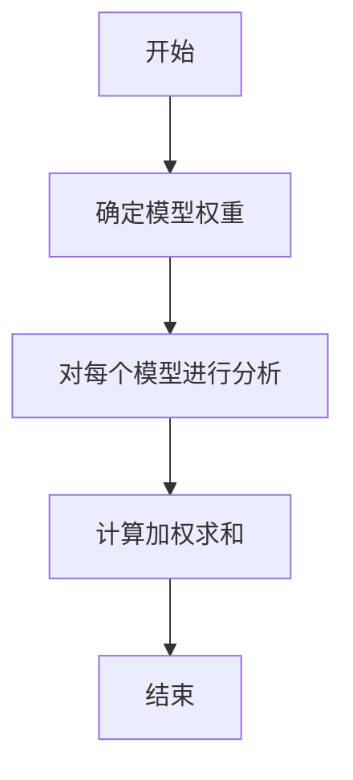
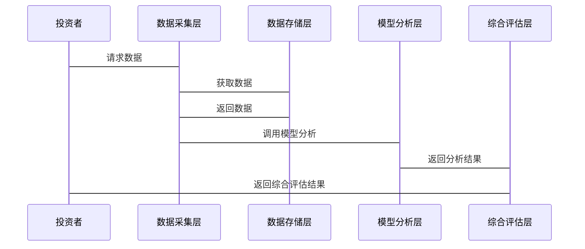

                 


# 查理芒格的多元思维模型：价值投资的跨学科应用

> 关键词：多元思维模型，价值投资，跨学科应用，查理·芒格，投资决策

> 摘要：本文系统地介绍查理·芒格的多元思维模型，并探讨其在价值投资中的跨学科应用。通过分析芒格的多元思维模型的核心概念、算法原理、系统架构及项目实战，本文旨在为投资者提供一种全新的视角，帮助他们在复杂的投资环境中做出更明智的决策。

---

# 第一部分: 查理·芒格的多元思维模型概述

## 第1章: 查理·芒格与多元思维模型的背景介绍

### 1.1 查理·芒格的生平与思想起源

#### 1.1.1 查理·芒格的早年经历
查理·芒格（Charlie Munger）出生于1924年，是一位美国投资家、作家和政治家。他早年就读于哈佛大学，后转学到加州大学伯克利分校，获得经济学学士学位。芒格的职业生涯始于法律领域，但他很快转向投资领域，并在伯克希尔哈撒韦公司（Berkshire Hathaway）与沃伦·巴菲特（Warren Buffett）合作，成为该公司的重要合伙人。

#### 1.1.2 芒格投资理念的形成
芒格的投资理念深受其哲学、心理学和经济学背景的影响。他认为，投资不仅仅是对市场的分析，更是对人性的深刻理解。芒格提出的“多元思维模型”（mental models）是一种将多个学科的原理和概念整合起来，用于分析和决策的方法。

#### 1.1.3 芒格思想的核心贡献
芒格的核心思想是，投资者应该通过跨学科的学习和思考，构建一个多元化的思维框架。这种框架能够帮助投资者更好地理解市场的复杂性，并在决策时避免常见错误。

### 1.2 多元思维模型的定义与特点

#### 1.2.1 多元思维模型的定义
多元思维模型（mental models）是指将不同学科的核心原理和概念整合到一个统一的框架中，用于分析和解决问题的方法。芒格认为，投资者应该掌握多个领域的知识，并能够将这些知识结合起来，以做出更明智的决策。

#### 1.2.2 多元思维模型的核心特点
- **跨学科性**：多元思维模型整合了多个学科的核心原理，如心理学、经济学、统计学等。
- **系统性**：模型强调系统性思考，避免单一视角的局限性。
- **实用性**：模型旨在帮助投资者在实际决策中应用这些知识。

#### 1.2.3 多元思维模型与传统投资理念的区别
传统的投资理念往往侧重于单一学科（如金融学）的分析，而多元思维模型则强调跨学科的整合与应用。这种整合能够帮助投资者更全面地理解市场和企业的本质。

### 1.3 多元思维模型的跨学科应用

#### 1.3.1 经济学视角
经济学视角强调市场机制、供需关系和成本收益分析。芒格认为，投资者应该理解市场的基本运作机制，以更好地把握投资机会。

#### 1.3.2 心理学视角
心理学视角关注人类行为和决策中的认知偏差。芒格指出，投资者常常因为情绪化决策而犯错，因此需要通过心理学知识来克服这些偏差。

#### 1.3.3 统计学视角
统计学视角关注数据的分布和概率分析。芒格认为，通过统计学方法，投资者可以更准确地评估投资风险和收益。

#### 1.3.4 其他相关学科的融合
多元思维模型还包括哲学、历史学等学科的融合，这些学科提供了更广泛的视角，帮助投资者理解市场的复杂性。

---

## 第2章: 多元思维模型的核心概念与联系

### 2.1 多元思维模型的核心原理

#### 2.1.1 多元思维模型的构成要素
- **基本原理**：多元思维模型的核心是将多个学科的基本原理整合到一个框架中。
- **模型之间的关系**：模型之间通过相互关联，形成一个完整的系统。

#### 2.1.2 各个模型之间的关系
- **相互依赖性**：不同模型之间存在相互依赖的关系，例如经济学和心理学模型在分析市场行为时需要结合使用。
- **互补性**：每个模型都有其独特的优势，通过互补可以覆盖更多的分析维度。

#### 2.1.3 多元思维模型的系统性特征
- **整体性**：模型强调系统性思考，而非单一视角的分析。
- **动态性**：模型能够适应市场环境的变化，提供灵活的分析框架。

### 2.2 核心概念对比与联系

#### 2.2.1 各个模型的属性特征对比表

| 模型         | 核心原理                     | 应用领域                     |
|--------------|------------------------------|------------------------------|
| 经济学模型    | 供需关系、成本收益分析       | 市场分析、企业估值           |
| 心理学模型    | 认知偏差、行为决策            | 投资者行为分析               |
| 统计学模型    | 数据分布、概率分析           | 风险评估、收益预测           |

#### 2.2.2 ER实体关系图架构

```mermaid
erDiagram
    actor 投资者 {
        string 账户
        string 投资标的
        string 时间
    }
    actor 市场 {
        string 标的资产
        string 价格
        string 时间
    }
    actor 模型 {
        string 原理
        string 应用领域
        string 关系
    }
    投资者 --> 市场 : 交易
    市场 --> 模型 : 分析
    投资者 --> 模型 : 应用
```

### 2.3 多元思维模型的数学模型与公式

#### 2.3.1 基本公式推导
多元思维模型可以通过以下公式进行简化表示：

$$
\text{投资收益} = \sum_{i=1}^{n} (\text{模型}_i \times \text{权重}_i)
$$

其中，$\text{模型}_i$ 表示第 $i$ 个模型的分析结果，$\text{权重}_i$ 表示该模型在整体分析中的权重。

#### 2.3.2 公式应用实例
假设我们有三个模型：经济学模型（权重 0.4）、心理学模型（权重 0.3）和统计学模型（权重 0.3）。根据公式，投资收益可以表示为：

$$
\text{投资收益} = 0.4 \times \text{经济学模型} + 0.3 \times \text{心理学模型} + 0.3 \times \text{统计学模型}
$$

---

## 第3章: 多元思维模型的算法原理讲解

### 3.1 算法原理概述

#### 3.1.1 算法的基本思路
多元思维模型的算法思路是将多个学科的模型结合起来，通过加权平均的方式，对投资标的进行综合评估。

#### 3.1.2 算法的核心步骤
1. 确定各个模型的权重。
2. 对每个模型进行独立分析。
3. 将各个模型的分析结果加权求和，得到最终的评估结果。

### 3.2 算法流程图



### 3.3 算法的数学模型与公式

#### 3.3.1 数学模型的构建
$$
\text{综合评估} = \sum_{i=1}^{n} (\text{权重}_i \times \text{模型}_i)
$$

#### 3.3.2 公式的详细推导
以两个模型为例，假设模型 A 的权重为 0.6，模型 B 的权重为 0.4。则综合评估公式为：

$$
\text{综合评估} = 0.6 \times \text{模型 A} + 0.4 \times \text{模型 B}
$$

---

## 第4章: 系统分析与架构设计方案

### 4.1 问题场景介绍

#### 4.1.1 投资决策中的问题分析
投资者在面对复杂的市场环境时，常常因为单一视角的局限性而做出错误决策。

#### 4.1.2 系统需要解决的核心问题
如何通过多元思维模型，整合多个学科的知识，帮助投资者做出更明智的决策。

#### 4.1.3 系统的目标与范围
本系统的目标是通过整合多个学科的模型，构建一个多元化的投资分析框架，帮助投资者进行更全面的投资分析。

### 4.2 系统功能设计

#### 4.2.1 领域模型设计（用 mermaid 类图表示）


#### 4.2.2 系统功能模块划分
- 数据采集模块：收集市场数据和投资者行为数据。
- 模型分析模块：对各个模型进行独立分析。
- 综合评估模块：对各个模型的分析结果进行加权求和，得到最终的评估结果。

### 4.3 系统架构设计

#### 4.3.1 系统架构设计（用 mermaid 架构图表示）

```mermaid
archi
    一个投资者 --> 应用层 : 使用系统
    应用层 --> 数据采集层 : 获取数据
    数据采集层 --> 数据存储层 : 存储数据
    数据存储层 --> 模型分析层 : 分析数据
    模型分析层 --> 综合评估层 : 计算结果
    综合评估层 --> 应用层 : 返回结果
```

### 4.4 系统接口设计

#### 4.4.1 系统接口的定义
- 数据接口：用于获取市场数据和投资者行为数据。
- 模型接口：用于调用各个模型的分析结果。

#### 4.4.2 接口之间的交互关系
- 数据接口与模型接口之间的交互：数据接口提供数据，模型接口进行分析。
- 模型接口与综合评估接口之间的交互：模型接口返回分析结果，综合评估接口进行加权求和。

### 4.5 系统交互设计

#### 4.5.1 系统交互流程图（用 mermaid 序列图表示）



---

## 第5章: 项目实战

### 5.1 环境安装

#### 5.1.1 安装必要的工具
- Python：用于代码实现。
- Mermaid：用于绘制图表。

#### 5.1.2 安装步骤
1. 安装 Python：可以从官方网站下载并安装。
2. 安装 Mermaid：可以使用在线工具或本地安装。

### 5.2 系统核心实现源代码

#### 5.2.1 数据采集模块

```python
import pandas as pd

def get_data():
    # 示例数据：获取市场数据
    data = pd.DataFrame({
        '日期': ['2023-01-01', '2023-01-02', '2023-01-03'],
        '价格': [100, 102, 101]
    })
    return data
```

#### 5.2.2 模型分析模块

```python
def model_analysis(data):
    # 示例分析：计算平均价格
    average_price = data['价格'].mean()
    return average_price
```

#### 5.2.3 综合评估模块

```python
def comprehensive_assessment(data, model_results):
    # 示例评估：计算加权平均
    weights = {'模型1': 0.6, '模型2': 0.4}
    total = 0
    for i in range(len(model_results)):
        total += weights[f'模型{i+1}'] * model_results[i]
    return total
```

### 5.3 代码应用解读与分析

#### 5.3.1 数据采集模块解读
数据采集模块负责从市场中获取相关的数据，如股票价格、市场指数等。这些数据将被用于后续的模型分析。

#### 5.3.2 模型分析模块解读
模型分析模块对各个模型进行独立分析。例如，经济学模型可以分析市场的供需关系，心理学模型可以分析投资者的行为偏差。

#### 5.3.3 综合评估模块解读
综合评估模块将各个模型的分析结果进行加权求和，得到最终的综合评估结果。这个过程可以更好地反映市场的复杂性。

### 5.4 实际案例分析

#### 5.4.1 案例介绍
以苹果公司为例，我们可以通过多元思维模型进行投资分析。

#### 5.4.2 分析步骤
1. 数据采集：获取苹果公司的市场数据。
2. 模型分析：分别应用经济学模型、心理学模型和统计学模型进行分析。
3. 综合评估：对各个模型的分析结果进行加权求和，得到最终的评估结果。

#### 5.4.3 分析结果解读
通过多元思维模型，我们能够更全面地分析苹果公司的投资价值，并做出更明智的投资决策。

---

## 第6章: 总结与注意事项

### 6.1 总结

#### 6.1.1 多元思维模型的核心价值
多元思维模型通过整合多个学科的知识，帮助投资者更全面地理解市场和企业，从而做出更明智的决策。

#### 6.1.2 投资中的注意事项
投资者在实际操作中需要注意以下几点：
- 理解各个模型的局限性。
- 灵活调整模型的权重。
- 定期更新和优化模型。

### 6.2 小结

#### 6.2.1 最佳实践 tips
- 多元思维模型是一种工具，而不是万能公式。
- 投资者需要根据实际情况灵活应用模型。

#### 6.2.2 投资中的注意事项
- 避免过度依赖单一模型。
- 定期回顾和优化投资策略。

### 6.3 拓展阅读

#### 6.3.1 推荐书籍
- 《查理·芒格的决策艺术》
- 《投资学原理》

#### 6.3.2 推荐文章
- 多元思维模型在风险管理中的应用
- 多元思维模型与长期投资策略

---

# 作者：AI天才研究院/AI Genius Institute & 禅与计算机程序设计艺术 /Zen And The Art of Computer Programming

