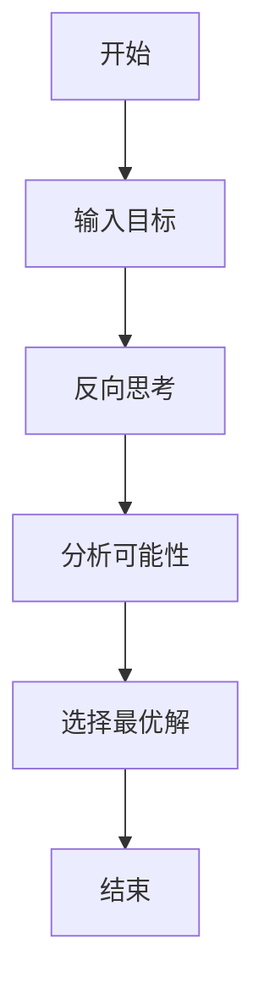
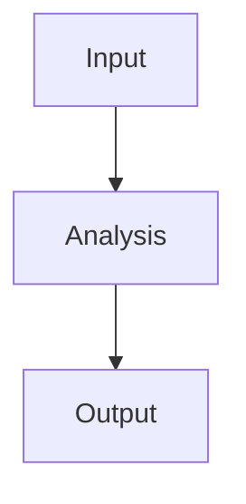
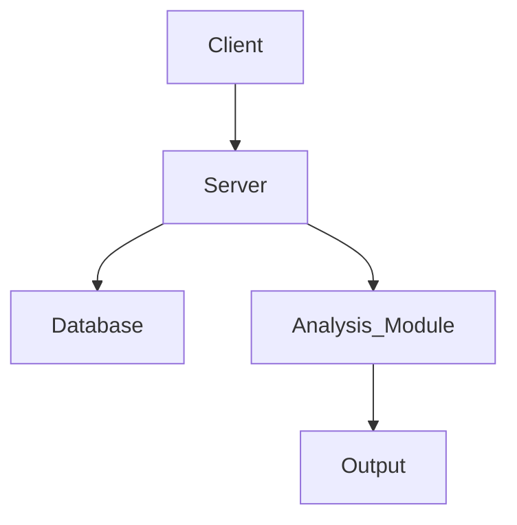
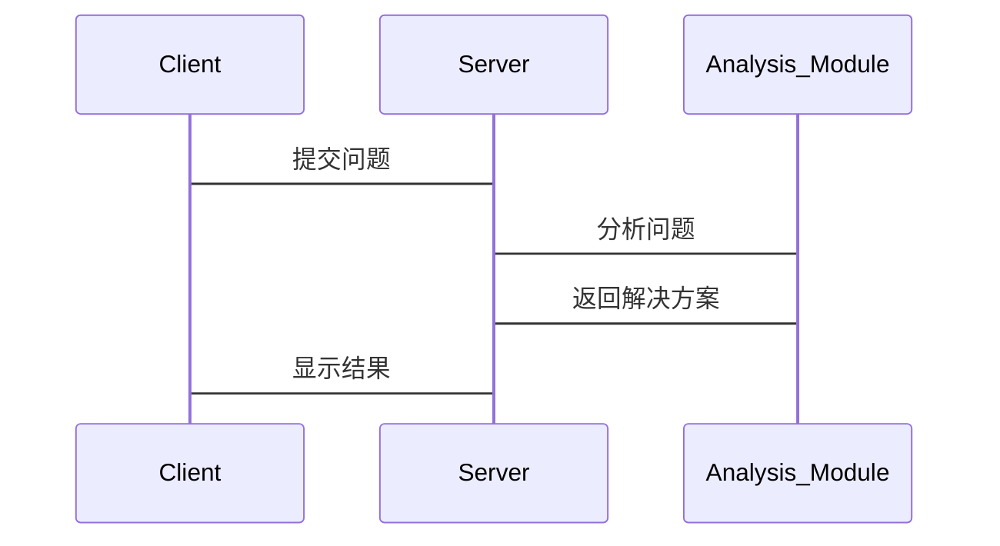

                 


# 查理芒格的逆向思维应用

> 关键词：逆向思维, 投资决策, 系统设计, 风险管理, 算法模型, 项目管理

> 摘要：本文探讨查理芒格的逆向思维在技术领域的应用，从投资决策到系统设计，分析其优缺点，并通过数学模型、算法实现和项目实战来展示逆向思维的实际价值。

---

## # 第1章: 逆向思维的哲学基础

### ## 1.1 逆向思维的定义与本质

#### ### 1.1.1 逆向思维的定义
逆向思维是指通过反向思考问题，寻找解决方案的方法。与正向思维不同，逆向思维从结果出发，推导原因，常用于创新和问题解决。

#### ### 1.1.2 逆向思维的本质特征
- **反向推理**：从结果推导原因。
- **创新性**：打破常规思维，寻找独特解决方案。
- **实用性**：在决策中避免常见错误。

#### ### 1.1.3 逆向思维与正向思维的区别
| 特性 | 正向思维 | 逆向思维 |
|------|----------|----------|
| 思维方向 | 从原因到结果 | 从结果到原因 |
| 创新性 | 较低 | 较高 |
| 应用场景 | 日常问题 | 复杂决策 |

### ## 1.2 逆向思维的哲学基础

#### ### 1.2.1 反向思维在哲学中的体现
- **辩证法**：矛盾的对立面分析。
- **怀疑论**：质疑现有假设，寻找真相。

#### ### 1.2.2 逆向思维与辩证法的关系
逆向思维通过分析矛盾的对立面，帮助识别问题的潜在风险和机会。

#### ### 1.2.3 逆向思维在决策中的作用
逆向思维帮助决策者预见问题，制定应对策略，避免错误。

---

## # 第2章: 逆向思维的应用场景

### ## 2.1 投资与风险管理中的逆向思维

#### ### 2.1.1 逆向思维在投资决策中的应用
- **市场分析**：从市场低迷寻找投资机会。
- **价值评估**：寻找被低估的资产。

#### ### 2.1.2 风险管理中的逆向思维策略
- **风险识别**：从最坏情况出发，评估潜在风险。
- **风险缓解**：制定应对措施，降低风险影响。

#### ### 2.1.3 逆向思维与价值投资的结合
芒格通过逆向思维寻找低估的公司，长期投资，实现收益。

### ## 2.2 管理与决策中的逆向思维

#### ### 2.2.1 逆向思维在企业管理中的应用
- **战略制定**：从目标反推策略。
- **问题解决**：从结果反推原因，制定解决方案。

#### ### 2.2.2 逆向思维在领导决策中的作用
- **决策优化**：通过逆向思维识别潜在问题，优化决策。
- **团队管理**：识别团队问题，制定改进措施。

#### ### 2.2.3 逆向思维与组织文化的建设
- **文化塑造**：鼓励员工采用逆向思维，培养创新文化。

---

## # 第3章: 逆向思维的优缺点分析

### ## 3.1 逆向思维的优点

#### ### 3.1.1 逆向思维的独特视角
- **创新**：提供新的解决方案。
- **效率**：快速识别问题根源。

#### ### 3.1.2 逆向思维在创新中的优势
- **突破常规**：激发创新思维。
- **竞争优势**：在竞争中脱颖而出。

#### ### 3.1.3 逆向思维在问题解决中的高效性
- **精准定位**：快速找到问题根源。
- **节省时间**：减少试错成本。

### ## 3.2 逆向思维的缺点

#### ### 3.2.1 逆向思维的局限性
- **复杂性**：处理复杂问题时可能不够直观。
- **信息不足**：依赖现有信息，可能受限。

#### ### 3.2.2 逆向思维可能带来的风险
- **过度分析**：可能导致决策延迟。
- **误判风险**：忽视某些关键因素，导致错误决策。

#### ### 3.2.3 逆向思维与实际操作的冲突
- **现实限制**：理论与实际可能不符。
- **团队协作**：逆向思维可能影响团队合作。

---

## # 第4章: 逆向思维的数学模型与算法原理

### ## 4.1 逆向思维的数学模型

#### ### 4.1.1 逆向思维的决策树模型
- **决策树结构**：从结果反推决策点。
- **概率计算**：评估每个决策的概率和结果。

#### ### 4.1.2 逆向思维的概率论分析
- **贝叶斯定理**：用于更新概率，基于新的信息调整决策。
- **马尔可夫链**：分析状态转移，评估风险。

#### ### 4.1.3 逆向思维的博弈论模型
- **纳什均衡**：分析逆向思维在博弈中的应用，寻找最优策略。

### ## 4.2 逆向思维的算法实现

#### ### 4.2.1 逆向思维的算法流程图


#### ### 4.2.2 逆向思维的代码实现
```python
def reverse_thinking(target):
    # 反向思考过程
    possibilities = []
    for i in range(len(target)):
        possibilities.append(target[i])
    # 分析可能性，选择最优解
    optimal = max(possibilities)
    return optimal
```

#### ### 4.2.3 逆向思维的数学公式推导
逆向思维中的概率计算公式：
$$ P(A|B) = \frac{P(B|A)P(A)}{P(B)} $$
其中，$P(A|B)$ 是在B条件下A的概率，用于更新决策。

---

## # 第5章: 逆向思维的系统分析与架构设计

### ## 5.1 逆向思维的系统功能设计

#### ### 5.1.1 逆向思维的系统目标
- **目标**：通过逆向思维分析问题，提供解决方案。
- **功能模块**：问题输入、反向分析、结果输出。

#### ### 5.1.2 逆向思维的功能模块划分
| 模块 | 功能 |
|------|------|
| 输入模块 | 接收问题输入 |
| 分析模块 | 反向思考，生成解决方案 |
| 输出模块 | 显示结果 |

#### ### 5.1.3 逆向思维的系统流程图


### ## 5.2 逆向思维的系统架构设计

#### ### 5.2.1 逆向思维的系统架构图


#### ### 5.2.2 逆向思维的系统接口设计
- **输入接口**：接收问题描述。
- **输出接口**：返回解决方案。

#### ### 5.2.3 逆向思维的系统交互设计


---

## # 第6章: 逆向思维的项目实战

### ## 6.1 项目环境安装与配置

#### ### 6.1.1 项目开发环境
- **语言**：Python 3.8+
- **框架**：Django 2.2+

#### ### 6.1.2 项目依赖库
```bash
pip install django
pip install mermaid
```

### ## 6.2 系统核心实现源代码

#### ### 6.2.1 核心代码实现
```python
class ReverseThinking:
    def __init__(self, target):
        self.target = target

    def analyze(self):
        possibilities = self.reverse(self.target)
        return possibilities

    def reverse(self, input):
        # 反向思考逻辑
        return [input[i] for i in range(len(input))]
```

#### ### 6.2.2 代码应用解读与分析
- **初始化**：接收目标问题。
- **分析**：调用reverse方法，生成可能性列表。
- **返回**：最优解决方案。

### ## 6.3 实际案例分析

#### ### 6.3.1 案例分析
- **问题**：优化系统性能。
- **反向思考**：从性能指标出发，分析可能的原因，如代码效率、数据库查询等。
- **解决方案**：优化关键路径，减少资源消耗。

#### ### 6.3.2 详细讲解剖析
- **步骤1**：识别系统瓶颈。
- **步骤2**：反向分析问题根源。
- **步骤3**：实施优化措施。
- **步骤4**：验证优化效果。

### ## 6.4 项目小结

#### ### 6.4.1 成果总结
- **成功实现**：系统性能提升。
- **经验总结**：逆向思维在问题解决中的有效性。

#### ### 6.4.2 展望未来
- **进一步应用**：探索更多逆向思维的应用场景。
- **持续优化**：改进系统，提升效率。

---

## # 第7章: 总结与展望

### ## 7.1 总结
查理芒格的逆向思维在技术领域具有重要应用价值，从投资到系统设计，帮助我们避免常见错误，优化决策。

### ## 7.2 展望
未来，逆向思维将继续在技术领域发挥重要作用，结合AI和大数据，推动决策优化和创新。

---

## # 参考文献
1. 查理·芒格《Poor Charlie's Almanack》
2. 投资与决策相关文献
3. 技术系统设计经典书籍

---

作者：AI天才研究院 & 禅与计算机程序设计艺术

