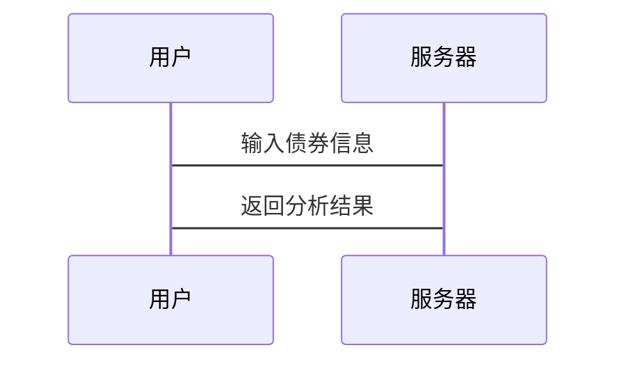

                 


# 格雷厄姆·多德的固定收益证券分析方法

> 关键词：固定收益证券，价值投资，内在价值，安全边际，多德分析方法，风险管理，投资策略

> 摘要：本文深入探讨了格雷厄姆·多德的固定收益证券分析方法，从其投资理念的核心思想、分析方法的数学模型，到实际应用中的系统架构设计和风险管理策略，全面解析了这一经典方法的现代意义。文章不仅介绍了多德分析方法的基本原理和核心要素，还结合实际案例，详细讲解了如何通过安全边际和内在价值评估来优化投资决策，为读者提供了从理论到实践的完整指南。

---

# 第1章：格雷厄姆·多德投资理念概述

## 1.1 格雷厄姆·多德的生平与投资思想

### 1.1.1 格雷厄姆·多德的生平简介

格雷厄姆·多德（Benjamin Graham）是20世纪最具影响力的投资者之一，被誉为“价值投资之父”。他于1894年出生于纽约，早年在哥伦比亚大学学习法律，后转向金融领域。多德的职业生涯始于1920年代，他通过研究市场波动和公司基本面，逐步形成了自己的投资理论。1949年，他与戴维·多德（David Dodd）合著的《证券分析》一书奠定了现代价值投资的基础。

### 1.1.2 多德投资理念的核心思想

多德的投资理念以“安全边际”为核心，强调以低于内在价值的价格买入优质资产。他认为，市场的波动性使得价格经常偏离其实际价值，投资者应利用这种偏差，寻找那些被市场低估的证券。多德的投资哲学注重长期稳健，而非短期收益，他主张分散投资以降低风险。

### 1.1.3 多德与价值投资的关联

多德是价值投资的鼻祖，他的方法影响了后来的投资者，如沃伦·巴菲特和彼得·林奇。多德的价值投资理念强调深入分析公司的财务状况，关注企业的盈利能力、资产质量和管理团队，而非市场的短期波动。这种方法在固定收益证券分析中尤为重要，因为债券的价格波动通常与企业的信用状况密切相关。

## 1.2 固定收益证券的基本概念

### 1.2.1 固定收益证券的定义与分类

固定收益证券是指那些具有固定到期日和固定利率的金融工具，主要包括债券、优先股和抵押贷款等。债券是最常见的固定收益证券，通常分为政府债券和企业债券。政府债券由政府发行，信用风险较低；企业债券由企业发行，信用风险较高。

### 1.2.2 固定收益证券的主要类型

1. **政府债券**：由政府发行，信用风险最低，收益相对稳定。
2. **企业债券**：由企业发行，收益较高，但信用风险也较高。
3. **优先股**：一种混合型证券，既有债券的固定收益，又有股票的部分权益特征。
4. **抵押贷款**：以房地产抵押为基础的债券，通常用于住房或商业贷款。

### 1.2.3 固定收益证券的风险与收益特征

固定收益证券的风险主要体现在信用风险和利率风险上。信用风险是指债券发行人可能无法按时支付利息或本金的风险；利率风险是指利率变化导致债券价格波动的风险。固定收益证券的收益相对稳定，但其价格波动可能较大，尤其是在市场利率变化时。

---

# 第2章：多德固定收益证券分析方法的核心概念

## 2.1 多德分析方法的基本原理

### 2.1.1 安全边际的概念与作用

安全边际是多德分析方法的核心概念，它是指债券的市场价格与其内在价值之间的差距。多德认为，投资者应以低于内在价值的价格买入债券，以确保即使市场价格波动，也能获得超额收益。安全边际的计算公式为：

$$ \text{安全边际} = \text{内在价值} - \text{市场价格} $$

### 2.1.2 内在价值的计算方法

内在价值是债券在合理市场条件下应有的价格，通常通过现金流折现法计算。对于零息债券，其内在价值为：

$$ V = \frac{F}{(1 + r)^n} $$

其中，\( F \) 是债券的面值，\( r \) 是市场利率，\( n \) 是债券的剩余期限。

对于息票债券，其内在价值为：

$$ V = \sum_{t=1}^{n} \frac{C}{(1 + r)^t} + \frac{F}{(1 + r)^n} $$

其中，\( C \) 是债券的年利息，\( F \) 是面值，\( r \) 是市场利率，\( n \) 是债券的剩余期限。

### 2.1.3 市场价格与内在价值的关系

市场价格围绕内在价值波动，但受市场情绪和市场参与者行为的影响。多德认为，市场价格与内在价值的偏离为投资者提供了套利机会。通过分析市场价格与内在价值的差异，投资者可以找到被低估的债券。

---

## 2.2 多德分析方法的核心要素

### 2.2.1 财务报表分析的重要性

多德分析方法强调对债券发行企业的财务状况进行深入分析，重点关注企业的盈利能力、资产质量和偿债能力。通过分析财务报表，投资者可以评估企业的信用状况，从而确定债券的内在价值。

### 2.2.2 偿债能力与盈利能力的评估

偿债能力是评估企业信用状况的重要指标，主要包括流动比率、速动比率和债务权益比。盈利能力则通过净利润率、息税前利润（EBIT）等指标衡量。多德认为，企业应具备较强的盈利能力，以确保其能够按时支付债券利息和本金。

### 2.2.3 资产质量与管理能力的考量

资产质量是指企业资产的流动性、变现能力和质量。管理能力则反映了企业在市场竞争中的地位和管理团队的效率。多德认为，优质资产和高效的管理团队是企业长期稳健发展的基础。

---

## 2.3 多德分析方法与现代金融分析的对比

### 2.3.1 多德方法与现代金融模型的异同

多德方法注重基本面分析，强调安全边际和内在价值，而现代金融模型（如CAPM和APT）更注重市场整体风险和资产定价。多德方法适用于个体债券分析，而现代模型适用于资产组合配置。

### 2.3.2 多德方法在固定收益分析中的独特性

多德方法的独特性在于其对安全边际的重视和对个体债券的深入分析。这种方法特别适用于信用风险较高的债券，如高收益债券和垃圾债券。

### 2.3.3 多德方法的局限性与改进方向

多德方法的局限性在于其对市场整体波动的忽视，以及对个体债券分析的复杂性。未来的研究可以结合多德方法与现代金融模型，探索其在资产组合管理和风险管理中的应用。

---

# 第3章：多德分析方法的数学模型与公式

## 3.1 内在价值计算的数学模型

### 3.1.1 现金流折现法的公式推导

现金流折现法是计算债券内在价值的核心方法。对于零息债券，其内在价值公式为：

$$ V = \frac{F}{(1 + r)^n} $$

对于息票债券，其内在价值公式为：

$$ V = \sum_{t=1}^{n} \frac{C}{(1 + r)^t} + \frac{F}{(1 + r)^n} $$

其中，\( C \) 是债券的年利息，\( F \) 是面值，\( r \) 是市场利率，\( n \) 是债券的剩余期限。

### 3.1.2 债券定价的公式分析

债券的市场价格 \( P \) 可以通过以下公式计算：

$$ P = \sum_{t=1}^{n} \frac{C}{(1 + r)^t} + \frac{F}{(1 + r)^n} $$

其中，\( C \) 是债券的年利息，\( F \) 是面值，\( r \) 是市场利率，\( n \) 是债券的剩余期限。

---

## 3.2 安全边际的量化评估

### 3.2.1 安全边际的计算公式

安全边际的计算公式为：

$$ \text{安全边际} = \text{内在价值} - \text{市场价格} $$

如果安全边际为正，说明债券被低估，具有投资价值；如果安全边际为负，说明债券被高估，应避免投资。

---

## 3.3 多德分析方法的数学模型与公式总结

通过上述公式，我们可以看出，多德分析方法的核心在于通过内在价值计算和安全边际评估，找到被低估的债券。这种方法不仅适用于个体债券分析，还可以扩展到资产组合管理和风险管理中。

---

# 第4章：多德分析方法的系统分析与架构设计

## 4.1 问题场景介绍

在固定收益证券分析中，投资者需要对债券的内在价值和市场价格进行深入分析，以识别被低估的债券。多德分析方法提供了一套系统化的分析框架，包括财务报表分析、信用评级和安全边际评估。

## 4.2 系统功能设计

### 4.2.1 领域模型

以下是多德分析方法的领域模型：


### 4.2.2 系统架构设计

以下是多德分析方法的系统架构设计：

```mermaid
client
server
    class 客户端 {
        输入债券信息
        请求分析结果
    }
    class 服务器 {
        接收债券信息
        执行内在价值计算
        计算安全边际
        返回分析结果
    }
    客户端 --> 服务器
    服务器 --> 客户端
```

---

## 4.3 系统接口设计

系统接口设计包括以下步骤：

1. **输入债券信息**：用户输入债券的面值、剩余期限、年利息等信息。
2. **执行内在价值计算**：服务器根据输入信息，计算债券的内在价值。
3. **计算安全边际**：服务器根据内在价值和市场价格，计算安全边际。
4. **返回分析结果**：服务器将分析结果返回给用户。

---

## 4.4 系统交互设计

以下是系统交互设计的流程图：



---

# 第5章：多德分析方法的项目实战

## 5.1 环境安装

为了实现多德分析方法，我们需要以下工具和环境：

1. **Python编程环境**：用于编写和运行代码。
2. **Jupyter Notebook**：用于数据可视化和分析。
3. **Pandas库**：用于数据处理和分析。
4. **Matplotlib库**：用于数据可视化。

---

## 5.2 核心实现源代码

以下是多德分析方法的核心实现源代码：

```python
import pandas as pd
import numpy as np

def calculate_intrinsic_value(face_value, rate, years):
    return face_value / (1 + rate) ** years

def calculate_market_price(face_value, rate, years):
    return face_value / (1 + rate) ** years

def calculate_margin_of_safety(intrinsic_value, market_price):
    return intrinsic_value - market_price

# 示例数据
face_value = 1000
rate = 0.05
years = 10

intrinsic_value = calculate_intrinsic_value(face_value, rate, years)
market_price = calculate_market_price(face_value, rate, years)
margin_of_safety = calculate_margin_of_safety(intrinsic_value, market_price)

print(f"内在价值: {intrinsic_value}")
print(f"市场价格: {market_price}")
print(f"安全边际: {margin_of_safety}")
```

---

## 5.3 代码应用解读与分析

通过上述代码，我们可以计算出债券的内在价值、市场价格和安全边际。如果安全边际为正，说明债券被低估，具有投资价值；如果安全边际为负，说明债券被高估，应避免投资。

---

## 5.4 实际案例分析

假设我们有以下债券信息：

- 面值：$1000
- 利率：5%
- 剩余期限：10年
- 市场价格：$900

计算内在价值：

$$ V = \frac{1000}{(1 + 0.05)^{10}} \approx 632.09 $$

计算安全边际：

$$ \text{安全边际} = 632.09 - 900 = -267.91 $$

由于安全边际为负，说明该债券被高估，不值得投资。

---

## 5.5 项目小结

通过本节的实战分析，我们可以看到多德分析方法在固定收益证券分析中的实际应用。通过计算内在价值和安全边际，投资者可以识别被低估的债券，从而制定合理的投资策略。

---

# 第6章：多德分析方法的风险管理与投资策略

## 6.1 多德分析方法的风险管理

### 6.1.1 风险评估

多德分析方法强调对债券的信用风险和利率风险进行评估。信用风险可以通过债券的信用评级来衡量，利率风险则通过债券的久期来衡量。

### 6.1.2 风险分散

多德认为，通过分散投资可以降低风险。投资者应将资金分配到不同行业和不同信用等级的债券中，以降低整体风险。

## 6.2 多德分析方法的投资策略

### 6.2.1 防御性投资

防御性投资是指投资于那些具有较高信用评级和较低市场风险的债券。这种方法适合风险厌恶型投资者。

### 6.2.2 集中投资

集中投资是指将资金集中投资于少数优质债券。这种方法适合对市场有深入了解的投资者。

---

## 6.3 多德分析方法的注意事项

### 6.3.1 定期复盘

投资者应定期复盘投资组合的表现，评估多德分析方法的有效性。

### 6.3.2 保持灵活性

市场环境不断变化，投资者应根据市场变化调整投资策略。

### 6.3.3 注意成本

投资者应关注交易成本和管理费用，以确保投资收益。

---

## 6.4 多德分析方法的拓展阅读

### 6.4.1 《证券分析》

《证券分析》是多德与戴维·多德合著的经典著作，系统介绍了多德分析方法的理论和实践。

### 6.4.2 现代投资组合理论

现代投资组合理论（MPT）是马克owitz提出的一种资产配置方法，可以与多德分析方法结合使用。

---

# 第7章：总结与展望

## 7.1 多德分析方法的现代应用

多德分析方法在现代固定收益证券分析中仍具有重要地位。随着金融市场的发展，多德方法在资产组合管理和风险管理中的应用越来越广泛。

## 7.2 未来研究方向

未来的研究可以探索多德分析方法与机器学习的结合，利用大数据技术提高分析效率和准确性。

---

# 作者：AI天才研究院/AI Genius Institute & 禅与计算机程序设计艺术 /Zen And The Art of Computer Programming

---

通过本文的深入分析，我们可以看到格雷厄姆·多德的固定收益证券分析方法在现代投资中的重要性。尽管市场环境不断变化，多德方法的核心理念依然适用，为投资者提供了可靠的分析框架。未来，随着技术的进步，多德方法将与更多现代工具结合，为固定收益证券分析提供更强大的支持。

