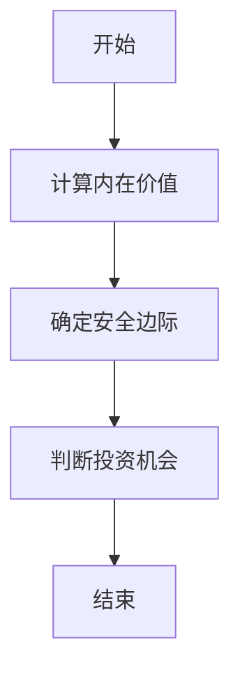
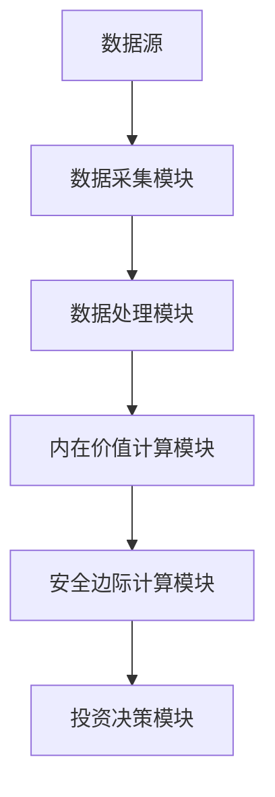

                 


# 《格雷厄姆多德的安全性分析在现代市场的应用》

**关键词**：格雷厄姆多德，安全性分析，内在价值，安全边际，现代市场，投资策略，技术分析

**摘要**：本文详细探讨了格雷厄姆和多德提出的安全性分析方法在现代市场中的应用。通过对安全边际、内在价值等核心概念的重新审视，结合现代市场的特点，分析了传统安全性分析在技术进步、市场波动性增加等背景下的演变与创新。文章结合数学模型、系统架构设计和实际案例，展示了如何将格雷厄姆多德的投资理念与现代投资工具、方法相结合，为投资者提供更有效的决策支持。

---

## 第1章: 格雷厄姆多德的安全性分析基础

### 1.1 安全性分析的核心概念

#### 1.1.1 格雷厄姆与多德的投资理念
格雷厄姆和多德的安全性分析方法是价值投资的基石。他们认为，市场的波动性为投资者提供了以低于内在价值的价格买入优质资产的机会。通过计算安全边际，投资者可以在市场恐慌时找到低估的资产，并在市场繁荣时避免过度支付。

#### 1.1.2 安全性分析的基本定义
安全性分析的核心在于识别资产的内在价值，并与市场价格进行对比。当市场价格低于内在价值时，资产被认为具有“安全边际”，即投资的安全空间。

#### 1.1.3 安全性分析的哲学基础
格雷厄姆和多德强调，市场情绪是不可预测的，但内在价值是可以通过基本面分析确定的。投资者应关注企业的长期价值，而非市场的短期波动。

---

### 1.2 安全性分析的核心要素

#### 1.2.1 安全边际的计算方法
安全边际 = 内在价值 - 市场价格  
$$ Safety\ Margin = Intrinsic\ Value - Market\ Price $$

#### 1.2.2 市场先生的理论
市场先生是格雷厄姆提出的一个比喻，用来描述市场的波动性。投资者应避免被市场先生的情绪左右，而是专注于寻找低估的资产。

#### 1.2.3 内在价值的计算
内在价值是企业未来现金流的现值。通过对企业财务状况、盈利能力、行业地位等因素的分析，可以估算出企业的内在价值。

---

## 第2章: 格雷厄姆多德安全性分析的数学模型

### 2.1 安全边际的计算公式

#### 2.1.1 内在价值的计算公式
$$ V = \frac{E}{k} $$  
其中，\( E \) 是企业的预期收益，\( k \) 是资本成本。

#### 2.1.2 安全边际的计算公式
$$ Margin\ of\ Safety = V - P $$  
其中，\( V \) 是内在价值，\( P \) 是市场价格。

#### 2.1.3 示例计算
假设某企业的预期收益 \( E = 100 \)，资本成本 \( k = 10\% \)，市场价格 \( P = 80 \)。  
则内在价值 \( V = \frac{100}{0.1} = 1000 \)，安全边际 \( = 1000 - 80 = 920 \)。

---

### 2.2 安全性分析的算法流程



---

## 第3章: 现代市场环境下的安全性分析

### 3.1 现代市场与传统市场的区别

#### 3.1.1 现代市场的特点
- 信息传播速度更快，市场波动性更大。
- 技术进步使得数据分析更加高效。
- 市场参与者更加多元化，包括机构投资者和个人投资者。

#### 3.1.2 传统市场的特点
- 信息传播较慢，市场波动性较小。
- 投资者主要以个人为主，机构投资者较少。

#### 3.1.3 两者的主要区别
- 技术进步改变了市场环境。
- 信息不对称的减少使得安全性分析更加复杂。

---

### 3.2 现代市场中的安全性分析应用

#### 3.2.1 技术分析与基本面分析的结合
技术分析可以帮助投资者预测市场的短期趋势，而基本面分析则可以帮助投资者确定资产的内在价值。

#### 3.2.2 安全边际的动态调整
在现代市场中，安全边际需要根据市场的变化进行动态调整，以应对市场的波动性。

#### 3.2.3 风险管理的现代方法
通过引入风险管理工具（如期权、期货等），投资者可以在现代市场中更好地控制风险。

---

## 第4章: 安全性分析的系统架构设计

### 4.1 系统功能设计

#### 4.1.1 数据采集模块
- 数据来源：股票价格、财务报表、行业数据等。
- 数据清洗：去除异常值，填补缺失值。

#### 4.1.2 内在价值计算模块
- 输入：企业的预期收益和资本成本。
- 输出：企业的内在价值。

#### 4.1.3 安全边际计算模块
- 输入：内在价值和市场价格。
- 输出：安全边际。

#### 4.1.4 投资决策模块
- 输入：安全边际和投资目标。
- 输出：投资建议。

---

### 4.2 系统架构图



---

## 第5章: 安全性分析的项目实战

### 5.1 环境安装与数据准备

#### 5.1.1 安装Python环境
- 使用Anaconda安装Python 3.8或更高版本。

#### 5.1.2 数据源获取
- 从Yahoo Finance获取股票数据。
- 从公司财报中获取财务数据。

#### 5.1.3 数据清洗与预处理
- 去除缺失值。
- 标准化数据格式。

---

### 5.2 核心代码实现

#### 5.2.1 数据采集代码

```python
import pandas as pd
import yfinance as yf

# 下载股票数据
stock = yf.download("AAPL", start="2020-01-01", end="2023-12-31")
stock.head()
```

#### 5.2.2 内在价值计算代码

```python
def calculate_intrinsic_value(enterprise_value, net_income):
    return enterprise_value / net_income
```

#### 5.2.3 安全边际计算代码

```python
def calculate_margin_of_safety(intrinsic_value, market_price):
    return intrinsic_value - market_price
```

---

## 第6章: 总结与展望

### 6.1 总结
格雷厄姆多德的安全性分析方法在现代市场中仍然具有重要的应用价值。通过结合技术分析和基本面分析，投资者可以更好地识别低估的资产，并在市场波动中保持冷静。

### 6.2 展望
随着人工智能和大数据技术的发展，安全性分析将更加精准和高效。未来的研究可以进一步探索如何利用机器学习算法优化内在价值的计算和安全边际的动态调整。

---

**作者：AI天才研究院/AI Genius Institute & 禅与计算机程序设计艺术 /Zen And The Art of Computer Programming**

