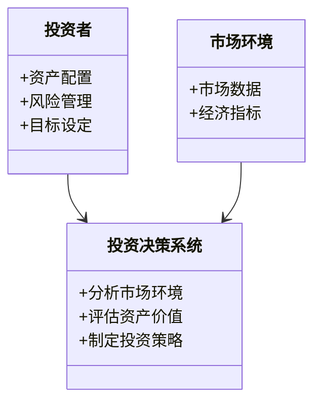
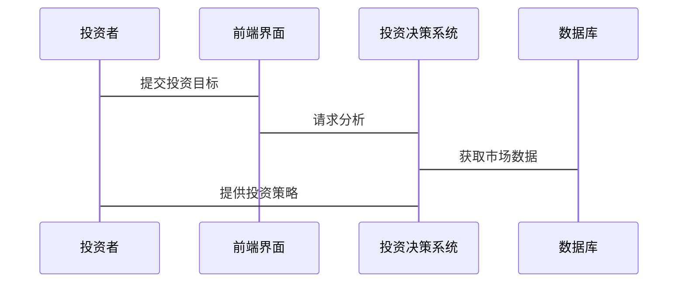

                 


# 《格雷厄姆对投机与投资的区分》

---

## 关键词：
- 格雷厄姆、投资、投机、内在价值、市场价值、风险管理、价值投资

---

## 摘要：
本文详细探讨了格雷厄姆对投机与投资的区分，分析了两者在目标、风险、收益和决策过程上的本质差异。通过理论与实践结合，介绍了投资的内在价值分析、风险管理策略以及长期投资的实践意义。文章结合数学模型、算法原理和系统架构，为读者提供了全面的理解和实用的指导。

---

## 正文

### 第一部分：投机与投资的基本概念

#### 第1章：投机与投资的定义与背景

##### 1.1 投机与投资的定义与特征
- **投机的定义与特征**  
  投机是指通过短期交易获利，依赖市场波动，风险较高，通常基于市场情绪和短期趋势。  
  - **投机的核心特征**：
    - 短期性：追求短期收益，不关注长期价值。
    - 不确定性：依赖市场波动，结果难以预测。
    - 高风险：可能在短时间内获得高收益，也可能迅速亏损。

- **投资的定义与特征**  
  投资是指通过购买资产，长期持有，追求资产增值，关注内在价值和长期回报。  
  - **投资的核心特征**：
    - 长期性：关注资产的长期价值增长。
    - 稳定性：通过分散投资降低风险，追求稳定的收益。
    - 理性分析：基于基本面分析，选择具有安全边际的资产。

- **投机与投资的区分**  
  格雷厄姆强调，投机与投资的区别在于目标和方法。投机是基于市场波动的短期行为，而投资是基于资产价值的长期行为。

##### 1.2 投机与投资的背景与历史
- **投资与投机的历史发展**  
  投资与投机在金融市场上长期共存，投机推动市场的流动性，而投资为市场提供长期资金支持。
- **格雷厄姆的学术背景与投资理念**  
  格雷厄姆是价值投资的鼻祖，他的《证券分析》奠定了现代投资理论的基础。他认为，投资应基于内在价值的分析，而非市场的短期波动。
- **投资与投机在现代金融中的地位**  
  在现代金融中，投机和投资并存，但投资更注重长期稳健的回报，而投机则更注重短期获利。

#### 第2章：投机与投资的本质差异

##### 2.1 投机与投资的目标与动机
- **投机的目标与动机**  
  投机者追求短期收益，动机是市场的短期波动，而非资产的内在价值。
- **投资的目标与动机**  
  投资者追求长期价值增长，动机是资产的内在价值和长期回报。
- **两者的目标对比**  
  投机注重短期收益，而投资注重长期价值。

##### 2.2 投机与投资的风险与收益
- **投机的风险与收益**  
  投机风险高，收益不稳定，但可能在短期内获得高回报。
- **投资的风险与收益**  
  投资风险较低，收益稳定，但需要较长的时间积累。
- **两者的风险与收益对比**  
  投机的风险高于投资，但收益的波动性也更大。

##### 2.3 投机与投资的决策过程
- **投机的决策过程**  
  投机者依赖市场情绪和短期趋势，决策快速，注重技术分析。
- **投资的决策过程**  
  投资者依赖基本面分析，决策稳健，注重资产的内在价值。
- **两者决策过程的对比**  
  投机决策快且情绪化，而投资决策慢且理性。

---

### 第二部分：投资的内在价值分析

#### 第3章：内在价值与市场价值的区分

##### 3.1 内在价值的定义与计算
- **内在价值的定义**  
  内在价值是指资产在合理市场条件下的公平价格，基于其未来现金流的现值。
- **内在价值的计算公式**  
  格雷厄姆提出，内在价值 $V$ 可以通过以下公式计算：
  $$ V = \frac{C}{r} $$
  其中，$C$ 是资产的年现金流，$r$ 是折现率。
- **内在价值的计算方法**  
  通过分析企业的盈利能力、成长性和财务状况，评估其未来现金流，并折现计算内在价值。

##### 3.2 内在价值与市场价值的对比
- **内在价值的稳定性**  
  内在价值相对稳定，不受短期市场波动影响。
- **市场价值的波动性**  
  市场价值受情绪和市场趋势影响，波动较大。
- **两者的关系**  
  市场价值围绕内在价值波动，内在价值是投资决策的核心依据。

---

### 第三部分：投资策略与风险管理

#### 第4章：价值投资的核心策略

##### 4.1 价值投资的基本原则
- **质优价廉的原则**  
  投资者应选择具有强大基本面和合理估值的资产。
- **长期持有的策略**  
  长期持有优质资产，避免频繁交易。
- **安全边际的概念**  
  安全边际是指内在价值与市场价格之间的差距，确保投资的安全性。

##### 4.2 投资组合的构建与管理
- **分散化原则**  
  通过分散投资降低风险，避免过度集中。
- **资产配置策略**  
  根据风险承受能力和收益目标，合理配置不同类型的资产。
- **定期复盘与调整**  
  定期评估投资组合的表现，根据市场变化和自身目标进行调整。

#### 第5章：风险管理与心理控制

##### 5.1 投资中的风险管理
- **风险的定义与分类**  
  投资风险包括市场风险、流动性风险和信用风险等。
- **主要风险来源**  
  市场波动、经济周期和个体资产风险。
- **风险管理的具体措施**  
  通过分散投资、设置止损和定期评估来控制风险。

##### 5.2 投资心理的自我控制
- **常见心理偏差**  
  包括过度自信、从众心理和损失厌恶等。
- **格雷厄姆的心理管理**  
  投资者应保持理性，避免情绪化决策。
- **心理控制的具体方法**  
  设定明确的投资目标，坚持长期视角，避免短期波动的影响。

---

### 第四部分：系统分析与架构设计方案

#### 第6章：投资决策的系统架构

##### 6.1 问题场景介绍
- 投资者需要在复杂市场环境中做出理性决策，需要一套系统化的分析框架。

##### 6.2 系统功能设计（领域模型）


##### 6.3 系统架构设计


##### 6.4 系统接口设计
- 输入接口：市场数据、经济指标、投资者目标。
- 输出接口：投资策略、风险评估报告。

##### 6.5 系统交互


---

### 第五部分：项目实战

#### 第7章：实际案例分析与实现

##### 7.1 环境安装
- 需要安装Python和相关库（如pandas、numpy）。

##### 7.2 核心实现源代码
```python
import pandas as pd
import numpy as np

def calculate_intrinsic_value(enterprise_value, free_cash_flow):
    # 假设折现率为10%
    discount_rate = 0.10
    return enterprise_value / discount_rate

# 示例数据
enterprise_value = 100000000
free_cash_flow = 10000000

intrinsic_value = calculate_intrinsic_value(enterprise_value, free_cash_flow)
print(f"内在价值: {intrinsic_value}")
```

##### 7.3 代码应用解读与分析
- 计算内在价值，比较与市场价格的差异，判断是否存在安全边际。

##### 7.4 实际案例分析
- 以苹果公司为例，分析其内在价值和市场价值的关系，制定投资策略。

##### 7.5 项目小结
- 通过实际案例，验证价值投资理论的有效性，强调内在价值的重要性。

---

### 第六部分：最佳实践与小结

#### 第8章：总结与实践建议

##### 8.1 最佳实践 tips
- 长期投资，避免短期波动。
- 选择具有安全边际的资产。
- 定期评估和调整投资组合。

##### 8.2 小结
- 格雷厄姆的价值投资理念强调内在价值和长期稳健，为投资者提供了科学的指导。
-抽丝剥茧，逐一分析，让读者深刻理解投资的本质。

---

## 作者：AI天才研究院/AI Genius Institute & 禅与计算机程序设计艺术 /Zen And The Art of Computer Programming

---

通过以上内容，文章详细探讨了格雷厄姆对投机与投资的区分，结合理论与实践，为读者提供了全面的理解和实用的指导。

