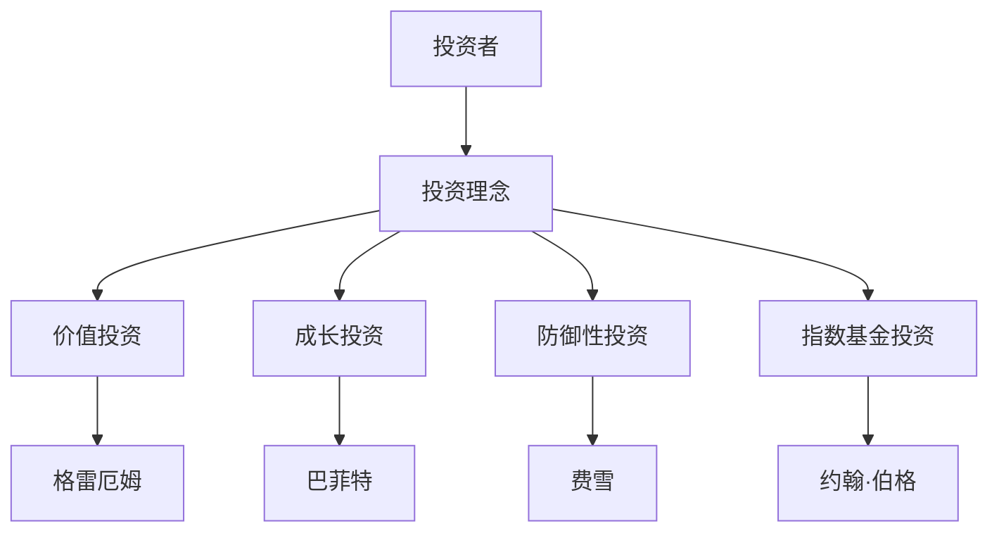

                 

# 《格雷厄姆、巴菲特、费雪和约翰伯格的投资理念比较》

**关键词**：价值投资，成长投资，指数基金，风险管理，投资策略

**摘要**：本文深入探讨了格雷厄姆、巴菲特、费雪和约翰·伯格四位投资大师的核心理念，分析了他们的投资策略、方法和哲学，比较了各自的理念异同，并结合现代投资环境，探讨了这些理念的实际应用和风险管理策略。

---

## 第一部分：投资理念的背景与核心概念

### 第1章：投资理念的核心概念与背景

#### 1.1 投资理念的背景与问题背景

- **传统投资与现代投资的区别**  
  传统投资强调短期交易和市场波动，而现代投资则注重长期价值和基本面分析。  
  $$传统投资 = 短期交易，现代投资 = 长期价值$$

- **价值投资与成长投资的起源**  
  价值投资由本杰明·格雷厄姆提出，强调以低于内在价值的价格购买股票。成长投资由菲利普·费雪提出，注重寻找具有持续增长潜力的企业。  
  $$价值投资 \text{ vs } 成长投资 = 内在价值 \text{ vs } 增长潜力$$

- **投资理念的核心问题与解决方法**  
  核心问题是如何在不确定的市场中实现长期收益最大化。格雷厄姆提出安全边际，巴菲特强调企业护城河，费雪关注成长股，伯格则倡导指数基金。  
  $$核心问题 = 如何在不确定性中实现收益最大化$$

- **投资理念的边界与外延**  
  价值投资适用于市场低估时期，成长投资适用于高增长行业，指数基金适合长期被动投资。  
  $$价值投资的边界 = 市场低估，成长投资的外延 = 高增长行业$$

- **投资理念的核心要素与组成**  
  核心要素包括估值、成长性、安全边际和风险管理。  
  $$核心要素 = 估值 + 成长性 + 安全边际 + 风险管理$$

#### 1.2 格雷厄姆、巴菲特、费雪和约翰·伯格的背景介绍

- **格雷厄姆的生平与贡献**  
  格雷厄姆是价值投资之父，著有《证券分析》和《聪明的投资者》，强调安全边际和 Margin of Safety 理论。  
  $$格雷厄姆 = 价值投资之父$$

- **巴菲特的生平与贡献**  
  巴菲特是格雷厄姆的学生，将价值投资与成长股结合，提出“伟大企业”投资理念。  
  $$巴菲特 = 格雷厄姆的学生 + 成长投资的践行者$$

- **费雪的生平与贡献**  
  费雪是成长投资的倡导者，著有《怎样选择成长股》，强调寻找具有持续增长潜力的企业。  
  $$费雪 = 成长投资的倡导者$$

- **约翰·伯格的生平与贡献**  
  伯格是指数基金的先驱，创立了 Vanguard 集团，倡导低成本指数投资。  
  $$约翰·伯格 = 指数基金之父$$

---

## 第2章：格雷厄姆、巴菲特、费雪和约翰·伯格的投资理念比较

### 2.1 格雷厄姆的价值投资理念

#### 2.1.1 价值投资的核心概念

- 格雷厄姆的价值投资强调以低于内在价值的价格购买股票，注重安全边际。  
  $$价值投资 = 内在价值 - 市场价格$$

- **安全边际的数学模型**  
  $$安全边际 = 内在价值 - 市场价格$$

- **格雷厄姆的投资策略与方法**  
  策略包括分散投资、买入低于内在价值的股票、长期持有。  
  $$策略 = 分散投资 + 长期持有$$

### 2.2 巴菲特的成长投资理念

#### 2.2.1 巴菲特的投资理念与策略

- 巴菲特将价值投资与成长投资结合，寻找具有强大护城河的企业。  
  $$巴菲特 = 价值投资 + 成长投资$$

- **巴菲特的选股标准**  
  看重企业盈利能力、管理层素质、行业地位和护城河。  
  $$选股标准 = 盈利能力 + 管理层 + 行业地位 + 护城河$$

### 2.3 费雪的成长股投资理念

#### 2.3.1 费雪的成长股投资理论

- 费雪强调寻找具有持续增长潜力的企业，注重每股收益（EPS）的增长。  
  $$成长股 = 持续增长的 EPS$$

- **费雪的集中投资与复利效应**  
  集中投资于少数优质成长股，利用复利效应实现财富增长。  
  $$集中投资 = 少数优质成长股$$

### 2.4 约翰·伯格的指数基金投资理念

#### 2.4.1 指数基金的理论基础

- 伯格认为市场难以预测，指数基金通过分散投资降低风险，实现市场平均收益。  
  $$指数基金 = 分散投资 + 市场平均收益$$

- **低成本投资策略**  
  通过降低管理费和交易成本，提高长期收益。  
  $$低成本策略 = 降低管理费 + 降低交易成本$$

---

## 第3章：投资理念的核心概念与联系

### 3.1 核心概念的原理与对比

- **价值投资与成长投资的对比**  
  $$价值投资 \text{ vs } 成长投资 = 内在价值 \text{ vs } 增长潜力$$

- **防御性投资与进攻性投资的对比**  
  防御性投资注重安全边际，进攻性投资注重成长潜力。  
  $$防御性投资 = 安全边际，进攻性投资 = 成长潜力$$

- **股票投资与指数基金的对比**  
  股票投资注重个股选择，指数基金注重分散投资。  
  $$股票投资 = 个股选择，指数基金 = 分散投资$$

### 3.2 核心概念的属性特征对比表格

| 投资理念 | 核心要素 | 投资目标 | 风险管理 | 适用场景 |
|----------|----------|----------|----------|----------|
| 价值投资 | 内在价值 | 稳定收益 | 安全边际 | 市场低估 |
| 成长投资 | 增长潜力 | 高收益 | 成长风险 | 高增长行业 |
| 指数基金 | 分散投资 | 市场平均收益 | 风险分散 | 长期投资 |

### 3.3 ER实体关系图架构的 Mermaid 流程图

---

## 第4章：投资理念的风险管理与实际应用

### 4.1 风险管理的核心策略

- **风险管理的数学模型**  
  $$风险 = 标准差 = \sqrt{\sum (x_i - \mu)^2 / N}$$

- **投资组合的分散化策略**  
  通过分散投资降低非系统性风险。  
  $$分散化策略 = 投资组合的多样化$$

### 4.2 投资理念的实际应用

- **价值投资者的应用场景**  
  在市场低估时购买优质股票，长期持有。  
  $$应用场景 = 市场低估$$

- **成长投资者的应用场景**  
  在高增长行业寻找具有持续增长潜力的企业。  
  $$应用场景 = 高增长行业$$

- **指数基金投资者的应用场景**  
  长期投资，通过分散投资降低风险。  
  $$应用场景 = 长期投资$$

---

## 第5章：总结与展望

### 5.1 总结

- 格雷厄姆的价值投资注重安全边际，巴菲特的成长投资注重企业护城河，费雪的成长股投资注重增长潜力，伯格的指数基金投资注重分散风险。  
  $$总结 = 价值投资 + 成长投资 + 指数基金$$

### 5.2 展望

- 随着市场的变化，投资者需要灵活调整策略，结合多种投资理念，制定适合自己的投资计划。  
  $$展望 = 灵活调整策略 + 综合运用理念$$

---

## 作者：AI天才研究院/AI Genius Institute & 禅与计算机程序设计艺术 /Zen And The Art of Computer Programming

