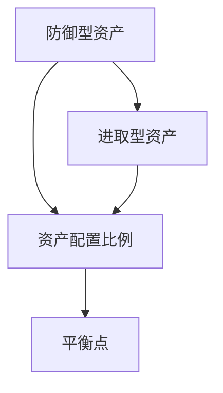
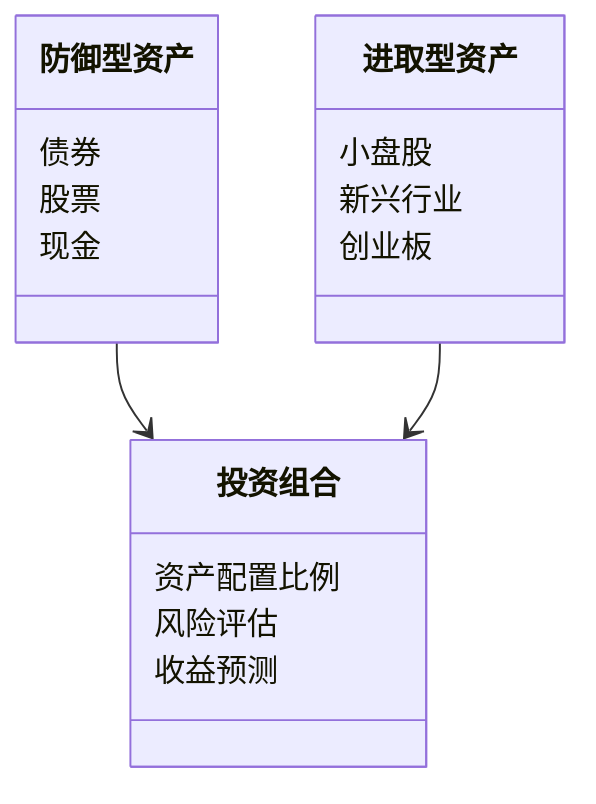

                 


# 格雷厄姆的'中庸之道'：在防御与进取之间找平衡

> 关键词：中庸之道、投资策略、防御与进取、平衡点、价值投资

> 摘要：本文深入探讨了格雷厄姆的中庸之道理念，分析了防御型投资和进取型投资的定义、特点及应用场景，并通过数学建模和系统架构设计的方法，提出了在防御与进取之间找到平衡点的具体策略。文章结合实际案例，详细阐述了如何在投资实践中应用中庸之道，以实现稳健与收益的双重目标。

---

## 第一部分：中庸之道的背景与定义

### 第1章：中庸之道的哲学基础

#### 1.1 格雷厄姆的生平与投资哲学
格雷厄姆是价值投资的鼻祖，他的投资哲学以稳健和理性著称。他提出的中庸之道理念，强调在市场波动中保持冷静，避免极端的投资行为。格雷厄姆的投资理念深刻影响了巴菲特等后世投资者。

#### 1.2 中庸之道的定义
中庸之道是一种追求稳健与进取之间平衡的投资策略。它既不追求高风险高回报的激进投资，也不满足于保守的低风险低回报，而是通过合理配置资产，在风险与收益之间找到最佳平衡点。

#### 1.3 格雷厄姆中庸之道的核心思想
格雷厄姆认为，投资者应避免极端的市场情绪，坚持基本面分析，通过分散投资和合理配置资产，降低风险的同时追求稳健的收益。中庸之道的核心在于“不偏不倚”，既不过度冒险，也不因循守旧。

---

### 第2章：防御与进取的定义与特征

#### 2.1 防御型投资策略
防御型投资是一种以稳健为主导的投资策略，注重低风险和高流动性。其核心目标是在市场波动中保护资本，避免重大损失。

##### 2.1.1 防御型投资的特点
- **低风险**：主要投资于稳定收益的资产，如国债、蓝筹股等。
- **高流动性**：资金流动性强，便于应对突发事件。
- **保守性**：注重本金的安全性，追求稳定的收益。

##### 2.1.2 防御型投资的适用场景
- 市场低迷期：在市场下跌时，防御型投资能够保护资本。
- 投资者风险偏好较低：适合保守型投资者。

#### 2.2 进取型投资策略
进取型投资是一种以高收益为目标的投资策略，注重高风险和高回报。其核心目标是通过承担更大的风险，获取超额收益。

##### 2.2.1 进取型投资的特点
- **高风险**：投资于高成长性资产，如小盘股、新兴行业等。
- **高回报**：潜在收益较高，但伴随更高的风险。
- **冒险性**：注重市场机会，追求高收益。

##### 2.2.2 进取型投资的适用场景
- 市场繁荣期：在市场上涨时，进取型投资能够获得超额收益。
- 投资者风险偏好较高：适合激进型投资者。

---

### 第3章：防御与进取的平衡点

#### 3.1 平衡点的定义与重要性
平衡点是指在防御与进取之间找到一个合理的资产配置比例，既能在市场下跌时减少损失，又能在市场上涨时分享收益。平衡点的核心在于根据市场环境和个人风险偏好，动态调整资产配置。

#### 3.2 格雷厄姆的中庸之道策略
格雷厄姆提出的中庸之道策略，强调在投资组合中同时配置防御性和进取性资产，以实现稳健的收益和适度的风险控制。

##### 3.2.1 中庸之道的核心原则
- **分散投资**：通过配置不同类型的资产，降低整体风险。
- **动态调整**：根据市场变化和个人风险偏好，及时调整资产配置比例。
- **长期视角**：避免短期市场波动的干扰，注重长期收益。

##### 3.2.2 中庸之道的实现路径
1. 确定自身风险偏好和投资目标。
2. 根据市场环境，确定防御与进取资产的配置比例。
3. 定期审视投资组合，进行必要的调整。

---

## 第二部分：中庸之道的核心概念与联系

### 第4章：防御与进取策略的核心概念

#### 4.1 核心概念原理
防御与进取策略的核心在于通过资产配置实现风险与收益的平衡。防御策略注重本金安全，进取策略注重收益增长，两者结合能够实现稳健的长期收益。

#### 4.2 核心概念对比分析

| **属性**       | **防御型投资**       | **进取型投资**       |
|----------------|----------------------|----------------------|
| **风险**       | 低                   | 高                   |
| **收益**       | 稳定                 | 高，但波动大           |
| **流动性**     | 高                   | 较低                 |
| **适用场景**   | 市场低迷期           | 市场繁荣期           |
| **投资者类型** | 保守型             | 激进型               |

#### 4.3 中庸之道的数学模型

$$ \text{平衡点} = \frac{\text{防御型资产比例} \times \text{防御型收益} + \text{进取型资产比例} \times \text{进取型收益}}{\text{总资产}} $$

---

### 第5章：防御与进取的实体关系图



---

## 第三部分：系统分析与架构设计

### 第6章：系统功能设计

#### 6.1 领域模型



---

### 第7章：系统架构设计

#### 7.1 系统架构图


---

## 第四部分：项目实战

### 第8章：环境安装与代码实现

#### 8.1 环境安装
- Python 3.8+
- Jupyter Notebook
- Matplotlib

#### 8.2 核心代码实现

```python
def calculate_balance_point(conservative_assets, aggressive_assets):
    total_assets = conservative_assets + aggressive_assets
    return (conservative_assets / total_assets) * 0.5 + (aggressive_assets / total_assets) * 0.5

# 示例
conservative_assets = 600000
aggressive_assets = 400000
balance_point = calculate_balance_point(conservative_assets, aggressive_assets)
print(f"平衡点为：{balance_point}%")
```

---

### 第9章：案例分析与小结

#### 9.1 案例分析
假设一位投资者有100万元，其中60%投资于防御型资产（股票、债券等），40%投资于进取型资产（小盘股、新兴行业）。根据上述代码，平衡点为50%。这意味着在市场波动中，投资者可以通过动态调整资产配置比例，实现稳健的收益。

#### 9.2 小结
中庸之道是一种科学的投资策略，通过在防御与进取之间找到平衡点，投资者能够在市场波动中实现稳健的收益。通过系统化的方法和动态调整，投资者可以更好地应对市场的不确定性。

---

## 第五部分：最佳实践与总结

### 第10章：最佳实践 tips

#### 10.1 投资者注意事项
- 根据自身风险偏好和财务状况，合理配置防御与进取资产。
- 定期审视投资组合，及时调整资产配置比例。
- 避免盲目跟风，坚持长期投资。

#### 10.2 拓展阅读
- 格雷厄姆的《 Intelligent Investor 》
- 《投资最重要的事情》

---

## 作者：AI天才研究院/AI Genius Institute & 禅与计算机程序设计艺术 /Zen And The Art of Computer Programming

