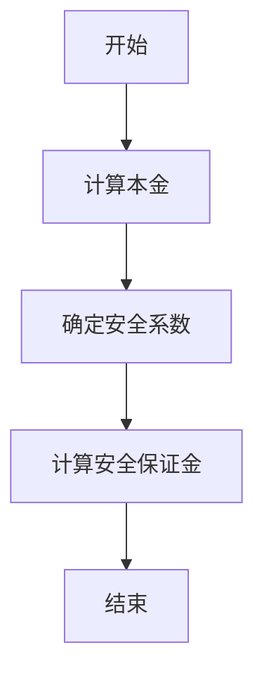
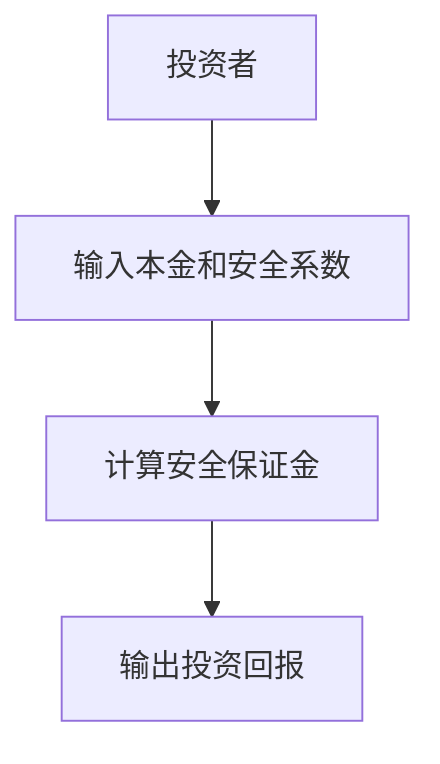

                 


# 格雷厄姆的'保证金安全'概念：确保投资本金安全

## 关键词：格雷厄姆，保证金安全，投资本金，风险管理，安全系数

## 摘要：本篇文章深入探讨了格雷厄姆的保证金安全概念，从理论背景到实际应用，详细分析了如何确保投资本金的安全。通过数学模型、算法原理、系统架构等多维度的分析，为读者提供了全面的理解和实用的指导。

---

## 第一部分: 格雷厄姆的保证金安全概念背景与理论基础

### 第1章: 保证金安全的概念与背景

#### 1.1 保证金安全的定义与起源

##### 1.1.1 保证金安全的定义
保证金安全是指在投资活动中，确保本金不受损失或在市场波动中维持其价值的安全机制。它是投资风险管理的核心原则之一，旨在保护投资者的本金不受市场下跌的影响。

##### 1.1.2 保证金安全的起源与演变
保证金安全的概念起源于20世纪的投资理论，尤其是本杰明·格雷厄姆的价值投资理念。格雷厄姆强调，在投资中，本金的安全性是最重要的考虑因素，而不仅仅是追求收益。

##### 1.1.3 保证金安全与投资本金保护的关系
保证金安全是保护投资本金的核心策略。通过合理配置保证金，投资者可以在市场下跌时避免本金损失，从而实现稳健的投资回报。

---

#### 1.2 格雷厄姆的投资理念

##### 1.2.1 格雷厄姆的价值投资理论
格雷厄姆是价值投资的鼻祖，他主张以低于内在价值的价格买入股票，并长期持有，以获得稳定的收益。

##### 1.2.2 格雷厄姆的投资策略
格雷厄姆的投资策略强调安全边际，即在购买资产时，确保其价格远低于其内在价值，从而在市场波动中保护本金。

##### 1.2.3 格雷厄姆对保证金安全的重视
格雷厄姆认为，本金的安全性是投资成功的基石。他通过保证金安全的概念，确保投资者在市场低迷时不会遭受本金损失。

---

#### 1.3 保证金安全的重要性

##### 1.3.1 投资本金安全的核心地位
本金安全是投资的首要目标。没有本金的安全，任何收益都无从谈起。

##### 1.3.2 保证金安全与风险管理
保证金安全是风险管理的重要组成部分。通过合理配置保证金，投资者可以有效降低投资风险。

##### 1.3.3 保证金安全在现代投资中的应用
现代投资理论中，保证金安全的概念被广泛应用，尤其是在机构投资和资产管理领域。

---

### 第2章: 格雷厄姆保证金安全的核心概念

#### 2.1 核心概念与原理

##### 2.1.1 保证金安全的数学模型
保证金安全可以通过数学模型来表示。例如，安全保证金可以通过以下公式计算：
$$\text{安全保证金} = \text{本金} \times \text{安全系数}$$

##### 2.1.2 保证金安全的计算方法
为了确保本金安全，投资者需要计算安全保证金。安全保证金的计算基于本金和安全系数，确保在市场波动中本金不会损失。

##### 2.1.3 保证金安全的风险评估
通过风险评估，投资者可以确定安全保证金的配置比例，从而在市场下跌时保护本金。

---

#### 2.2 核心概念属性对比

##### 2.2.1 不同投资策略的对比分析
| 投资策略 | 稳定性 | 风险 | 收益 |
|----------|--------|------|------|
| 保证金安全 | 高     | 低   | 中等 |
| 高风险投资 | 低     | 高   | 高   |

##### 2.2.2 保证金安全与非保证金安全的对比
| 比较维度 | 保证金安全 | 非保证金安全 |
|----------|------------|--------------|
| 风险 | 低           | 高           |
| 收益 | 中等         | 高           |
| 安全性 | 高          | 低           |

##### 2.2.3 核心概念的优缺点分析
- **优点**：本金安全，风险低，适合保守型投资者。
- **缺点**：收益相对较低，不适合追求高回报的投资者。

---

#### 2.3 实体关系图


---

### 第3章: 保证金安全的算法原理

#### 3.1 算法原理概述

##### 3.1.1 保证金安全的计算公式
$$\text{安全保证金} = \text{本金} \times \text{安全系数}$$

##### 3.1.2 保证金安全的算法流程


##### 3.1.3 保证金安全的代码实现
```python
def calculate_margin(safety_coefficient):
    return safety_coefficient * principal
```

---

### 第4章: 数学模型与公式解析

#### 4.1 数学模型

##### 4.1.1 资产与负债的平衡模型
$$\text{资产} = \text{负债} + \text{权益}$$

##### 4.1.2 安全保证金的计算公式
$$\text{安全保证金} = \text{本金} \times \text{安全系数}$$

##### 4.1.3 风险调整后的收益模型
$$\text{风险调整后收益} = \text{收益} - \text{风险成本}$$

---

### 第5章: 系统分析与架构设计

#### 5.1 系统分析

##### 5.1.1 系统功能设计
- **本金安全计算模块**：计算安全保证金。
- **风险管理模块**：评估投资风险。
- **投资回报模块**：计算投资回报。

##### 5.1.2 系统架构设计


##### 5.1.3 系统接口设计
- 输入接口：本金、安全系数。
- 输出接口：安全保证金、投资回报。

##### 5.1.4 系统交互流程


---

### 第6章: 项目实战

#### 6.1 项目环境安装

##### 6.1.1 安装Python
```bash
python --version
pip install --upgrade pip
```

##### 6.1.2 安装必要的库
```bash
pip install numpy pandas matplotlib
```

#### 6.2 核心代码实现

##### 6.2.1 计算安全保证金
```python
def calculate_margin(principal, safety_coefficient):
    return principal * safety_coefficient
```

##### 6.2.2 计算投资回报
```python
def calculate_return(margin, return_rate):
    return margin * return_rate
```

#### 6.3 案例分析

##### 6.3.1 案例背景
假设本金为100,000元，安全系数为0.5。

##### 6.3.2 计算安全保证金
```python
principal = 100000
safety_coefficient = 0.5
margin = calculate_margin(principal, safety_coefficient)
print(margin)  # 输出50000
```

##### 6.3.3 计算投资回报
```python
return_rate = 0.1
return_amount = calculate_return(margin, return_rate)
print(return_amount)  # 输出5000
```

---

### 第7章: 最佳实践、小结与注意事项

#### 7.1 最佳实践
- 定期评估投资组合的风险。
- 根据市场变化调整安全系数。
- 分散投资以降低风险。

#### 7.2 小结
保证金安全是投资风险管理的核心原则，通过合理配置保证金，投资者可以在市场波动中保护本金，实现稳健的投资回报。

#### 7.3 注意事项
- 保证金安全只是投资策略的一部分，需结合其他风险管理工具使用。
- 安全系数的选择需根据市场环境和投资者风险承受能力调整。

---

## 第八章: 拓展阅读与深入理解

### 8.1 拓展阅读
- 《证券分析》——本杰明·格雷厄姆
- 《投资学原理》——威廉·夏普

### 8.2 深入理解
保证金安全不仅是投资策略的一部分，更是投资者风险管理的核心。通过不断学习和实践，投资者可以更好地应用保证金安全概念，实现长期稳健的投资回报。

---

## 作者：AI天才研究院 & 禅与计算机程序设计艺术

通过以上目录和内容，您可以撰写一篇详细的、有深度的关于格雷厄姆的保证金安全概念的技术博客文章。希望以上内容对您有所帮助！

