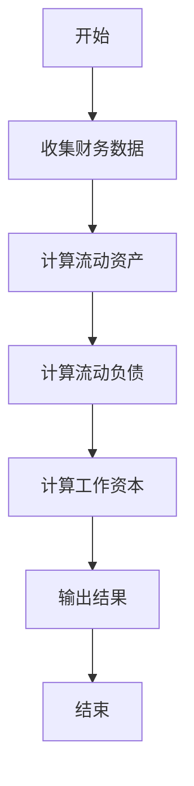

                 


# 格雷厄姆的'工作资本'分析：评估公司短期偿债能力

---

## 关键词：财务分析、工作资本、短期偿债能力、价值投资、格雷厄姆

---

## 摘要：本文深入探讨了格雷厄姆提出的“工作资本”分析方法，详细阐述了其在评估公司短期偿债能力中的应用。通过分析工作资本的定义、计算公式、算法原理及系统架构，结合实际案例，为读者提供了一套完整的分析框架。文章旨在帮助投资者和财务分析人员更好地理解工作资本的核心概念，并通过代码实现和系统设计，展示如何将理论应用于实践。

---

## 第一部分: 格雷厄姆的“工作资本”分析概述

### 第1章: 工作资本分析的背景与意义

#### 1.1 工作资本分析的起源与发展
- 1.1.1 财务分析的起源
  - 财务分析的起源可以追溯到古代商业贸易，但系统的财务分析方法在19世纪末开始发展。
  - 19世纪末至20世纪初，企业融资需求增加，财务分析成为企业决策的重要工具。

- 1.1.2 格雷厄姆与价值投资的贡献
  - 本杰明·格雷厄姆（Benjamin Graham）被誉为“价值投资之父”，他在《证券分析》中提出了许多重要的财务分析方法。
  - 格雷厄姆的学生彼得·林奇（Peter Lynch）进一步发展了这些方法，使其更加实用。

- 1.1.3 工作资本分析的定义与核心概念
  - 工作资本（Working Capital）是流动资产减去流动负债，反映了企业在短期内偿还债务的能力。
  - 核心概念：流动资产、流动负债、净流动资产。

#### 1.2 工作资本分析的重要性
- 1.2.1 短期偿债能力的核心地位
  - 工作资本是衡量企业短期偿债能力的核心指标。
  - 负的工作资本意味着企业可能无法偿还短期债务。

- 1.2.2 工作资本分析在投资决策中的作用
  - 投资者可以通过工作资本分析评估企业的财务健康状况。
  - 低工作资本可能意味着企业存在流动性风险。

- 1.2.3 工作资本与企业财务健康的关系
  - 正的工作资本表明企业有足够的流动性来应对短期债务。
  - 高的工作资本可能表明企业存在资金闲置问题。

### 第2章: 核心概念与理论基础

#### 2.1 工作资本的定义与组成
- 2.1.1 工作资本的定义
  - 工作资本 = 流动资产 - 流动负债
  - $$\text{工作资本} = \text{流动资产} - \text{流动负债}$$

- 2.1.2 工作资本的组成要素
  - 流动资产：现金、应收账款、存货。
  - 流动负债：短期借款、应付账款、应付工资。

- 2.1.3 工作资本与流动资产、流动负债的关系
  - 工作资本是流动资产与流动负债的差额。
  - 流动资产越多，工作资本越大；流动负债越多，工作资本越小。

#### 2.2 格雷厄姆的分析框架
- 2.2.1 格雷厄姆的“安全边际”理论
  - 格雷厄姆强调安全边际的重要性，即买入价格低于内在价值。
  - 工作资本分析是评估内在价值的重要工具。

- 2.2.2 工作资本分析的核心公式
  - 工作资本 = 流动资产 - 流动负债
  - $$\text{工作资本} = \text{流动资产} - \text{流动负债}$$

- 2.2.3 工作资本分析的边界与外延
  - 边界：流动资产和流动负债的范围。
  - 外延：工作资本的变化趋势和行业对比。

#### 2.3 核心概念的数学模型
- 2.3.1 工作资本计算公式
  - $$\text{工作资本} = \text{流动资产} - \text{流动负债}$$

- 2.3.2 流动资产与流动负债的对比
  - 流动资产 = 现金 + 应收账款 + 存货。
  - 流动负债 = 短期借款 + 应付账款。

### 第3章: 工作资本分析的算法原理

#### 3.1 工作资本分析的算法流程


#### 3.2 算法实现的Python代码
```python
def calculate_working_capital(current_assets, current_liabilities):
    return current_assets - current_liabilities

# 示例数据
current_assets = 500000  # 流动资产（元）
current_liabilities = 300000  # 流动负债（元）

working_capital = calculate_working_capital(current_assets, current_liabilities)
print(f"工作资本 = {working_capital}")
```

#### 3.3 工作资本分析的数学模型
- 工作资本的计算公式：
  - $$\text{工作资本} = \text{流动资产} - \text{流动负债}$$
  - $$\text{流动资产} = \text{现金} + \text{应收账款} + \text{存货}$$
  - $$\text{流动负债} = \text{短期借款} + \text{应付账款}$$

---

## 第四部分: 系统分析与架构设计方案

### 第4章: 工作资本分析系统架构设计

#### 4.1 问题场景介绍
- 系统目标：评估公司短期偿债能力。
- 问题描述：如何利用工作资本分析方法实现自动化评估。

#### 4.2 系统功能设计
- 数据输入模块：收集流动资产和流动负债数据。
- 数据处理模块：计算工作资本。
- 数据输出模块：展示结果。

#### 4.3 系统架构设计


#### 4.4 系统交互设计


---

## 第五部分: 项目实战

### 第5章: 工作资本分析的项目实现

#### 5.1 项目环境安装
- 安装Python和Pandas库：
  ```bash
  pip install pandas
  ```

#### 5.2 项目核心实现
```python
import pandas as pd

def calculate_working_capital(current_assets, current_liabilities):
    return current_assets - current_liabilities

# 示例数据
data = {
    '公司': ['A', 'B', 'C'],
    '流动资产': [500000, 600000, 700000],
    '流动负债': [300000, 400000, 500000]
}

df = pd.DataFrame(data)

# 计算工作资本
df['工作资本'] = df['流动资产'] - df['流动负债']

print(df)
```

#### 5.3 项目小结
- 通过代码实现工作资本分析，能够快速评估公司的短期偿债能力。
- 示例数据展示了如何将理论应用于实际。

---

## 第六部分: 总结与展望

### 第6章: 总结与注意事项

#### 6.1 关键点总结
- 工作资本是衡量短期偿债能力的核心指标。
- 格雷厄姆的分析方法具有重要的现实意义。

#### 6.2 注意事项
- 数据的准确性是分析的关键。
- 结果需要结合行业背景进行分析。

#### 6.3 小结
- 工作资本分析是价值投资的重要工具。
- 通过本文的讲解，读者可以掌握如何利用工作资本分析评估公司的短期偿债能力。

---

## 作者：AI天才研究院/AI Genius Institute & 禅与计算机程序设计艺术 /Zen And The Art of Computer Programming

