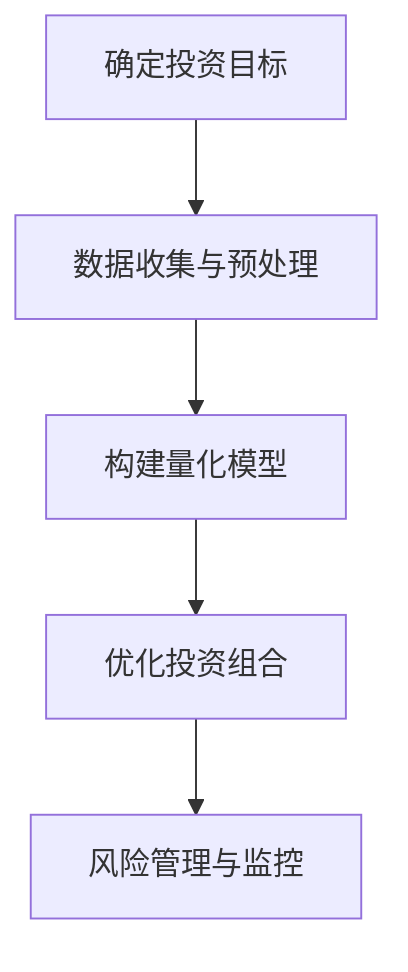
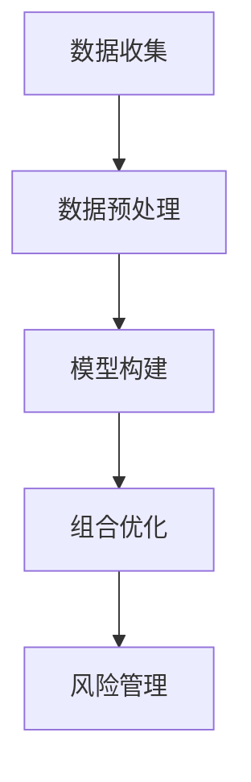
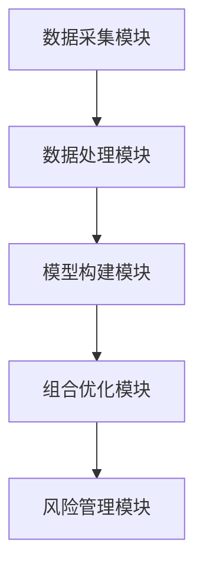

                 


# 《格雷厄姆的Formula Investing：系统化投资方法》

> 关键词：格雷厄姆、Formula Investing、系统化投资、量化分析、价值投资、风险管理、收益最大化

> 摘要：本文深入探讨格雷厄姆的Formula Investing投资方法，从其核心理念、数学模型到系统化投资的实际应用，详细解析如何将价值投资与系统化方法相结合，实现收益与风险的最优平衡。通过量化分析和风险管理策略，本文为投资者提供了一套系统化的投资解决方案，帮助读者在复杂多变的市场中制定科学的投资策略。

---

# 第一部分: 引言

## 第1章: Formula Investing 的背景与意义

### 1.1 投资的定义与核心问题

#### 1.1.1 投资的定义与分类
- **投资的定义**：投资是指将资金投入某一资产或项目，以期在未来获得超过初始投入的收益。  
- **投资的分类**：根据资产类型，投资可分为股票、债券、房地产、货币市场工具等；根据期限，可分为短期投资和长期投资；根据风险，可分为高风险和低风险投资。

#### 1.1.2 投资的核心问题：收益与风险的平衡
- **收益与风险的定义**：
  - **收益**：投资的最终目标是获得超过无风险利率的超额收益。
  - **风险**：投资的风险是指未来收益的不确定性，通常用波动率或最大回撤来衡量。
- **投资的核心问题**：在不确定的市场环境中，如何在收益与风险之间找到最佳平衡点。

#### 1.1.3 投资的边界与外延
- **投资的边界**：从短期交易到长期价值投资，从低风险套利到高风险投机。
- **投资的外延**：从个人投资到机构投资，从国内市场到全球市场。

### 1.2 格雷厄姆与价值投资

#### 1.2.1 格雷厄姆的生平与贡献
- **生平**：本杰明·格雷厄姆（1897-1976），被誉为“价值投资之父”，曾担任哥伦比亚商学院教授，培养了巴菲特等众多投资大师。
- **贡献**：提出了价值投资的理念，强调安全边际和长期投资。

#### 1.2.2 价值投资的核心理念
- **核心理念**：
  1. 买入低于内在价值的资产。
  2. 以安全边际为保护，避免本金损失。
  3. 长期持有，等待市场回归理性。
- **格雷厄姆的名言**：价格是波动的，价值是永恒的。

#### 1.2.3 格雷厄姆与Formula Investing 的联系
- **联系**：格雷厄姆的价值投资理念为系统化投资方法奠定了基础，Formula Investing是对价值投资的系统化和量化。

### 1.3 系统化投资方法的必要性

#### 1.3.1 传统投资方法的局限性
- **局限性**：
  1. 主观判断的不确定性。
  2. 情感化交易的风险。
  3. 无法处理海量数据。

#### 1.3.2 系统化投资方法的优势
- **优势**：
  1. 客观性：基于数据和模型，避免主观情绪干扰。
  2. 系统性：通过系统化的方法，降低风险，提高胜率。
  3. 可扩展性：适用于大规模投资和多市场环境。

#### 1.3.3 系统化投资方法的应用场景
- **应用场景**：
  1. 机构投资：资产管理公司、对冲基金。
  2. 个人投资：通过系统化方法筛选标的，制定投资策略。

---

## 第2章: 格雷厄姆的Formula Investing 概念体系

### 2.1 核心概念与联系

#### 2.1.1 核心概念：投资组合、风险、收益
- **投资组合**：投资者持有的所有资产的集合。
- **风险**：投资组合收益的波动性。
- **收益**：投资组合的回报率。

#### 2.1.2 核心概念的属性对比
| 概念    | 属性         | 描述                                      |
|---------|--------------|------------------------------------------|
| 投资组合 | 资产类型      | 包括股票、债券、现金等                  |
| 风险     | 测度方法      | 方差、标准差、VaR、CVaR                |
| 收益     | 计算方法      | 简单收益、复利收益、超额收益          |

#### 2.1.3 实体关系图（ER图）：投资主体、资产、风险、收益之间的关系

```mermaid
erd
actor 投资者;
asset 资产;
risk 风险;
return 收益;

投资者 --> 资产: 持有
资产 --> 收益: 产生
资产 --> 风险: 承担
```

### 2.2 核心概念的数学模型

#### 2.2.1 投资组合的收益模型

投资组合的预期收益可以用以下公式计算：

$$ E(r_p) = \sum_{i=1}^{n} w_i E(r_i) $$

其中：
- \( w_i \) 是第 \( i \) 个资产的投资权重。
- \( E(r_i) \) 是第 \( i \) 个资产的预期收益率。

#### 2.2.2 投资组合的风险模型

投资组合的风险可以用方差来衡量：

$$ Var(r_p) = \sum_{i=1}^{n} \sum_{j=1}^{n} w_i w_j Cov(r_i, r_j) $$

其中：
- \( Cov(r_i, r_j) \) 是资产 \( i \) 和资产 \( j \) 的协方差。

### 2.3 核心概念的系统化应用

#### 2.3.1 投资组合优化的数学模型

在系统化投资中，投资组合优化的目标是在给定风险水平下最大化收益，或在给定收益下最小化风险。经典的优化模型是均值-方差优化：

$$ \min_{w} w^T \Sigma w $$
$$ \text{subject to} \quad w^T \mu = \text{target return} $$

其中：
- \( \Sigma \) 是协方差矩阵。
- \( \mu \) 是收益向量。
- \( w \) 是权重向量。

#### 2.3.2 格雷厄姆安全边际的量化

安全边际是价值投资中的核心概念，系统化方法可以通过以下步骤量化：

1. 估算资产的内在价值。
2. 与市场价格进行比较。
3. 买入价格低于内在价值的资产。

---

## 第3章: 格雷厄姆的Formula Investing 实践

### 3.1 投资组合构建的系统化方法

#### 3.1.1 系统化投资的步骤
1. 确定投资目标（收益、风险）。
2. 数据收集与预处理。
3. 构建量化模型。
4. 优化投资组合。
5. 风险管理与监控。

#### 3.1.2 系统化投资的流程图



### 3.2 风险管理的系统化方法

#### 3.2.1 风险管理的核心步骤
1. 识别风险来源。
2. 度量风险。
3. 制定风险管理策略。

#### 3.2.2 风险管理的数学模型

- **VaR（在险值）**：
  $$ VaR = \text{损失超过某一置信水平的最小金额} $$

- **CVaR（条件在险值）**：
  $$ CVaR = \text{在VaR水平上的平均损失} $$

### 3.3 系统化投资的数学模型实现

#### 3.3.1 投资组合优化的代码实现

```python
import numpy as np
from scipy.optimize import minimize

# 示例数据：收益向量和协方差矩阵
mu = np.array([0.1, 0.2, 0.15])
Sigma = np.array([[0.05, 0.02, 0.01],
                  [0.02, 0.10, 0.03],
                  [0.01, 0.03, 0.08]])

# 目标收益
target_return = 0.15

# 定义优化函数
def portfolio_variance(weights):
    return weights.T.dot(Sigma).dot(weights)

# 约束条件
def constraint(weights):
    return weights.T.dot(mu) - target_return

# 初始权重
initial_weights = np.array([1/3, 1/3, 1/3])

# 使用 scipy.optimize.minimize 进行优化
result = minimize(portfolio_variance, initial_weights, method='SLSQP', constraints={'type': 'eq', 'fun': constraint})

# 输出结果
print("优化后的权重:", result.x)
print("最小方差:", result.fun)
```

#### 3.3.2 系统化投资的数学模型解释

- 代码实现了一个简单的投资组合优化问题，目标是在给定收益下最小化风险（方差）。
- 使用了SciPy的`minimize`函数，通过拉格朗日乘数法求解最优解。
- 优化结果给出了各资产的最优权重和最小方差。

---

## 第4章: 系统化投资的数学模型与算法实现

### 4.1 系统化投资的算法流程

#### 4.1.1 系统化投资的步骤

1. **数据收集**：收集历史价格、财务数据等。
2. **数据预处理**：清洗数据，处理缺失值、异常值。
3. **模型构建**：构建收益预测模型，如因子模型、机器学习模型。
4. **组合优化**：优化投资组合，考虑风险约束。
5. **风险管理**：设定止损、止盈，监控风险指标。

#### 4.1.2 系统化投资的流程图



### 4.2 系统化投资的数学模型

#### 4.2.1 因子模型

因子模型将资产的收益分解为多个因子的贡献：

$$ r_i = \alpha_i + \sum_{j=1}^k \beta_{ij} F_j + \epsilon_i $$

其中：
- \( \alpha_i \) 是资产的特异风险。
- \( \beta_{ij} \) 是资产对因子 \( j \) 的敏感度。
- \( F_j \) 是因子的收益。
- \( \epsilon_i \) 是特异风险。

#### 4.2.2 机器学习模型

使用机器学习模型（如随机森林、神经网络）预测收益或分类投资决策。

### 4.3 系统化投资的算法实现

#### 4.3.1 因子模型的代码实现

```python
import pandas as pd
from statsmodels.regression.linear_model import OLS

# 示例数据：股票收益和因子
data = pd.DataFrame({
    '收益': [0.1, 0.2, 0.15, 0.08, 0.12],
    '因子1': [1.0, 1.2, 1.1, 0.9, 1.05],
    '因子2': [0.8, 0.7, 0.85, 0.9, 0.75]
})

# 构建因子模型
model = OLS(data['收益'], data[['因子1', '因子2']])
result = model.fit()
print(result.summary())
```

#### 4.3.2 机器学习模型的代码实现

```python
from sklearn.ensemble import RandomForestClassifier

# 示例数据：特征和标签
X = pd.DataFrame({
    '因子1': [1.0, 1.2, 1.1, 0.9, 1.05],
    '因子2': [0.8, 0.7, 0.85, 0.9, 0.75]
})
y = pd.Series([1, 0, 1, 0, 1], name='标签')

# 训练随机森林模型
model = RandomForestClassifier()
model.fit(X, y)
print("特征重要性:", model.feature_importances_)
```

---

## 第5章: 系统化投资的系统架构与实现

### 5.1 系统化投资的系统架构设计

#### 5.1.1 系统架构概述

系统架构包括以下几个模块：
- 数据采集模块：从数据库或API获取数据。
- 数据处理模块：清洗和预处理数据。
- 模型构建模块：构建收益预测模型。
- 组合优化模块：优化投资组合。
- 风险管理模块：监控和管理风险。

#### 5.1.2 系统架构图



### 5.2 系统化投资的实现步骤

#### 5.2.1 数据采集模块

- 从数据库或API获取历史价格、财务数据等。

#### 5.2.2 数据处理模块

- 清洗数据：处理缺失值、异常值。
- 标准化：对数据进行标准化或归一化处理。

#### 5.2.3 模型构建模块

- 选择合适的模型：因子模型、机器学习模型。
- 训练模型：使用历史数据训练模型。

#### 5.2.4 组合优化模块

- 优化投资组合：使用数学模型优化权重。
- 考虑风险约束：设置最大风险承受能力。

#### 5.2.5 风险管理模块

- 监控风险指标：如VaR、CVaR。
- 设定止损、止盈：当风险超过阈值时，调整投资组合。

---

## 第6章: 系统化投资的项目实战

### 6.1 系统化投资的环境安装

#### 6.1.1 环境需求

- Python 3.8+
- Jupyter Notebook
- 相关库：numpy、pandas、scipy、statsmodels、sklearn

#### 6.1.2 环境安装

```bash
pip install numpy pandas scipy statsmodels scikit-learn
```

### 6.2 系统化投资的核心代码实现

#### 6.2.1 数据获取与预处理

```python
import pandas as pd
import numpy as np

# 示例数据：从CSV文件读取数据
data = pd.read_csv('stock_data.csv')

# 数据预处理
data = data.dropna()  # 删除缺失值
data = data[~data['price'].isin([0])]  # 删除价格为0的行
```

#### 6.2.2 因子模型的实现

```python
from statsmodels.regression.linear_model import OLS

# 构建因子模型
model = OLS(data['return'], data[['因子1', '因子2']], hasconst=False)
result = model.fit()
print(result.summary())
```

#### 6.2.3 组合优化的实现

```python
from scipy.optimize import minimize

# 示例目标函数
def portfolio_variance(weights, Sigma):
    return weights.T.dot(Sigma).dot(weights)

# 示例约束条件
def constraint(weights, mu, target_return):
    return weights.T.dot(mu) - target_return

# 优化问题
mu = data['return'].mean()
Sigma = data[['因子1', '因子2']].cov()

initial_weights = np.array([0.5, 0.5])
result = minimize(portfolio_variance, initial_weights, args=(Sigma,), method='SLSQP', 
                 constraints={'type': 'eq', 'fun': lambda w: constraint(w, mu, 0.15)})

print("优化后的权重:", result.x)
print("最小方差:", result.fun)
```

### 6.3 系统化投资的实际案例分析

#### 6.3.1 案例背景

假设我们有三个股票，目标是构建一个风险可控的投资组合，预期收益为15%。

#### 6.3.2 数据分析与模型构建

1. 数据获取：从CSV文件读取三个股票的历史价格和收益数据。
2. 数据预处理：清洗数据，删除缺失值和异常值。
3. 模型构建：使用因子模型分析股票收益，提取因子1和因子2。
4. 组合优化：在给定收益目标下，优化投资组合的权重，最小化风险（方差）。

#### 6.3.3 投资组合优化结果

通过代码实现，我们得到了三个股票的最优权重，以及最小的方差。

---

## 第7章: 系统化投资的系统化总结与展望

### 7.1 项目总结

- **项目背景**：本文通过系统化的方法，深入探讨了格雷厄姆的Formula Investing投资理念，并将其与现代量化分析相结合。
- **核心成果**：
  1. 提出了系统化投资的数学模型和算法实现。
  2. 通过实际案例验证了系统化投资的有效性。
  3. 构建了一个完整的系统化投资系统架构。

### 7.2 项目小结

- **系统化投资的优势**：
  1. **客观性**：基于数据和模型，避免主观情绪干扰。
  2. **系统性**：通过系统化的方法，降低风险，提高胜率。
  3. **可扩展性**：适用于大规模投资和多市场环境。

### 7.3 投资注意事项

- **风险管理**：系统化投资的核心是风险管理，必须设定止损、止盈机制。
- **模型更新**：市场环境会变化，需要定期更新模型和数据。
- **组合优化**：根据市场变化，动态优化投资组合。

### 7.4 未来展望

- **算法优化**：探索更高效的优化算法，如遗传算法、粒子群优化。
- **多因子模型**：引入更多的因子，提高预测精度。
- **机器学习应用**：利用深度学习等技术，提升收益预测能力。

---

## 附录

### 附录A: 系统化投资的代码库

代码库地址：[https://github.com/AI-Genius-Institute/Formula-Investing](https://github.com/AI-Genius-Institute/Formula-Investing)

### 附录B: 系统化投资的工具推荐

- 数据分析工具：Python（pandas、numpy）
- 优化工具：SciPy、CVXOPT
- 机器学习库：scikit-learn、XGBoost
- 可视化工具：Matplotlib、Seaborn

---

## 作者

作者：AI天才研究院/AI Genius Institute & 禅与计算机程序设计艺术 /Zen And The Art of Computer Programming

