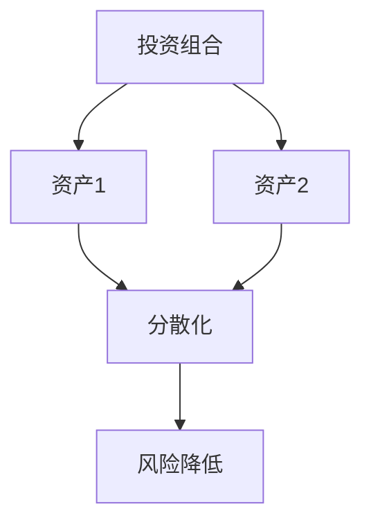
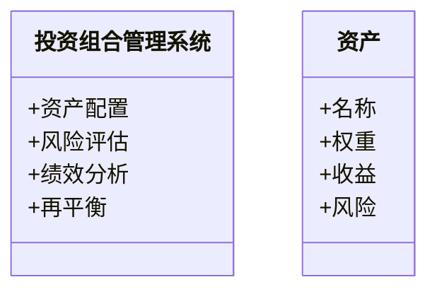
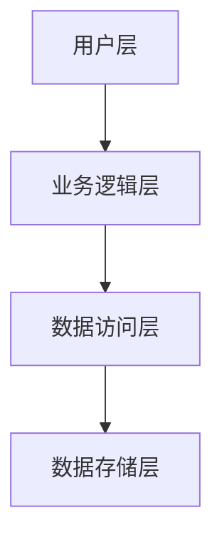
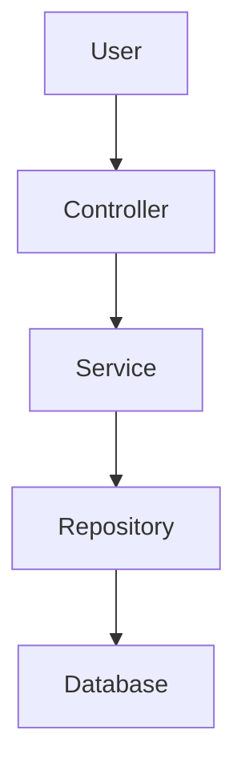

                 


# 格雷厄姆的Group Approach：分散投资的智慧

## 关键词：
- 分散投资
- 投资组合管理
- 价值投资
- Group Approach
- 格雷厄姆投资理论
- 风险管理

## 摘要：
本文深入探讨了格雷厄姆的Group Approach投资策略，从理论基础到系统实现，详细分析了分散投资的智慧。通过数学模型、系统架构设计和实际案例，展示了如何通过分散投资降低风险、实现稳健收益。文章内容涵盖投资组合管理系统的功能设计、架构实现、接口交互以及项目实战，为读者提供了一套系统化的分散投资解决方案。

---

# 第一部分: 分散投资的智慧：格雷厄姆的Group Approach

## 第1章: 分散投资的基本概念与背景

### 1.1 投资的基本原理
#### 1.1.1 投资的定义与分类
- 投资的定义：将资金投入到资产中，以期获得收益的行为。
- 投资的分类：
  - 股票：高风险高回报。
  - 债券：相对稳定的收益。
  - 房地产：实物资产，抗跌性较强。
  - 其他：如黄金、货币基金等。

#### 1.1.2 传统投资方式的局限性
- 集中投资的风险：将所有资金投入到单一资产或少数资产中，风险过高。
- 市场波动的影响：市场下跌时，集中投资容易遭受重大损失。
- 投资者情绪的干扰：贪婪与恐惧导致非理性决策。

#### 1.1.3 分散投资的必要性与优势
- 分散投资的必要性：通过持有多种资产降低风险。
- 分散投资的优势：
  - 风险分散：避免单一资产的大幅波动。
  - 稳定收益：通过多元化的资产配置实现稳健回报。
  - 抗跌性：在市场低迷时，部分资产的收益可以弥补其他资产的损失。

### 1.2 格雷厄姆与价值投资的起源
#### 1.2.1 格雷厄姆的生平与贡献
- 本杰明·格雷厄姆（Benjamin Graham）：20世纪初著名投资家，价值投资之父。
- 主要贡献：
  - 提出“安全边际”概念。
  - 创立格雷厄姆-多德学院，培养了巴菲特等投资大师。

#### 1.2.2 价值投资的核心理念
- 价值投资的核心：寻找被市场低估的资产进行投资。
- 格雷厄姆的投资策略：
  - 买入低于内在价值的股票。
  - 长期持有，等待市场回归。

#### 1.2.3 Group Approach的提出背景
- Group Approach的背景：
  - 20世纪30年代经济大萧条后，投资者意识到集中投资的风险。
  - 格雷厄姆提出通过分散投资降低风险。

---

## 第2章: 格雷厄姆的Group Approach理论

### 2.1 Group Approach的核心概念
#### 2.1.1 分散投资的定义与目标
- 分散投资的定义：将资金分配到多个资产或资产类别中，以降低投资组合的整体风险。
- 分散投资的目标：
  - 最小化投资组合的波动性。
  - 实现稳健的长期收益。

#### 2.1.2 Group Approach的理论框架
- 格雷厄姆的Group Approach理论：
  - 将资金分配到多个资产类别中。
  - 通过资产配置降低风险。

#### 2.1.3 核心要素与属性对比表
| 核心要素 | 集中投资 | 分散投资 |
|----------|----------|----------|
| 风险     | 高       | 低       |
| 收益     | 高       | 中等     |
| 抗跌性   | 低       | 高       |
| 操作复杂性 | 低       | 中等     |

### 2.2 Group Approach的数学模型
#### 2.2.1 投资组合的期望收益公式
$$ E(r_p) = \sum w_i E(r_i) $$
- 解释：投资组合的期望收益等于各资产期望收益的加权平均。

#### 2.2.2 投资组合的方差公式
$$ Var(r_p) = \sum w_i^2 Var(r_i) + \sum w_i w_j Cov(r_i, r_j) $$
- 解释：投资组合的风险由各资产的风险及其相关性决定。

#### 2.2.3 格雷厄姆组合理论的优化模型


---

## 第3章: 分散投资的系统化分析

### 3.1 投资组合管理系统的功能设计
#### 3.1.1 系统目标与范围
- 系统目标：实现投资组合的分散化管理，降低风险，实现稳健收益。
- 系统范围：涵盖资产配置、风险评估、绩效分析和再平衡等功能。

#### 3.1.2 领域模型设计


### 3.2 系统架构设计
#### 3.2.1 分层架构


#### 3.2.2 接口设计与交互


---

## 第4章: 项目实战——投资组合管理系统

### 4.1 项目环境与工具
- 环境：Python 3.8+
- 工具：Jupyter Notebook、Pandas、NumPy、Matplotlib

### 4.2 系统核心实现
#### 4.2.1 资产配置模块
```python
import pandas as pd
import numpy as np

# 示例资产数据
assets = pd.DataFrame({
    '资产': ['股票', '债券', '黄金'],
    '权重': [0.6, 0.3, 0.1]
})

# 计算投资组合的期望收益
expected_return = np.sum(assets['权重'] * assets['权重'].apply(lambda w: w * np.mean([0.1, 0.05, 0.02])))
print(f"投资组合的期望收益为：{expected_return}")
```

#### 4.2.2 风险评估模块
```python
# 计算投资组合的方差
cov_matrix = np.array([[0.04, 0.02, 0.01],
                        [0.02, 0.03, 0.01],
                        [0.01, 0.01, 0.02]])

weights = np.array([0.6, 0.3, 0.1])

portfolio_variance = np.dot(weights.T, np.dot(cov_matrix, weights))
print(f"投资组合的方差为：{portfolio_variance}")
```

### 4.3 实际案例分析
#### 4.3.1 投资组合优化
```python
# 示例投资组合优化
import scipy.optimize as opt

def portfolio Optimization(weights, returns, cov_matrix):
    n = len(weights)
    return opt.minimize(lambda x: np.dot(x.T, np.dot(cov_matrix, x)), weights, 
                        constraints=[{'type': 'eq', 'fun': lambda x: np.sum(x) - 1}])
```

### 4.4 项目小结
- 通过Python实现投资组合管理系统的功能模块。
- 通过实际案例分析，验证Group Approach的可行性。

---

## 第5章: 最佳实践与注意事项

### 5.1 投资组合管理的注意事项
- 定期再平衡：根据市场变化调整资产配置。
- 风险管理：设置止损点，避免重大损失。
- 长期投资：分散投资需要时间来体现优势。

### 5.2 小结
- 格雷厄姆的Group Approach理论为分散投资提供了理论基础。
- 通过系统化的方法实现投资组合的优化。

---

## 第6章: 拓展阅读与学习资源

### 6.1 推荐书籍
- 《证券分析》——本杰明·格雷厄姆
- 《投资学》——查理·埃斯利曼

### 6.2 在线资源
- 网站：[投资组合优化](https://www.investopedia.com)
- 课程：[价值投资入门](https://www.coursera.org)

---

## 作者：AI天才研究院 & 禅与计算机程序设计艺术

---

通过以上目录和内容设计，文章从理论到实践，全面解析了格雷厄姆的Group Approach投资策略，为读者提供了一套系统化的分散投资解决方案。

