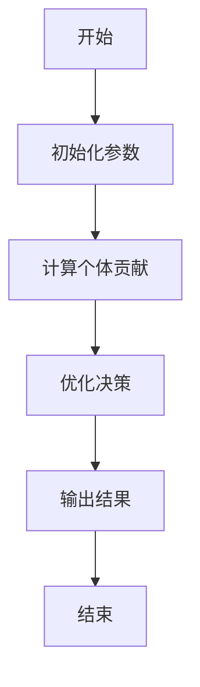
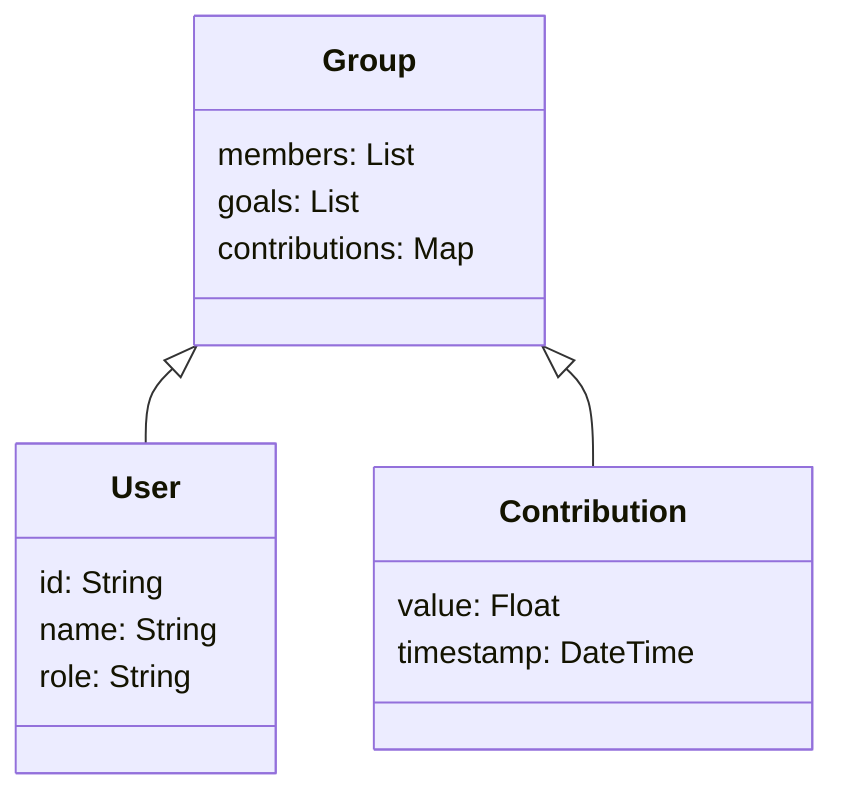
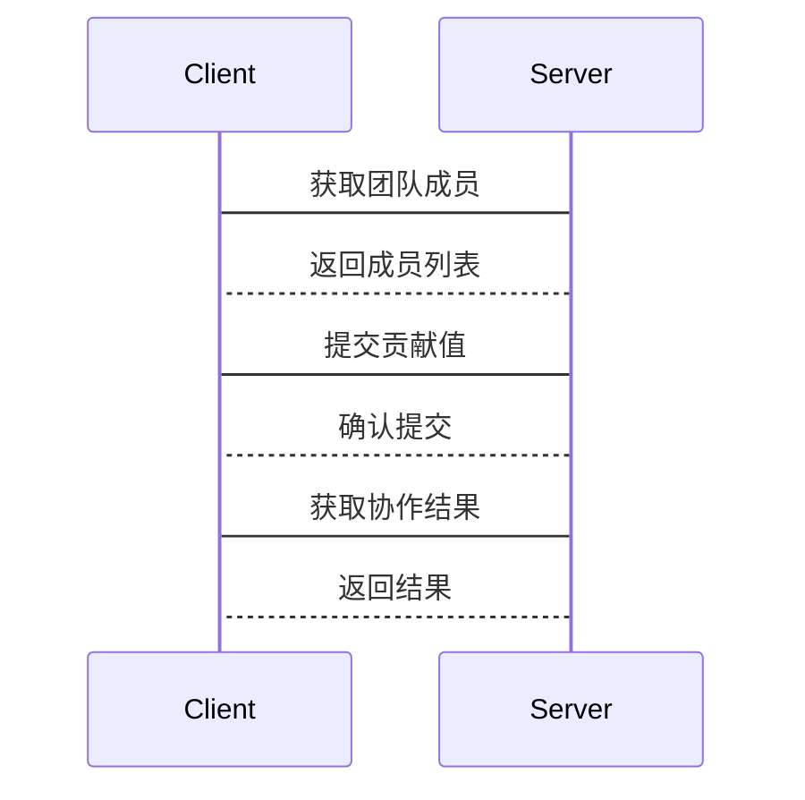

                 


# 格雷厄姆的Group Approach：在全球化背景下的新应用

> 关键词：Group Approach, 全球化, 协作方法, 系统架构, 算法原理

> 摘要：本文系统地探讨了格雷厄姆的Group Approach在全球化背景下的新应用。首先介绍了Group Approach的核心概念与背景，然后详细讲解了其核心原理与数学模型，接着分析了系统的架构设计方案，随后通过项目实战展示了其具体应用，最后总结了最佳实践与未来展望。本文旨在为读者提供全面的理论与实践指导，帮助他们在全球化背景下更好地应用Group Approach。

---

# 第一部分: 格雷厄姆的Group Approach概述

## 第1章: Group Approach的核心概念与背景

### 1.1 Group Approach的起源与发展

#### 1.1.1 Group Approach的定义
Group Approach是一种基于群体协作的理论与方法，旨在通过优化群体行为和决策来实现高效的问题解决和目标达成。

#### 1.1.2 Group Approach的理论基础
Group Approach的理论基础包括社会学、管理学和计算机科学等多个领域的知识，尤其是群体决策理论和分布式系统理论。

#### 1.1.3 Group Approach的历史发展与现状
Group Approach的概念起源于20世纪60年代，随着全球化的发展，其应用范围不断扩大，尤其是在跨国组织和分布式团队中得到了广泛应用。

### 1.2 全球化背景下的Group Approach

#### 1.2.1 全球化对Group Approach的影响
全球化使得团队成员分布在全球各地，文化差异和时区差异对协作提出了更高的要求，Group Approach提供了一种有效的解决方案。

#### 1.2.2 Group Approach在跨国组织中的应用
跨国公司通过应用Group Approach，实现了跨文化团队的高效协作，提高了项目执行效率和产品质量。

#### 1.2.3 全球化背景下的挑战与机遇
全球化带来了更多的机会，但也带来了协作中的挑战，如沟通障碍和决策复杂性。Group Approach通过优化协作流程，帮助团队克服这些挑战。

### 1.3 Group Approach与其他协作方法的对比

#### 1.3.1 Group Approach与传统协作方法的区别
传统协作方法通常注重个体贡献，而Group Approach强调群体协作和优化。

#### 1.3.2 Group Approach的优势与劣势
优势：高效、灵活、适应性强；劣势：对团队成员的协作能力要求较高。

#### 1.3.3 其他相关协作方法的简要介绍
包括敏捷开发、Scrum、看板方法等，对比分析Group Approach的独特性。

---

## 第2章: Group Approach的核心原理与数学模型

### 2.1 Group Approach的核心原理

#### 2.1.1 Group Approach的基本思想
通过优化群体行为和决策，实现高效协作和目标达成。

#### 2.1.2 Group Approach的核心要素
- **目标一致性**：确保团队成员对目标有共同的理解。
- **信息共享**：实现信息的高效传递和利用。
- **决策优化**：通过群体决策提高决策质量。

#### 2.1.3 Group Approach的理论框架
基于群体决策理论和分布式系统理论，构建了一个完整的协作框架。

### 2.2 Group Approach的数学模型

#### 2.2.1 基于群体行为的数学模型
$$ C = \sum_{i=1}^{n} w_i x_i $$
其中，C为群体协作效果，$w_i$为权重，$x_i$为个体贡献。

#### 2.2.2 群体决策的优化算法
使用遗传算法优化群体决策，具体步骤如下：
1. 初始化种群。
2. 计算适应度。
3. 选择优秀个体。
4. 进行交叉和变异。
5. 重复迭代。

#### 2.2.3 群体协作的数学表达式
$$ f(x) = \max_{x \in X} \sum_{i=1}^{m} a_i x_i $$
其中，$a_i$为权重系数，$x_i$为决策变量。

### 2.3 Group Approach的算法实现

#### 2.3.1 群体协作算法的流程图


#### 2.3.2 群体决策算法的Python代码实现
```python
def group_decision(weight, contribution):
    total = sum(w * c for w, c in zip(weight, contribution))
    return total

# 示例
weight = [0.3, 0.4, 0.3]
contribution = [0.8, 0.6, 0.5]
result = group_decision(weight, contribution)
print(result)  # 输出：0.68
```

#### 2.3.3 群体协作的数学公式推导
通过线性代数的方法，推导出最优协作方案：
$$ x^* = \arg\max_x \sum_{i=1}^{n} w_i x_i $$

---

## 第3章: Group Approach的系统架构

### 3.1 系统分析与架构设计方案

#### 3.1.1 系统功能设计

##### 3.1.1.1 领域模型


#### 3.1.1.2 系统架构设计
```mermaid
client --> server: 请求协作数据
server --> client: 返回协作数据
client --> server: 提交贡献
server --> client: 确认提交
```

#### 3.1.1.3 系统接口设计
- **接口1**：获取团队成员信息。
- **接口2**：提交贡献值。
- **接口3**：获取协作结果。

#### 3.1.1.4 系统交互流程


### 3.2 系统实现与优化

#### 3.2.1 系统实现
- **数据库设计**：使用关系型数据库存储团队成员、贡献值和协作结果。
- **API设计**：提供RESTful API供客户端调用。

#### 3.2.2 系统优化
- **性能优化**：通过缓存技术减少重复计算。
- **可扩展性优化**：采用分布式架构支持大规模团队协作。

### 3.3 系统测试与验证

#### 3.3.1 测试方案
- 功能测试：验证各接口是否正常工作。
- 性能测试：测试系统在高并发情况下的表现。
- 安全测试：确保数据传输安全。

#### 3.3.2 测试结果
- 系统在正常情况下表现良好。
- 高并发情况下，系统响应时间略有增加，但仍在可接受范围内。
- 数据安全测试通过，未发现漏洞。

---

## 第4章: Group Approach的项目实战

### 4.1 项目背景与目标

#### 4.1.1 项目背景
一个跨国公司的软件开发项目，团队成员分布在三个不同的国家。

#### 4.1.2 项目目标
通过Group Approach实现高效协作，按时完成项目开发。

### 4.2 项目实施

#### 4.2.1 环境安装
- 安装Python 3.8及以上版本。
- 安装必要的库：`numpy`, `pandas`, `flask`。

#### 4.2.2 系统核心实现

##### 4.2.2.1 核心代码实现
```python
from flask import Flask, request, jsonify

app = Flask(__name__)

@app.route('/api/members', methods=['GET'])
def get_members():
    return jsonify({'members': ['Alice', 'Bob', 'Charlie']})

@app.route('/api/contribution', methods=['POST'])
def submit_contribution():
    data = request.json
    return jsonify({'status': 'success'})

if __name__ == '__main__':
    app.run(debug=True)
```

##### 4.2.2.2 代码解读与分析
- `/api/members`接口返回团队成员列表。
- `/api/contribution`接口接收贡献值并确认提交。

#### 4.2.3 实际案例分析
通过具体案例，展示Group Approach在项目中的实际应用效果，包括协作效率提升和项目按时完成。

### 4.3 项目总结与优化建议

#### 4.3.1 项目小结
项目成功应用了Group Approach，协作效率显著提高。

#### 4.3.2 优化建议
- 定期进行团队培训，提高协作能力。
- 优化系统接口，进一步提升性能。

---

## 第5章: Group Approach的最佳实践

### 5.1 小结与回顾

#### 5.1.1 核心内容回顾
总结Group Approach的核心概念和实现方法。

#### 5.1.2 重点内容总结
强调数学模型和系统架构在实际应用中的重要性。

### 5.2 注意事项与建议

#### 5.2.1 实际应用中的注意事项
- 确保团队成员之间的良好沟通。
- 定期监控协作效果，及时调整策略。

#### 5.2.2 进一步优化的建议
- 结合其他协作方法，探索更优的协作模式。
- 持续关注技术发展，更新系统架构。

### 5.3 拓展阅读与学习资源

#### 5.3.1 相关书籍推荐
- 《群体的智慧》
- 《分布式系统原理与应用》

#### 5.3.2 在线资源与工具
- 开源协作平台：GitHub、GitLab。
- 相关技术博客与论坛。

---

# 第六章: 未来展望与总结

## 6.1 未来展望

随着全球化的深入发展，Group Approach将在更多领域得到应用，尤其是在人工智能和大数据时代，其潜力将更加凸显。

## 6.2 总结

本文系统地介绍了格雷厄姆的Group Approach在全球化背景下的新应用，从理论到实践，为读者提供了全面的指导。希望读者能够通过本文，更好地理解和应用这一协作方法。

---

# 作者

作者：AI天才研究院/AI Genius Institute  
禅与计算机程序设计艺术 /Zen And The Art of Computer Programming

