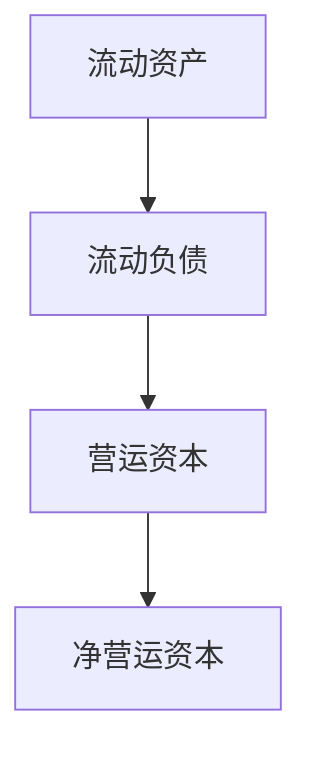
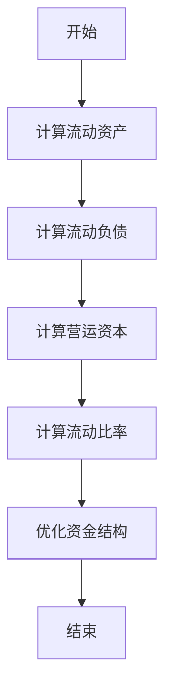

                 


# 格雷厄姆的Working Capital管理：运营效率的重要性

## 关键词：格雷厄姆、Working Capital、营运资本、运营效率、财务管理、企业运营

## 摘要：本文深入探讨了格雷厄姆关于Working Capital管理的理论与实践，分析了其在企业运营中的重要性。通过详细阐述营运资本的组成、管理策略及优化方法，结合实际案例和财务分析工具，帮助读者理解如何有效提升企业的运营效率和财务健康状况。文章内容涵盖背景介绍、核心概念、算法原理、系统架构及项目实战，为读者提供全面的指导。

---

## 第一部分：Working Capital管理基础

### 第1章：Working Capital概述

#### 1.1 Working Capital的基本概念

- **1.1.1 营运资本的定义**
  营运资本（Working Capital）是指企业在日常运营中所需的流动资产与流动负债的差额，用于衡量企业短期偿债能力和运营资金的流动性。公式为：
  $$ \text{营运资本} = \text{流动资产} - \text{流动负债} $$

- **1.1.2 营运资本的组成与分类**
  - 流动资产：现金、应收账款、存货等。
  - 流动负债：应付账款、短期借款等。

- **1.1.3 营运资本在企业运营中的重要性**
  营运资本是企业维持日常运营的基础，直接影响企业的偿债能力、资金效率和运营稳定性。

#### 1.2 营运资本管理的核心目标

- **1.2.1 维持企业日常运营的流动性**
  确保企业有足够的流动资金应对日常开支和突发情况。

- **1.2.2 优化资产使用效率**
  提高存货周转率、应收账款回收率等，降低资金占用。

- **1.2.3 平衡短期负债与流动资产的关系**
  通过合理匹配流动资产和流动负债，避免资金链断裂风险。

#### 1.3 营运资本管理的基本原则

- **1.3.1 确保短期偿债能力**
  保持足够的流动比率和速动比率，确保企业能够偿还短期债务。

- **1.3.2 优化资本结构**
  合理配置流动资产和流动负债，降低融资成本，提高资金使用效率。

- **1.3.3 提高资金使用效率**
  通过科学的资金分配，避免资金闲置或过度使用。

#### 1.4 本章小结

本章介绍了营运资本的基本概念、组成、分类及其在企业运营中的重要性，强调了营运资本管理的核心目标和基本原则。

---

### 第2章：营运资本管理的背景与现状

#### 2.1 当前企业面临的营运资本管理挑战

- **2.1.1 经济波动对企业营运资本的影响**
  经济衰退可能导致流动资产贬值，流动负债增加，影响企业营运资本的健康状况。

- **2.1.2 数字化时代对企业营运资本管理的需求**
  数字化转型要求企业采用更高效的资金管理工具和技术，提升营运资本管理的精准性和实时性。

- **2.1.3 全球化背景下营运资本管理的复杂性**
  跨国经营增加了营运资本管理的难度，需考虑不同国家的财务政策和市场环境。

#### 2.2 营运资本管理的核心问题

- **2.2.1 资金链断裂的风险**
  营运资本不足可能导致企业无法偿还短期债务，引发资金链断裂。

- **2.2.2 资产周转效率低下**
  库存积压、应收账款回收慢等问题会影响资金周转效率。

- **2.2.3 短期负债与流动资产的匹配问题**
  如果流动资产与流动负债的结构不合理，可能导致企业面临短期偿债压力。

#### 2.3 营运资本管理的行业差异

- **2.3.1 制造业的营运资本管理特点**
  制造业需关注库存管理和生产周期，优化供应链管理以降低营运资本占用。

- **2.3.2 零售业的营运资本管理特点**
  零售业需注重现金流管理，合理配置存货和应收账款，提高资金周转效率。

- **2.3.3 服务业的营运资本管理特点**
  服务业营运资本管理更关注现金流和客户信用管理，降低应收账款风险。

#### 2.4 本章小结

本章分析了当前企业在营运资本管理中面临的挑战，探讨了不同行业在营运资本管理中的特点和差异。

---

### 第3章：营运资本管理的核心概念与联系

#### 3.1 核心概念原理

- **3.1.1 流动资产与流动负债的关系**
  流动资产是企业的短期资产，流动负债是企业的短期债务，两者的差额即为营运资本。

- **3.1.2 营运资本周转率的计算公式**
  $$ \text{营运资本周转率} = \frac{\text{营业收入}}{\text{营运资本}} $$

- **3.1.3 净营运资本的定义与作用**
  净营运资本是流动资产减去流动负债后的净额，用于衡量企业短期偿债能力。

#### 3.2 概念属性特征对比表格

| 概念       | 属性特征                   |
|------------|----------------------------|
| 流动资产   | 可快速转化为现金的资产     |
| 流动负债   | 短期内需偿还的债务         |
| 营运资本   | 流动资产减去流动负债的结果   |

#### 3.3 ER实体关系图



#### 3.4 本章小结

本章通过核心概念的对比和关系图，详细阐述了营运资本管理中的关键要素及其相互关系。

---

### 第4章：营运资本管理的算法原理

#### 4.1 算法原理概述

- **4.1.1 营运资本周转率计算**
  通过计算营业收入与营运资本的比率，评估企业营运资本的使用效率。

- **4.1.2 净营运资本与流动比率的关系**
  流动比率（$$ \text{流动比率} = \frac{\text{流动资产}}{\text{流动负债}} $$）是评估企业短期偿债能力的重要指标，净营运资本则是流动资产与流动负债的差额。

- **4.1.3 资金链优化算法**
  通过优化流动资产和流动负债的结构，降低资金占用，提高资金周转效率。

#### 4.2 算法流程图



#### 4.3 本章小结

本章通过算法原理和流程图，展示了如何通过计算和优化营运资本来提升企业的财务健康状况。

---

### 第5章：系统分析与架构设计方案

#### 5.1 项目介绍

- **5.1.1 项目背景**
  某制造企业面临库存积压和应收账款回收慢的问题，希望通过优化营运资本管理提升运营效率。

#### 5.2 系统功能设计

- **5.2.1 领域模型设计**
  ```mermaid
  classDiagram
      class 流动资产 {
          现金
          应收账款
          存货
      }
      class 流动负债 {
          应付账款
          短期借款
      }
      class 营运资本管理 {
          计算营运资本
          优化库存管理
          管理应收账款
      }
      流动资产 --> 营运资本管理
      流动负债 --> 营运资本管理
  ```

- **5.2.2 系统架构设计**
  ```mermaid
  context diagram
      系统：营运资本管理系统
          includes
              用户：企业财务人员
              数据库：财务数据
              外部系统：银行、供应商、客户
  ```

- **5.2.3 系统接口设计**
  - 输入接口：财务数据录入、供应商信息同步、客户订单管理。
  - 输出接口：营运资本报告、库存周转分析、应收账款回收预测。

- **5.2.4 系统交互设计**
  ```mermaid
  sequenceDiagram
      用户 -> 系统：输入财务数据
      系统 -> 数据库：查询流动资产和流动负债
      系统 -> 用户：输出营运资本报告
      用户 -> 系统：优化库存管理
      系统 -> 供应商：同步采购订单
      系统 -> 用户：输出库存周转分析
  ```

#### 5.3 本章小结

本章通过系统设计和架构图，展示了如何通过信息化手段优化营运资本管理，提升企业的运营效率。

---

### 第6章：项目实战

#### 6.1 环境安装

- **6.1.1 软件安装**
  安装Python、Pandas、Matplotlib等工具，用于数据处理和可视化。

#### 6.2 系统核心实现源代码

```python
import pandas as pd
import matplotlib.pyplot as plt

# 数据加载
df = pd.read_csv('financial_data.csv')

# 营运资本计算
operating_capital = df['流动资产'] - df['流动负债']

# 绘制营运资本变化趋势图
plt.figure(figsize=(10, 6))
plt.plot(df['日期'], operating_capital, 'b-', marker='o')
plt.title('营运资本变化趋势')
plt.xlabel('日期')
plt.ylabel('营运资本')
plt.grid(True)
plt.show()
```

#### 6.3 代码应用解读与分析

- **6.3.1 数据加载与处理**
  使用Pandas加载财务数据，并计算营运资本。

- **6.3.2 数据可视化**
  通过Matplotlib绘制营运资本变化趋势图，帮助财务人员直观了解营运资本的波动情况。

#### 6.4 实际案例分析

- **6.4.1 案例背景**
  某制造企业面临库存积压和应收账款回收慢的问题，导致营运资本周转效率低下。

- **6.4.2 数据分析**
  计算营运资本周转率和流动比率，发现库存周转率低于行业平均水平，应收账款回收周期较长。

- **6.4.3 优化策略**
  优化库存管理，实施ABC分类法，缩短采购周期；优化应收账款管理，采用分期付款政策，提高回收率。

#### 6.5 本章小结

本章通过实际案例分析和代码实现，展示了如何利用数据驱动的方法优化营运资本管理，提升企业的运营效率。

---

### 第7章：总结与展望

#### 7.1 本章总结

本文深入探讨了格雷厄姆关于营运资本管理的理论与实践，分析了营运资本管理在企业运营中的重要性，提出了优化营运资本管理的具体策略和方法。

#### 7.2 未来展望

随着数字化和智能化技术的发展，未来营运资本管理将更加依赖大数据和人工智能技术，实现更精准的资金管理和风险控制。企业应积极拥抱新技术，提升营运资本管理的效率和效果。

---

### 作者：AI天才研究院/AI Genius Institute & 禅与计算机程序设计艺术/Zen And The Art of Computer Programming

