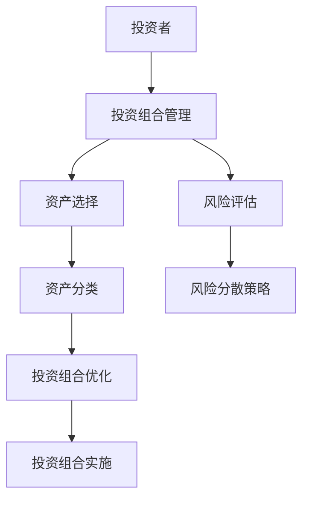
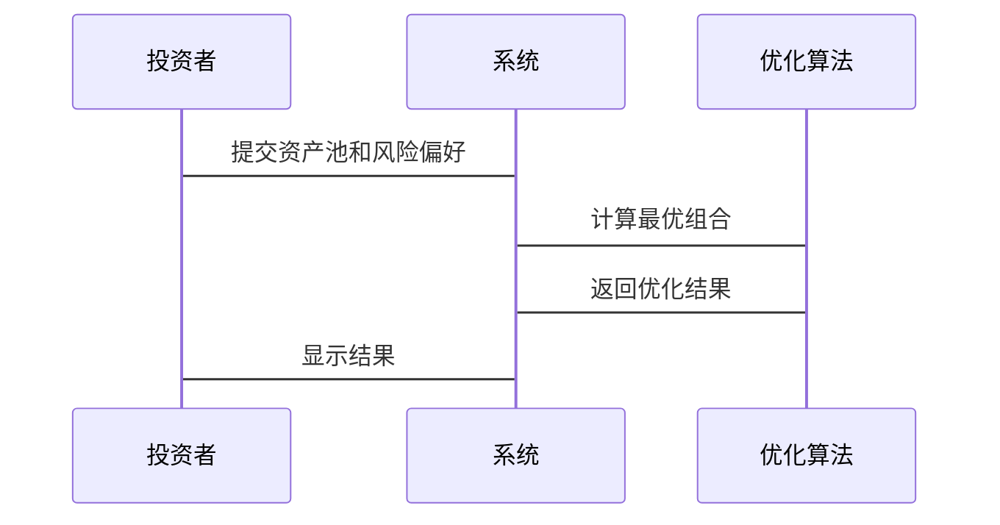

                 


```markdown
# 格雷厄姆的分散化原则：降低投资风险

> 关键词：格雷厄姆，分散投资，投资风险，资产配置，投资组合优化，风险管理

> 摘要：本文详细探讨了格雷厄姆的分散化原则，分析其在降低投资风险中的作用。通过介绍分散投资的核心概念、数学模型、系统架构设计以及实际案例，本文为投资者提供了降低风险的有效策略。

---

# 第一部分：引言

## 第1章：投资风险与分散投资的引言

### 1.1 投资风险的重要性
- 1.1.1 投资风险的定义与分类
  - 系统性风险与非系统性风险
  - 市场风险、流动性风险、信用风险等

- 1.1.2 投资风险对企业的影响
  - 资产贬值、财务损失、信誉损失
  - 对企业运营稳定性的影响

- 1.1.3 分散投资的必要性
  - 风险降低的理论基础
  - 分散化投资如何平滑收益波动

### 1.2 格雷厄姆投资理论的背景
- 1.2.1 格雷厄姆的生平简介
  - 本杰明·格雷厄姆的学术贡献
  - 他对价值投资的深远影响

- 1.2.2 格雷厄姆投资理论的核心思想
  - 安全边际的概念
  - 投资的长期视角

- 1.2.3 格雷厄姆与价值投资的关系
  - 价值投资的定义与核心原则
  - 格雷厄姆对价值投资的贡献

### 1.3 分散投资的原则与目标
- 1.3.1 分散投资的核心原则
  - 不将所有资金投入单一资产
  - 通过多样化降低特定风险

- 1.3.2 分散投资的目标与优势
  - 最小化非系统性风险
  - 平衡风险与收益

- 1.3.3 分散投资的边界与外延
  - 投资组合的构建原则
  - 分散化与投资期限的关系

### 1.4 本章小结
- 1.4.1 格雷厄姆分散投资的背景
  - 投资风险的系统性与非系统性
  - 分散投资的理论基础

- 1.4.2 分散投资的核心概念
  - 分散化与风险降低的关系
  - 格雷厄姆理论的核心要素

- 1.4.3 本章内容的总结
  - 分散投资的重要性
  - 格雷厄姆理论的现代应用

---

# 第二部分：格雷厄姆分散投资的核心概念与联系

## 第2章：格雷厄姆分散投资的核心概念

### 2.1 格雷厄姆分散投资的原理
- 2.1.1 分散投资的基本原理
  - 非相关资产的组合效应
  - 投资组合的收益与风险权衡

- 2.1.2 分散投资的数学模型
  - 现代投资组合理论（MPT）简介
  - 均值-方差优化模型

- 2.1.3 分散投资的实现方法
  - 资产配置策略
  - 定期再平衡

### 2.2 格雷厄姆分散投资的核心要素
- 2.2.1 资产配置的重要性
  - 不同资产类别的风险与收益
  - 资产配置的动态调整

- 2.2.2 风险分散的实现方式
  - 行业分散、地域分散、资产类别分散
  - 如何选择相关性低的资产

- 2.2.3 投资组合的优化策略
  - 风险承受能力与收益目标的匹配
  - 使用数学模型优化投资组合

### 2.3 格雷厄姆分散投资的属性特征对比
- 2.3.1 分散投资的属性特征
  - 风险分散性与收益稳定性
  - 投资组合的流动性

- 2.3.2 核心要素的对比分析
  - 资产配置与分散化的关系
  - 不同分散策略的优缺点

- 2.3.3 分散投资的优缺点对比
  - 分散化的优势：降低特定风险
  - 分散化的劣势：难以捕捉高收益机会

### 2.4 格雷厄姆分散投资的ER实体关系图
```mermaid
erDiagram
    investor++ o-[:投资] portfolio
    portfolio ++ o-[:包含] asset
    asset ++ o-[:属于] category
    category ++ o-[:涵盖] risk_type
```

---

## 第3章：格雷厄姆分散投资的数学模型与算法原理

### 3.1 分散投资的数学模型
- 3.1.1 现代投资组合理论（MPT）
  - 均值-方差优化模型
  - 最小方差组合与最优风险-收益组合

- 3.1.2 资本资产定价模型（CAPM）
  - 预测资产的预期收益
  - 评估资产的系统性风险

### 3.2 分散投资的算法原理
- 3.2.1 均值-方差优化算法
  - 计算资产的期望收益和方差
  - 确定无风险利率和风险溢价
  - 优化投资组合的权重

- 3.2.2 投资组合再平衡算法
  - 确定目标配置比例
  - 计算当前与目标的偏差
  - 调整头寸以实现再平衡

### 3.3 分散投资的实现步骤
- 3.3.1 数据收集与预处理
  - 获取资产的历史收益数据
  - 填补缺失值和处理异常值

- 3.3.2 计算资产的相关性矩阵
  - 使用协方差矩阵衡量相关性
  - 分析资产之间的相关性对分散化效果的影响

- 3.3.3 优化投资组合
  - 使用数学模型计算最优权重
  - 调整投资组合以最小化风险或最大化收益

---

## 第4章：系统分析与架构设计

### 4.1 投资组合管理系统架构


- 4.1.1 系统功能设计
  - 用户输入：资产池选择、风险承受能力
  - 系统输出：最优投资组合、风险-收益分析

- 4.1.2 系统架构设计
  - 前端：用户界面，输入参数和查看结果
  - 后端：计算引擎，实现优化算法
  - 数据层：存储历史数据和计算结果

### 4.2 系统接口设计
- 4.2.1 API接口定义
  - 输入：资产列表、权重、风险偏好
  - 输出：优化后的投资组合、风险指标

- 4.2.2 接口实现
  - RESTful API设计
  - 使用Python Flask或Django框架

### 4.3 系统交互流程


---

## 第5章：项目实战

### 5.1 环境安装与配置
- 安装Python和必要的库（如NumPy、Pandas、Scipy）
- 安装优化工具（如CVXOPT或Pyomo）

### 5.2 核心实现代码
```python
import numpy as np
from scipy.optimize import minimize

def portfolio_optimization(returns, cov_matrix, risk_aversion):
    n = len(returns)
    # 定义目标函数
    def objective(weights):
        return (weights.T @ cov_matrix @ weights)[0,0] / 2
    # 定义约束条件
    constraints = [
        ('sum_eq', weights @ np.ones(n) - 1 == 0)
    ]
    # 求解优化问题
    result = minimize(objective, np.ones(n)/n, method='SLSQP', 
                     constraints=constraints)
    return result.x

# 示例数据
returns = np.array([0.1, 0.2, 0.15])
cov_matrix = np.array([[0.02, 0.01, 0.01],
                        [0.01, 0.03, 0.02],
                        [0.01, 0.02, 0.03]])
weights = portfolio_optimization(returns, cov_matrix, 1)
print(weights)
```

### 5.3 代码解读与分析
- 数据输入：收益矩阵和协方差矩阵
- 优化目标：最小化投资组合的方差
- 约束条件：权重之和为1
- 优化结果：最优权重

### 5.4 实际案例分析
- 使用具体资产数据进行优化
- 分析不同分散策略下的风险与收益

### 5.5 项目小结
- 项目实现的关键点
- 分散投资的实际效果
- 优化算法的局限性与改进方向

---

## 第6章：总结与最佳实践

### 6.1 本章总结
- 格雷厄姆分散投资的核心思想
- 数学模型与算法实现
- 系统设计与项目实战

### 6.2 小结与注意事项
- 分散投资的边界条件
- 算法优化的注意事项
- 实际应用中的风险提示

### 6.3 拓展阅读与深入学习
- 推荐相关书籍和论文
- 建议进一步研究的方向

---

# 作者：AI天才研究院/AI Genius Institute & 禅与计算机程序设计艺术 /Zen And The Art of Computer Programming
```

