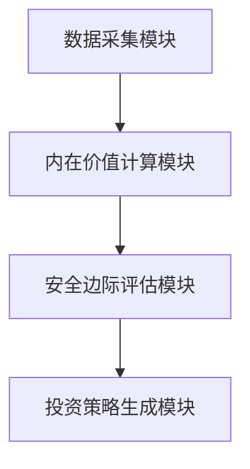

                 


# 格雷厄姆的价值投资公式解析

## 关键词：价值投资，格雷厄姆，安全边际，内在价值，投资公式

## 摘要：格雷厄姆的价值投资公式是投资学中的经典理论，它通过内在价值、安全边际等核心概念，为投资者提供了一种科学的投资决策方法。本文将详细解析格雷厄姆的投资公式，探讨其数学模型、系统架构及实际应用。

---

# 第一部分: 格雷厄姆价值投资公式的核心理念

## 第1章: 价值投资的背景与发展

### 1.1 价值投资的起源与核心理念

- **1.1.1 投资学的演进历程**  
  价值投资的起源可以追溯到18世纪的英国工业革命，早期投资者开始关注企业的内在价值。20世纪初，本杰明·格雷厄姆和戴维德·多德提出了价值投资的理论框架，奠定了现代价值投资的基础。

- **1.1.2 格雷厄姆与价值投资的诞生**  
  本杰明·格雷厄姆是价值投资之父，他在1934年出版的《证券分析》一书中首次系统性地提出了价值投资的方法论，强调安全边际和内在价值的重要性。

- **1.1.3 价值投资的核心理念与特点**  
  价值投资的核心理念是寻找市场价格低于内在价值的股票，通过安全边际来降低投资风险。其特点是注重基本面分析、长期投资和逆向思维。

### 1.2 格雷厄姆投资公式的基本框架

- **1.2.1 投资决策的三要素：安全、收益、风险**  
  格雷厄姆的投资公式以安全为首要原则，强调在确保本金安全的前提下追求超额收益。

- **1.2.2 格雷厄姆公式的核心要素**  
  格雷厄姆的投资公式主要包括内在价值（Intrinsic Value）、市场价格（Market Price）、安全边际（Margin of Safety）三个核心要素。

- **1.2.3 价值投资与其他投资策略的对比**  
  与技术分析和趋势投资不同，价值投资注重基本面分析，强调长期持有和安全边际的重要性。

---

## 第2章: 格雷厄姆价值投资公式的数学模型

### 2.1 格雷厄姆内在价值计算公式

- **2.1.1 内在价值的定义与公式**  
  内在价值是企业未来现金流的现值，公式为：
  $$ V = \frac{E}{(1 + r)^n} $$
  其中，\( E \) 为未来现金流，\( r \) 为折现率，\( n \) 为时间跨度。

- **2.1.2 格雷厄姆安全边际的计算方法**  
  安全边际公式为：
  $$ S = V - P $$
  其中，\( V \) 为内在价值，\( P \) 为市场价格。安全边际越大，投资风险越小。

- **2.1.3 格雷厄姆公式中的关键参数解释**  
  - **折现率 \( r \)**：反映市场的风险偏好，通常取长期国债收益率或行业平均回报率。  
  - **未来现金流 \( E \)**：基于企业历史业绩和未来增长预测得出。  
  - **安全边际 \( S \)**：投资者在市场价格低于内在价值时买入，安全边际为正值时投资具有吸引力。

### 2.2 格雷厄姆投资公式的应用案例

- **案例一：某公司内在价值计算**  
  假设某公司未来5年的现金流分别为100万、120万、150万、180万、200万，折现率为8%。计算其内在价值：
  $$ V = \frac{100}{(1.08)^1} + \frac{120}{(1.08)^2} + \frac{150}{(1.08)^3} + \frac{180}{(1.08)^4} + \frac{200}{(1.08)^5} $$

- **案例二：安全边际的实际应用**  
  若某股票的内在价值 \( V \) 为50元，市场价格 \( P \) 为40元，则安全边际 \( S = 50 - 40 = 10 \) 元，安全边际率为20%，具有较高的投资吸引力。

- **案例三：市场波动对投资决策的影响**  
  市场价格的波动会影响安全边际的计算，投资者需要根据市场变化动态调整投资决策。

---

## 第3章: 格雷厄姆价值投资公式的系统架构设计

### 3.1 投资决策系统的功能模块

- **数据采集模块**  
  采集企业的财务数据、行业信息和市场数据，为后续计算提供基础数据。

- **内在价值计算模块**  
  基于现金流折现法计算企业的内在价值，使用公式：
  $$ V = \sum_{t=1}^{n} \frac{CF_t}{(1 + r)^t} $$
  其中，\( CF_t \) 为第 \( t \) 年的现金流。

- **安全边际评估模块**  
  计算安全边际 \( S = V - P \)，评估投资的安全性。

- **投资策略生成模块**  
  根据内在价值和安全边际生成投资策略，包括买入、持有或卖出的决策。

### 3.2 系统架构的Mermaid图



### 3.3 系统接口设计与交互

- **数据接口**  
  通过API接口获取实时市场数据和企业财务数据。

- **用户界面**  
  提供友好的用户界面，展示内在价值、安全边际和投资策略。

---

## 第4章: 格雷厄姆价值投资公式的项目实战

### 4.1 项目环境安装与配置

- **Python环境的搭建**  
  安装Python 3.x，推荐使用Anaconda或virtualenv管理环境。

- **必要库的安装**  
  使用以下命令安装所需库：
  ```bash
  pip install numpy pandas matplotlib
  ```

### 4.2 核心代码实现

- **内在价值计算函数**
  ```python
  def calculate_intrinsic_value(cash_flows, discount_rate):
      return sum([cf / (1 + discount_rate) ** t for t, cf in enumerate(cash_flows)])
  ```

- **安全边际计算函数**
  ```python
  def calculate_margin_ofSafety(intrinsic_value, market_price):
      return intrinsic_value - market_price
  ```

### 4.3 项目实战案例：苹果公司的投资价值分析

- **案例分析**
  假设苹果公司的未来现金流和折现率已知，计算其内在价值和安全边际：
  ```python
  cash_flows = [1000, 1200, 1500, 1800, 2000]
  discount_rate = 0.08
  iv = calculate_intrinsic_value(cash_flows, discount_rate)
  market_price = 300
  mos = calculate_margin_ofSafety(iv, market_price)
  print(f"内在价值: {iv:.2f}, 安全边际: {mos:.2f}")
  ```

---

## 第5章: 总结与展望

### 5.1 总结

格雷厄姆的价值投资公式为投资者提供了一种科学的投资方法，通过内在价值和安全边际的计算，帮助投资者做出更理性的投资决策。本文详细解析了格雷厄姆公式的数学模型、系统架构和实际应用，为投资者提供了理论和实践的双重指导。

### 5.2 展望

未来，价值投资公式可以结合人工智能和大数据技术进行动态调整，进一步提升投资决策的科学性和效率。此外，投资者可以结合其他投资策略，如成长投资和股息投资，构建多元化投资组合，降低风险并提高收益。

---

## 作者：AI天才研究院 & 禅与计算机程序设计艺术

感谢您的阅读！如需进一步了解格雷厄姆的价值投资公式或相关技术细节，请随时联系。

