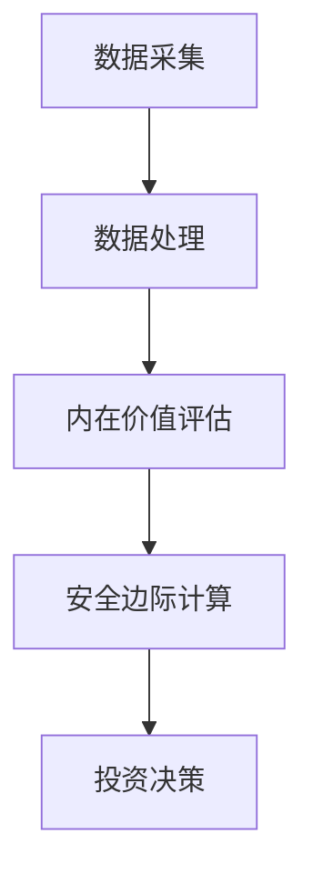

                 


# 格雷厄姆的价值投资公式：寻找被低估的股票

> **关键词**：格雷厄姆，价值投资，安全边际，内在价值，市盈率，市净率

> **摘要**：本文深入探讨了格雷厄姆的价值投资理论，分析了其核心概念，包括安全边际和内在价值，并通过具体案例展示了如何运用这些概念寻找被低估的股票。文章还介绍了价值投资的数学模型和系统架构，帮助读者理解如何在实际投资中应用这些方法。

---

# 第一部分: 价值投资的背景与核心概念

## 第1章: 价值投资的起源与发展

### 1.1 价值投资的起源

价值投资是一种以基本面分析为基础的投资策略，其核心在于寻找市场价格低于其内在价值的股票。这一理念的起源可以追溯到20世纪初。

#### 1.1.1 投资的定义与目标

投资的本质是通过购买资产，在未来获得收益或资本增值。价值投资的目标是找到那些市场价格低于其真实价值的资产，从而在长期获得超额收益。

#### 1.1.2 格雷厄姆的贡献

本杰明·格雷厄姆（Benjamin Graham）是价值投资的奠基人，他的理论为现代投资学奠定了基础。格雷厄姆强调，股票不仅是价格标签，更是一笔企业所有权的 claim。他提出了“安全边际”的概念，即在购买股票时，确保市场价格远低于其内在价值，从而降低投资风险。

#### 1.1.3 价值投资的现代发展

尽管格雷厄姆的价值投资理论诞生于20世纪30年代，但其核心思想至今仍被广泛应用于投资实践中。投资者如沃伦·巴菲特（Warren Buffett）等人，都将格雷厄姆的理论作为自己的投资哲学的基础。

---

## 第2章: 格雷厄姆的价值投资理论

### 2.1 格雷厄姆的核心思想

#### 2.1.1 安全边际的概念与应用

安全边际是价值投资的核心理念之一。它指的是股票的市场价格与内在价值之间的差距。通过计算安全边际，投资者可以确保自己以合理的价格购买股票，从而降低投资风险。

##### 公式：$$\text{安全边际} = \text{内在价值} - \text{市场价格}$$

##### 计算步骤：
1. **计算内在价值**：通过基本面分析确定企业的内在价值。
2. **确定市场价格**：观察当前股票的市场价格。
3. **计算安全边际**：将内在价值减去市场价格，得出安全边际。

#### 2.1.2 内在价值的计算方法

内在价值是企业未来现金流的现值。格雷厄姆提出了多种方法来估算内在价值，其中最常用的是基于市盈率和市净率的分析。

##### 市盈率法：
$$\text{内在价值} = \text{每股收益} \times \text{合理市盈率}$$

##### 市净率法：
$$\text{内在价值} = \text{每股净资产} \times \text{合理市净率}$$

---

## 第3章: 价值投资的适用场景与边界

### 3.1 价值投资的适用范围

价值投资适用于那些企业基本面稳定、财务状况健康的公司。在成熟市场中，投资者更容易找到被低估的股票，而在新兴市场中，由于市场波动较大，价值投资的难度更高。

### 3.2 价值投资的边界与限制

尽管价值投资是一种有效的投资策略，但它也有其局限性。例如，在经济周期的波动中，某些行业的内在价值可能受到较大影响，从而影响投资决策。

---

# 第二部分: 价值投资的核心算法与数学模型

## 第4章: 安全边际的计算方法

### 4.1 安全边际的定义与公式

安全边际是衡量股票投资风险的重要指标。它通过比较市场价格与内在价值之间的差异，帮助投资者确定投资的安全性。

##### 公式：$$\text{安全边际} = \text{内在价值} - \text{市场价格}$$

### 4.2 安全边际的计算步骤

1. **计算内在价值**：通过基本面分析确定企业的内在价值。
2. **确定市场价格**：观察当前股票的市场价格。
3. **计算安全边际**：将内在价值减去市场价格，得出安全边际。

---

## 第5章: 内在价值的评估模型

### 5.1 内在价值的计算公式

内在价值是企业未来现金流的现值。格雷厄姆提出了多种方法来估算内在价值，其中最常用的是基于市盈率和市净率的分析。

##### 市盈率法：
$$\text{内在价值} = \text{每股收益} \times \text{合理市盈率}$$

##### 市净率法：
$$\text{内在价值} = \text{每股净资产} \times \text{合理市净率}$$

### 5.2 内在价值的评估步骤

1. **确定企业的盈利能力**：计算净利润、ROE等指标。
2. **评估企业的成长潜力**：分析行业前景和竞争优势。
3. **计算合理的折现率**：通常使用无风险利率加风险溢价。

---

## 第6章: 市场先生的模型与应用

### 6.1 市场先生的定义与特征

市场先生是格雷厄姆提出的虚拟人物，代表股票市场的波动性。市场先生每天都会以不同的价格购买或出售股票，投资者需要在市场先生的报价中找到投资机会。

### 6.2 市场先生的数学模型

市场先生的报价可以用概率分布来描述，投资者需要通过分析市场波动性来确定投资策略。

##### 公式：$$\text{市场波动} = \sqrt{\text{方差}}$$

---

# 第三部分: 价值投资的系统分析与架构设计

## 第7章: 价值投资的系统架构

### 7.1 投资流程的系统架构

#### 7.1.1 数据采集与处理

1. 收集企业的财务数据（如净利润、ROE等）。
2. 获取股票的市场价格数据。

#### 7.1.2 内在价值评估模块

1. 使用市盈率法或市净率法计算内在价值。
2. 确定合理市盈率或市净率。

#### 7.1.3 安全边际计算模块

1. 计算安全边际。
2. 确定是否满足投资条件。

#### 7.1.4 投资决策模块

1. 根据安全边际和内在价值做出投资决策。
2. 调整投资组合。

---

## 第8章: 价值投资的数学模型与算法实现

### 8.1 内在价值计算的数学模型

##### 市盈率法：
$$\text{内在价值} = \text{每股收益} \times \text{合理市盈率}$$

##### 市净率法：
$$\text{内在价值} = \text{每股净资产} \times \text{合理市净率}$$

### 8.2 安全边际计算的算法实现

```python
def calculate_intrinsic_value(eps, pe_ratio):
    intrinsic_value = eps * pe_ratio
    return intrinsic_value

def calculate_market_price(price):
    return price

def calculate_margin_of_safety(intrinsic_value, market_price):
    margin_of_safety = intrinsic_value - market_price
    return margin_of_safety

# 示例
eps = 5
pe_ratio = 15
intrinsic_value = calculate_intrinsic_value(eps, pe_ratio)
market_price = calculate_market_price(100)
margin_of_safety = calculate_margin_of_safety(intrinsic_value, market_price)
print(f"内在价值: {intrinsic_value}")
print(f"市场价格: {market_price}")
print(f"安全边际: {margin_of_safety}")
```

---

## 第9章: 价值投资的系统架构设计

### 9.1 系统功能设计

1. 数据采集与处理模块。
2. 内在价值评估模块。
3. 安全边际计算模块。
4. 投资决策模块。

### 9.2 系统架构图



---

## 第10章: 项目实战与案例分析

### 10.1 项目实战

#### 10.1.1 选股标准

1. 低市盈率（市盈率低于行业平均水平）。
2. 低市净率（市净率低于行业平均水平）。
3. 高股息率（股息率高于行业平均水平）。

#### 10.1.2 实际案例分析

假设我们分析一家公司，其每股收益为5元，合理市盈率为15倍，市场价格为100元。计算内在价值和安全边际：

1. 内在价值：$$5 \times 15 = 75$$
2. 安全边际：$$75 - 100 = -25$$

由于安全边际为负数，说明该股票价格被高估，不建议投资。

---

## 第11章: 最佳实践与注意事项

### 11.1 最佳实践

1. **长期投资**：价值投资需要耐心，避免短期波动的影响。
2. **分散投资**：通过分散投资降低风险。
3. **持续学习**：市场环境不断变化，需要不断学习和调整策略。

### 11.2 注意事项

1. **市场波动**：市场先生的报价可能会剧烈波动，影响投资决策。
2. **企业基本面变化**：企业的财务状况和行业环境可能会发生变化，影响内在价值。
3. **经济周期**：经济周期的波动会影响企业的盈利能力和股票价格。

---

## 第12章: 结语

价值投资是一种长期有效的投资策略，通过寻找被低估的股票，投资者可以在长期获得超额收益。格雷厄姆的价值投资公式为我们提供了一种科学的方法来评估股票的内在价值和市场价格之间的差异。然而，投资需要耐心、纪律和持续的学习，才能在复杂的市场环境中获得成功。

---

**作者：AI天才研究院/AI Genius Institute & 禅与计算机程序设计艺术 /Zen And The Art of Computer Programming**

