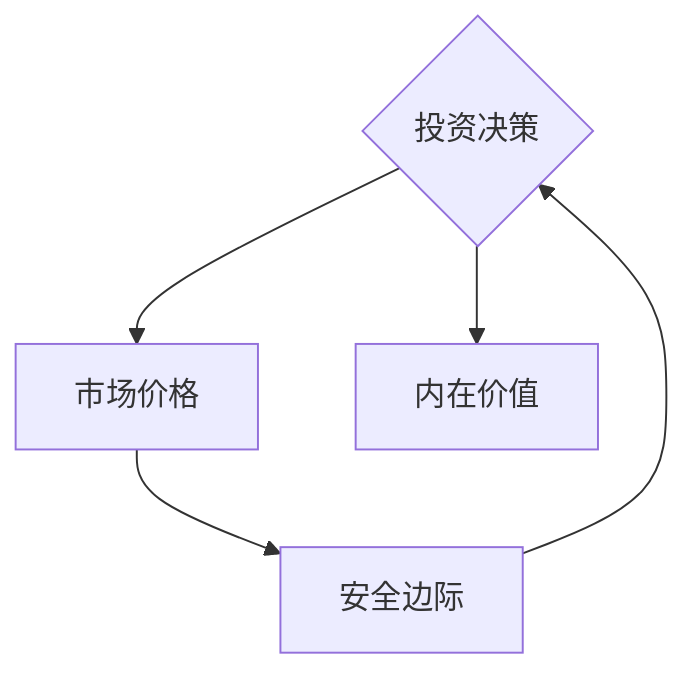

                 


# 格雷厄姆的价值投资教育理念

> 关键词：价值投资，本杰明·格雷厄姆，安全边际，内在价值，投资策略，防御性投资，投资教育

> 摘要：本文深入探讨了格雷厄姆的价值投资理念，结合技术语言和逻辑推理，分析其核心概念、数学模型和系统架构，通过案例分析和项目实战，帮助读者掌握价值投资的教育理念。

---

## 第一部分：价值投资的背景与核心理念

### 第1章：价值投资的起源与核心概念

#### 1.1 价值投资的起源

- **1.1.1 投资学的起源与发展**  
  投资学作为一门学科，起源于对经济学和金融学的深入研究。19世纪末和20世纪初，投资者开始关注市场的波动性和资产定价问题。1934年，本杰明·格雷厄姆与戴维·多德合著的《证券分析》一书，标志着价值投资理论的诞生。

- **1.1.2 格雷厄姆与价值投资的诞生**  
  本杰明·格雷厄姆是20世纪最著名的价值投资者之一。他在经历了1929年大萧条后，提出了以基本面分析为基础的价值投资方法，强调安全边际和长期稳健的投资策略。

- **1.1.3 价值投资的核心理念与目标**  
  价值投资的核心理念是通过分析公司的基本面，找到市场价格低于内在价值的投资标的。其目标是通过长期持有优质资产，实现稳定的超额收益。

#### 1.2 格雷厄姆的生平与贡献

- **1.2.1 格雷厄姆的生平简介**  
  本杰明·格雷厄姆（1894-1976）是美国著名的投资家和教育家。他在哥伦比亚大学教授证券分析，并培养了许多著名投资者，如沃伦·巴菲特。

- **1.2.2 格雷厄姆对投资学的贡献**  
  格雷厄姆提出了“安全边际”概念，强调在投资时应考虑市场价格与内在价值的差异，避免情绪化决策。

- **1.2.3 格雷厄姆的价值投资哲学**  
  格雷厄姆认为，市场波动反映的是短期情绪，而内在价值反映的是企业的长期基本面。投资者应以低于内在价值的价格买入优质资产，并长期持有。

#### 1.3 价值投资的基本原则

- **1.3.1 安全边际的概念与重要性**  
  安全边际是市场价格与内在价值之间的差距，提供了投资的安全性。它能够缓冲短期市场波动带来的风险。

- **1.3.2 市场先生的比喻与投资决策**  
  格雷厄姆将市场波动比作“市场先生”，提醒投资者避免被短期情绪左右，专注于长期价值。

- **1.3.3 避免情绪化投资的重要性**  
  情绪化投资是价值投资的大敌，投资者应保持理性，避免追涨杀跌。

---

### 第2章：价值投资的核心概念与联系

#### 2.1 核心概念原理

- **2.1.1 安全边际的数学模型**  
  安全边际公式：  
  $$\text{安全边际} = \text{内在价值} - \text{市场价格}$$  
  通过计算安全边际，投资者可以评估投资标的的风险和潜在收益。

- **2.1.2 内在价值的计算方法**  
  内在价值是基于公司基本面的合理估值。常用的计算方法包括DCF模型和市盈率法。  
  DCF模型公式：  
  $$\text{内在价值} = \frac{\text{现金流}}{\text{折现率}}$$

- **2.1.3 市场波动与投资机会的关系**  
  市场波动为投资者提供了以低于内在价值的价格买入优质资产的机会。通过分析波动，投资者可以捕捉短期市场错误定价带来的长期收益。

#### 2.2 核心概念对比表格

| 概念               | 价值投资               | 成长投资               |
|--------------------|------------------------|------------------------|
| 投资目标           | 稳定收益，注重安全边际 | 高增长，注重未来潜力   |
| 投资策略           | 买入低估资产           | 买入高增长资产         |
| 风险容忍度         | 较低                  | 较高                  |

#### 2.3 ER实体关系图



---

### 第3章：价值投资的数学模型与算法原理

#### 3.1 安全边际的数学模型

- **安全边际的公式推导**  
  安全边际是内在价值与市场价格的差额：  
  $$\text{安全边际} = \text{内在价值} - \text{市场价格}$$  
  通过计算安全边际，投资者可以评估投资的安全性。

- **安全边际的应用案例**  
  假设某公司内在价值为100元，市场价格为80元，则安全边际为20元，提供了较高的投资安全。

#### 3.2 内在价值的计算方法

- **内在价值的公式**  
  内在价值基于公司未来现金流的现值：  
  $$\text{内在价值} = \frac{\text{现金流}}{\text{折现率}}$$  
  折现率通常基于市场利率和风险偏好确定。

- **内在价值的计算步骤**  
  1. 预测公司未来现金流。  
  2. 确定合理的折现率。  
  3. 计算现金流的现值，即内在价值。

#### 3.3 价值投资的决策流程

- **决策流程图**  
  ```mermaid
  graph TD
      I[投资者] --> D[数据收集]
      D --> A[分析]
      A --> S[安全边际计算]
      S --> D[决策]
  ```

---

### 第4章：价值投资的系统分析与架构设计

#### 4.1 投资决策系统的功能设计

- **系统功能模块划分**  
  1. 数据收集模块：获取公司财务数据和市场数据。  
  2. 分析模块：计算内在价值和安全边际。  
  3. 决策模块：生成投资建议。

- **系统功能流程图**  
  ```mermaid
  graph TD
      I[投资者] --> D[数据收集]
      D --> A[分析]
      A --> S[安全边际计算]
      S --> D[决策]
  ```

#### 4.2 系统架构设计

- **系统架构图**  
  ```mermaid
  graph TD
      I[投资者] --> C[控制器]
      C --> D[数据层]
      C --> A[分析层]
      C --> S[决策层]
  ```

#### 4.3 系统交互流程

- **系统交互流程图**  
  ```mermaid
  graph TD
      I[投资者] --> C[控制器]
      C --> D[数据层]
      C --> A[分析层]
      A --> C[返回分析结果]
      C --> S[决策层]
      S --> I[投资建议]
  ```

---

## 第五部分：价值投资的项目实战与案例分析

### 第5章：价值投资的项目实战

#### 5.1 环境安装与数据准备

- **环境安装**  
  安装Python和必要的库（如Pandas、NumPy）。

- **数据准备**  
  收集目标公司的财务数据和市场数据。

#### 5.2 核心代码实现

- **安全边际计算代码**  
  ```python
  def calculate_margin(intrinsic_value, market_price):
      return intrinsic_value - market_price
  ```

- **内在价值计算代码**  
  ```python
  def calculate_intrinsic_value(cash_flow, discount_rate):
      return cash_flow / discount_rate
  ```

#### 5.3 案例分析

- **案例分析**  
  假设某公司预计未来现金流为100元，折现率为10%。其内在价值为100/0.1=1000元。若市场价格为900元，则安全边际为100元，提供了较高的投资价值。

---

## 第六部分：价值投资的教育理念与最佳实践

### 第6章：价值投资的教育理念

#### 6.1 教育理念的核心内容

- **长期投资的重要性**  
  格雷厄姆强调长期投资，避免短期波动的影响。

- **安全边际的重要性**  
  教育投资者如何计算和应用安全边际，降低投资风险。

#### 6.2 教育实践中的注意事项

- **理性分析的重要性**  
  投资者应避免情绪化决策，坚持基本面分析。

- **持续学习与反思**  
  投资者需要不断学习和反思，以适应市场的变化。

---

## 作者信息

作者：AI天才研究院（AI Genius Institute）  
联系方式：[email protected]  
关注我们：[禅与计算机程序设计艺术（Zen And The Art of Computer Programming）](#)

