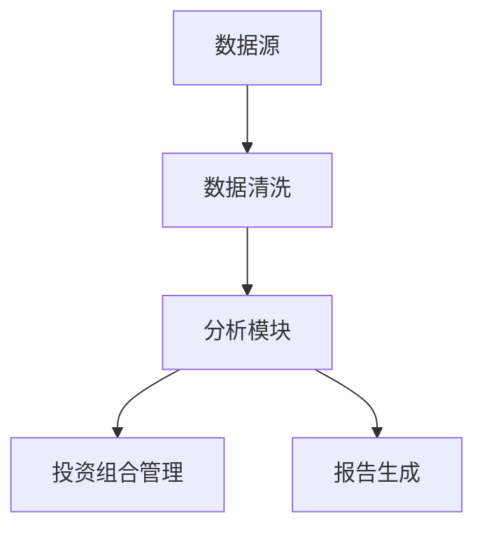
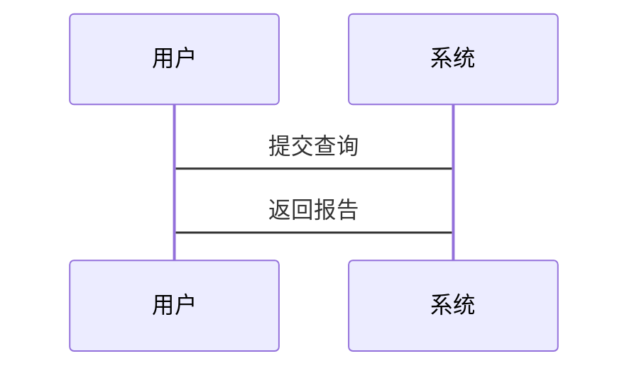

                 


# 格雷厄姆的价值投资理论在新兴市场的应用

## 关键词：价值投资，格雷厄姆，新兴市场，安全边际，内在价值，投资策略，系统分析

## 摘要：  
本文详细探讨了格雷厄姆的价值投资理论在新兴市场的应用，分析了新兴市场的独特性及其对投资策略的影响。通过结合价值投资的核心概念，本文提出了适用于新兴市场的投资策略，并通过系统分析和项目实战，展示了如何在新兴市场中实现稳健的投资回报。文章结构清晰，内容详实，适合投资专业人士和对价值投资感兴趣的读者阅读。

---

## 第一部分：价值投资理论的背景与基础

### 第1章：价值投资理论概述

#### 1.1 价值投资理论的起源与发展

##### 1.1.1 本杰明·格雷厄姆的生平与贡献
- 格雷厄姆是价值投资理论的鼻祖，被誉为“价值投资之父”。他于20世纪初开始研究股票市场，提出了许多经典的投资理念，如“安全边际”和“内在价值”。
- 他的投资哲学强调以低于内在价值的价格购买优质股票，注重企业的基本面分析，而非市场波动。

##### 1.1.2 价值投资理论的核心思想
- 格雷厄姆的价值投资理论强调“买入便宜的东西”，即寻找市场价格低于内在价值的股票。
- 他认为市场是理性的，但投资者往往是非理性的，市场波动为理性投资者提供了低价买入的机会。

##### 1.1.3 价值投资与现代投资理论的联系与区别
- 现代投资组合理论（MPT）强调分散投资和风险调整后的收益，而价值投资更注重个股的内在价值和安全边际。
- 区别在于，价值投资更倾向于长期持有，而现代投资理论更注重短期风险调整。

#### 1.2 格雷厄姆价值投资的核心概念

##### 1.2.1 内在价值的定义与计算方法
- 内在价值是企业未来现金流的现值，可以通过 discounted cash flow (DCF) 模型计算。
- 例如，假设某企业未来5年的现金流分别为100万、120万、150万、180万、200万，折现率假设为10%。则内在价值计算如下：

$$
\text{内在价值} = \sum_{t=1}^{5} \frac{\text{CF}_t}{(1 + r)^t} = \frac{100}{1.1} + \frac{120}{1.1^2} + \frac{150}{1.1^3} + \frac{180}{1.1^4} + \frac{200}{1.1^5}
$$

##### 1.2.2 安全边际的概念及其重要性
- 安全边际 = 内在价值 - 市场价格
- 格雷厄姆建议以低于内在价值的价格购买股票，留出安全边际以应对市场的不确定性。

##### 1.2.3 投资组合的构建原则
- 分散投资：避免将所有资金投入到单一股票中，以降低风险。
- 专注于基本面良好的企业：选择具有强大财务状况和良好管理的企业。

#### 1.3 价值投资与其他投资策略的对比

##### 1.3.1 价值投资与成长投资的区别
- 价值投资关注低估的股票，而成长投资关注高成长性的股票。
- 价值投资者更注重当前的盈利能力，而成长投资者更关注未来的增长潜力。

##### 1.3.2 价值投资与技术分析的异同
- 价值投资注重基本面分析，而技术分析关注价格和成交量的变化。
- 两者可以结合使用，但价值投资更注重长期稳健，技术分析更注重短期波动。

##### 1.3.3 价值投资在不同市场环境下的表现
- 在牛市中，价值投资可能表现平平，但在熊市中，价值投资往往能跑赢市场。

---

## 第二部分：新兴市场的特点与投资环境分析

### 第2章：新兴市场的独特性与投资机会

#### 2.1 新兴市场的经济结构与特点

##### 2.1.1 新兴市场的定义与范围
- 新兴市场通常指那些经济快速增长、但尚未完全工业化的国家，如中国、印度、巴西等。

##### 2.1.2 新兴市场的特点
- 经济增长快，但波动性大。
- 市场流动性相对较差，信息透明度较低。
- 企业盈利能力强，但财务风险较高。

##### 2.1.3 新兴市场与成熟市场的对比
- 成熟市场：市场流动性高，信息透明，监管完善。
- 新兴市场：市场流动性低，信息不透明，监管相对薄弱。

#### 2.2 新兴市场的投资机会与挑战

##### 2.2.1 投资机会
- 高增长潜力：新兴市场的GDP增速通常高于成熟市场。
- 估值优势：许多新兴市场的股票价格相对较低，具有较高的安全边际。

##### 2.2.2 投资挑战
- 市场波动大：新兴市场的股票价格波动剧烈。
- 信息不对称：投资者可能难以获取准确的企业信息。
- 政治和经济风险：新兴市场可能存在政治不稳定或经济政策变化的风险。

#### 2.3 格雷厄姆价值投资理论在新兴市场的适用性

##### 2.3.1 格雷厄姆理论的核心思想在新兴市场的适用性
- 格雷厄姆的价值投资理论在新兴市场仍然适用，但需要结合新兴市场的特点进行调整。

##### 2.3.2 新兴市场中价值投资的特殊考虑
- 选择具有强大本地竞争优势的企业。
- 关注企业的财务健康状况，尤其是现金流和债务水平。

---

## 第三部分：格雷厄姆价值投资理论的具体应用策略

### 第3章：新兴市场中的价值投资策略

#### 3.1 股票筛选与估值

##### 3.1.1 股票筛选标准
- 低市盈率（P/E）：P/E < 15。
- 低市净率（P/B）：P/B < 2。
- 高股息率：股息率 > 5%。

##### 3.1.2 企业内在价值的评估
- 使用DCF模型评估企业的内在价值。
- 考虑新兴市场的特殊因素，如增长率和风险。

##### 3.1.3 安全边际的确定
- 根据市场的波动性和企业的风险状况，确定适当的安全边际。

#### 3.2 投资组合管理

##### 3.2.1 投资组合的构建
- 分散投资：将资金分配到不同行业和地区的股票中。
- 选择具有稳定收益和良好成长性的企业。

##### 3.2.2 定期调整
- 定期审视投资组合，根据企业的基本面变化和市场环境进行调整。

#### 3.3 风险管理

##### 3.3.1 风险控制策略
- 设置止损点：当股价下跌超过一定幅度时卖出。
- 保持足够的流动资金以应对市场波动。

##### 3.3.2 仓位管理
- 根据市场环境和投资目标调整仓位。
- 在市场恐慌时增加仓位，在市场过热时减少仓位。

---

## 第四部分：系统分析与架构设计

### 第4章：系统分析与架构设计

#### 4.1 系统功能设计

##### 4.1.1 数据收集模块
- 从多个数据源收集企业的财务数据和市场数据。
- 数据清洗和预处理。

##### 4.1.2 分析模块
- 计算企业的内在价值和安全边际。
- 生成股票筛选报告。

##### 4.1.3 投资组合管理模块
- 根据筛选结果构建投资组合。
- 监控和调整投资组合。

#### 4.2 系统架构设计

##### 4.2.1 系统架构图


##### 4.2.2 接口设计
- 数据接口：从第三方数据源获取数据。
- 报告接口：生成筛选报告和投资组合建议。

##### 4.2.3 交互流程


---

## 第五部分：项目实战

### 第5章：项目实战

#### 5.1 环境安装

##### 5.1.1 安装Python和相关库
- 安装Python 3.8以上版本。
- 安装Pandas、NumPy、Matplotlib等库。

#### 5.2 核心代码实现

##### 5.2.1 数据收集与预处理
```python
import pandas as pd
import numpy as np

# 假设我们从CSV文件中读取数据
df = pd.read_csv('stocks.csv')

# 数据清洗
df.dropna(inplace=True)
df = df[~df['PE'].isin([0])]
df['PE'] = df['PE'].astype(float)
```

##### 5.2.2 内在价值计算
```python
def calculate_intrinsic_value(enterprise_value, free_cash_flow, discount_rate):
    if free_cash_flow == 0:
        return 0
    growth_rate = 0.05  # 假设增长率
    perpetuity_value = free_cash_flow / (discount_rate - growth_rate)
    return (enterprise_value + perpetuity_value) / (1 + discount_rate)
```

##### 5.2.3 安全边际计算
```python
def calculate_margin_of_safety(current_price, intrinsic_value):
    return intrinsic_value - current_price
```

#### 5.3 案例分析

##### 5.3.1 案例选择
- 选择新兴市场中的几只股票，计算它们的内在价值和安全边际。

##### 5.3.2 结果分析
- 对比计算出的内在价值与市场价格，确定具有安全边际的股票。

#### 5.4 项目总结

##### 5.4.1 项目成果
- 成功筛选出具有投资价值的股票。
- 构建了初步的价值投资模型。

##### 5.4.2 经验与教训
- 数据的准确性和完整性对结果影响重大。
- 需要不断调整模型以适应市场变化。

---

## 第六部分：最佳实践与小结

### 第6章：最佳实践与小结

#### 6.1 最佳实践

##### 6.1.1 定期复盘
- 每季度复盘投资组合的表现。
- 调整投资策略以适应市场变化。

##### 6.1.2 保持学习
- 关注新兴市场的经济动态和政策变化。
- 学习新的投资工具和方法。

#### 6.2 小结

##### 6.2.1 核心观点总结
- 格雷厄姆的价值投资理论在新兴市场中仍然适用。
- 投资者需要结合新兴市场的特点进行调整。

##### 6.2.2 展望未来
- 随着新兴市场的不断发展，价值投资将发挥越来越重要的作用。

---

## 作者：AI天才研究院/AI Genius Institute & 禅与计算机程序设计艺术 /Zen And The Art of Computer Programming

---

感谢您的阅读！如需进一步探讨，请随时联系！

