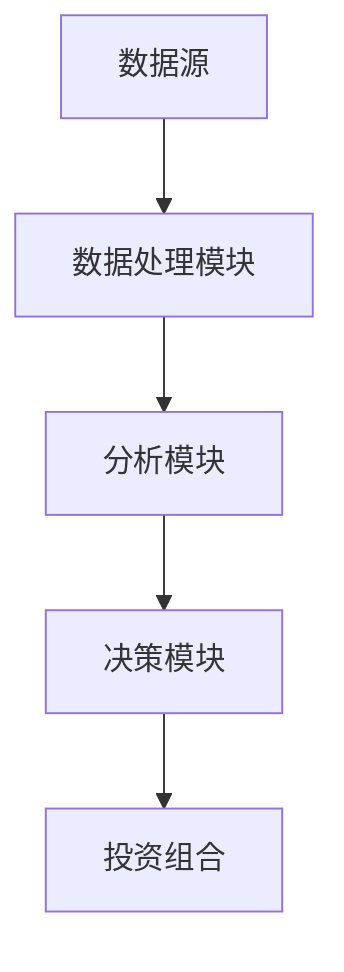
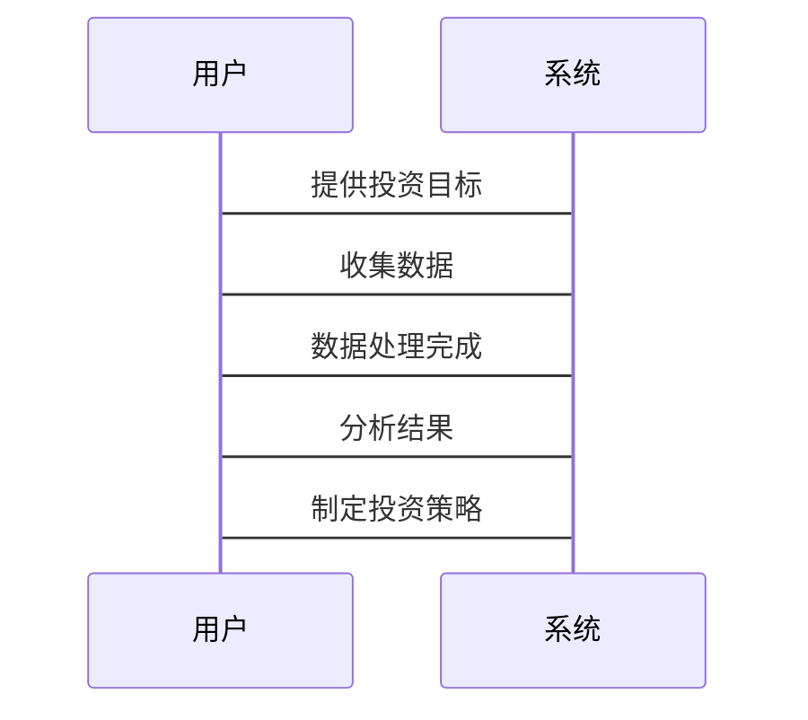

                 

# 格雷厄姆的价值投资者修炼之道

## 关键词

价值投资，格雷厄姆，内在价值，安全边际，基本面分析，投资策略

## 摘要

《格雷厄姆的价值投资者修炼之道》系统地介绍了价值投资的核心理念、分析方法和实战技巧。文章从本杰明·格雷厄姆的投资哲学出发，详细阐述了安全边际、内在价值等关键概念，结合基本面分析、财务指标评估和投资策略，为读者提供了从基础到进阶的完整投资体系。通过实际案例分析和系统架构设计，文章帮助读者构建高效的投资决策系统，实现长期稳健的投资收益。

---

## 第一部分：价值投资的背景与基础

### 第1章：价值投资的起源与发展

#### 1.1 本杰明·格雷厄姆及其投资理念

##### 1.1.1 格雷厄姆的生平简介
本杰明·格雷厄姆（Benjamin Graham）是20世纪著名的投资家和经济学家，被誉为“价值投资之父”。他出生于1894年，早年就读于哥伦比亚大学，后来在金融领域崭露头角。格雷厄姆在1926年与戴维·多德（David Dodd）共同开发了价值投资的方法，成为投资领域的重要里程碑。

##### 1.1.2 价值投资的起源与核心思想
价值投资的核心思想来源于格雷厄姆的著作《证券分析》和《聪明的投资者》。他认为，市场波动是投资者的机会，而不是风险。价值投资者应寻找那些市场价格低于其内在价值的公司，长期持有，等待市场回归理性。

##### 1.1.3 格雷厄姆的投资哲学与方法
格雷厄姆的投资方法以“安全边际”为核心，强调通过深入分析企业的财务状况，寻找具有稳定收益和较低风险的公司。他认为，市场先生（Market先生）的情绪波动为投资者提供了低价买入优质资产的机会。

#### 1.2 价值投资的基本概念

##### 1.2.1 价值投资的定义与特点
价值投资是一种投资策略，强调以低于内在价值的价格买入优质股票，长期持有，追求稳定的收益。其特点包括注重基本面分析、追求安全边际、长期投资和逆向思维。

##### 1.2.2 价值投资的核心理念
- **安全边际**：买入价格低于内在价值，以降低投资风险。
- **内在价值**：公司未来现金流的现值，是评估股票合理价格的基础。
- **市场波动**：市场短期波动为投资者提供了买入优质资产的机会。

##### 1.2.3 价值投资与其他投资策略的对比
- **技术分析**：关注价格走势和成交量，与价值投资的长期视角不同。
- **成长投资**：侧重于公司未来的高增长潜力，而价值投资更关注当前的低估值。
- **指数投资**：通过分散投资降低风险，但不主动寻找低估股票。

---

## 第二部分：价值投资的核心概念与分析方法

### 第2章：安全边际与内在价值

#### 2.1 安全边际的定义与作用

##### 2.1.1 安全边际的概念
安全边际是指股票的市场价格与内在价值之间的差距。通过预留安全边际，投资者可以降低市场波动带来的风险。

##### 2.1.2 安全边际的重要性
- 提供缓冲空间，避免因估值错误或市场波动带来的损失。
- 增加投资的确定性，提高长期收益的稳定性。

##### 2.1.3 安全边际的计算方法
安全边际 = 内在价值 - 市场价格

---

#### 2.2 内在价值的计算

##### 2.2.1 内在价值的定义
内在价值是公司未来现金流的现值，反映了公司的真实价值。通过计算内在价值，投资者可以判断股票是否被低估或高估。

##### 2.2.2 内在价值的计算模型
格雷厄姆的内在价值计算主要基于股利折现模型（DDM）和现金流折现模型（DCF）。

##### 2.2.3 内在价值与市场价格的关系
市场价格围绕内在价值波动，但长期来看，市场价格会回归内在价值。

---

#### 2.3 市场先生与投资者心理

##### 2.3.1 市场先生的定义
市场先生是格雷厄姆用来描述市场波动的隐喻。市场先生每天提供买卖价格，投资者可以通过观察市场先生的情绪波动来寻找投资机会。

##### 2.3.2 投资者心理对投资决策的影响
- **贪婪与恐惧**：市场上涨时，投资者可能过于乐观；市场下跌时，可能过于悲观。
- **从众心理**：投资者往往跟随市场潮流，忽视独立思考。

---

## 第三部分：基本面分析方法

### 第3章：基本面分析的核心要素

#### 3.1 财务报表分析

##### 3.1.1 利润表分析
利润表反映了公司在一定时期内的收入和利润情况。重点关注收入、成本、净利润等指标。

##### 3.1.2 资产负债表分析
资产负债表反映了公司的资产、负债和所有者权益。重点关注流动资产、固定资产、负债结构等。

##### 3.1.3 现金流量表分析
现金流量表反映了公司在一定时期内的现金流情况，重点关注经营活动、投资活动和筹资活动的现金流。

##### 3.1.4 财务指标评估
- **市盈率（P/E）**：股价除以每股收益。
- **市净率（P/B）**：股价除以每股净资产。
- **股息率**：每股股息除以股价。

---

### 第3.2 行业分析与竞争优势

##### 3.2.1 行业分析
分析行业的发展前景、竞争格局和周期性，选择具有持续增长潜力的行业。

##### 3.2.2 竞争优势分析
寻找具有强大竞争优势的公司，如成本优势、品牌优势、技术优势等。

---

## 第四部分：投资策略与组合管理

### 第4章：投资策略的制定与执行

#### 4.1 优质股的选择标准

##### 4.1.1 低市盈率与低市净率
选择市盈率和市净率低于行业平均水平的公司。

##### 4.1.2 高股息率
选择股息率高且稳定的公司。

##### 4.1.3 财务健康状况
公司财务状况稳健，负债率低，现金流充足。

---

#### 4.2 投资组合的构建与管理

##### 4.2.1 投资组合的构建
- 分散投资，降低风险。
- 根据市场变化动态调整持仓。

##### 4.2.2 风险管理策略
- 设置止损点，避免重大损失。
- 定期审视持仓，及时淘汰表现不佳的股票。

---

### 第4.3 价值投资的长期视角

##### 4.3.1 长期持有与复利效应
价值投资强调长期持有，通过复利效应实现财富的稳定增长。

##### 4.3.2 定期复盘与调整
定期审视投资组合，根据公司基本面变化和市场环境进行调整。

---

## 第五部分：价值投资的进阶实践

### 第5章：市场波动与投资机会

#### 5.1 宏观经济分析

##### 5.1.1 经济周期对投资的影响
在经济衰退期寻找低估股票，在经济复苏期持有优质资产。

##### 5.1.2 货币政策与市场波动
关注央行货币政策的变化，判断市场的短期波动。

---

#### 5.2 心理因素对投资决策的影响

##### 5.2.1 克服贪婪与恐惧
保持冷静，避免情绪化决策。

##### 5.2.2 坚持独立思考
不随波逐流，坚持自己的投资策略。

---

## 第六部分：项目实战与系统架构

### 第6章：价值投资的系统化实践

#### 6.1 投资决策系统的架构设计

##### 6.1.1 系统功能设计
- 数据采集模块：收集公司财务数据、行业信息等。
- 分析模块：计算内在价值、评估安全边际。
- 决策模块：根据分析结果制定投资策略。

##### 6.1.2 系统架构图

##### 6.1.3 系统交互图

---

## 第七部分：总结与小结

### 7.1 价值投资的核心要义

- **安全边际**：买入价格低于内在价值。
- **基本面分析**：关注公司的财务状况和竞争优势。
- **长期视角**：坚持长期投资，避免短期波动的干扰。

### 7.2 价值投资的注意事项

- **持续学习**：市场环境不断变化，投资者需要不断学习和调整策略。
- **风险管理**：设置止损点，控制投资风险。
- **心理调整**：克服贪婪与恐惧，保持冷静和理性。

### 7.3 价值投资的未来展望

随着市场的不断发展，价值投资的理念和方法将不断完善。投资者需要结合新技术和新工具，不断提高自己的分析能力和决策水平。

---

## 作者信息

作者：AI天才研究院/AI Genius Institute & 禅与计算机程序设计艺术 /Zen And The Art of Computer Programming

---

通过以上详细分析和系统设计，《格雷厄姆的价值投资者修炼之道》为投资者提供了从基础到进阶的完整投资体系，帮助读者在复杂的市场环境中找到属于自己的投资机会，实现长期稳健的财富增长。

