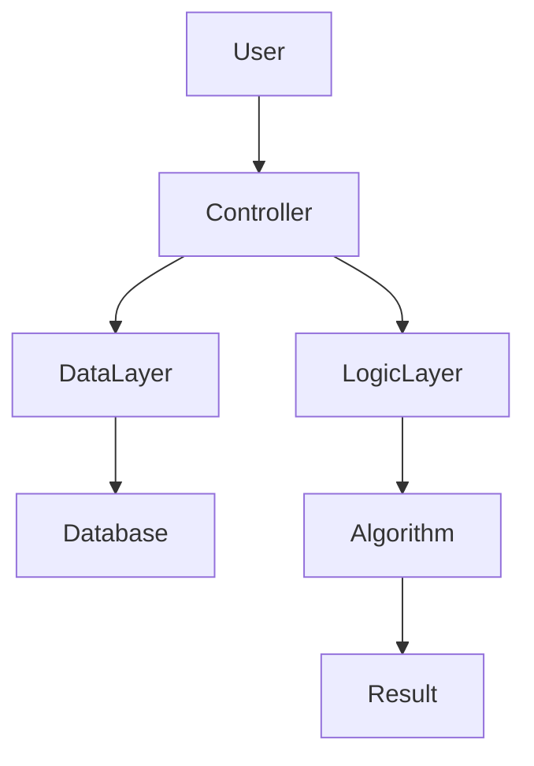

                 


# 格雷厄姆的价值线概念及其应用

---

## 关键词
价值线，格雷厄姆，投资分析，股票估值，价值投资，基本面分析，数学模型

---

## 摘要
本文深入探讨了格雷厄姆提出的价值线概念，分析其在投资决策中的应用。文章从价值线的背景与基础入手，详细阐述了其核心概念、算法原理、数学模型，并通过实际案例展示了其在系统设计和项目实战中的应用。最后，总结了价值线的优势与局限性，并提供了最佳实践建议。

---

# 第一部分: 格雷厄姆价值线概念的背景与基础

## 第1章: 价值线概念的背景与起源

### 1.1 价值线概念的提出背景
格雷厄姆作为价值投资之父，提出了许多深刻的投资理论，其中价值线概念是其核心之一。价值线概念的提出背景可以追溯到20世纪30年代，当时市场波动剧烈，投资者迫切需要一种稳定可靠的估值方法。价值线概念的出现，为投资者提供了一种基于基本面分析的股票估值工具。

### 1.2 价值线的定义与基本假设
价值线是指通过分析股票的内在价值，确定其在市场中的合理价格范围。其基本假设包括：股票的内在价值可以通过财务指标计算，市场情绪和周期会影响股票价格，价值线是内在价值与市场价值的动态平衡点。

### 1.3 价值线的核心框架与逻辑
价值线的核心框架包括基本面分析、市场情绪分析和动态调整机制。其逻辑是通过分析公司财务数据，结合市场环境，计算出股票的内在价值，并与市场价格进行对比，找出投资机会。

### 1.4 价值线的应用范围与边界
价值线主要应用于股票投资、资产配置和风险管理。其适用边界包括公司财务数据的可靠性、市场环境的稳定性以及投资者的风险承受能力。

---

## 第2章: 价值线概念的核心要素与属性

### 2.1 价值线的核心要素
价值线的核心要素包括盈利能力、成长性、财务健康状况和市场竞争力。这些要素通过财务指标量化，如市盈率、市净率、ROE等。

### 2.2 价值线的属性特征对比
与传统估值方法相比，价值线具有动态调整、综合分析和风险控制的特点。其属性特征包括：动态调整、综合分析和风险控制。

### 2.3 价值线的ER实体关系图
```mermaid
graph TD
    ValueLine -> CompanyFinancials
    CompanyFinancials -> MarketData
    MarketData -> InvestorSentiment
    ValueLine -> MarketPrice
```

---

# 第二部分: 价值线概念的核心原理与算法

## 第3章: 价值线概念的核心原理

### 3.1 格雷厄姆的内在价值公式
股票的内在价值可以通过以下公式计算：
$$
\text{内在价值} = \frac{\text{净利润} \times (1 + g)}{\text{资本成本} - g}
$$
其中，g为净利润增长率，资本成本为投资者要求的最低回报率。

### 3.2 市场价格与内在价值的关系
市场价格围绕内在价值波动，市场情绪和周期会影响两者的偏离程度。价值线通过比较市场价格与内在价值，判断投资机会。

### 3.3 动态调整机制
价值线的动态调整机制包括定期更新财务数据、调整资本成本和考虑市场环境变化。

---

## 第4章: 价值线的算法与实现

### 4.1 价值线算法的步骤
1. 收集公司财务数据，包括净利润、营业收入、资产负债率等。
2. 计算内在价值，使用格雷厄姆的内在价值公式。
3. 对比市场价格与内在价值，判断股票的估值是否合理。
4. 结合市场情绪和周期进行动态调整。

### 4.2 价值线算法的Python实现
```python
def calculate_intrinsic_value(net_income, revenue, debt, cost_of_equity, growth_rate):
    # 计算净利润增长率
    growth_rate = (revenue - net_income) / net_income
    # 计算内在价值
    intrinsic_value = (net_income * (1 + growth_rate)) / (cost_of_equity - growth_rate)
    return intrinsic_value

# 示例数据
net_income = 100
revenue = 200
debt = 50
cost_of_equity = 0.1
growth_rate = 0.05

intrinsic_value = calculate_intrinsic_value(net_income, revenue, debt, cost_of_equity, growth_rate)
print(f"内在价值: {intrinsic_value}")
```

### 4.3 价值线算法的数学模型
价值线算法的数学模型如下：
$$
\text{内在价值} = \frac{\text{净利润} \times (1 + g)}{\text{资本成本} - g}
$$
其中，g为净利润增长率，资本成本为投资者要求的最低回报率。

---

# 第三部分: 价值线的系统设计与项目实战

## 第5章: 价值线的系统设计

### 5.1 系统功能设计
价值线系统的功能包括数据采集、内在价值计算、市场价对比、动态调整和投资决策建议。

### 5.2 系统架构设计


### 5.3 系统接口设计
系统接口包括数据接口（API）、用户界面（UI）和报告生成接口。

### 5.4 系统交互流程
用户输入股票代码，系统返回股票的内在价值和市场价格对比结果，生成投资建议。

---

## 第6章: 价值线的项目实战

### 6.1 项目环境安装
安装Python和相关库，如pandas、numpy、scipy。

### 6.2 系统核心实现
实现价值线算法，包括数据采集、计算和报告生成。

### 6.3 代码实现与应用解读
```python
import pandas as pd
import numpy as np

def calculate_intrinsic_value(net_income, revenue, debt, cost_of_equity, growth_rate):
    growth_rate = (revenue - net_income) / net_income
    intrinsic_value = (net_income * (1 + growth_rate)) / (cost_of_equity - growth_rate)
    return intrinsic_value

# 示例数据
data = {
    '公司': ['公司A', '公司B'],
    '净利润': [100, 150],
    '营业收入': [200, 250],
    '债务': [50, 75],
    '资本成本': [0.1, 0.12],
    '增长率': [0.05, 0.07]
}

df = pd.DataFrame(data)
result = df.apply(lambda x: calculate_intrinsic_value(x['净利润'], x['营业收入'], x['债务'], x['资本成本'], x['增长率']), axis=1)
print(result)
```

### 6.4 案例分析与详细解读
以公司A为例，计算其内在价值，对比市场价格，判断其是否低估或高估。

---

# 第四部分: 总结与展望

## 第7章: 总结与最佳实践

### 7.1 核心总结
价值线概念是一种有效的股票估值工具，通过分析公司基本面和市场环境，帮助投资者做出明智的投资决策。

### 7.2 最佳实践建议
- 定期更新财务数据和市场数据。
- 结合其他估值方法进行综合分析。
- 考虑市场情绪和周期性因素。

### 7.3 注意事项
- 数据的准确性和完整性至关重要。
- 动态调整模型需要根据市场变化及时更新。
- 投资者应具备一定的财务和投资知识。

### 7.4 拓展阅读
推荐阅读格雷厄姆的《证券分析》和《聪明的投资者》，深入了解价值线概念的理论基础。

---

## 作者
作者：AI天才研究院/AI Genius Institute  
及  
禅与计算机程序设计艺术/Zen And The Art of Computer Programming

