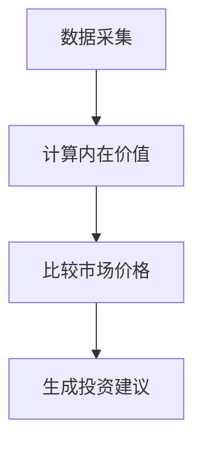

                 


# 格雷厄姆的价格与价值区分：市场先生的教训

---

## 关键词
- 价值投资
- 价格与价值区分
- 市场先生
- 格雷厄姆
- 投资策略

---

## 摘要
本文深入探讨了格雷厄姆的价格与价值区分理论，结合市场先生的比喻，分析了投资者如何在市场波动中保持理性决策。文章从格雷厄姆的投资理念出发，详细解释了价格与价值的区分方法，以及如何通过算法和系统设计实现价值投资。通过实际案例和代码实现，展示了如何在技术领域应用这些理论，帮助读者在投资中避免情绪化决策，实现长期稳健收益。

---

# 第一部分: 格雷厄姆的价格与价值区分概述

## 第1章: 格雷厄姆的投资理念概述

### 1.1 格雷厄姆的生平与主要思想
#### 1.1.1 格雷厄姆的生平简介
本杰明·格雷厄姆（Benjamin Graham）是20世纪著名的投资学家，被誉为“价值投资之父”。他出生于1894年，曾在哥伦比亚大学教授投资课程，并著有《证券分析》和《聪明的投资者》等经典书籍。

#### 1.1.2 格雷厄姆的主要投资理念
格雷厄姆的核心思想是价值投资，即以低于内在价值的价格买入优质资产。他认为市场是理性的，但价格是波动的，投资者应以长期视角看待投资，而非被短期波动所左右。

#### 1.1.3 格雷厄姆与价值投资的关系
格雷厄姆是价值投资的鼻祖，他的理念影响了包括沃伦·巴菲特在内的众多投资者。他的理论强调安全边际和长期投资，而非短期投机。

---

### 1.2 格雷厄姆的价格与价值区分理论
#### 1.2.1 价格与价值的基本概念
- **价格**：市场上的交易价格，受供需关系和情绪影响，具有波动性。
- **价值**：资产的内在价值，基于其未来现金流的折现值，具有稳定性。

#### 1.2.2 格雷厄姆对价格与价值区分的定义
格雷厄姆认为，价格是波动的，而价值是稳定的。投资者的任务是找到价格低于内在价值的资产。

#### 1.2.3 格雷厄姆价格与价值区分的核心思想
- 价格围绕价值波动。
- 投资者应在价格低于价值时买入，在价格高于价值时卖出。

---

### 1.3 市场先生的比喻
#### 1.3.1 市场先生的定义
市场先生是格雷厄姆用来比喻市场的形象。市场先生每天提供买卖报价，但他的报价受情绪影响，可能过高或过低。

#### 1.3.2 市场先生的行为特征
- 情绪化：市场先生的报价受市场情绪影响，可能高估或低估资产价值。
- 不可预测性：市场先生的行为难以预测，但价格波动围绕价值展开。

#### 1.3.3 市场先生与投资者决策的关系
投资者应忽视市场先生的情绪，专注于分析资产的内在价值，做出理性的投资决策。

---

## 第2章: 格雷厄姆价格与价值区分的核心概念

### 2.1 价格与价值的区分原理
#### 2.1.1 价格的波动性
价格受市场情绪和外部因素影响，具有短期波动性。

#### 2.1.2 价值的稳定性
内在价值基于资产的未来现金流，相对稳定，不受短期市场波动影响。

#### 2.1.3 格雷厄姆价格与价值区分模型
格雷厄姆认为，价格与价值之间的差异为投资者提供了套利机会。

---

### 2.2 格雷厄姆的价值评估方法
#### 2.2.1 内在价值的计算
内在价值 = 未来现金流的现值。公式如下：
$$ V = \sum_{t=1}^{n} \frac{CF_t}{(1 + r)^t} $$
其中，\( CF_t \) 是第t年的现金流，\( r \) 是折现率。

#### 2.2.2 市场价值的判断
市场价值是市场价格，受情绪和流动性影响。

#### 2.2.3 安全边际的概念
安全边际 = 内在价值 - 市场价格。安全边际越大，投资风险越小。

---

### 2.3 格雷厄姆的价格与价值区分的数学模型
#### 2.3.1 价值评估的公式
$$ V = \frac{E}{r} $$
其中，\( E \) 是企业的预期收益，\( r \) 是资本成本。

#### 2.3.2 安全边际的计算公式
$$ \text{安全边际} = V - P $$
其中，\( V \) 是内在价值，\( P \) 是市场价格。

---

## 第3章: 格雷厄姆价格与价值区分的算法原理

### 3.1 价格与价值区分的算法概述
#### 3.1.1 算法的基本原理
通过分析资产的未来现金流，计算其内在价值，并与市场价格进行比较。

#### 3.1.2 算法的核心步骤
1. 收集资产的财务数据。
2. 计算资产的内在价值。
3. 比较市场价格与内在价值，判断是否存在套利机会。

#### 3.1.3 算法的输入输出
- 输入：财务数据、市场数据。
- 输出：价格与价值的差异、投资建议。

---

### 3.2 格雷厄姆价格与价值区分的数学模型
#### 3.2.1 内在价值的计算公式
$$ V = \frac{E}{r} $$
其中，\( E \) 是企业的预期收益，\( r \) 是资本成本。

#### 3.2.2 市场价值的判断公式
$$ P = \text{市场价格} $$

#### 3.2.3 安全边际的计算公式
$$ \text{安全边际} = V - P $$

---

## 第4章: 格雷厄姆价格与价值区分的系统分析与架构设计

### 4.1 系统分析
#### 4.1.1 系统的目标与范围
- 目标：帮助投资者判断资产是否被低估或高估。
- 范围：收集数据、计算内在价值、比较市场价格。

#### 4.1.2 系统的功能需求
- 数据采集：收集资产的财务数据和市场数据。
- 内在价值计算：基于财务数据计算内在价值。
- 价格比较：比较市场价格与内在价值，生成投资建议。

#### 4.1.3 系统的约束条件
- 数据来源的可靠性。
- 计算模型的准确性。

---

### 4.2 系统架构设计
#### 4.2.1 系统架构的模块划分
- 数据采集模块：收集资产数据。
- 计算模块：计算内在价值。
- 比较模块：比较市场价格与内在价值。
- 输出模块：生成投资建议。

#### 4.2.2 系统架构的流程图


#### 4.2.3 系统架构的实现方案
使用Python编写数据采集和计算模块，使用前端展示投资建议。

---

## 第5章: 格雷厄姆价格与价值区分的项目实战

### 5.1 项目环境安装
- Python 3.8+
- NumPy和Pandas库。

### 5.2 核心代码实现
```python
import numpy as np
import pandas as pd

def calculate_intrinsic_value(enterprise_value, revenue, growth_rate, discount_rate):
    # 内在价值计算公式
    V = enterprise_value / (discount_rate - growth_rate)
    return V

def main():
    # 数据输入
    enterprise_value = 1000000
    revenue = 10000000
    growth_rate = 0.05
    discount_rate = 0.1

    # 计算内在价值
    V = calculate_intrinsic_value(enterprise_value, revenue, growth_rate, discount_rate)
    print(f"内在价值: {V:.2f}")

    # 比较市场价格
    P = 900000
    if V > P:
        print("市场低估，建议买入。")
    elif V < P:
        print("市场高估，建议卖出。")
    else:
        print("市场合理，建议观望。")

if __name__ == "__main__":
    main()
```

---

## 第6章: 总结与展望

### 6.1 总结
格雷厄姆的价格与价值区分理论强调了内在价值的重要性，帮助投资者在市场波动中做出理性的决策。通过算法和系统设计，投资者可以更好地识别低估资产。

### 6.2 展望
未来，随着人工智能和大数据技术的发展，价格与价值区分将更加精准，投资者可以利用这些技术工具，进一步优化投资决策。

---

## 作者：AI天才研究院/AI Genius Institute & 禅与计算机程序设计艺术 /Zen And The Art of Computer Programming

---

通过本文的分析，读者可以深入理解格雷厄姆的价格与价值区分理论，并将其应用于实际投资中，避免被市场情绪左右，实现长期稳健的投资收益。

