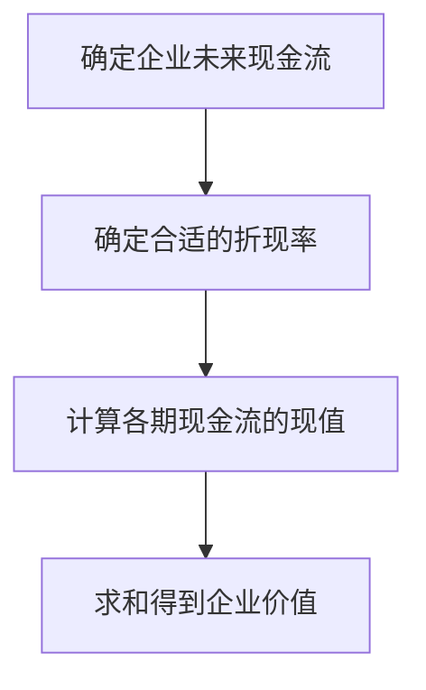
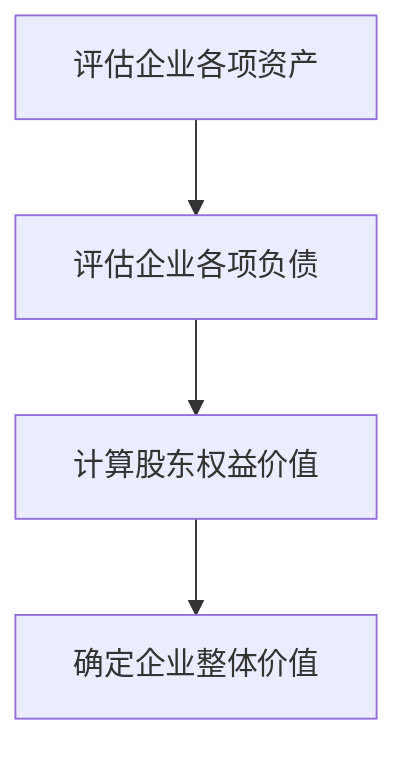
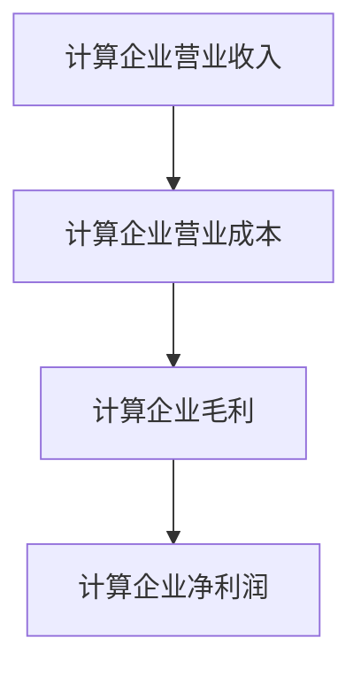

                 

# 格雷厄姆的企业价值计算方法

> 关键词：格雷厄姆、企业价值、投资分析、现金流折现、资产评估

> 摘要：本篇文章深入探讨了格雷厄姆的企业价值计算方法，从其核心投资理念到具体的计算模型，再到实际应用的案例分析，详细解析了如何通过这些方法进行企业估值，从而为投资者提供科学的决策依据。

---

## 第一部分: 格雷厄姆投资理念与企业价值计算基础

### 第1章: 格雷厄姆投资理念概述

#### 1.1 格雷厄姆投资理论的核心思想
格雷厄姆是价值投资的鼻祖，他强调以低于企业内在价值的价格买入股票。其核心思想包括：

- **安全边际**：买入价格应低于企业的内在价值，确保有足够的安全空间。
- **长期视角**：投资应关注企业的长期盈利能力，而非短期波动。
- **逆向思维**：在市场恐慌时寻找被低估的企业。

#### 1.2 企业价值计算的基本原理
企业价值计算是格雷厄姆方法的核心，旨在确定企业的真实价值。主要包括以下步骤：
1. 确定企业的未来现金流。
2. 选择合适的折现率。
3. 计算现金流的现值。
4. 将现值总和与市场价格进行比较。

### 第2章: 格雷厄姆的企业价值计算模型

#### 2.1 企业价值计算的核心概念
- **现金流折现法**：通过折现未来现金流来计算企业价值。
- **资产重置成本**：评估企业资产的重置成本。
- **股东权益**：计算企业的净资产价值。

#### 2.2 格雷厄姆企业价值计算模型的数学公式
- 现金流折现模型：
  $$ V = \sum_{t=1}^{n} \frac{CF_t}{(1+r)^t} $$
  其中，$CF_t$是第$t$年的现金流，$r$是折现率。

- 资产评估模型：
  $$ V = \sum_{i=1}^{m} \frac{A_i}{(1+r)^i} $$
  其中，$A_i$是第$i$年的资产价值。

### 第3章: 现金流折现法的详细分析

#### 3.1 现金流折现法的原理与步骤
1. **确定企业未来现金流**：预测企业的自由现金流。
2. **选择合适的折现率**：通常使用企业的加权平均资本成本（WACC）。
3. **计算各期现金流的现值**：将未来现金流折现到当前价值。
4. **求和得到企业价值**：将所有现值相加，得到企业的内在价值。

#### 3.2 现金流折现法的mermaid流程图

### 第4章: 资产评估法的详细分析

#### 4.1 资产评估法的原理与步骤
1. **评估企业各项资产**：包括流动资产、固定资产等。
2. **评估企业各项负债**：包括流动负债、长期负债等。
3. **计算股东权益价值**：资产减去负债等于股东权益。
4. **确定企业整体价值**：考虑资产的重置成本和未来收益。

#### 4.2 资产评估法的mermaid流程图

### 第5章: 企业盈利能力分析

#### 5.1 企业盈利能力的核心指标
- **净利润**：企业利润的最终体现。
- **净资产收益率（ROE）**：衡量企业利用股东资产创造利润的能力。
- **毛利率与净利率**：反映企业成本控制和盈利能力。

#### 5.2 企业盈利能力分析的mermaid流程图

---

## 第二部分: 格雷厄姆企业价值计算方法的实际应用

### 第6章: 格雷厄姆企业价值计算方法的案例分析

#### 6.1 案例分析：微软公司
1. **确定未来现金流**：预测微软未来五年的自由现金流。
2. **选择折现率**：使用WACC作为折现率。
3. **计算现值总和**：将未来现金流折现并求和。
4. **比较市场价格**：与当前股价进行对比，判断是否低估。

#### 6.2 案例分析：亚马逊公司
1. **评估资产与负债**：分析亚马逊的资产结构和负债情况。
2. **计算股东权益**：资产减去负债得到股东权益。
3. **确定整体价值**：考虑资产重置成本和未来收益。

---

## 第三部分: 格雷厄姆企业价值计算方法的总结与展望

### 第7章: 格雷厄姆企业价值计算方法的总结

#### 7.1 格雷厄姆方法的核心优势
- **安全边际**：确保投资的本金安全。
- **长期视角**：关注企业的长期价值。
- **逆向思维**：在市场恐慌时寻找机会。

#### 7.2 格雷厄姆方法的局限性
- **假设的限制**：依赖于准确的现金流预测和合理的折现率。
- **市场波动**：短期内股价可能偏离内在价值。

### 第8章: 格雷厄姆企业价值计算方法的现代应用与拓展

#### 8.1 现代投资分析中的格雷厄姆方法
- **结合市场情绪**：在市场恐慌时寻找低估企业。
- **技术分析的辅助**：结合技术分析确认买入点。

#### 8.2 格雷厄姆方法的未来发展
- **大数据分析**：利用大数据技术优化现金流预测。
- **人工智能辅助**：使用AI工具进行企业估值。

---

## 作者：AI天才研究院/AI Genius Institute & 禅与计算机程序设计艺术 /Zen And The Art of Computer Programming

---

通过以上分析，我们可以看到格雷厄姆的企业价值计算方法不仅在理论上具有深刻的指导意义，而且在实际操作中也有广泛的应用。这种方法帮助投资者在复杂的市场环境中找到真正的投资机会，实现长期稳定的收益。

