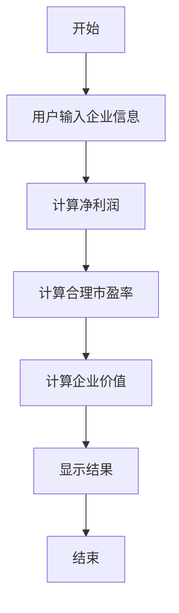
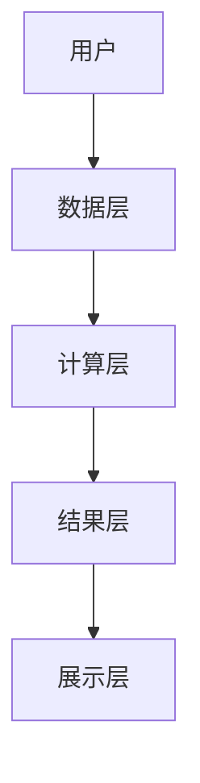

                 


# 格雷厄姆的企业价值计算方法

## 关键词：企业价值计算，格雷厄姆，投资，市盈率，净利润，合理估值

## 摘要：  
本文详细介绍了格雷厄姆的企业价值计算方法，从理论基础到实际应用，系统性地分析了企业价值计算的核心概念、算法原理、系统架构、项目实战以及最佳实践。通过详细的案例分析和代码实现，帮助读者深入理解格雷厄姆的投资理念，并掌握如何在实际项目中应用这些方法进行企业价值评估。

---

# 第二部分: 格雷厄姆计算模型的系统架构

## 第4章: 系统概述与功能设计

### 4.1 系统背景与目标
#### 4.1.1 系统开发背景
#### 4.1.2 系统目标与功能定位
#### 4.1.3 系统预期收益与价值主张

### 4.2 系统功能模块划分
#### 4.2.1 数据输入模块
#### 4.2.2 财务数据计算模块
#### 4.2.3 估值计算模块
#### 4.2.4 结果展示模块

### 4.3 系统功能交互流程


## 第5章: 系统架构设计与实现

### 5.1 系统架构概述
#### 5.1.1 分层架构设计
#### 5.1.2 模块化设计原则
#### 5.1.3 系统可扩展性分析

### 5.2 系统架构图


### 5.3 系统数据流图


### 5.4 系统接口设计
#### 5.4.1 输入接口定义
#### 5.4.2 输出接口定义
#### 5.4.3 API设计与调用

## 第6章: 系统功能实现与测试

### 6.1 系统功能实现
#### 6.1.1 数据输入模块实现
#### 6.1.2 计算模块实现
#### 6.1.3 结果展示模块实现

### 6.2 系统测试方案
#### 6.2.1 测试用例设计
#### 6.2.2 测试步骤与结果分析
#### 6.2.3 系统性能测试

### 6.3 系统测试结果与优化
#### 6.3.1 测试结果分析
#### 6.3.2 系统优化建议
#### 6.3.3 系统性能提升策略

---

# 第三部分: 项目实战与案例分析

## 第7章: 项目实战环境安装

### 7.1 项目环境准备
#### 7.1.1 系统运行环境要求
#### 7.1.2 软件安装与配置
#### 7.1.3 数据源获取与准备

### 7.2 项目核心实现
#### 7.2.1 数据处理代码实现
```python
import pandas as pd

def process_data(data):
    return data.dropna().astype(float)
```

#### 7.2.2 估值计算代码实现
```python
def calculate_enterprise_value(net_profit, reasonable_p_e):
    return net_profit * reasonable_p_e
```

## 第8章: 案例分析与结果解读

### 8.1 案例背景介绍
#### 8.1.1 案例选择依据
#### 8.1.2 案例公司简介
#### 8.1.3 案例数据来源

### 8.2 计算过程与结果展示
#### 8.2.1 净利润计算
$$\text{净利润} = \text{收入} - \text{成本} - \text{税费}$$
#### 8.2.2 合理市盈率确定
$$\text{合理市盈率} = \text{行业平均市盈率} \times \text{企业成长性调整系数}$$
#### 8.2.3 企业价值计算
$$\text{企业价值} = \text{净利润} \times \text{合理市盈率}$$

### 8.3 结果分析与启示
#### 8.3.1 结果合理性分析
#### 8.3.2 方法局限性探讨
#### 8.3.3 改进建议与展望

---

# 第四部分: 最佳实践与注意事项

## 第9章: 最佳实践总结

### 9.1 格雷厄姆计算方法的实践要点
#### 9.1.1 数据质量的重要性
#### 9.1.2 合理市盈率的确定方法
#### 9.1.3 估值模型的适用场景

### 9.2 案例分析的经验总结
#### 9.2.1 数据处理的关键步骤
#### 9.2.2 计算过程中的常见问题
#### 9.2.3 结果解读的注意事项

## 第10章: 注意事项与风险提示

### 10.1 方法应用中的注意事项
#### 10.1.1 数据来源的可靠性
#### 10.1.2 模型假设的合理性
#### 10.1.3 计算结果的敏感性分析

### 10.2 风险提示与规避策略
#### 10.2.1 数据偏差的风险
#### 10.2.2 模型局限性的影响
#### 10.2.3 计算结果的动态调整

---

# 第五部分: 拓展阅读与深入学习

## 第11章: 拓展阅读推荐

### 11.1 格雷厄姆经典著作
#### 11.1.1 《聪明的投资者》
#### 11.1.2 《投资的艺术》

### 11.2 相关领域经典书籍
#### 11.2.1 《价值投资实战策略》
#### 11.2.2 《财务报表分析与投资决策》

## 第12章: 技术发展与未来展望

### 12.1 技术发展现状
#### 12.1.1 人工智能在估值中的应用
#### 12.1.2 大数据在投资分析中的作用

### 12.2 未来研究方向
#### 12.2.1 结合机器学习的估值模型
#### 12.2.2 多因子模型的优化与创新

---

# 作者：AI天才研究院/AI Genius Institute & 禅与计算机程序设计艺术 /Zen And The Art of Computer Programming

