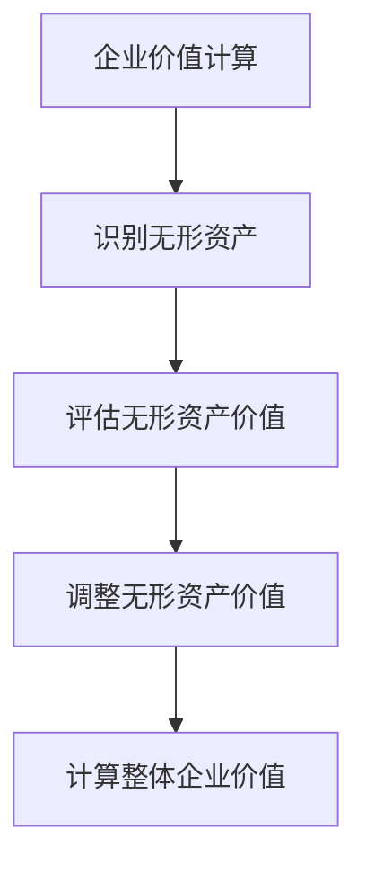
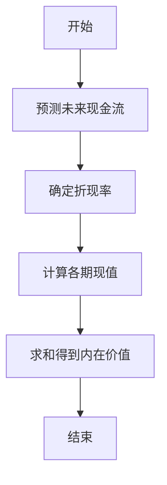
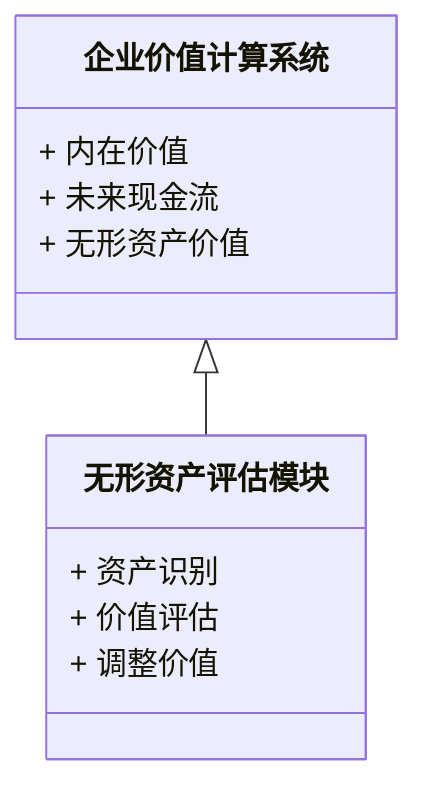
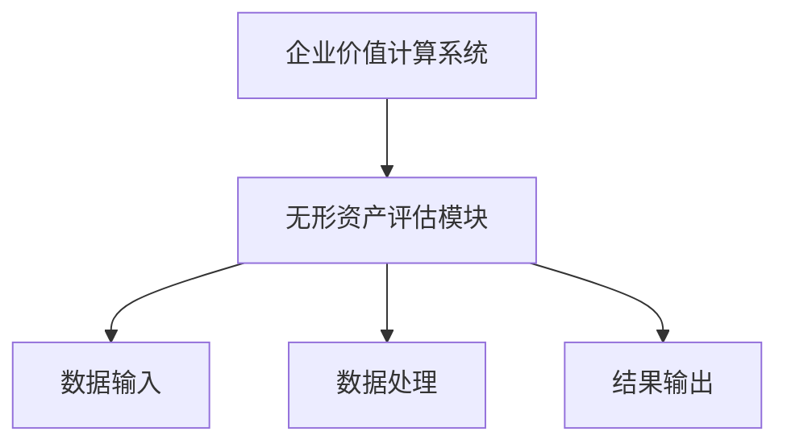
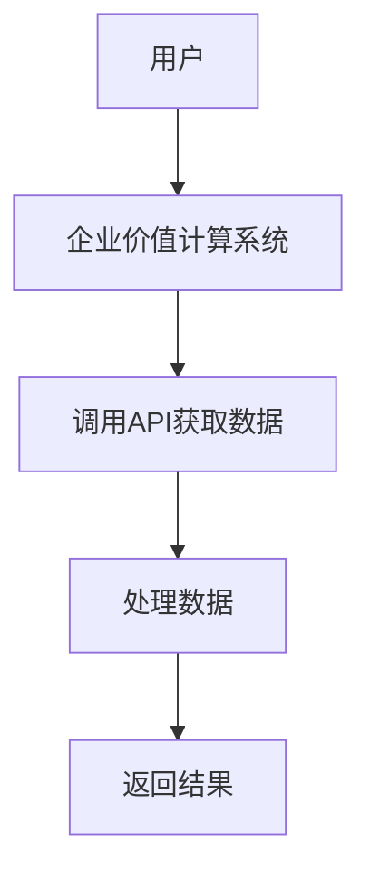

                 


# 格雷厄姆的企业价值计算：调整无形资产的重要性

## 关键词：企业价值计算、格雷厄姆、无形资产、投资理论、价值评估

## 摘要：本文探讨了格雷厄姆的企业价值计算方法，重点分析了调整无形资产在评估中的重要性。通过详细讲解核心概念、算法原理和系统架构，本文为读者提供了全面的理解，并通过实际案例展示了如何在实践中应用这些方法。

---

# 第一部分：企业价值计算的背景与基础

## 第1章：企业价值计算概述

### 1.1 企业价值计算的基本概念

#### 1.1.1 企业价值的定义
企业价值（Enterprise Value）是指企业整体的经济价值，包括所有权益、债权和所有其他资产的价值，减去流动负债的公平市场价值。它反映了企业的综合价值，是投资决策的重要依据。

#### 1.1.2 无形资产的定义与分类
无形资产是指企业拥有或控制的没有实物形态的长期资产，包括专利权、商标权、商誉、特许经营权等。这些资产通常难以用实物衡量，但对企业价值有重要影响。

#### 1.1.3 调整无形资产的重要性
无形资产的价值容易受到市场环境和技术变化的影响，因此在企业价值计算中，准确调整无形资产的价值至关重要。这有助于更准确地评估企业的整体价值，避免低估或高估的风险。

### 1.2 格雷厄姆投资理论简介

#### 1.2.1 格雷厄姆的生平与贡献
本杰明·格雷厄姆（Benjamin Graham）是价值投资的先驱，被誉为“价值投资之父”。他的投资理念强调安全边际和内在价值，对现代投资理论有深远影响。

#### 1.2.2 格雷厄姆的价值投资理念
格雷厄姆认为，投资应基于企业的内在价值，而非市场波动。他强调安全边际，即内在价值与市场价格的差额，以降低投资风险。

#### 1.2.3 格雷厄姆对企业价值计算的贡献
格雷厄姆提出了多期现金流折现法，为评估企业价值提供了科学方法。他强调了资产质量的重要性，尤其是无形资产对企业价值的影响。

### 1.3 无形资产对企业价值的影响

#### 1.3.1 无形资产的特征
无形资产具有长期性、不确定性、难以量化等特征，这些特点使其在价值评估中更具挑战性。

#### 1.3.2 无形资产对企业价值的提升作用
无形资产能够为企业创造超额利润，增强市场竞争力，从而提升企业整体价值。

#### 1.3.3 无形资产的风险与挑战
无形资产的价值波动大，难以准确评估，可能导致企业价值评估的偏差。

### 1.4 本章小结
本章介绍了企业价值计算的基本概念，格雷厄姆的投资理论，以及无形资产在企业价值中的重要性。接下来，将深入探讨格雷厄姆企业价值计算的核心概念与联系。

---

# 第二部分：格雷厄姆企业价值计算的核心概念与联系

## 第2章：核心概念与联系

### 2.1 格雷厄姆企业价值计算的原理

#### 2.1.1 格雷厄姆的企业价值公式
格雷厄姆提出了企业价值的计算公式，强调了内在价值的重要性。公式如下：
$$
\text{企业价值} = \text{息税前利润} \times \text{合理市盈率}
$$
其中，合理市盈率通常基于行业平均水平或企业历史数据确定。

#### 2.1.2 格雷厄姆的内在价值计算方法
内在价值是基于未来现金流的现值计算得出的。格雷厄姆使用多期现金流折现法，考虑未来各期的现金流，并折现到现值。

#### 2.1.3 格雷厄姆的保守主义原则
格雷厄姆主张保守评估，避免高估资产价值。他建议在计算内在价值时，采用较低的折现率和保守的假设。

### 2.2 无形资产的评估与调整

#### 2.2.1 无形资产的评估方法
无形资产的评估通常采用收益法、市场法和成本法。收益法通过预测未来现金流，计算其现值；市场法基于可比企业的市场价值进行评估；成本法则基于资产的重置成本。

#### 2.2.2 调整无形资产的步骤与流程
1. 识别无形资产：确定企业拥有的无形资产。
2. 评估资产价值：采用适当的方法评估无形资产的公允价值。
3. 调整资产价值：考虑市场变化和技术进步，调整无形资产的价值。
4. 计算企业价值：将调整后的无形资产价值纳入企业整体价值计算。

#### 2.2.3 无形资产调整对整体价值的影响
调整无形资产价值直接影响企业的整体价值。高估无形资产可能导致企业价值虚高，低估则可能导致价值被忽视。

### 2.3 核心概念的对比分析

#### 2.3.1 核心概念属性对比表格

| 概念       | 核心要素                 | 特征                     |
|------------|--------------------------|--------------------------|
| 企业价值   | 内在价值、未来现金流     | 现值计算、保守评估         |
| 无形资产   | 商誉、专利权             | 难以量化、价值波动大       |

#### 2.3.2 ER实体关系图架构
以下是企业价值与无形资产的实体关系图：

```mermaid
er
actor 企业价值 {
  id 企业价值ID
  内在价值 (现值)
  未来现金流 (预测值)
}
actor 无形资产 {
  id 无形资产ID
  资产价值 (公允价值)
  调整价值 (调整后价值)
}
企业价值与无形资产通过 调整价值 关联
```

#### 2.3.3 核心概念的 mermaid 流程图
以下是核心概念的流程图：



---

# 第三部分：格雷厄姆企业价值计算的算法原理

## 第3章：格雷厄姆企业价值计算的算法原理

### 3.1 格雷厄姆的多期现金流折现法

#### 3.1.1 多期现金流折现法的定义
多期现金流折现法（DCF）是一种通过预测未来各期的现金流，并将其折现到现值，以计算企业内在价值的方法。

#### 3.1.2 多期现金流折现法的步骤
1. 预测未来各期的现金流。
2. 确定适当的折现率。
3. 将各期现金流折现到现值。
4. 将现值求和，得到企业内在价值。

#### 3.1.3 多期现金流折现法的 mermaid 流程图
以下是多期现金流折现法的流程图：



### 3.2 无形资产调整的数学模型

#### 3.2.1 核心数学模型与公式
以下是调整无形资产价值的数学模型：

$$
\text{调整后无形资产价值} = \text{公允价值} \times \text{调整系数}
$$

其中，调整系数基于市场环境和技术进步等因素确定。

---

# 第四部分：系统分析与架构设计方案

## 第4章：系统分析与架构设计方案

### 4.1 问题场景介绍
在实际应用中，企业价值计算通常涉及复杂的系统架构。本文将介绍如何构建一个基于格雷厄姆理论的企业价值评估系统。

### 4.2 系统功能设计（领域模型）



### 4.3 系统架构设计



### 4.4 接口和交互设计
系统通过API接口与外部数据源交互，获取企业财务数据和市场信息。以下是交互流程图：



---

# 第五部分：项目实战

## 第5章：项目实战

### 5.1 环境安装
需要安装以下工具：
1. Python编程语言
2. 数据分析库（如Pandas、NumPy）
3. 图表生成工具（如Matplotlib）

### 5.2 核心代码实现

```python
import pandas as pd
import numpy as np

def calculate_intrinsic_value(fcf, discount_rate):
    # 计算各期现值
    pv = []
    for cash_flow in fcf:
        pv.append(cash_flow / (1 + discount_rate))
    return sum(pv)

# 示例数据
fcf = [100, 120, 150]  # 各期现金流
discount_rate = 0.10    # 折现率

intrinsic_value = calculate_intrinsic_value(fcf, discount_rate)
print("企业内在价值：", intrinsic_value)
```

### 5.3 案例分析
以一家科技公司为例，计算其企业价值。假设公司未来三年的现金流分别为100万、120万、150万，折现率为10%。计算如下：

$$
\text{内在价值} = \frac{100}{1.10} + \frac{120}{1.10^2} + \frac{150}{1.10^3} \approx 312.93 \text{万元}
$$

---

# 第六部分：最佳实践、小结、注意事项和拓展阅读

## 第6章：最佳实践与总结

### 6.1 最佳实践 tips
1. 在评估无形资产时，结合多种方法进行验证。
2. 定期更新资产价值评估，适应市场变化。
3. 保持保守的评估态度，避免过高或过低的估计。

### 6.2 小结
本文详细探讨了格雷厄姆的企业价值计算方法，重点分析了调整无形资产的重要性。通过理论讲解、算法原理和项目实战，为读者提供了全面的指导。

### 6.3 注意事项
- 无形资产的评估需要考虑多种因素，包括市场环境、技术进步等。
- 在实际应用中，建议结合企业实际情况，灵活调整评估方法。

### 6.4 拓展阅读
推荐阅读格雷厄姆的《证券分析》和《聪明的投资者》，深入理解价值投资的理念和方法。

---

# 作者：AI天才研究院/AI Genius Institute & 禅与计算机程序设计艺术 /Zen And The Art of Computer Programming

