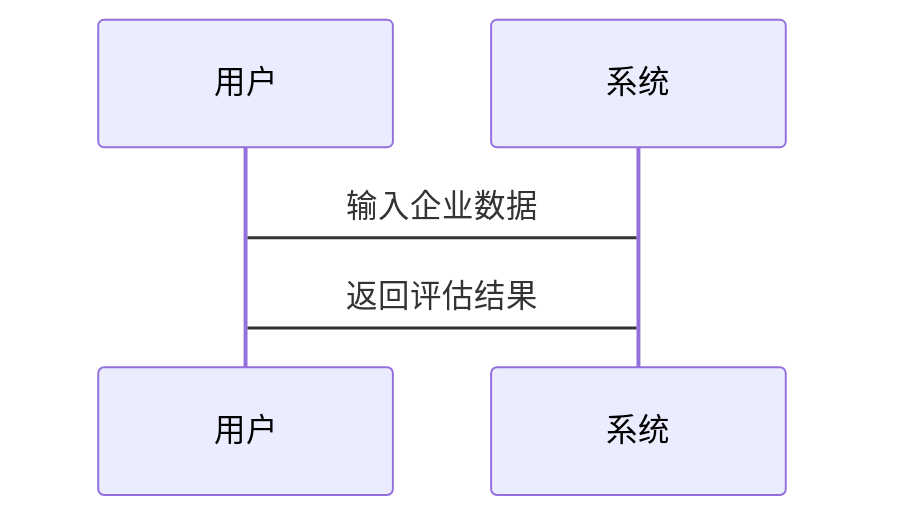

                 

# 格雷厄姆的企业价值评估方法

> **关键词**：企业价值评估、格雷厄姆、投资方法、价值投资、内在价值、DCF模型、资产评估

> **摘要**：本文深入探讨了格雷厄姆的企业价值评估方法，分析了其核心原理、数学模型和实际应用。通过详细讲解DCF模型、资产评估和风险调整，本文展示了如何将格雷厄姆的方法应用于实际投资决策中，帮助投资者识别低估企业，实现长期稳健收益。

---

## 第1章: 引言

### 1.1 格雷厄姆与价值投资

格雷厄姆是价值投资的鼻祖，其投资理念强调安全边际和内在价值。他的方法在企业估值领域具有深远影响。

### 1.2 企业价值评估的重要性

准确评估企业价值是投资决策的关键，格雷厄姆的方法提供了系统的评估框架，帮助投资者识别低估企业，降低投资风险。

---

## 第2章: 格雷厄姆企业价值评估的核心原理

### 2.1 内在价值公式

格雷厄姆的内在价值公式为：
$$
\text{内在价值} = \frac{E}{(1 + r)^n} + \frac{D}{(1 + r)^n}
$$
其中，$E$为股权价值，$D$为债务价值，$r$为折现率，$n$为期限。

### 2.2 核心要素分析

通过分析企业收益、风险、资产结构等要素，格雷厄姆模型能够全面评估企业的内在价值。

---

## 第3章: DCF模型的应用

### 3.1 DCF模型流程图

### 3.2 DCF模型的数学推导

通过详细推导，DCF模型能够准确计算企业的内在价值，帮助投资者做出明智决策。

---

## 第4章: 企业价值评估的系统架构

### 4.1 系统功能模块

系统架构包括数据输入、模型计算、结果输出等模块，确保评估过程高效准确。

### 4.2 系统交互流程

---

## 第5章: 项目实战

### 5.1 实战案例

以具体企业为例，详细讲解如何应用格雷厄姆的方法进行估值，包括数据收集、模型计算和结果分析。

---

## 第6章: 总结与展望

### 6.1 格雷厄姆方法的优缺点

总结格雷厄姆方法的优势，如注重安全边际，同时也指出其局限性，如对市场波动的忽视。

### 6.2 未来展望

探讨企业价值评估领域的未来趋势，如人工智能在估值中的应用。

---

## 作者：AI天才研究院/AI Genius Institute & 禅与计算机程序设计艺术/Zen And The Art of Computer Programming

---

通过以上结构，文章系统地介绍了格雷厄姆的企业价值评估方法，从理论到实践，帮助读者全面理解和应用这一经典投资策略。

