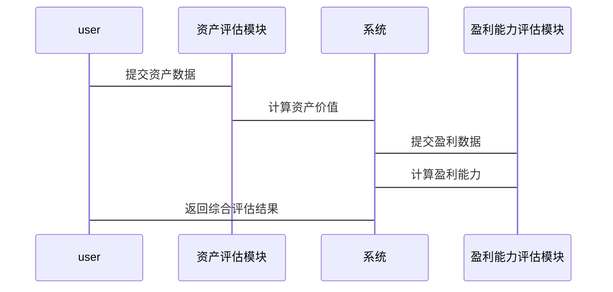

                 


# 格雷厄姆的企业价值评估方法：资产还是盈利？

## 关键词：格雷厄姆，企业价值评估，资产，盈利，投资

## 摘要：格雷厄姆是价值投资之父，他提出了许多深刻的企业价值评估方法。本文将探讨资产与盈利在企业价值评估中的重要性，分析它们的优缺点，并通过数学模型和实际案例帮助读者理解如何在资产与盈利之间做出选择。文章还结合系统架构设计，提供一个综合评估框架，帮助投资者做出更明智的投资决策。

---

# 第一部分: 格雷厄姆的企业价值评估方法基础

## 第1章: 企业价值评估的背景与核心概念

### 1.1 企业价值评估的背景

#### 1.1.1 企业价值评估的定义与意义

企业价值评估是通过对企业的资产、负债、盈利能力和未来发展潜力进行分析，估算其整体价值的过程。它是投资决策中至关重要的一环，能够帮助投资者识别被低估的企业，避免盲目投资。

#### 1.1.2 格雷厄姆投资理念的核心思想

 Benjamin Graham 是价值投资的鼻祖，他强调以低于内在价值的价格买入优质股票。他认为，企业的真实价值在于其资产和盈利能力，而非市场短期波动。

#### 1.1.3 资产与盈利在企业价值评估中的重要性

资产是企业的基础，决定了企业的生产能力；盈利是企业的生命线，反映了企业的经营效率。两者的结合能够全面评估企业的健康状况和未来潜力。

---

### 1.2 企业价值评估的基本原理

#### 1.2.1 企业价值的构成要素

企业价值由有形资产、无形资产、盈利能力、市场地位和发展潜力等多个因素构成。

#### 1.2.2 格雷厄姆的企业价值评估模型

格雷厄姆提出的企业价值评估模型将资产和盈利作为核心指标，通过分析企业的资产回报率和盈利能力来估算其内在价值。

#### 1.2.3 资产与盈利的辩证关系

资产是盈利的基础，而盈利是资产运用效率的体现。两者相辅相成，共同决定企业的价值。

---

## 第2章: 资产评估的核心方法

### 2.1 资产评估的基本原则

#### 2.1.1 资产的定义与分类

资产分为流动资产和非流动资产，流动资产包括现金、应收账款和存货，非流动资产包括固定资产、无形资产和长期投资。

#### 2.1.2 资产评估的三大方法

1. 市场法：通过比较类似资产的市场价值进行评估。
2. 成本法：基于资产的重置成本进行评估。
3. 收益法：基于资产未来产生的收益进行评估。

#### 2.1.3 格雷厄姆对资产价值的重视

格雷厄姆认为，资产是企业价值的基石，尤其重视企业的账面价值和资产回报率。

---

### 2.2 格雷厄姆的资产评估模型

#### 2.2.1 资产的内在价值计算

内在价值公式为：
$$ V = \frac{E}{(D - N)} $$
其中，V为内在价值，E为净利润，D为资本回报率，N为资本成本率。

#### 2.2.2 资产负债表分析方法

通过分析资产负债表，评估企业的资产结构和负债情况，判断企业的财务健康状况。

#### 2.2.3 资产周转率与企业效率

资产周转率反映了资产的使用效率，公式为：
$$ 资产周转率 = \frac{营业收入}{平均资产总额} $$

---

## 第3章: 盈利能力评估的深度分析

### 3.1 盈利能力的核心指标

#### 3.1.1 净利润与每股收益

净利润是企业的最终收益，每股收益反映了每股股票的盈利能力。

#### 3.1.2 营业利润率与成本控制

营业利润率衡量了企业的经营效率，公式为：
$$ 营业利润率 = \frac{营业收入 - 营业成本}{营业收入} $$

#### 3.1.3 盈利质量分析

盈利质量分析关注利润的来源和质量，包括现金流量和应收账款管理。

---

### 3.2 格雷厄姆对盈利的关注点

#### 3.2.1 盈利的可持续性评估

格雷厄姆强调，企业必须具备持续盈利的能力，才能真正体现其价值。

#### 3.2.2 盈利与资产的匹配性

盈利必须与企业的资产规模和结构相匹配，避免过高或过低的盈利水平。

#### 3.2.3 盈利能力的行业差异

不同行业的盈利模式和指标有所不同，需结合行业特点进行分析。

---

## 第4章: 资产与盈利的比较分析

### 4.1 资产与盈利的优劣势对比

#### 4.1.1 资产评估的优势

资产评估具有较强的客观性，能够反映企业的实际经营状况。

#### 4.1.2 盈利评估的优势

盈利评估更能体现企业的经营效率和市场竞争力。

#### 4.1.3 资产与盈利的潜在冲突

在某些情况下，资产与盈利可能出现矛盾，需综合考虑。

---

### 4.2 格雷厄姆的平衡观点

#### 4.2.1 资产与盈利的动态平衡

格雷厄姆认为，企业价值评估应综合考虑资产和盈利的动态平衡。

#### 4.2.2 不同行业中的资产与盈利侧重

根据行业特点，某些行业更应关注资产，另一些行业则更应关注盈利。

#### 4.2.3 投资者如何在资产与盈利之间做出选择

投资者应根据自身的投资目标和市场环境，灵活选择评估重点。

---

## 第5章: 数学模型与公式解析

### 5.1 资产评估的数学模型

#### 5.1.1 资产内在价值公式

$$ V = \frac{E}{(D - N)} $$

---

### 5.2 盈利能力的数学模型

#### 5.2.1 净资产收益率公式

$$ ROE = \frac{净利润}{平均净资产} $$

---

### 5.3 资产与盈利综合评估模型

#### 5.3.1 综合评分公式

$$ Score = 0.4 \times 资产评分 + 0.6 \times 盈利评分 $$

---

## 第6章: 系统分析与架构设计方案

### 6.1 问题场景介绍

#### 6.1.1 企业价值评估的复杂性

企业价值评估涉及多个因素，需要综合分析。

#### 6.1.2 资产与盈利评估的系统性问题

通过系统化的方法，可以更全面地评估企业价值。

---

### 6.2 系统功能设计

#### 6.2.1 领域模型设计


---

### 6.3 系统架构设计

```mermaid
server
    class 企业价值评估系统 {
        +资产数据
        +盈利数据
        +评估模型
        +用户界面
    }
    class 资产评估模块 {
        +计算资产价值
    }
    class 盈利能力评估模块 {
        +计算盈利能力
    }
```

---

### 6.4 系统接口设计

系统接口设计包括数据输入、评估模型调用和结果输出三个部分。

---

### 6.5 系统交互设计



---

## 第7章: 项目实战

### 7.1 环境安装

安装Python和相关库，如pandas、numpy和scipy。

---

### 7.2 核心实现源代码

```python
def calculate_asset_value(E, D, N):
    return E / (D - N)

def calculate_profitability_ratio(net_profit, average_equity):
    return net_profit / average_equity

# 示例数据
E = 1000000  # 净利润
D = 0.15     # 资本回报率
N = 0.05     # 资本成本率
net_profit = 500000  # 净利润
average_equity = 2000000  # 平均净资产

# 计算资产价值
asset_value = calculate_asset_value(E, D, N)
# 计算净资产收益率
ro

