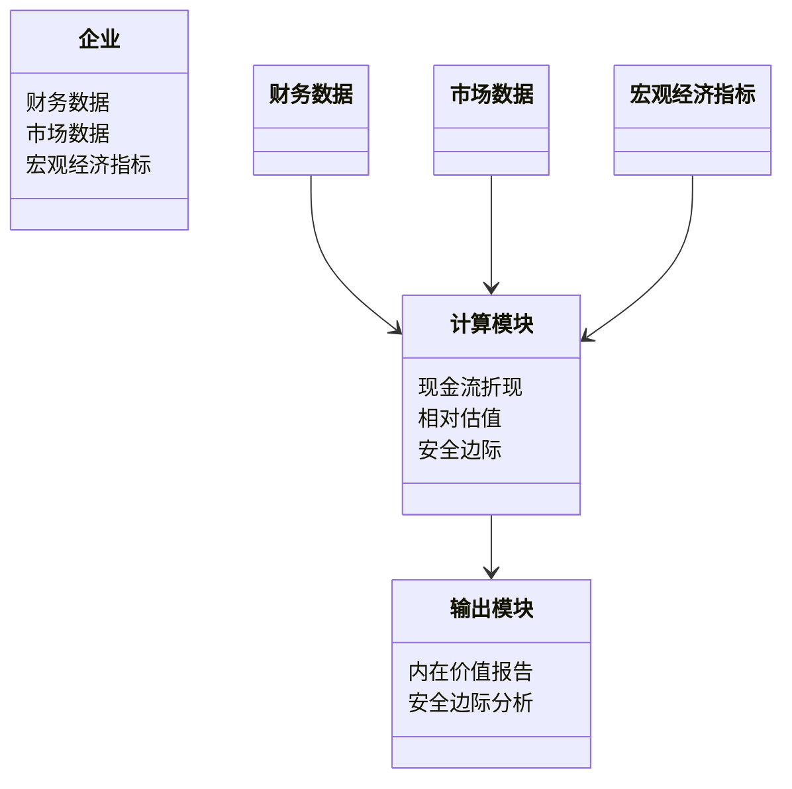

                 


# 《格雷厄姆的企业内在价值计算方法》

> 关键词：格雷厄姆，企业内在价值，投资方法，现金流折现，安全边际

> 摘要：本文详细介绍了格雷厄姆的企业内在价值计算方法，从其核心概念到具体计算步骤，再到数学模型和实际案例分析，帮助读者全面理解并掌握这一经典投资方法。

---

# 第1章 企业内在价值的核心概念与背景

## 1.1 企业内在价值的定义与背景

### 1.1.1 企业内在价值的定义

企业内在价值是指企业在未来经营中能够为股东创造的自由现金流的现值，它是企业真实价值的衡量标准，与市场波动无关。格雷厄姆在其投资理论中强调，内在价值是决定股票合理价格的基础，而市场价格只是波动的结果。

### 1.1.2 内在价值与市场价值的关系

市场价值是市场参与者对股票价格的主观定价，常常受到情绪、市场波动等因素的影响。而内在价值则是基于对企业未来现金流的理性评估。格雷厄姆认为，市场价格与内在价值之间的差异为投资者提供了套利机会，这也是“安全边际”概念的基础。

### 1.1.3 格雷厄姆投资理念的核心思想

格雷厄姆的投资理念可以总结为“买入低于内在价值的股票并长期持有”。他强调安全边际的重要性，即以低于内在价值的价格买入股票，以降低投资风险。

---

## 1.2 企业内在价值计算的重要性

### 1.2.1 投资决策中的价值评估

准确计算企业内在价值是投资决策的核心。通过内在价值评估，投资者可以判断股票是否被低估或高估，从而做出合理的买入或卖出决策。

### 1.2.2 避免市场情绪干扰的必要性

市场价格常常受到市场情绪的影响，而内在价值计算则帮助投资者跳出市场的喧嚣，回归基本面分析。

### 1.2.3 格雷厄姆方法的现实意义

格雷厄姆的方法不仅适用于传统股票投资，也对当前量化投资、价值投资等领域具有重要指导意义。

---

## 1.3 企业内在价值的分析框架

### 1.3.1 财务报表分析的基础

内在价值计算依赖于对企业财务报表的深入分析，特别是利润表、资产负债表和现金流量表。

### 1.3.2 格雷厄姆的“安全边际”概念

安全边际是内在价值与市场价格之间的差额，它为投资者提供了风险缓冲，确保在市场波动中仍能获得正收益。

### 1.3.3 内在价值计算的逻辑流程

1. **确定企业未来现金流**：预测企业未来几年的自由现金流。
2. **计算永续现金流**：假设企业在稳定状态下产生的现金流。
3. **确定合适的折现率**：基于企业风险和市场利率，选择合适的折现率。
4. **计算现值**：将未来现金流折现，得到企业内在价值。

---

# 第2章 格雷厄姆的企业内在价值计算方法

## 2.1 格雷厄姆的基本公式

### 2.1.1 内在价值计算的核心公式

格雷厄姆的企业内在价值公式可以简化为：

$$
\text{内在价值} = \sum_{t=1}^{n} \frac{\text{现金流}_t}{(1 + r)^t} + \frac{\text{永续现金流}}{r}
$$

其中：
- $\text{现金流}_t$ 是第 $t$ 年的自由现金流。
- $r$ 是折现率。
- $n$ 是预测现金流的年数。

### 2.1.2 公式中各变量的含义

- **现金流**：企业的自由现金流，即企业经营活动中产生的现金流，扣除资本支出后的剩余部分。
- **折现率**：基于企业风险和市场利率确定的贴现率，用于将未来现金流折现到当前价值。
- **永续现金流**：企业在稳定状态下产生的持续现金流，通常假设以固定增长率增长。

---

## 2.2 现金流折现法的详细步骤

### 2.2.1 自由现金流的计算

自由现金流的计算公式为：

$$
\text{自由现金流} = \text{净利润} + \text{非现金费用} - \text{资本支出}
$$

### 2.2.2 确定合适的折现率

折现率通常基于企业的无风险利率和企业风险溢价之和：

$$
r = r_{\text{无风险}} + \text{风险溢价}
$$

### 2.2.3 现金流的未来价值评估

将未来现金流折现到现值，计算企业内在价值。

---

## 2.3 相对价值评估法

### 2.3.1 市盈率与市净率的比较

市盈率（P/E）和市净率（P/B）是常用的相对估值指标。市盈率适用于利润稳定的公司，而市净率适用于资产密集型行业。

### 2.3.2 企业价值倍数的应用

企业价值倍数（EV/EBITDA）是将企业价值与税息折旧及摊销前利润进行比较，适用于不同行业的横向比较。

### 2.3.3 相对价值法的优缺点

优点：简单易用，适合快速估值；缺点：依赖于行业平均值，可能不适合特殊情况。

---

## 2.4 格雷厄姆的保守估计原则

### 2.4.1 收益增长率的保守估计

假设企业未来现金流增长率为5%，远低于市场预期，以确保保守性。

### 2.4.2 折现率的合理选择

选择高于行业平均水平的折现率，以反映较高的风险溢价。

### 2.4.3 安全边际的预留

确保买入价格低于内在价值的一定折扣，以应对市场波动。

---

## 2.5 本章小结

格雷厄姆的企业内在价值计算方法以现金流折现为核心，结合相对估值法，通过保守估计和安全边际的预留，帮助投资者在复杂市场中做出理性决策。

---

# 第3章 企业内在价值计算的数学模型与公式

## 3.1 现金流折现法的数学模型

### 3.1.1 现金流折现的基本公式

$$
PV = \sum_{t=1}^{n} \frac{CF_t}{(1 + r)^t}
$$

其中，$CF_t$ 是第 $t$ 年的自由现金流，$r$ 是折现率，$n$ 是预测年数。

### 3.1.2 永续年金的折现公式

$$
PV = \frac{CF}{r}
$$

适用于永续增长的情况。

---

## 3.2 相对价值评估法的数学模型

### 3.2.1 市盈率模型

$$
P = PE \times EPS
$$

其中，$PE$ 是市盈率，$EPS$ 是每股收益。

### 3.2.2 市净率模型

$$
P = PB \times BVPS
$$

其中，$PB$ 是市净率，$BVPS$ 是每股账面价值。

---

## 3.3 格雷厄姆的保守估计法

### 3.3.1 收益增长率的线性模型

$$
g = a + bt
$$

其中，$g$ 是增长率，$a$ 和 $b$ 是常数，$t$ 是时间变量。

### 3.3.2 折现率的区间估计

$$
r = r_{\text{min}} + t \times (r_{\text{max}} - r_{\text{min}})
$$

---

## 3.4 本章小结

数学模型是内在价值计算的核心工具，通过合理选择参数和模型，投资者可以更准确地评估企业价值。

---

# 第4章 企业内在价值计算的系统架构与流程

## 4.1 系统分析与设计

### 4.1.1 问题场景介绍

企业内在价值计算需要整合财务数据、市场数据和宏观经济指标，构建一个完整的计算系统。

### 4.1.2 系统功能设计（领域模型）

使用Mermaid绘制领域模型图：



### 4.1.3 系统架构设计

使用Mermaid绘制系统架构图：

```mermaid
container 系统架构 {
    数据输入模块
    计算模块
    输出模块
}
dataflow 数据输入模块 --> 计算模块
dataflow 计算模块 --> 输出模块
```

---

## 4.2 项目实战

### 4.2.1 环境安装

安装Python和必要的库（如numpy、pandas、scipy）。

### 4.2.2 核心实现源代码

以下是Python实现的现金流折现法代码：

```python
import numpy as np

def calculate_intrinsic_value(cash_flows, discount_rate):
    # 计算现值
    PV = np.sum(cash_flows / (1 + discount_rate) ** np.arange(len(cash_flows)))
    return PV

# 示例数据
cash_flows = [100, 120, 140, 160]
discount_rate = 0.08

intrinsic_value = calculate_intrinsic_value(cash_flows, discount_rate)
print("内在价值：", intrinsic_value)
```

---

## 4.3 代码应用解读与分析

上述代码通过numpy库计算了未来现金流的现值，适用于简单的情况。实际应用中，需要考虑永续现金流和更高的折现率。

---

## 4.4 本章小结

通过系统架构和代码实现，读者可以更好地理解内在价值计算的流程和实现细节。

---

# 第5章 项目实战与案例分析

## 5.1 实际案例分析

以苹果公司为例，计算其内在价值。

### 5.1.1 数据收集

收集苹果公司过去几年的自由现金流和相关财务数据。

### 5.1.2 参数假设

假设未来现金流增长率为5%，折现率为8%。

### 5.1.3 计算过程

使用现金流折现法计算苹果公司的内在价值。

---

## 5.2 本章小结

通过实际案例分析，读者可以掌握内在价值计算的实际应用。

---

# 第6章 总结与展望

## 6.1 本章总结

本文详细介绍了格雷厄姆的企业内在价值计算方法，从理论到实践，帮助读者掌握这一经典投资方法。

## 6.2 展望

未来，结合人工智能和大数据技术，企业内在价值计算将更加精确和高效。

---

# 作者

作者：AI天才研究院/AI Genius Institute & 禅与计算机程序设计艺术 /Zen And The Art of Computer Programming

