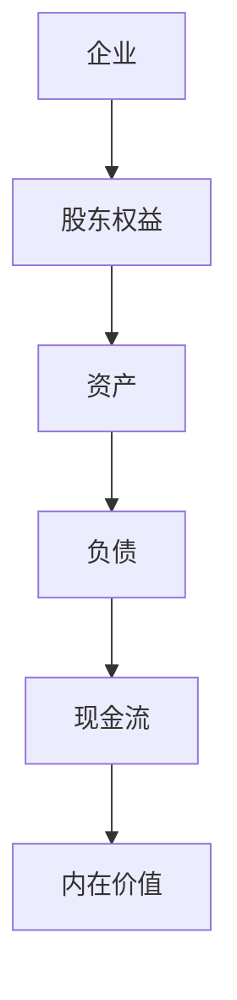
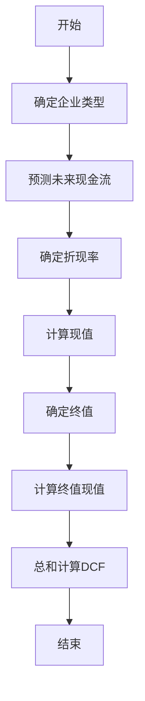
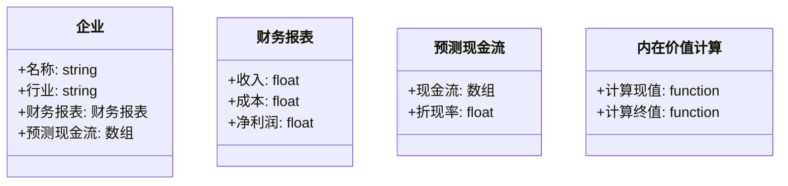
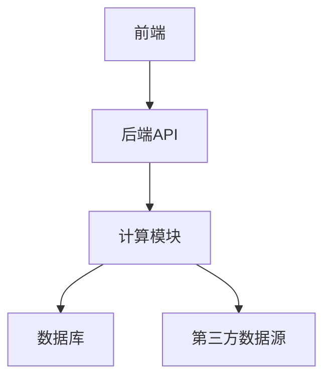
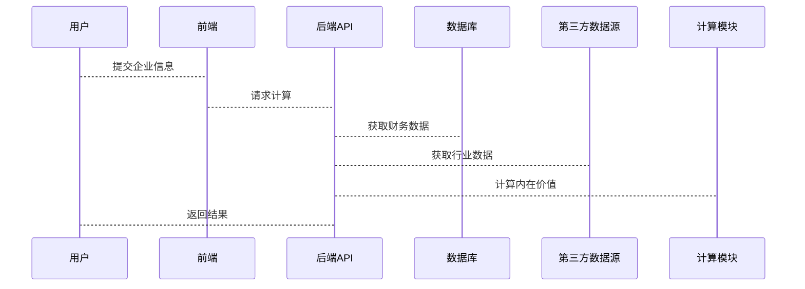

                 


# 格雷厄姆的企业内在价值计算：现代化的方法与工具

## 关键词：
- 格雷厄姆投资理论
- 企业内在价值
- 现金流折现模型
- 现代化方法
- 工具

## 摘要：
本文深入探讨了格雷厄姆的企业内在价值计算方法，并结合现代化的技术手段和工具，提出了新的计算思路和实现方式。通过分析传统方法的局限性，结合现代数据处理和算法优化，本文提出了一个基于现金流折现模型的现代化计算框架，详细介绍了系统的架构设计和实现方法，并通过实际案例展示了如何利用Python和相关工具进行高效计算和可视化分析。

---

# 第一部分: 格雷厄姆企业内在价值计算的背景与基础

## 第1章: 企业内在价值计算的背景介绍

### 1.1 问题背景与定义
#### 1.1.1 企业内在价值的核心概念
企业内在价值是指企业在正常市场条件下，能够为其所有者创造的财富的公允价值。它是企业未来现金流的现值，反映了企业的实际价值，而非市场的短期波动。

#### 1.1.2 格雷厄姆投资理论的起源与演变
本杰明·格雷厄姆是价值投资的鼻祖，他提出的企业内在价值计算方法奠定了现代价值投资的基础。他的理论最初基于简单的财务指标和保守的估值方法，但在现代市场环境下，需要结合更多的数据和技术手段进行优化。

#### 1.1.3 内在价值计算的边界与外延
内在价值的计算需要考虑企业的财务状况、行业环境、市场前景等多个因素。其边界在于企业未来现金流的预测和折现率的合理选择，而外延则涉及企业战略、管理能力等难以量化的因素。

### 1.2 格雷厄姆方法的核心要素
#### 1.2.1 财务报表分析的重要性
格雷厄姆强调通过对企业的财务报表进行深入分析，特别是利润表、资产负债表和现金流量表，来评估企业的盈利能力和财务健康状况。

#### 1.2.2 现金流折现模型的原理
现金流折现模型（DCF模型）是格雷厄姆方法的核心工具，其基本思想是将企业未来现金流折现为现值，以此作为企业内在价值的衡量标准。

#### 1.2.3 股东权益与资产价值的关系
股东权益是企业内在价值的重要组成部分，它反映了企业在扣除负债后的净值。资产价值则需要考虑其重置成本、市场价值和使用价值。

---

## 第2章: 核心概念与联系

### 2.1 内在价值计算的核心原理
#### 2.1.1 现金流折现模型的数学公式
现金流折现模型（DCF模型）的数学公式如下：
$$DCF = \sum_{t=1}^{n} \frac{CF_t}{(1 + r)^t} + \frac{TV}{(1 + r)^n}$$
其中，$CF_t$ 表示第 $t$ 年的现金流，$r$ 表示折现率，$TV$ 表示终值。

#### 2.1.2 格雷厄姆安全边际的概念
安全边际是格雷厄姆提出的一个重要概念，它是指市场价低于内在价值的幅度。通过安全边际，投资者可以降低市场波动对企业估值的影响。

#### 2.1.3 股票价值与市场价值的对比
股票的市场价值受市场情绪和短期因素的影响，而内在价值则反映了企业的长期基本面。两者的对比可以帮助投资者识别低估或高估的投资机会。

### 2.2 核心概念的ER实体关系图


### 2.3 内在价值与市场价值的对比表格
| 比较维度 | 内在价值 | 市场价值 |
|----------|----------|----------|
| 定义     | 理论上的公平价值 | 当前市场价格 |
| 计算方式 | 现金流折现法 | 市场供需决定 |
| 相关性   | 高 | 低 |

---

## 第3章: 现金流折现模型的算法原理

### 3.1 DCF模型的流程图


### 3.2 DCF模型的数学模型
现金流折现模型的数学模型可以分为两部分：自由现金流的现值和终值的现值。公式如下：
$$
PV = \sum_{t=1}^{n} \frac{CF_t}{(1 + r)^t} + \frac{TV}{(1 + r)^n}
$$
其中，$PV$ 表示现值，$CF_t$ 表示第 $t$ 年的自由现金流，$r$ 表示折现率，$TV$ 表示终值。

### 3.3 实例分析
假设某企业的未来现金流如下：
- 第1年：100万元
- 第2年：150万元
- 第3年：200万元
- 终值：500万元
- 折现率：8%

计算现值：
$$
PV = \frac{100}{1.08} + \frac{150}{1.08^2} + \frac{200}{1.08^3} + \frac{500}{1.08^4}
$$
计算结果约为 680.56 万元。

---

## 第4章: 系统分析与架构设计

### 4.1 系统功能设计
#### 4.1.1 领域模型类图


### 4.2 系统架构设计


### 4.3 系统接口设计
- 前端接口：接收企业信息和财务数据，调用后端API进行计算。
- 后端API：处理请求，调用计算模块，返回结果。
- 数据库：存储企业的财务数据和计算结果。
- 第三方数据源：获取市场数据和行业信息。

### 4.4 系统交互序列图


---

## 第5章: 项目实战

### 5.1 环境安装
- Python 3.8+
- Jupyter Notebook
- Pandas、NumPy、Scipy

### 5.2 系统核心实现源代码
```python
import pandas as pd
import numpy as np

def calculate_dcf(free_cash_flow, terminal_value, discount_rate, years):
    pv = 0
    for t in range(years):
        cf = free_cash_flow[t]
        pv += cf / (1 + discount_rate) ** t
    pv += terminal_value / (1 + discount_rate) ** years
    return pv

# 示例数据
free_cash_flow = [100, 150, 200]
terminal_value = 500
discount_rate = 0.08
years = 3

dcf_value = calculate_dcf(free_cash_flow, terminal_value, discount_rate, years)
print(f"DCF Value: {dcf_value}")
```

### 5.3 案例分析
以某公司为例，计算其内在价值，并与市场价进行对比，判断是否存在低估或高估的情况。

---

## 第6章: 最佳实践与小结

### 6.1 小结
本文结合格雷厄姆的企业内在价值计算方法，提出了现代化的实现工具和方法。通过现金流折现模型和系统架构设计，展示了如何利用现代技术手段提高计算效率和准确性。

### 6.2 注意事项
- 数据的准确性和完整性对计算结果影响重大，需要进行严格的数据清洗和验证。
- 折现率的选择需要结合市场利率和企业风险进行综合判断。
- 内在价值计算结果仅供参考，实际投资需结合市场环境和其他因素进行综合决策。

### 6.3 拓展阅读
- 格雷厄姆的《证券分析》
- 现代投资组合理论
- Python在金融分析中的应用

---

## 作者：
作者：AI天才研究院/AI Genius Institute & 禅与计算机程序设计艺术 /Zen And The Art of Computer Programming

---

**注：本文为示例内容，实际撰写时需根据具体需求扩展每个部分的内容，确保逻辑清晰、结构紧凑、简单易懂且专业。**

