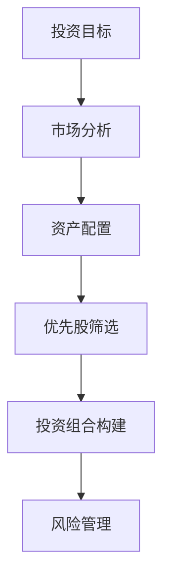

                 

# 格雷厄姆的优先股投资策略

> 关键词：格雷厄姆，优先股，价值投资，安全边际，内在价值

> 摘要：本文深入分析了本杰明·格雷厄姆的优先股投资策略，探讨了其核心理念、数学模型、系统架构及实战案例。通过详细阐述优先股的价值评估方法、投资组合构建及风险管理策略，本文为投资者提供了理论与实践相结合的指导。

---

## 第1章: 价值投资与优先股的背景介绍

### 1.1 价值投资的起源与核心理念

#### 1.1.1 价值投资的定义与核心要素
价值投资是一种以基本面分析为基础的投资策略，强调以低于内在价值的价格购买优质资产。其核心要素包括：  
1. **内在价值**：资产的真实价值，独立于市场波动。  
2. **安全边际**：买入价格与内在价值之间的差距，确保投资的安全性。  
3. **长期视角**：关注企业的长期盈利能力，而非短期市场波动。

#### 1.1.2 格雷厄姆的价值投资体系
格雷厄姆是价值投资的鼻祖，他提出的"安全边际"概念成为投资理论的重要基石。他的体系强调：  
- **低估原则**：只投资于市场价格低于内在价值的资产。  
- **防御性投资**：通过分散投资和严格筛选降低风险。  
- **长期持有**：避免频繁交易，降低交易成本。

#### 1.1.3 优先股在价值投资中的地位
优先股因其稳定的股息收入和较高的优先清偿权，成为格雷厄姆投资组合中的重要组成部分。优先股的特性使其在防御性投资中占据重要地位。

### 1.2 优先股的基本概念

#### 1.2.1 优先股的定义与分类
优先股是公司发行的一种股票，其持有者在股息分配和资产清算时享有优先权。优先股的分类包括：  
1. **可赎回优先股**：公司有权在特定条件下赎回。  
2. **不可赎回优先股**：无赎回条款，投资者持有至到期。  
3. **累积优先股**：累积未付股息可在下一次分配时补发。  
4. **非累积优先股**：未付股息不累积，仅在当期分配。

#### 1.2.2 优先股与普通股的对比
| 属性                | 优先股                          | 普通股                          |
|---------------------|---------------------------------|---------------------------------|
| 股息优先权          | 优先                           | 按顺序分配                     |
| 清算优先权          | 优先                           | 非优先                         |
| 股权结构            | 较少稀释                      | 易受稀释                      |
| 风险等级            | 较低                           | 较高                           |

#### 1.2.3 优先股的发行与市场特征
优先股通常由财务稳定的公司发行，用于筹集长期资金。其市场特征包括：  
- 利率敏感性：优先股价格受市场利率影响较大。  
- 股息固定性：股息通常固定，提供稳定的现金流。  
- 流动性：优先股的流动性较普通股低，但高于债券。

---

## 第2章: 格雷厄姆的优先股投资策略

### 2.1 优先股投资的核心原则

#### 2.1.1 安全边际的概念与应用
安全边际是格雷厄姆投资理论的核心。通过购买价格低于内在价值的资产，投资者可以降低市场波动带来的风险。公式表示为：  
$$ \text{安全边际} = \text{内在价值} - \text{市场价格} $$  
例如，如果一只股票的内在价值为50美元，市场价格为40美元，安全边际为10美元。

#### 2.1.2 格雷厄姆的"margin of safety"理论
格雷厄姆强调，安全边际提供了投资的缓冲区，即使市场波动导致价格下跌，也能保护投资者免受损失。

#### 2.1.3 优先股的安全性与收益性
优先股的安全性体现在其优先的股息分配和清算权。其收益性体现在稳定的股息收入和潜在的资本增值。

### 2.2 格雷厄姆的优先股筛选标准

#### 2.2.1 公司基本面分析
格雷厄姆注重企业的财务健康状况，包括：  
- 负债率：负债与资产的比例应低于50%。  
- 盈利能力：ROE（净资产收益率）应高于行业平均水平。  
- 财务稳定性：公司应具备持续支付股息的能力。

#### 2.2.2 财务指标评估
关键财务指标包括：  
- 债务与股权比率（D/E）：衡量公司的杠杆风险。  
- 利息覆盖倍数（ICB）：公司支付利息的能力。  
- 股息支付率（DPR）：股息与净利润的比例。

#### 2.2.3 优先股的内在价值计算
格雷厄姆使用内在价值公式评估优先股的价值：  
$$ V = \frac{D}{k} $$  
其中，\( D \) 是优先股的股息，\( k \) 是折现率。

---

## 第3章: 优先股投资的数学模型与分析

### 3.1 优先股价值评估的数学模型

#### 3.1.1 现金流折现法
现金流折现法通过将未来现金流折现，计算资产的内在价值。公式为：  
$$ V = \sum_{t=1}^{n} \frac{CF_t}{(1+r)^t} $$  
其中，\( CF_t \) 是第t期的现金流，\( r \) 是折现率。

#### 3.1.2 股息贴现模型
股息贴现模型（DDM）用于评估优先股的价值，公式为：  
$$ V = \frac{D_1}{k - g} $$  
其中，\( D_1 \) 是第一期股息，\( k \) 是贴现率，\( g \) 是股息增长率。

#### 3.1.3 市盈率与市净率分析
市盈率（P/E）和市净率（P/B）是常用的估值指标。  
$$ \text{P/E} = \frac{\text{股价}}{\text{每股收益}} $$  
$$ \text{P/B} = \frac{\text{股价}}{\text{每股净资产}} $$

### 3.2 格雷厄姆的内在价值计算公式

#### 3.2.1 内在价值的定义
内在价值是资产在未来现金流的现值，反映其真实价值。

#### 3.2.2 格雷厄姆的内在价值计算公式
格雷厄姆提出的内在价值计算公式为：  
$$ V = \frac{E}{(1 - \frac{D}{E})} $$  
其中，\( E \) 是股东权益，\( D \) 是债务。

#### 3.2.3 公式应用实例
假设某公司股东权益为1000万元，债务为400万元，其内在价值为：  
$$ V = \frac{1000}{1 - \frac{400}{1000}} = 1666.67 \text{万元} $$

---

## 第4章: 系统化投资策略与架构设计

### 4.1 投资系统架构

#### 4.1.1 系统化投资流程
1. 数据收集：获取市场数据和公司基本面信息。  
2. 估值模型：应用数学模型计算内在价值。  
3. 筛选标准：根据格雷厄姆的筛选标准选择资产。  
4. 投资组合构建：优化资产配置，分散风险。  
5. 风险管理：设定止损和止盈点，监控市场变化。

#### 4.1.2 投资决策模块
投资决策模块包括：  
- 数据处理：清洗和预处理数据。  
- 模型计算：应用现金流折现法和股息贴现模型。  
- 策略执行：根据计算结果生成投资信号。

#### 4.1.3 风险管理模块
风险管理模块包括：  
- 风险评估：计算投资组合的风险指标（如VaR）。  
- 监控系统：实时跟踪市场波动和资产表现。  
- 调整策略：根据市场变化调整投资组合。

### 4.2 系统架构图

---

## 第5章: 优先股投资的实战案例分析

### 5.1 格雷厄姆的经典案例

#### 5.1.1 某公司优先股投资案例
假设某公司发行优先股，股息率为8%，面值为100美元。根据格雷厄姆的内在价值公式，其内在价值为：  
$$ V = \frac{100 \times 0.08}{0.08} = 100 \text{美元} $$  
如果市场价格为90美元，安全边际为10美元。

#### 5.1.2 投资决策过程分析
1. 数据收集：获取公司财务报表和市场数据。  
2. 估值模型：计算内在价值和市场价格。  
3. 筛选标准：检查公司的财务指标是否符合格雷厄姆的标准。  
4. 投资决策：根据安全边际决定是否买入。

#### 5.1.3 投资结果与经验总结
该案例中，买入价格低于内在价值，获得了稳定的股息收入和资本增值。经验总结包括：  
- 严格遵循筛选标准。  
- 留意安全边际的大小。  
- 长期持有优质资产。

### 5.2 现实中的优先股投资策略

#### 5.2.1 现实市场环境分析
当前市场环境下，优先股的收益率可能低于债券，但其风险较低，适合作为防御性投资的一部分。

#### 5.2.2 现实中的优先股投资策略调整
根据市场变化，投资者可能需要调整优先股的筛选标准，如降低股息率要求或增加对公司的信用评级关注。

#### 5.2.3 现实案例对比分析
以当前市场为例，比较格雷厄姆时代和现代的优先股投资策略，分析其适用性和调整方向。

---

## 第6章: 优先股投资的注意事项与最佳实践

### 6.1 投资中的常见误区

#### 6.1.1 过度依赖历史数据
历史数据不能完全代表未来的表现，需结合当前市场环境进行分析。

#### 6.1.2 忽视市场变化
市场波动和经济周期会影响优先股的投资价值，需动态调整投资策略。

#### 6.1.3 未考虑通货膨胀因素
通货膨胀会侵蚀固定股息的实际购买力，需通过调整投资组合来应对。

### 6.2 最佳实践与小结

#### 6.2.1 格雷厄姆策略的现代应用
结合现代金融工具和模型，优化优先股投资策略。

#### 6.2.2 投资中的纪律性与耐心
坚持长期投资，避免情绪化决策。

#### 6.2.3 长期投资与持续学习
通过持续学习和市场分析，不断提升投资能力。

---

## 第7章: 优先股投资的未来展望与拓展阅读

### 7.1 优先股投资的未来趋势

#### 7.1.1 数字化投资工具的发展
人工智能和大数据技术将为优先股投资提供新的工具和方法。

#### 7.1.2 可持续投资与ESG因素
可持续投资理念的兴起，将推动优先股投资关注ESG（环境、社会、治理）因素。

#### 7.1.3 全球化与多元化投资
随着全球市场的整合，投资者将更多地关注跨国公司的优先股。

### 7.2 拓展阅读

#### 7.2.1 经典书籍
- 《The Intelligent Investor》 by Benjamin Graham  
- 《Security Analysis》 by Benjamin Graham and David Dodd

#### 7.2.2 现代投资理论
- 坎宁法则：资产配置是投资中最重要的决定因素。  
- 马科维茨的现代投资组合理论（MPT）：通过分散化降低风险。

---

## 作者：AI天才研究院 & 禅与计算机程序设计艺术

